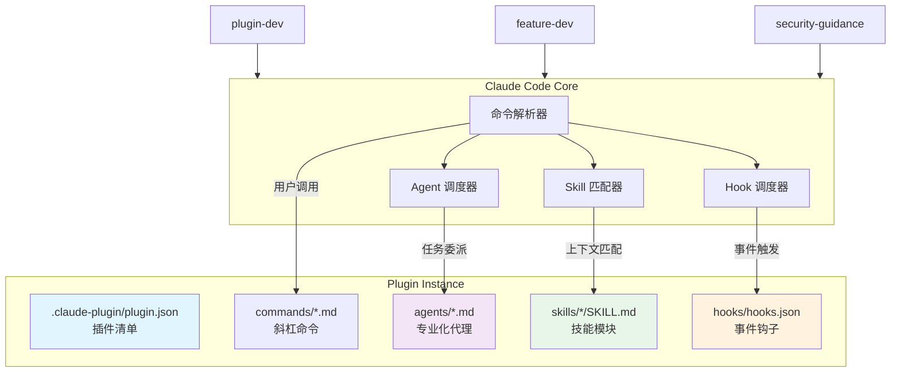
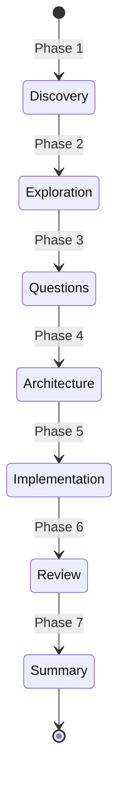
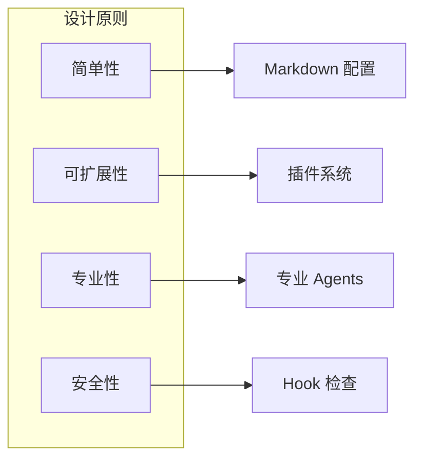

# Claude Code 研究报告

> **研究目标**：以设计思想与架构取舍为主，学习 Claude Code 的插件系统设计理念
> **版本**：基于 2.1.29
> **研究日期**：2026-02-02

---

## 一、概览

### 1.1 项目定位

Claude Code 是 Anthropic 官方推出的 **AI 编程助手**，它：

- **运行在终端**：直接嵌入开发者的工作流，无需切换上下文
- **理解代码库**：能够智能分析项目结构和代码模式
- **执行任务**：可运行命令、编辑文件、处理 Git 工作流
- **自然语言交互**：通过对话完成复杂编程任务

### 1.2 核心设计哲学

| 设计维度 | 理念 | 体现 |
|---------|------|------|
| **可扩展性** | 插件化架构 | 所有功能通过插件扩展，核心极简 |
| **约定优于配置** | 自动发现 | 标准目录结构下组件自动注册 |
| **专业化** | Agent 分工 | 不同任务使用专业化子代理 |
| **事件驱动** | Hook 机制 | 在关键事件点注入自定义逻辑 |
| **可移植性** | 环境变量 | `${CLAUDE_PLUGIN_ROOT}` 确保跨平台兼容 |

### 1.3 目录结构概览

```
claude-code/
├── .claude/
│   └── commands/              # 内置斜杠命令
├── plugins/                   # 官方插件集合（核心）
│   ├── agent-sdk-dev/         # Agent SDK 开发工具包
│   ├── feature-dev/           # 功能开发工作流
│   ├── code-review/           # 自动代码审查
│   ├── plugin-dev/            # 插件开发工具包
│   ├── security-guidance/     # 安全指导 Hook
│   └── [12 more plugins...]
├── examples/
│   └── hooks/                 # Hook 示例代码
└── Script/                    # 辅助脚本
```

---

## 二、插件系统架构

### 2.1 核心架构图



### 2.2 插件标准结构

每个插件遵循统一的结构约定：

```
plugin-name/
├── .claude-plugin/
│   └── plugin.json          # 必需：插件元数据
├── commands/                 # 可选：斜杠命令 (.md)
├── agents/                   # 可选：子代理定义 (.md)
├── skills/                   # 可选：技能模块
│   └── skill-name/
│       └── SKILL.md         # 技能定义
├── hooks/                    # 可选：事件钩子
│   └── hooks.json           # 钩子配置
├── .mcp.json                 # 可选：MCP 服务器配置
└── README.md                 # 插件文档
```

**关键设计决策**：

| 决策点 | 选择 | 理由 |
|-------|------|------|
| 组件存放位置 | 插件根目录，而非 `.claude-plugin/` 内 | 简化路径，便于访问 |
| 配置格式 | JSON 清单 + Markdown 组件 | 人类可读，易于版本控制 |
| 发现机制 | 自动扫描标准目录 | 无需手动注册 |
| 路径引用 | `${CLAUDE_PLUGIN_ROOT}` 环境变量 | 跨平台兼容，安装位置无关 |

---

## 三、四大核心组件

### 3.1 组件职责表

| 组件 | 职责 | 触发方式 | 典型用途 |
|------|------|---------|---------|
| **Commands** | 用户主动调用的功能 | `/命令名` | Git 操作、工作流启动 |
| **Agents** | 专业化子任务处理 | 自动调度或手动调用 | 代码审查、架构分析 |
| **Skills** | 上下文相关的知识注入 | 任务描述自动匹配 | API 设计、前端规范 |
| **Hooks** | 事件驱动的拦截处理 | 系统事件触发 | 安全检查、风格注入 |

### 3.2 Commands（命令）

命令是用户直接调用的功能入口，采用 Markdown + YAML frontmatter 格式：

**示例：`commit-push-pr.md`**

```markdown
---
allowed-tools: Bash(git *), Bash(gh pr create:*)
description: Commit, push, and open a PR
---

## Context
- Current git status: !`git status`
- Current git diff: !`git diff HEAD`

## Your task
1. Create a new branch if on main
2. Create a single commit
3. Push to origin
4. Create a PR using `gh pr create`
```

**设计亮点**：
- `allowed-tools` 限制可用工具，增强安全性
- `!\`命令`` 语法在执行时动态注入结果
- 声明式描述任务，而非命令式脚本

### 3.3 Agents（代理）

Agents 是专业化子任务处理器，可以并行运行多个代理处理同一问题的不同方面：

**示例：feature-dev 的并行代理架构**

```mermaid
flowchart LR
    U[用户请求] --> FE[feature-dev 命令]

    subgraph Phase2["Phase 2: 代码探索"]
        CE1[code-explorer<br/>相似功能]
        CE2[code-explorer<br/>架构映射]
        CE3[code-explorer<br/>UI 模式]
    end

    subgraph Phase4["Phase 4: 架构设计"]
        CA1[code-architect<br/>最小改动]
        CA2[code-architect<br/>清洁架构]
        CA3[code-architect<br/>实用平衡]
    end

    subgraph Phase6["Phase 6: 质量审查"]
        CR1[code-reviewer<br/>简洁性]
        CR2[code-reviewer<br/>正确性]
        CR3[code-reviewer<br/>项目规范]
    end

    FE --> Phase2
    Phase2 -->|关键文件列表| Phase4
    Phase4 -->|设计方案| Phase6
    Phase6 -->|审查结果| R[最终实现]
```



**并行代理的设计取舍**：

| 优势 | 代价 |
|-----|------|
| 多角度深入分析 | API 调用成本增加 |
| 减少单点偏差 | 结果需要整合 |
| 可处理复杂任务 | 调度逻辑复杂 |

### 3.4 Skills（技能）

技能是可被自动激活的知识模块，通过 `description` 字段声明触发条件：

**SKILL.md 格式**：

```markdown
---
name: Plugin Structure
description: 当用户询问 "创建插件"、"理解插件结构" 时使用
version: 0.1.0
---

# Plugin Structure for Claude Code

详细的技能指导内容...
```

**关键特性**：
- **声明式触发**：系统根据任务上下文自动匹配
- **资源携带**：技能目录可包含脚本、示例、参考文档
- **版本管理**：支持技能版本控制

### 3.5 Hooks（钩子）

Hooks 在系统事件发生时自动执行，可用于安全检查、风格注入等：

**可用事件类型**：

| 事件 | 触发时机 | 典型用途 |
|-----|---------|---------|
| `SessionStart` | 会话开始 | 初始化上下文 |
| `PreToolUse` | 工具调用前 | 安全检查、输入验证 |
| `PostToolUse` | 工具调用后 | 日志记录、状态同步 |
| `Stop` | 代理停止前 | 清理工作 |
| `UserPromptSubmit` | 用户提交前 | 内容审查 |

**安全 Hook 示例**：

```json
{
  "hooks": {
    "PreToolUse": [{
      "matcher": "Edit|Write|MultiEdit",
      "hooks": [{
        "type": "command",
        "command": "python3 ${CLAUDE_PLUGIN_ROOT}/hooks/security_reminder_hook.py"
      }]
    }]
  }
}
```

**安全 Hook 检测的 9 种模式**：

1. 命令注入（Command Injection）
2. XSS 跨站脚本
3. `eval` 使用
4. 危险 HTML 生成
5. Pickle 反序列化
6. `os.system` 调用
7. SQL 注入
8. 硬编码凭证
9. 不安全的随机数

---

## 四、典型插件分析

### 4.1 feature-dev 插件

**目标**：提供结构化的功能开发工作流

**七阶段流程**：



**设计思想**：

| 阶段 | 目标 | 关键活动 |
|-----|------|---------|
| Discovery | 理解需求 | 询问问题，确认理解 |
| Exploration | 理解代码库 | 启动 2-3 个并行 code-explorer |
| Questions | 填补细节 | 系统性提问，等待回答 |
| Architecture | 设计方案 | 启动 2-3 个并行 code-architect |
| Implementation | 编码实现 | 等待用户批准后执行 |
| Review | 质量检查 | 启动 3 个并行 code-reviewer |
| Summary | 文档总结 | 记录决策和变更 |

**核心取舍**：
- **多轮确认 vs 快速交付**：选择前者，确保理解正确
- **并行分析 vs 成本控制**：在关键阶段使用并行代理

### 4.2 plugin-dev 插件

**目标**：帮助开发者创建新插件

**七个专家 Skills**：

| Skill | 用途 |
|-------|------|
| plugin-structure | 插件结构和目录布局 |
| hook-development | Hook 开发和配置 |
| mcp-integration | MCP 服务器集成 |
| plugin-settings | 插件设置管理 |
| command-development | 命令开发 |
| agent-development | 代理开发 |
| skill-development | 技能开发 |

**设计亮点**：
- **自举能力**：用插件开发插件
- **AI 辅助创建**：`/plugin-dev:create-plugin` 命令提供 8 阶段引导式工作流

### 4.3 security-guidance 插件

**目标**：在编辑文件时提醒安全问题

**实现方式**：
- 监听 `PreToolUse` 事件
- 匹配 `Edit|Write|MultiEdit` 工具
- 运行 Python 脚本检测安全模式
- 发现问题时向用户显示警告

**设计哲学**：
- **非阻塞式**：警告但不阻止操作
- **教育性**：解释为何存在风险
- **可扩展**：易于添加新的检测模式

---

## 五、设计模式与架构原则

### 5.1 应用设计模式

| 模式 | 应用场景 | 价值 |
|-----|---------|------|
| **约定优于配置** | 标准目录结构 | 降低学习成本 |
| **依赖注入** | `${CLAUDE_PLUGIN_ROOT}` | 提高可移植性 |
| **事件驱动** | Hook 系统 | 松耦合扩展 |
| **策略模式** | 多个并行 Agent | 灵活选择方案 |
| **中间件模式** | PreToolUse/PostToolUse | 横切关注点 |

### 5.2 架构原则



| 原则 | 体现 |
|-----|------|
| **简单性** | 配置文件使用 Markdown 和 JSON，人类可读 |
| **可扩展性** | 所有功能通过插件添加，核心保持稳定 |
| **专业性** | 不同任务使用专门的 Agent，而非万能 Agent |
| **安全性** | `allowed-tools` 限制、Security Hook 检查 |

---

## 六、使用示例

### 6.1 最小可用插件

```bash
my-plugin/
├── .claude-plugin/
│   └── plugin.json           # 只需 name 字段
└── commands/
    └── hello.md              # 单个命令
```

**plugin.json**：
```json
{
  "name": "my-plugin"
}
```

**hello.md**：
```markdown
---
description: Say hello
---

# Hello World

You are helping a developer say hello to the world.
```

### 6.2 带安全检查的插件

```json
{
  "name": "secure-writer",
  "hooks": {
    "PreToolUse": [{
      "matcher": "Write|Edit",
      "hooks": [{
        "type": "command",
        "command": "python3 ${CLAUDE_PLUGIN_ROOT}/check.py"
      }]
    }]
  }
}
```

### 6.3 多阶段工作流命令

参考 `feature-dev.md`，使用分阶段指南：
- 明确阶段目标
- 指定关键活动
- 标记等待点（"DO NOT START WITHOUT USER APPROVAL"）
- 跟踪进度（TodoWrite）

---

## 七、结论与建议

### 7.1 核心设计亮点

1. **Markdown 即配置**：用人类可读的格式定义行为，降低门槛
2. **自动发现机制**：约定目录结构，无需手动注册
3. **并行专业代理**：多角度分析，提高决策质量
4. **事件驱动扩展**：Hook 系统实现横切关注点
5. **环境变量抽象**：`${CLAUDE_PLUGIN_ROOT}` 实现跨平台

### 7.2 架构权衡分析

| 设计选择 | 优势 | 代价 | 适用场景 |
|---------|------|------|---------|
| Markdown 组件 | 可读性高、易版本控制 | 无语法校验、IDE 支持弱 | 配置简单、逻辑复杂的场景 |
| 并行 Agents | 全面分析、减少偏差 | API 成本高、需整合结果 | 关键决策阶段 |
| Hook 预检查 | 安全性高 | 可能增加延迟 | 安全敏感场景 |
| 插件化 | 易扩展、核心稳定 | 过度碎片化风险 | 工具型产品 |

### 7.3 落地建议

**如果你要构建类似的插件系统**：

1. **从简单开始**：先支持 Commands 和基础 Hooks
2. **约定目录结构**：降低学习曲线
3. **使用人类可读格式**：Markdown/YAML 优于代码配置
4. **提供脚手架**：像 `plugin-dev` 一样帮助用户上手
5. **考虑成本控制**：并行调用虽好，但要提供开关
6. **安全第一**：限制工具权限、提供安全检查机制

**可借鉴的设计**：

- **环境变量抽象**：解决插件安装位置问题
- **声明式触发**：Skills 的 description 匹配机制
- **分阶段工作流**：feature-dev 的七阶段流程
- **专业化分工**：不同 Agent 处理不同专长

### 7.4 潜在改进方向

1. **类型安全**：考虑引入 JSON Schema 或类型定义
2. **测试框架**：提供插件单元测试工具
3. **依赖管理**：声明插件间依赖关系
4. **版本兼容**：API 变更时的迁移机制
5. **性能优化**：智能缓存、增量分析

---

## 附录：术语表

| 术语 | 解释 |
|-----|------|
| **Plugin** | 插件，扩展 Claude Code 功能的独立模块 |
| **Command** | 命令，用户通过 `/名称` 调用的功能 |
| **Agent** | 代理，专业化处理特定任务的子 AI |
| **Skill** | 技能，可被自动激活的知识模块 |
| **Hook** | 钩子，在系统事件发生时执行的逻辑 |
| **MCP** | Model Context Protocol，外部工具集成协议 |
| **Auto-discovery** | 自动发现，系统自动扫描并注册组件 |
| **`${CLAUDE_PLUGIN_ROOT}`** | 环境变量，指向插件安装根目录 |

---

**参考资料**：
- [Claude Code 官方文档](https://code.claude.com/docs/en/overview)
- [插件系统文档](https://docs.claude.com/en/docs/claude-code/plugins)
- 本报告基于 `/vendors/claude-code` 源码分析
