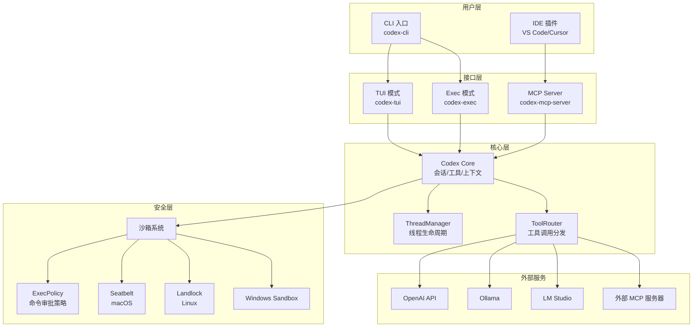
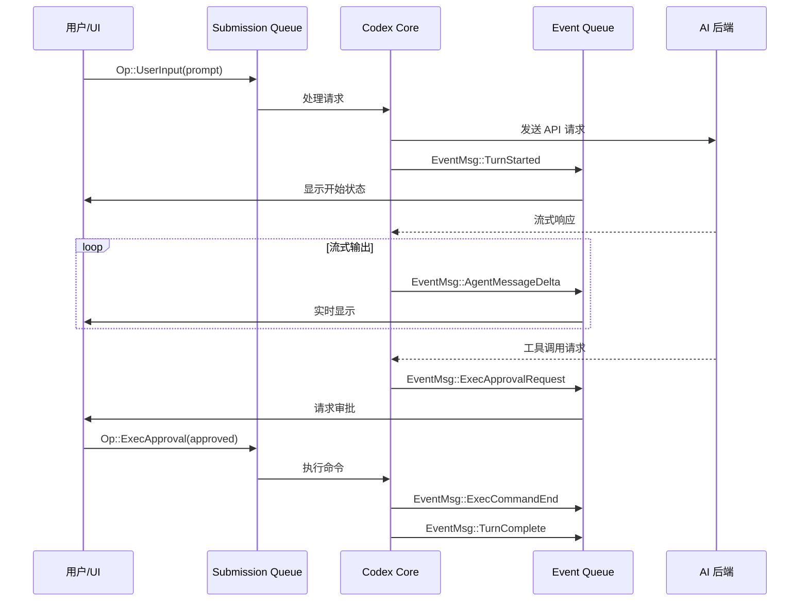
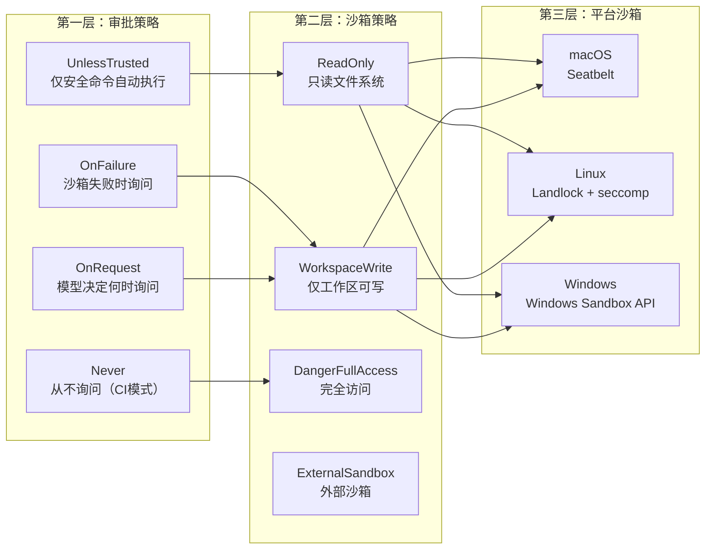

# OpenAI Codex CLI 研究报告

## 要点速览

| 维度 | 内容 |
|------|------|
| **定位** | 本地运行的编码代理（Coding Agent），零云依赖的独立可执行文件 |
| **核心语言** | Rust（主实现，47 个 crates）+ TypeScript（MCP 工具、旧版实现） |
| **运行模式** | TUI（交互式终端）、Exec（无界面/CI）、MCP Server（工具服务） |
| **安全机制** | 多平台沙箱（macOS Seatbelt、Linux Landlock、Windows Sandbox） |
| **协议设计** | SQ/EQ 异步队列模式 + MCP（Model Context Protocol）标准 |
| **AI 后端** | ChatGPT（主推）+ Ollama/LM Studio（本地 LLM） |

---

## 一、整体概览

### 1.1 项目定位与设计目标

Codex CLI 是 OpenAI 官方开源的本地编码代理，其核心设计目标是：

1. **本地优先**：在用户计算机上运行，代码不离开本地，保护隐私
2. **安全可控**：通过沙箱技术限制 AI 执行的命令权限
3. **零依赖**：单一可执行文件，无需安装运行时环境
4. **多模式支持**：既支持交互式使用，也支持无人值守的 CI/CD 场景

### 1.2 目录结构概览

```
codex/
├── codex-rs/                    # Rust 主实现（推荐使用）
│   ├── core/                    # 核心业务逻辑
│   ├── protocol/                # 通信协议定义
│   ├── tui/                     # 终端用户界面
│   ├── exec/                    # 无界面执行模式
│   ├── mcp-server/              # MCP 服务器实现
│   ├── linux-sandbox/           # Linux 沙箱（Landlock）
│   └── utils/                   # 工具库集合
├── codex-cli/                   # TypeScript 实现（已弃用）
├── shell-tool-mcp/              # Shell 工具 MCP 服务器
├── docs/                        # 文档
└── .github/                     # CI/CD 配置
```

### 1.3 核心模块职责表

| 模块名 | 职责 | 关键依赖 | 扩展点 |
|--------|------|----------|--------|
| `codex-core` | 业务逻辑中枢：会话管理、工具调用、上下文处理 | protocol, mcp-types | 工具路由器、沙箱策略 |
| `codex-protocol` | 定义 SQ/EQ 通信协议、事件类型、配置结构 | serde, schemars | 自定义事件类型 |
| `codex-tui` | 基于 ratatui 的全屏交互界面 | ratatui, crossterm | UI 组件、快捷键 |
| `codex-exec` | 无界面执行器，适合脚本和 CI | core | 输出格式（JSON/Human） |
| `codex-mcp-server` | 将 Codex 暴露为 MCP 服务器 | mcp-types | 自定义工具 |
| `codex-linux-sandbox` | Linux 权限限制（Landlock + seccomp） | landlock, seccompiler | 沙箱规则 |
| `seatbelt` | macOS 沙箱实现（Seatbelt/sandbox-exec） | libc | 策略文件 |

---

## 二、核心架构设计

### 2.1 整体架构图



### 2.2 通信协议设计：SQ/EQ 模式

Codex 采用 **Submission Queue / Event Queue** 异步通信模式，这是一个精妙的设计选择：



**设计取舍分析**：

| 方案 | 优点 | 缺点 | Codex 选择 |
|------|------|------|-----------|
| 同步 RPC | 简单直观 | 阻塞、无法流式 | 否 |
| 回调模式 | 灵活 | 回调地狱、难测试 | 否 |
| **SQ/EQ 队列** | 解耦、可测试、支持流式 | 复杂度稍高 | 是 |

核心协议定义（`protocol.rs`）：

```rust
/// Submission Queue Entry - 用户请求
pub struct Submission {
    pub id: String,  // 请求唯一标识
    pub op: Op,      // 操作类型
}

/// 操作类型枚举
pub enum Op {
    UserInput { items: Vec<UserInput>, ... },  // 用户输入
    ExecApproval { id: String, decision: ReviewDecision }, // 命令审批
    Interrupt,  // 中断当前任务
    Shutdown,   // 关闭会话
    // ...更多操作
}

/// Event Queue Entry - 代理响应
pub struct Event {
    pub id: String,   // 关联的 Submission ID
    pub msg: EventMsg, // 事件内容
}

/// 事件类型（50+种）
pub enum EventMsg {
    TurnStarted(TurnStartedEvent),
    AgentMessageDelta(AgentMessageDeltaEvent),
    ExecCommandBegin(ExecCommandBeginEvent),
    ExecApprovalRequest(ExecApprovalRequestEvent),
    TurnComplete(TurnCompleteEvent),
    // ...
}
```

---

## 三、沙箱安全机制

### 3.1 多层安全架构

Codex 的安全设计是其最重要的架构决策之一，采用"纵深防御"策略：



### 3.2 macOS Seatbelt 实现

macOS 使用系统自带的 `sandbox-exec` 命令实现沙箱：

```rust
// seatbelt.rs 核心实现
pub async fn spawn_command_under_seatbelt(
    command: Vec<String>,
    sandbox_policy: &SandboxPolicy,
    // ...
) -> std::io::Result<Child> {
    // 1. 生成 Seatbelt 策略字符串
    let full_policy = format!(
        "{BASE_POLICY}\n{file_read_policy}\n{file_write_policy}\n{network_policy}"
    );

    // 2. 构造 sandbox-exec 命令
    // sandbox-exec -p <policy> -DWRITABLE_ROOT_0=<path> -- <command>
    let args = ["-p", &policy, "-D...", "--", &command];

    // 3. 仅使用 /usr/bin/sandbox-exec（防止 PATH 注入攻击）
    spawn_child_async(
        PathBuf::from("/usr/bin/sandbox-exec"),
        args,
        // ...
    )
}
```

**安全亮点**：
- `.git` 和 `.codex` 目录即使在可写根目录下也保持只读（防止通过修改 git hooks 提权）
- 使用 `(require-not)` 规则排除敏感子路径
- 硬编码 sandbox-exec 路径防止 PATH 注入

### 3.3 Linux Landlock 实现

Linux 使用 Landlock（内核安全模块）+ seccomp 双重限制：

```rust
// landlock 规则示例
let ruleset = Ruleset::new()
    .handle_access(AccessFs::Execute | AccessFs::ReadFile)?
    .create()?;

// 添加可写目录
for writable_root in writable_roots {
    ruleset.add_rule(PathBeneath::new(
        PathFd::new(&writable_root)?,
        AccessFs::WriteFile | AccessFs::Remove,
    ))?;
}

// 强制执行
ruleset.restrict_self()?;
```

### 3.4 沙箱策略设计

```rust
/// 沙箱策略枚举
pub enum SandboxPolicy {
    /// 完全访问（危险！）
    DangerFullAccess,

    /// 只读文件系统
    ReadOnly,

    /// 外部沙箱（如 Docker 容器内）
    ExternalSandbox { network_access: NetworkAccess },

    /// 工作区可写（推荐）
    WorkspaceWrite {
        writable_roots: Vec<AbsolutePathBuf>,  // 额外可写目录
        network_access: bool,                   // 网络访问
        exclude_tmpdir_env_var: bool,          // 排除 TMPDIR
        exclude_slash_tmp: bool,               // 排除 /tmp
    },
}

/// 可写根目录（带只读子路径保护）
pub struct WritableRoot {
    pub root: AbsolutePathBuf,
    pub read_only_subpaths: Vec<AbsolutePathBuf>, // .git, .codex 等
}
```

---

## 四、三种运行模式

### 4.1 TUI 模式（交互式终端）

TUI 模式是最完整的用户体验，基于 `ratatui` 构建：

```rust
// tui/src/lib.rs
pub async fn run_main(cli: Cli, ...) -> std::io::Result<AppExitInfo> {
    // 1. 加载配置
    let config = load_config_or_exit(...).await;

    // 2. 初始化终端
    let mut terminal = tui::init()?;
    let mut tui = Tui::new(terminal);

    // 3. 处理 onboarding（首次运行引导）
    if should_show_onboarding(...) {
        run_onboarding_app(...).await?;
    }

    // 4. 运行主应用
    App::run(&mut tui, auth_manager, config, ...).await
}
```

**TUI 模块组成**：
- `chatwidget`: 聊天界面组件
- `markdown_render`: Markdown 实时渲染
- `exec_cell`: 命令执行显示
- `diff_render`: 代码差异渲染
- `onboarding`: 新用户引导流程
- `resume_picker`: 会话恢复选择器

### 4.2 Exec 模式（无界面/CI）

Exec 模式专为自动化场景设计：

```rust
// exec/src/lib.rs
pub async fn run_main(cli: Cli, ...) -> anyhow::Result<()> {
    // 1. 配置默认审批策略为 Never（无人值守）
    let overrides = ConfigOverrides {
        approval_policy: Some(AskForApproval::Never),
        sandbox_mode,
        // ...
    };

    // 2. 创建事件处理器（支持 JSON/Human 输出）
    let event_processor: Box<dyn EventProcessor> = match json_mode {
        true => Box::new(EventProcessorWithJsonOutput::new(...)),
        _ => Box::new(EventProcessorWithHumanOutput::create_with_ansi(...)),
    };

    // 3. 提交初始任务
    thread.submit(Op::UserTurn { items, ... }).await?;

    // 4. 事件循环
    while let Some(event) = rx.recv().await {
        let status = event_processor.process_event(event);
        match status {
            CodexStatus::Running => continue,
            CodexStatus::Shutdown => break,
        }
    }
}
```

### 4.3 MCP Server 模式

MCP Server 模式使 Codex 成为其他 AI 代理的工具：

```rust
// mcp-server/src/lib.rs
pub async fn run_main(...) -> IoResult<()> {
    // 1. 设置通道
    let (incoming_tx, incoming_rx) = mpsc::channel::<JSONRPCMessage>(128);
    let (outgoing_tx, outgoing_rx) = mpsc::unbounded_channel::<OutgoingMessage>();

    // 2. stdin 读取任务
    tokio::spawn(async move {
        let mut lines = BufReader::new(io::stdin()).lines();
        while let Some(line) = lines.next_line().await? {
            let msg: JSONRPCMessage = serde_json::from_str(&line)?;
            incoming_tx.send(msg).await?;
        }
    });

    // 3. 消息处理任务
    tokio::spawn(async move {
        let mut processor = MessageProcessor::new(outgoing_tx, ...);
        while let Some(msg) = incoming_rx.recv().await {
            match msg {
                JSONRPCMessage::Request(r) => processor.process_request(r).await,
                // ...
            }
        }
    });

    // 4. stdout 写入任务
    tokio::spawn(async move {
        while let Some(msg) = outgoing_rx.recv().await {
            let json = serde_json::to_string(&msg)?;
            stdout.write_all(json.as_bytes()).await?;
        }
    });
}
```

---

## 五、关键设计取舍

### 5.1 Rust vs TypeScript

| 维度 | TypeScript（旧） | Rust（新） | 选择原因 |
|------|-----------------|-----------|---------|
| 启动速度 | 慢（Node.js 冷启动） | 快（原生二进制） | 用户体验 |
| 包体积 | 大（需要运行时） | 小（单文件） | 分发便利 |
| 安全性 | 依赖沙箱难实现 | 原生系统调用 | 核心需求 |
| 开发效率 | 高 | 中等 | 长期维护 |
| 类型安全 | 运行时检查 | 编译时保证 | 可靠性 |

### 5.2 多 AI 后端支持

Codex 支持多种 AI 后端，体现了"平台化"思路：

```rust
pub enum WireApi {
    Responses,  // OpenAI Responses API（推荐）
    Chat,       // OpenAI Chat API（已弃用）
}

// 内置提供商
pub fn built_in_model_providers() -> Vec<ModelProviderInfo> {
    vec![
        // OpenAI 官方
        ModelProviderInfo::openai(),
        // 本地 LLM
        ModelProviderInfo::ollama(),
        ModelProviderInfo::lmstudio(),
        // 兼容 OpenAI 的第三方
        ModelProviderInfo::openai_compatible(...),
    ]
}
```

### 5.3 MCP 协议选择

采用 MCP（Model Context Protocol）而非自定义协议的考量：

| 方案 | 优点 | 缺点 |
|------|------|------|
| 自定义协议 | 完全控制 | 生态孤立 |
| **MCP 标准** | 生态兼容、工具复用 | 协议约束 |

MCP 使 Codex 能够：
- 连接任意 MCP 服务器扩展能力
- 作为 MCP 服务器供其他代理使用
- 与 Claude、ChatGPT 等客户端互操作

---

## 六、典型使用示例

### 6.1 基本交互使用

```bash
# 安装
npm i -g @openai/codex
# 或
brew install --cask codex

# 运行（TUI 模式）
codex

# 直接执行任务（Exec 模式）
codex exec "添加一个 /health 端点到 API"

# 使用本地 LLM
codex --oss --local-provider ollama
```

### 6.2 配置示例

```toml
# ~/.codex/config.toml

# 模型配置
[model]
default = "gpt-4o"

# 沙箱配置
[sandbox]
mode = "workspace-write"  # read-only | workspace-write | danger-full-access

# 审批策略
[approval]
policy = "on-request"  # untrusted | on-failure | on-request | never

# MCP 服务器连接
[mcp_servers.filesystem]
command = "npx"
args = ["-y", "@modelcontextprotocol/server-filesystem", "/path/to/dir"]

# 完成通知
[notify]
command = "/path/to/notify.sh"
```

### 6.3 作为 MCP 服务器使用

```json
// Claude Desktop 配置
{
  "mcpServers": {
    "codex": {
      "command": "codex",
      "args": ["mcp"]
    }
  }
}
```

---

## 七、同类工具对比

| 维度 | Codex CLI | Claude Code | Cursor | Aider |
|------|-----------|-------------|--------|-------|
| **运行位置** | 本地 | 本地 | IDE 内 | 本地 |
| **沙箱支持** | 原生多平台 | 无 | IDE 权限 | 无 |
| **协议标准** | MCP | MCP | 私有 | 私有 |
| **AI 后端** | 多后端 | Claude | 多后端 | 多后端 |
| **开源程度** | Apache-2.0 | 部分开源 | 闭源 | MIT |
| **学习曲线** | 中等 | 低 | 低 | 中等 |

---

## 八、结论与建议

### 8.1 设计亮点总结

1. **安全第一**：多层沙箱 + 审批机制，在自动化与安全之间取得平衡
2. **协议清晰**：SQ/EQ 模式解耦前后端，便于测试和扩展
3. **平台思维**：MCP 标准支持使其成为 AI 工具生态的一部分
4. **渐进信任**：从只读到完全访问的多级权限，用户可按需调整

### 8.2 可借鉴的设计模式

| 模式 | 描述 | 适用场景 |
|------|------|----------|
| SQ/EQ 异步队列 | 请求-响应解耦，支持流式、中断 | 任何需要异步 UI 的 CLI 工具 |
| 多层沙箱 | 审批策略 + 沙箱策略 + 平台实现 | 需要执行外部代码的系统 |
| 可写根目录保护 | 在可写目录中保护敏感子目录 | 文件系统隔离场景 |
| 多模式架构 | TUI/Exec/MCP 共用核心逻辑 | 需要多种交互方式的工具 |

### 8.3 落地建议

1. **学习 SQ/EQ 模式**：如果你在开发需要流式输出、中断支持的 CLI 工具，这是一个值得学习的架构模式
2. **参考沙箱实现**：如需在应用中执行不可信代码，Codex 的多平台沙箱实现是很好的参考
3. **考虑 MCP 集成**：如果你的工具需要与 AI 代理协作，优先考虑 MCP 协议而非自定义协议
4. **Rust 重写考量**：对于性能敏感、安全关键的 CLI 工具，从 TypeScript 迁移到 Rust 是可行的路径

---

## 附录：技术栈速查

| 类别 | 技术选型 |
|------|----------|
| **语言** | Rust 2024 Edition (1.90.0+) |
| **TUI 框架** | ratatui 0.29 + crossterm 0.28 |
| **异步运行时** | Tokio 1.x |
| **HTTP 客户端** | reqwest 0.12 |
| **序列化** | serde + serde_json |
| **日志** | tracing + tracing-subscriber |
| **错误处理** | anyhow + thiserror + color-eyre |
| **测试** | insta（快照）+ wiremock（HTTP mock） |
| **构建** | Cargo + Bazel（多平台交叉编译） |
| **沙箱** | Landlock 0.4 + seccompiler 0.5 |
