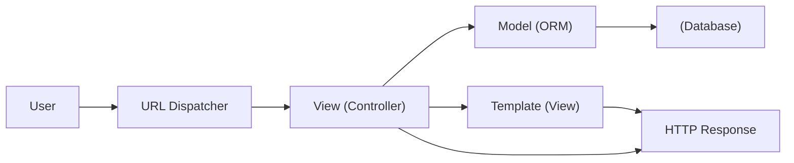
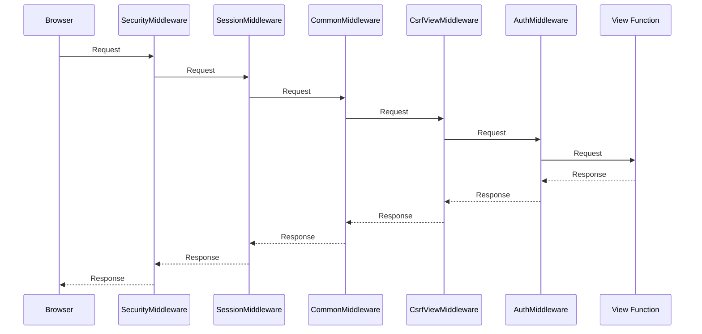

# Django 研究报告

> **声明**：本报告基于 `django` 源码分析，侧重于设计思想与架构取舍。

## 1. 概览

### 1.1 项目简介
**Django** 是 Python 生态中最著名的高级 Web 框架，诞生于 2005 年。它以“Batteries Included（内置电池）”为核心哲学，旨在让开发者能够快速构建高性能、优雅的 Web 应用。

### 1.2 核心设计哲学
*   **Batteries Included (全家桶)**：开箱即用。不像 Flask 等微框架只提供核心功能，Django 内置了 ORM、Admin 后台、认证系统、表单处理、Session 管理等几乎所有 Web 开发所需的基础设施。
*   **DRY (Don't Repeat Yourself)**：强调代码复用。通过模板继承、ORM 模型定义和 URL 命名模式，最大程度减少重复代码。
*   **Explicit is better than implicit**：尽管有很多“魔法”，但在配置（Settings）和模型定义上，Django 倾向于显式声明。
*   **Loosely Coupled (松耦合)**：虽然是全家桶，但各个模块（如 Template、Auth、Cache）设计上尽量保持独立，可以被替换（尽管替换 ORM 成本较高）。

### 1.3 目录结构概览

| 目录 | 说明 |
| :--- | :--- |
| `django/conf` | **配置中心**。管理全局 Settings (`django.conf.settings`)，采用惰性加载机制。 |
| `django/contrib` | **标准库**。内置的强大应用集，包括 Admin, Auth, Sessions, StaticFiles 等。 |
| `django/core` | **框架核心**。包含请求处理 (`handlers`), 缓存, 邮件, 签名等底层服务。 |
| `django/db` | **ORM**。数据库抽象层，包含模型定义 (`models`), 查询构建 (`query`), 迁移系统 (`migrations`)。 |
| `django/dispatch` | **信号系统**。实现了观察者模式，用于解耦组件间的事件通知。 |
| `django/template` | **模板引擎**。Django 自带的模板语言 (DTL) 实现。 |
| `django/urls` | **路由系统**。基于正则表达式和路径转换器的 URL 分发机制。 |

## 2. 核心架构与机制

### 2.1 架构总览：MVT 模式

Django 遵循 **MVT (Model-View-Template)** 架构，这本质上是 MVC 的一种变体。



*   **Model**: 数据存取层 (`django.db.models`)，描述数据结构。
*   **View**: 业务逻辑层 (`django.views`)，决定“展示什么数据”。注意，Django 的 View 相当于 MVC 中的 Controller。
*   **Template**: 表现层 (`django.template`)，决定“如何展示数据”。

### 2.2 请求处理管道：中间件 (Middleware)

Django 的请求处理核心是一个洋葱模型。请求经过一系列中间件到达 View，响应再反向穿过中间件返回。

`django.core.handlers.base.BaseHandler` 负责加载和执行这些中间件。



### 2.3 ORM：对象关系映射

Django 的 ORM 是其最强大的组件之一，支持多种数据库（PostgreSQL, MySQL, SQLite, Oracle）的统一操作。

*   **Active Record 风格**：模型类直接映射数据库表，实例映射行。
*   **Migrations**：`django.db.migrations` 提供了强大的版本控制机制，自动追踪模型变更并生成数据库迁移脚本。
*   **QuerySet**：惰性执行的查询集。链式调用（如 `.filter().exclude().order_by()`）不会立即查询数据库，只有在真正使用数据时才会触发 SQL。

### 2.4 The Contrib Packages：生态基石

Django 的 `contrib` 目录是其被称为“全家桶”的原因。

*   **django.contrib.admin**：杀手级功能。只需几行配置，就能根据 Model 定义自动生成生产级可用的后台管理界面。
*   **django.contrib.auth**：提供用户模型、权限组、登录/注销逻辑、密码哈希等完整的认证体系。

## 3. 典型用法示例

### 3.1 定义模型

```python
from django.db import models

class Question(models.Model):
    question_text = models.CharField(max_length=200)
    pub_date = models.DateTimeField("date published")
    
    def __str__(self):
        return self.question_text
```

### 3.2 编写视图 (Class Based View)

```python
from django.views import generic
from .models import Question

class IndexView(generic.ListView):
    template_name = "polls/index.html"
    context_object_name = "latest_question_list"

    def get_queryset(self):
        return Question.objects.order_by("-pub_date")[:5]
```

## 4. 结论与建议

### 4.1 优势
*   **开发速度快**：无需从头选择和集成各种库（ORM, Auth, Admin），`startproject` 后即可开始写业务。
*   **安全性高**：默认开启并处理了 CSRF, SQL Injection, XSS, Clickjacking 等常见安全问题。
*   **Admin 后台**：对于内容管理系统 (CMS) 或内部工具，Admin 后台能节省数周的开发时间。
*   **成熟稳定**：拥有庞大的社区、详尽的文档和长期的维护支持。

### 4.2 落地建议
*   **适合场景**：内容驱动的网站（新闻、博客、CMS）、电商平台、企业内部管理系统、快速原型开发。
*   **不适合场景**：超高并发的实时应用（虽然有了 ASGI，但不如 Go/Node 原生）、极简的微服务（此时 Flask/FastAPI 可能更轻量）。
*   **学习曲线**：虽然上手容易，但精通 Django（特别是 ORM 优化和 Class Based Views）需要时间。建议初学者先从 Function Based Views 开始，逐步过渡到 CBV。
