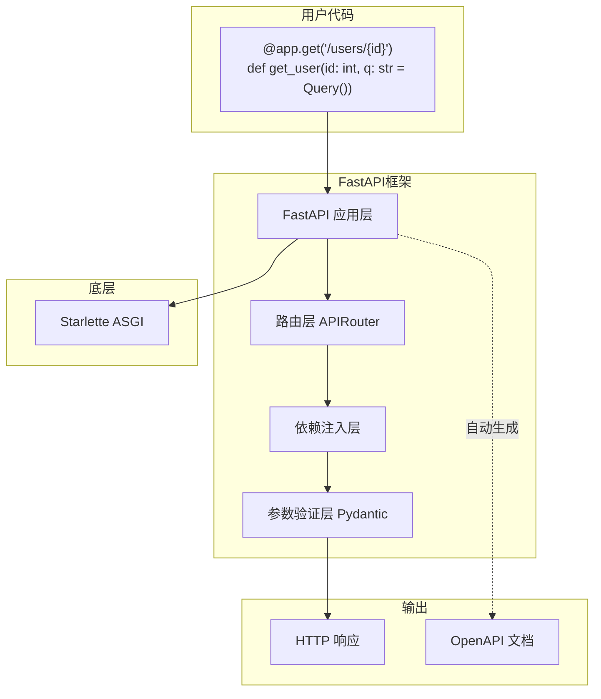
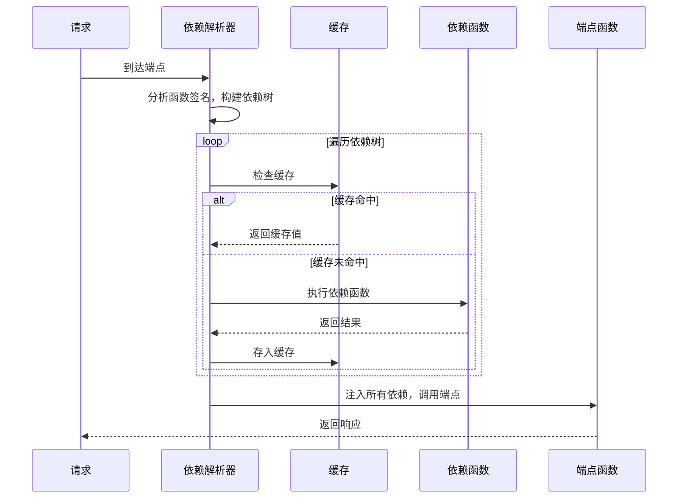
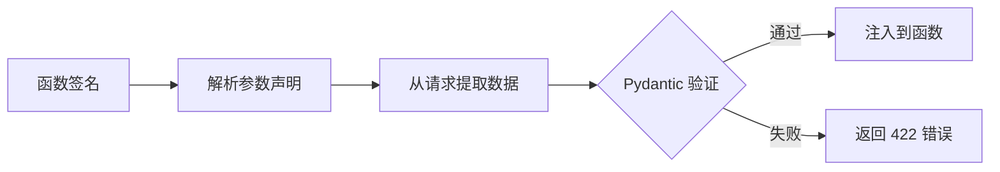
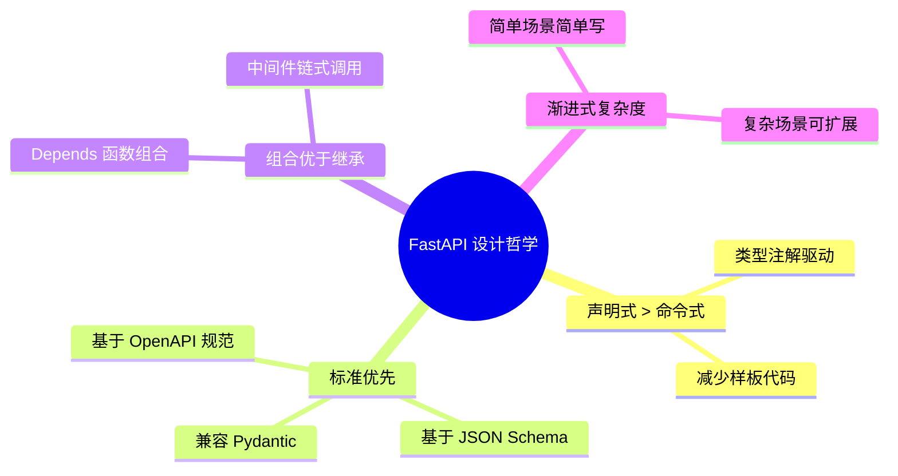

# FastAPI 框架研究报告

> 研究目标：理解 FastAPI 的核心设计思想、架构取舍与关键机制

## 要点速览

| 维度 | 说明 |
|------|------|
| 定位 | 现代化 Python Web API 框架，主打高性能与开发体验 |
| 核心依赖 | Starlette（ASGI 基础）+ Pydantic（数据验证） |
| 设计哲学 | "声明即文档"——类型注解驱动一切 |
| 核心能力 | 自动参数验证、依赖注入、OpenAPI 文档生成 |
| 适用场景 | REST API、微服务、需要高性能的后端服务 |

---

## 一、整体概览

### 1.1 FastAPI 解决什么问题？

传统 Web 框架（如 Flask）存在几个痛点：

1. **参数验证靠手写**：每个接口都要手动校验参数
2. **文档与代码分离**：Swagger 文档需要单独维护，容易过时
3. **依赖注入不完善**：复杂业务的依赖管理混乱
4. **异步支持不够原生**：需要额外配置

FastAPI 的核心思路：**用 Python 类型注解驱动一切**。你声明参数的类型，框架自动完成验证、文档生成、编辑器补全。

### 1.2 目录结构概览

```
fastapi/
├── applications.py      # FastAPI 应用主类（入口）
├── routing.py           # 路由和端点处理核心
├── param_functions.py   # Path/Query/Body 等参数声明函数
├── params.py            # 参数基类定义
├── exceptions.py        # 异常类
├── encoders.py          # JSON 编码器
├── datastructures.py    # 数据结构（如 UploadFile）
│
├── dependencies/        # 依赖注入系统（核心机制）
│   ├── models.py        #   依赖模型 Dependant
│   └── utils.py         #   依赖解析与执行逻辑
│
├── security/            # 安全认证模块
│   ├── oauth2.py        #   OAuth2 实现
│   ├── http.py          #   HTTP Basic/Bearer 认证
│   └── api_key.py       #   API Key 认证
│
├── openapi/             # OpenAPI 文档生成
│   ├── utils.py         #   Schema 生成逻辑
│   └── docs.py          #   Swagger UI / ReDoc 页面
│
└── middleware/          # 中间件集合（CORS、Gzip 等）
```

### 1.3 核心架构图



---

## 二、核心模块职责

### 2.1 模块职责表

| 模块 | 职责 | 关键依赖 | 扩展点 |
|------|------|----------|--------|
| **applications.py** | 应用容器，管理路由、文档、异常 | Starlette | 自定义异常处理器 |
| **routing.py** | 路由匹配，请求处理流程 | dependencies | 自定义路由类 |
| **dependencies/** | 依赖注入的解析与执行 | Pydantic | `Depends()` 自定义依赖 |
| **param_functions.py** | 参数声明 API | params.py | 自定义参数类型 |
| **security/** | 认证方案实现 | dependencies | 自定义安全方案 |
| **openapi/** | 文档自动生成 | Pydantic models | 自定义文档元数据 |

### 2.2 层次关系

FastAPI 采用**洋葱式分层架构**：

```
┌─────────────────────────────────────────────┐
│           FastAPI (applications.py)          │  ← 最外层：应用配置
├─────────────────────────────────────────────┤
│           APIRouter (routing.py)             │  ← 路由管理
├─────────────────────────────────────────────┤
│      依赖注入 (dependencies/utils.py)        │  ← 核心机制
├─────────────────────────────────────────────┤
│      参数验证 (Pydantic + param_functions)   │  ← 数据验证
├─────────────────────────────────────────────┤
│            Starlette ASGI                    │  ← 底层网络
└─────────────────────────────────────────────┘
```

---

## 三、关键机制深入

### 3.1 核心机制一：依赖注入系统

这是 FastAPI 最精妙的设计。它用一个简单的 `Depends()` 函数，实现了强大的依赖注入。

**设计取舍**：
- 选择**函数式依赖**而非类式（如 Java Spring）——更 Pythonic
- 支持**任意层级嵌套**——依赖可以有自己的依赖
- **自动缓存**——同一请求中，相同依赖只执行一次

**工作流程**：



**核心代码位置**：`dependencies/utils.py` 中的 `solve_dependencies()` 函数

```python
# 依赖使用示例
async def get_db():
    """数据库连接依赖"""
    db = Database()
    try:
        yield db          # yield 之前是初始化
    finally:
        db.close()        # yield 之后是清理

async def get_current_user(db = Depends(get_db)):
    """当前用户依赖 —— 依赖于数据库连接"""
    return db.get_user()

@app.get("/items")
async def read_items(user = Depends(get_current_user)):
    """端点 —— 自动获得解析好的 user"""
    return user.items
```

**为什么这样设计？**

| 设计决策 | 原因 |
|----------|------|
| 用 `yield` 支持资源清理 | 比 `try/finally` 更简洁，自动管理生命周期 |
| 缓存基于 `(函数, use_cache)` 键 | 避免重复执行开销大的操作（如数据库查询） |
| 支持同步和异步 | 兼容各种使用场景，自动检测 |

### 3.2 核心机制二：参数声明与验证

FastAPI 通过类型注解自动完成参数提取和验证。

**参数来源分类**：

| 函数 | 来源 | 示例 |
|------|------|------|
| `Path()` | URL 路径 | `/users/{user_id}` |
| `Query()` | 查询字符串 | `?page=1&size=10` |
| `Header()` | HTTP 请求头 | `Authorization: Bearer xxx` |
| `Cookie()` | Cookie | `session_id=abc` |
| `Body()` | 请求体 | JSON/Form 数据 |
| `Form()` | 表单数据 | `application/x-www-form-urlencoded` |
| `File()` | 上传文件 | `multipart/form-data` |

**验证流程**：



**示例代码**：

```python
from fastapi import FastAPI, Path, Query, Body
from pydantic import BaseModel

app = FastAPI()

class Item(BaseModel):
    name: str
    price: float

@app.put("/items/{item_id}")
async def update_item(
    item_id: int = Path(gt=0, description="物品ID，必须大于0"),
    q: str | None = Query(default=None, max_length=50),
    item: Item = Body(embed=True)
):
    """
    FastAPI 自动完成：
    1. 从 URL 提取 item_id，验证 > 0
    2. 从查询参数提取 q，验证长度 <= 50
    3. 从请求体解析 JSON 为 Item 对象
    4. 生成 OpenAPI 文档
    """
    return {"item_id": item_id, "item": item}
```

### 3.3 核心机制三：自动文档生成

FastAPI 的"声明即文档"理念在这里体现得淋漓尽致。

**生成过程**：

1. 框架扫描所有注册的路由
2. 分析每个端点的参数声明和返回类型
3. 提取 `description`、`summary`、`examples` 等元数据
4. 生成符合 OpenAPI 3.0 规范的 JSON Schema
5. 提供 `/docs`（Swagger UI）和 `/redoc` 两种 UI

**设计取舍**：

| 决策 | 权衡 |
|------|------|
| 内置文档 UI | 增加包体积，但开箱即用提升开发体验 |
| 基于类型注解 | 要求开发者写类型，但换来自动化文档 |
| 支持两种 UI | 满足不同偏好（Swagger 交互性强，ReDoc 阅读体验好） |

---

## 四、设计哲学与取舍

### 4.1 核心设计原则



### 4.2 关键设计取舍

| 取舍点 | FastAPI 的选择 | 原因 |
|--------|----------------|------|
| 同步 vs 异步 | 默认异步，兼容同步 | 现代 Web 性能需求 |
| 强类型 vs 弱类型 | 强类型（Python 类型注解） | 换取自动验证和文档 |
| 内置功能 vs 插件 | 核心精简，功能通过依赖注入扩展 | 保持灵活性 |
| 自研 vs 复用 | 底层复用 Starlette/Pydantic | 专注上层抽象 |
| 魔法 vs 显式 | 尽量显式（通过类型注解） | 代码即文档 |

### 4.3 与同类框架对比

| 维度 | FastAPI | Flask | Django REST |
|------|---------|-------|-------------|
| 异步支持 | 原生 | 需插件 | 有限 |
| 类型系统 | 原生集成 | 可选 | 序列化器 |
| 文档生成 | 自动 | 需插件 | 需配置 |
| 学习曲线 | 中等 | 低 | 高 |
| 性能 | 高（ASGI） | 中（WSGI） | 中 |
| 适用场景 | API 服务 | 小型应用 | 全栈应用 |

---

## 五、典型使用场景

### 5.1 最小可用示例

```python
from fastapi import FastAPI

app = FastAPI()

@app.get("/")
async def root():
    return {"message": "Hello World"}

# 运行: uvicorn main:app --reload
# 文档: http://localhost:8000/docs
```

### 5.2 依赖注入实战

```python
from fastapi import FastAPI, Depends, HTTPException
from typing import Annotated

app = FastAPI()

# 模拟数据库
fake_users_db = {"alice": {"name": "Alice", "role": "admin"}}

# 依赖：获取当前用户
async def get_current_user(token: str = Header()):
    user = fake_users_db.get(token)
    if not user:
        raise HTTPException(status_code=401, detail="Invalid token")
    return user

# 依赖：权限检查（依赖于 get_current_user）
async def require_admin(user = Depends(get_current_user)):
    if user["role"] != "admin":
        raise HTTPException(status_code=403, detail="Admin required")
    return user

# 使用依赖链
@app.get("/admin/settings")
async def admin_settings(admin = Depends(require_admin)):
    return {"settings": "secret", "admin": admin["name"]}
```

### 5.3 请求体验证

```python
from fastapi import FastAPI
from pydantic import BaseModel, Field, EmailStr

app = FastAPI()

class UserCreate(BaseModel):
    """用户创建请求体 —— Pydantic 自动验证"""
    username: str = Field(min_length=3, max_length=20)
    email: EmailStr
    age: int = Field(ge=0, le=150)

    model_config = {
        "json_schema_extra": {
            "examples": [{"username": "alice", "email": "alice@example.com", "age": 25}]
        }
    }

@app.post("/users")
async def create_user(user: UserCreate):
    # 到这里时，user 已经通过所有验证
    return {"id": 1, **user.model_dump()}
```

---

## 六、结论与建议

### 6.1 FastAPI 的核心价值

1. **开发效率**：类型注解 → 自动验证 + 自动文档，减少 40% 以上样板代码
2. **性能优秀**：基于 ASGI，性能接近 Go/Node.js
3. **学习曲线平缓**：会 Python 类型注解就能上手
4. **生态兼容**：与 Pydantic、SQLAlchemy、各种 ORM 无缝集成

### 6.2 适用场景

| 场景 | 推荐度 | 说明 |
|------|--------|------|
| REST API 开发 | ⭐⭐⭐⭐⭐ | 最佳场景 |
| 微服务 | ⭐⭐⭐⭐⭐ | 轻量、高性能 |
| 实时应用（WebSocket） | ⭐⭐⭐⭐ | 原生支持 |
| 全栈应用 | ⭐⭐⭐ | 可行但非最优（考虑 Django） |
| 小型脚本 | ⭐⭐ | 可能过重（考虑 Flask） |

### 6.3 落地建议

1. **项目结构**：按功能模块组织，每个模块一个 `router.py`
   ```
   app/
   ├── main.py          # 应用入口
   ├── dependencies.py  # 公共依赖
   ├── users/
   │   ├── router.py    # 用户路由
   │   ├── schemas.py   # Pydantic 模型
   │   └── service.py   # 业务逻辑
   └── items/
       └── ...
   ```

2. **依赖注入最佳实践**：
   - 数据库连接用 `yield` 依赖，自动管理生命周期
   - 公共验证逻辑抽成依赖，避免重复代码
   - 复杂依赖链拆分成小依赖，便于测试

3. **性能优化**：
   - IO 密集操作用 `async`，CPU 密集操作用 `run_in_executor`
   - 利用依赖缓存避免重复计算
   - 生产环境用 Gunicorn + Uvicorn Workers

4. **学习路径**：
   - 入门：官方教程（https://fastapi.tiangolo.com/tutorial/）
   - 进阶：阅读 `routing.py` 和 `dependencies/utils.py` 源码
   - 深入：研究 Starlette 和 Pydantic 的底层实现

---

## 参考资料

- [FastAPI 官方文档](https://fastapi.tiangolo.com/)
- [Starlette 官方文档](https://www.starlette.io/)
- [Pydantic 官方文档](https://docs.pydantic.dev/)
- 源码版本：FastAPI 0.128.0
