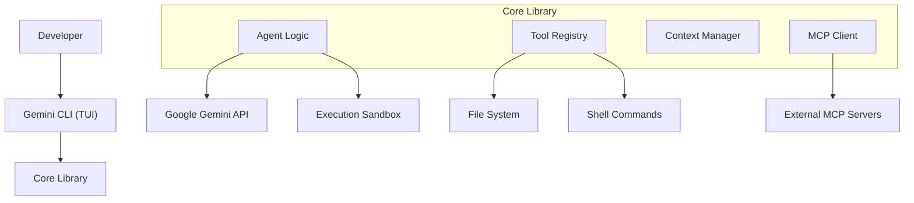
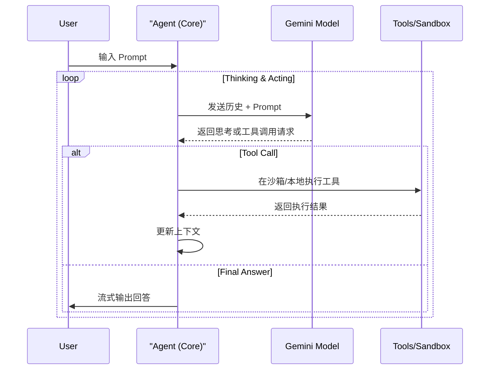

# Gemini CLI 研究报告

> **声明**：本报告基于 `@google/gemini-cli` 源码分析，侧重于设计思想与架构取舍。

## 1. 概览

### 1.1 项目简介
**Gemini CLI** 是 Google 推出的开源 AI 终端助手，旨在将 Gemini 模型的强大能力无缝集成到开发者的命令行工作流中。它不仅是一个简单的聊天机器人，更是一个具备上下文感知、工具调用能力和安全沙箱环境的智能 Agent。

### 1.2 核心设计哲学
*   **终端优先 (Terminal-First)**：专为习惯命令行的开发者设计，支持交互式 TUI 和非交互式管道 (Pipe) 模式，无缝融入现有 Shell 脚本和工具链。
*   **模块化核心 (Modular Core)**：采用 Monorepo 结构，将核心逻辑 (`core`) 与界面实现 (`cli`) 分离，便于未来扩展至 IDE 插件或其他界面。
*   **安全沙箱 (Sandboxed Execution)**：对 AI 执行的代码和命令进行隔离，通过 Docker 或 Podman 提供安全保障，防止意外破坏系统。
*   **协议标准化**：原生支持 [Model Context Protocol (MCP)](https://modelcontextprotocol.io/)，通过标准协议扩展工具能力，而非仅依赖内部硬编码工具。

### 1.3 目录结构概览 (Monorepo)

| 目录                    | 说明                                                      |
| :-------------------- | :------------------------------------------------------ |
| `packages/core`       | **大脑**。包含 Agent 逻辑、Gemini API 封装、Prompt 管理、工具链及 MCP 实现。 |
| `packages/cli`        | **躯体**。基于 React + Ink 构建的终端用户界面 (TUI)，负责输入解析、渲染和会话管理。   |
| `packages/test-utils` | **测试基础设施**。提供单元测试和集成测试的辅助工具。                            |
| `packages/a2a-server` | **Agent 协作**。可能涉及 Agent-to-Agent 通信的实验性服务。              |

## 2. 核心架构与机制

### 2.1 架构总览

Gemini CLI 采用分层架构，确保了逻辑复用与界面解耦。



### 2.2 交互模式：双模驱动

Gemini CLI 独特地支持两种截然不同的交互模式，由 `packages/cli/src/gemini.tsx` 统一调度：

1.  **交互式 TUI 模式**：
    *   **技术栈**：React + Ink。将 Web 开发的组件化思想带入终端 UI。
    *   **体验**：提供类似 IDE 的富文本体验，支持即时渲染 Markdown、代码高亮、多行输入和历史记录回溯。
    *   **实现**：`AppContainer.tsx` 作为根组件，管理着 `Chat`、`Input` 等子组件的状态。

2.  **非交互式 Pipe 模式**：
    *   **场景**：自动化脚本、CI/CD 流程。
    *   **机制**：检测 `stdin` 是否有数据输入，直接将输入作为 Prompt 发送给 Agent，并将结果输出到 `stdout`。
    *   **实现**：`runNonInteractive` 函数绕过 UI 渲染，直接调用 Core 的 `geminiChat` 服务。

### 2.3 思考与执行：The Loop

Agent 的核心思考循环位于 `packages/core/src/core/geminiChat.ts`，它定制了 Google GenAI SDK 的行为以适应 CLI 场景。



### 2.4 安全机制：受信与沙箱

为了解决 AI 执行本地命令的安全隐患，Gemini CLI 引入了双重保障：

1.  **受信文件夹 (Trusted Folders)**：
    *   用户需显式通过 `gemini config trusted-folders add <path>` 授权。
    *   未授权目录下的文件读写操作会被拦截或询问。
2.  **执行沙箱 (Execution Sandbox)**：
    *   对于高风险操作（如运行生成的代码），CLI 会尝试在 Docker 或 Podman 容器中执行，确保宿主机环境不受污染。

## 3. 典型用法与扩展

### 3.1 智能上下文感知

Gemini CLI 会自动读取项目根目录下的 `GEMINI.md`。这是一个简单的 Markdown 文件，用于为 Agent 注入项目特定的上下文（如代码规范、架构说明）。

*   **设计思想**：**Context as Code**。将 AI 的上下文配置随代码库一起版本控制，确保团队成员共享相同的 AI 辅助体验。

### 3.2 扩展能力：MCP

通过支持 MCP，Gemini CLI 可以连接到任何兼容 MCP 的服务。

```json
// ~/.gemini/settings.json 示例
{
  "mcpServers": {
    "postgres": {
      "command": "npx",
      "args": ["-y", "@modelcontextprotocol/server-postgres", "postgresql://localhost/mydb"]
    }
  }
}
```

配置后，Gemini 即可直接执行 SQL 查询数据库，无需任何代码修改。

## 4. 结论与建议

### 4.1 优势
*   **开发者体验极佳**：Ink 带来的 TUI 体验远超传统 CLI，同时保留了键盘操作的高效。
*   **生态整合**：通过 `GEMINI.md` 和 MCP，它不仅是聊天工具，更是可定制的开发环境增强器。
*   **安全性设计**：沙箱和受信目录机制展示了其对企业级安全需求的重视。

### 4.2 落地建议
*   **作为团队标配**：建议在每个代码仓库中维护 `GEMINI.md`，定义该项目的特定术语和开发规范，帮助新成员（和 AI）快速上手。
*   **自动化集成**：利用其 Pipe 模式，将其集成到 Git Hook 或 CI 流程中，例如自动生成 Commit Message 或 Review 代码变更。
*   **工具扩展**：对于内部复杂的运维操作，封装为 MCP Server，让 Gemini CLI 成为统一的运维入口。
