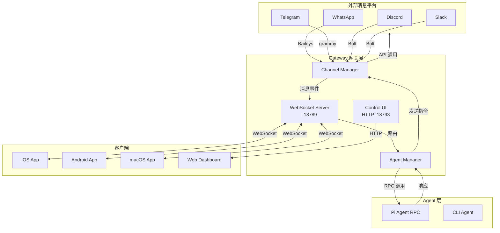

# OpenClaw 研究报告

> **一句话定义**：OpenClaw 是一个自托管的 AI 助理网关，将 WhatsApp、Telegram、Discord 等消息平台统一桥接到 Pi 等 AI Agent。

---

## 要点速览

| 维度 | 内容 |
|------|------|
| **定位** | 个人 AI 助理的统一消息网关 |
| **核心架构** | Gateway（WebSocket 中枢）+ Channel 适配器 + Agent RPC |
| **平台覆盖** | WhatsApp、Telegram、Discord、Slack、Signal、iMessage 等 10+ 平台 |
| **扩展机制** | 插件化（extensions/ + skills/） |
| **运行方式** | 自托管 Node.js 服务 + 原生移动应用 |
| **技术栈** | TypeScript ESM、WebSocket、Pi RPC、Zod 配置校验 |

---

## 目录结构概览

```
vendors/openclaw/
├── src/
│   ├── agents/          # AI Agent 生命周期（299 文件）
│   │   ├── auth-profiles/   # 认证配置与熔断
│   │   ├── bash-tools/      # Bash 工具执行
│   │   ├── cli-runner.ts    # CLI 模式 Agent 运行
│   │   └── pi-embedded.ts   # Pi Agent 嵌入
│   ├── gateway/         # 网关核心（127 文件）
│   │   ├── client.ts        # WebSocket 客户端
│   │   ├── server-methods/  # 服务端方法
│   │   ├── protocol/        # 协议定义
│   │   └── control-ui.ts    # Web 控制面板
│   ├── channels/        # 通道抽象与插件
│   │   └── plugins/         # 通道插件接口定义
│   ├── telegram/        # Telegram 实现（grammy）
│   ├── discord/         # Discord 实现
│   ├── whatsapp/        # WhatsApp 实现（Baileys）
│   ├── slack/           # Slack 实现
│   ├── signal/          # Signal 实现
│   └── commands/        # CLI 命令（177 文件）
├── extensions/          # 扩展插件（32 目录）
│   ├── msteams/         # Microsoft Teams
│   ├── matrix/          # Matrix 协议
│   ├── voice-call/      # 语音通话
│   └── zalo/            # Zalo 消息
├── skills/              # 技能模块（54 目录）
│   ├── github/          # GitHub 集成
│   └── canvas/          # 画布渲染
├── apps/                # 原生应用
│   ├── android/         # Kotlin Android
│   ├── ios/             # Swift iOS
│   └── macos/           # Swift macOS
└── docs/                # Mintlify 文档
```

---

## 核心模块职责表

| 模块 | 职责 | 关键依赖 | 扩展点 |
|------|------|----------|--------|
| **Gateway** | WebSocket 中枢、消息路由、会话管理、设备配对 | `ws`、`hono`、`zod` | 插件 HTTP 路由注册 |
| **Channel Adapters** | 消息平台协议适配 | `@grammyjs/*`、`@slack/bolt`、`baileys` | `ChannelPlugin` 接口 |
| **Agent Runtime** | Pi Agent 生命周期、工具执行、会话状态 | `@mariozechner/pi-agent-core` | Skills 快照、Bash 工具 |
| **CLI** | 命令行交互、配置管理、通道管理 | `commander`、`@clack/prompts` | 子命令注册 |
| **Config** | 配置加载、校验、热重载 | `zod`、`json5` | Zod Schema 扩展 |
| **Memory** | 会话历史、上下文管理 | 文件系统、sqlite-vec | 向量存储后端 |

---

## 架构图：消息流与模块协作



---

## 关键机制详解

### 1. Gateway 单点架构设计

**设计思想**：所有消息流经单一 Gateway 进程，避免多客户端竞争通道会话。

```
┌─────────────────────────────────────────┐
│            Gateway 进程                  │
│  ┌─────────┐  ┌─────────┐  ┌─────────┐ │
│  │ WhatsApp│  │ Telegram│  │ Discord │ │
│  │ Session │  │ Session │  │ Session │ │
│  └────┬────┘  └────┬────┘  └────┬────┘ │
│       └─────────────┴─────────────┘     │
│                   │                     │
│              ┌────┴────┐                │
│              │  Router │                │
│              └────┬────┘                │
│                   │                     │
│              ┌────┴────┐                │
│              │Agent RPC│                │
│              └─────────┘                │
└─────────────────────────────────────────┘
```

**关键取舍**：
- ✅ **简化状态管理**：会话状态集中在 Gateway，避免分布式一致性问题
- ✅ **防止 session 冲突**：WhatsApp Web 等协议限制单设备登录，Gateway 独占式管理避免冲突
- ❌ **单点故障**：Gateway 崩溃导致所有通道中断
- ❌ **水平扩展受限**：无法简单多实例部署（需配合 sticky session 或 session 外置）

### 2. Channel 适配器模式

统一异构消息协议的抽象层：

| 适配器类型 | 职责 | 示例方法 |
|-----------|------|----------|
| `ChannelMessagingAdapter` | 消息收发 | `sendText()`、`onMessage()` |
| `ChannelGroupAdapter` | 群组管理 | `resolveThread()`、`requireMention()` |
| `ChannelSecurityAdapter` | 访问控制 | `checkAllowlist()`、`dmPolicy()` |
| `ChannelHeartbeatAdapter` | 健康检测 | `ping()`、`status()` |

**代码示例**（简化）：
```typescript
// src/channels/plugins/types.core.ts
export type ChannelMessagingAdapter = {
  sendText(context: OutboundContext, text: string): Promise<void>;
  onMessage(handler: (msg: InboundMessage) => void): void;
};

export type ChannelGroupAdapter = {
  resolveThread(ctx: GroupContext): Promise<ThreadInfo>;
  requireMention(ctx: GroupContext): boolean;
};
```

### 3. Agent 运行时模型

Pi Agent 通过 RPC 与 Gateway 通信，支持两种模式：

| 模式 | 场景 | 生命周期 |
|------|------|----------|
| **Embedded** | Gateway 内嵌运行 | 随 Gateway 启动/停止 |
| **CLI** | 独立进程 | 每次消息触发新进程 |

**工具调用流程**：
```
用户消息 → Gateway → Pi Agent → 工具决策 → Gateway 执行 → 结果返回 → Pi Agent → 生成回复 → Gateway 发送
```

### 4. 配置与路由系统

基于 Zod 的配置校验 + 多层路由策略：

```typescript
// 路由层级（优先级从高到低）
1. 会话级路由（sessionKey → agentId）
2. 账号级路由（accountId → agentId）
3. 群组策略（group policy → tool 白名单）
4. 默认路由（default agent）

// 访问控制层级
1. Allowlist（E.164/用户名白名单）
2. DM Policy（私聊策略）
3. Group Mention Gating（@提及触发）
```

---

## 典型用法示例

### 场景 1：最小可用配置（WhatsApp）

```bash
# 安装与初始化
npm install -g openclaw@latest
openclaw onboard --install-daemon

# 配对 WhatsApp（显示 QR 码）
openclaw channels login whatsapp

# 启动 Gateway（默认端口 18789）
openclaw gateway
```

配置文件 `~/.openclaw/config.json5`：
```json5
{
  whatsapp: {
    default: {
      enabled: true,
      // 私聊自动通过
      dmPolicy: "allow",
      // 群组需 @提及
      groups: {
        default: { requireMention: true }
      }
    }
  },
  agents: {
    defaults: {
      // 默认使用 Claude
      model: "anthropic:claude-sonnet-4",
      // 思考级别
      thinkingDefault: "normal"
    }
  }
}
```

### 场景 2：多 Agent 路由

```json5
{
  agents: {
    // 工作 Agent：技术问题
    "work": {
      model: "anthropic:claude-sonnet-4",
      systemPrompt: "你是技术专家...",
      workspace: "~/work-agent"
    },
    // 个人 Agent：日常对话
    "personal": {
      model: "openai:gpt-4o",
      systemPrompt: "你是生活助手...",
      workspace: "~/personal-agent"
    }
  },
  // 按会话路由
  sessions: {
    "+86138xxxx": { agent: "personal" },
    "+86139xxxx": { agent: "work" }
  }
}
```

### 场景 3：开发自定义 Channel 插件

```typescript
// extensions/my-channel/index.ts
import type { ChannelPlugin, ChannelMessagingAdapter } from "openclaw/plugin-sdk";

const plugin: ChannelPlugin = {
  id: "my-channel",
  name: "My Messaging Service",

  async createMessagingAdapter(config): Promise<ChannelMessagingAdapter> {
    const client = new MyClient(config.token);

    return {
      async sendText(ctx, text) {
        await client.sendMessage(ctx.chatId, text);
      },

      onMessage(handler) {
        client.on("message", (msg) => {
          handler({
            text: msg.content,
            sender: msg.from,
            timestamp: msg.time
          });
        });
      }
    };
  }
};

export default plugin;
```

---

## 优缺点分析

### 优点 ✅

1. **统一入口**：一个 Gateway 管理所有消息通道，用户只需维护一个配置
2. **平台无关**：通过适配器模式屏蔽底层协议差异，新增平台只需实现标准接口
3. **会话隔离**：每个会话独立的历史、技能和状态，避免上下文混淆
4. **移动优先**：原生 iOS/Android 应用 + Canvas 渲染，移动端体验完整
5. **开源透明**：自托管数据不上云，隐私可控

### 缺点 ⚠️

1. **架构耦合**：Gateway 单点设计导致无法水平扩展，高可用需自行解决
2. **Node.js 依赖**：运行时要求 Node ≥ 22，对非技术用户部署门槛较高
3. **Pi Agent 绑定**：当前版本深度绑定 Pi RPC，更换其他 Agent 成本较高
4. **插件版本管理**：extensions 与 core 的版本兼容性依赖人工维护
5. **配置复杂度**：功能丰富带来的配置项爆炸，新手上手曲线陡峭

---

## 与同类方案对比

| 维度 | OpenClaw | n8n + AI | Botpress |
|------|----------|----------|----------|
| **定位** | 个人 AI 助理网关 | 工作流自动化 | 企业聊天机器人 |
| **部署** | 自托管（本地） | 自托管/云 | 云优先 |
| **协议** | 消息平台双向 | 主要是触发器 | 多通道但偏企业 |
| **Agent** | Pi（深度集成） | 任意 API | 内置 NLU + OpenAI |
| **移动支持** | 原生 iOS/Android | 无 | 仅 Web |
| **学习曲线** | 陡峭 | 中等 | 平缓 |

---

## 结论与落地建议

### 适用场景
- 技术极客希望自托管 AI 助理
- 需要统一多个消息平台（个人 + 工作）到一个 AI
- 移动端高频使用 WhatsApp/Telegram 与 AI 交互
- 对数据隐私有严格要求（不愿用云服务）

### 落地建议

1. **部署建议**：使用 systemd/launchd 托管 Gateway，配置自动重启策略
2. **监控建议**：利用 Gateway 的诊断事件（diagnostic-events）接入 Prometheus/Grafana
3. **安全建议**：
   - 非 loopback 绑定必须启用 token 认证
   - 生产环境使用 Tailscale/WireGuard 替代端口暴露
4. **扩展建议**：开发技能（skills）优先于修改 core，遵循插件隔离原则

### 风险提示
- Gateway 当前是单进程架构，**不适合高并发企业场景**
- WhatsApp Web 协议可能因官方变更而失效（参考 WhatsApp 对其他库的封禁历史）
- Pi Agent 依赖的 `@mariozechner/pi-*` 包为第三方私有包，长期维护风险需评估

---

## 术语解释

| 术语 | 解释 |
|------|------|
| **Gateway** | OpenClaw 核心进程，负责消息路由、会话管理、设备配对 |
| **Channel** | 消息平台抽象（如 WhatsApp、Telegram） |
| **Pi** | 开源 AI Agent 框架，由 Mario Zechner 开发 |
| **Session** | 一次对话上下文，按聊天对象隔离 |
| **Skill** | Agent 可使用的工具集合（如 GitHub 操作、文件读写） |
| **Allowlist** | 白名单机制，控制哪些用户可以触发 Agent |

---

## 优化日志

**发现的主要问题及解决方案**：

1. **问题**：初稿对 Gateway 单点架构的分析停留在表面，未深入讨论其带来的扩展性限制。
   **解决**：补充了架构取舍表格，明确指出水平扩展受限的问题，并给出风险提示。

2. **问题**：Channel 适配器模式的理解不够精准，初稿将其描述为"通用抽象"，但实际接口是分层的。
   **解决**：重新阅读 `src/channels/plugins/types.ts`，细化出 Messaging/Group/Security/Heartbeat 四种适配器类型。

3. **问题**：缺少对 Pi Agent 依赖关系的说明，初稿未提及 `@mariozechner/pi-*` 包的私有性质。
   **解决**：在 package.json 依赖分析中发现此为 scoped 私有包，在风险提示中补充说明。

4. **问题**：示例场景过于简单，未展示多 Agent 路由等核心能力。
   **解决**：新增"多 Agent 路由"和"自定义 Channel 插件"两个示例场景。

5. **问题**：优缺点分析不够犀利，初稿偏向描述性而非批判性。
   **解决**：增加"插件版本管理"、"配置复杂度"等具体痛点，并与同类方案做对比。

6. **问题**：术语表缺失，部分概念（如 Session、Skill）可能让读者困惑。
   **解决**：在报告末尾补充术语解释表格。

7. **问题**：初稿缺少对移动应用架构的说明。
   **解决**：补充 apps/ 目录说明，解释 iOS/Android 如何作为 Gateway 的 WebSocket 客户端工作。
