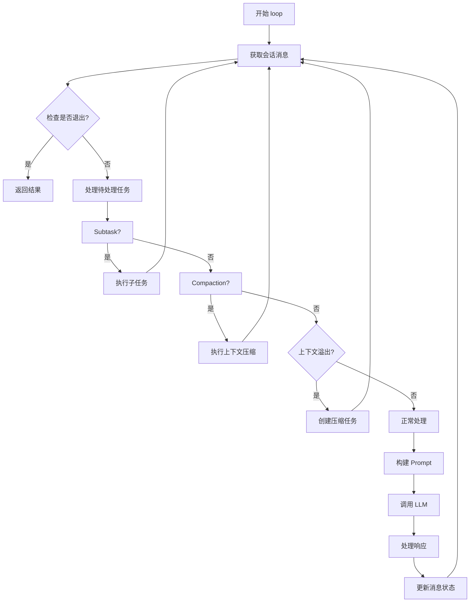

# OpenCode 任务循环与上下文管理详解（Mini版）

## 一、核心架构概览

### 1.1 任务循环的入口

OpenCode 的任务循环起始于 `SessionPrompt.loop()` 函数（`packages/opencode/src/session/prompt.ts:259`），这是一个 **while(true)** 无限循环，负责处理用户消息并与 LLM 交互。

```typescript
// packages/opencode/src/session/prompt.ts:259
export const loop = fn(Identifier.schema("session"), async (sessionID) => {
  const abort = start(sessionID)
  if (!abort) {
    // 如果已经在运行，加入等待队列
    return new Promise<MessageV2.WithParts>((resolve, reject) => {
      const callbacks = state()[sessionID].callbacks
      callbacks.push({ resolve, reject })
    })
  }

  using _ = defer(() => cancel(sessionID))

  let step = 0
  const session = await Session.get(sessionID)
  while (true) {
    SessionStatus.set(sessionID, { type: "busy" })
    // ... 处理逻辑
  }
})
```

### 1.2 核心文件结构

| 文件 | 职责 |
|------|------|
| `prompt.ts` | 主循环逻辑、消息创建 |
| `processor.ts` | LLM 流式响应处理 |
| `llm.ts` | LLM 调用、提示词构建 |
| `message-v2.ts` | 消息数据结构与转换 |
| `compaction.ts` | 上下文压缩/摘要 |
| `summary.ts` | 会话摘要生成 |
| `system.ts` | 系统提示词管理 |

---

## 二、上下文管理详解

### 2.1 消息数据结构

OpenCode 使用 **MessageV2** 作为核心消息模型：

```typescript
// packages/opencode/src/session/message-v2.ts:305-328
export const User = Base.extend({
  role: z.literal("user"),
  time: z.object({
    created: z.number(),
  }),
  summary: z.object({
    title: z.string().optional(),
    body: z.string().optional(),
    diffs: Snapshot.FileDiff.array(),
  }).optional(),
  agent: z.string(),           // 使用的 Agent
  model: z.object({            // 使用的模型
    providerID: z.string(),
    modelID: z.string(),
  }),
  system: z.string().optional(),  // 自定义系统提示词
  tools: z.record(z.string(), z.boolean()).optional(),  // 工具开关
  variant: z.string().optional(),
})

// packages/opencode/src/session/message-v2.ts:350-392
export const Assistant = Base.extend({
  role: z.literal("assistant"),
  time: z.object({
    created: z.number(),
    completed: z.number().optional(),
  }),
  error: APIError.Schema.optional(),
  parentID: z.string(),         // 父消息 ID（用户消息）
  modelID: z.string(),
  providerID: z.string(),
  agent: z.string(),            // 使用的 Agent
  cost: z.number(),             // 成本
  tokens: z.object({            // Token 统计
    input: z.number(),
    output: z.number(),
    reasoning: z.number(),
    cache: z.object({ read: z.number(), write: z.number() }),
  }),
  finish: z.string().optional(), // 完成原因
})
```

### 2.2 Part（消息片段）类型

每个消息包含多个 Part，支持丰富的消息类型：

```typescript
// packages/opencode/src/session/message-v2.ts:330-348
export const Part = z.discriminatedUnion("type", [
  TextPart,           // 文本内容
  SubtaskPart,        // 子任务调用
  ReasoningPart,      // 推理过程
  FilePart,           // 文件附件
  ToolPart,           // 工具调用
  StepStartPart,      // 步骤开始标记
  StepFinishPart,     // 步骤完成标记
  SnapshotPart,       // 文件快照
  PatchPart,          // 文件变更
  AgentPart,          // Agent 切换
  RetryPart,          // 重试信息
  CompactionPart,     // 压缩标记
])
```

---

## 三、主循环流程详解

### 3.1 循环结构



### 3.2 循环关键步骤

```typescript
// packages/opencode/src/session/prompt.ts:272-627
while (true) {
  // 1. 加载并过滤消息
  let msgs = await MessageV2.filterCompacted(MessageV2.stream(sessionID))

  // 2. 查找关键消息
  let lastUser: MessageV2.User | undefined
  let lastAssistant: MessageV2.Assistant | undefined
  let lastFinished: MessageV2.Assistant | undefined
  let tasks: (MessageV2.CompactionPart | MessageV2.SubtaskPart)[] = []

  for (let i = msgs.length - 1; i >= 0; i--) {
    const msg = msgs[i]
    if (!lastUser && msg.info.role === "user") lastUser = msg.info
    if (!lastAssistant && msg.info.role === "assistant") lastAssistant = msg.info
    if (!lastFinished && msg.info.role === "assistant" && msg.info.finish)
      lastFinished = msg.info
    if (lastUser && lastFinished) break
  }

  // 3. 检查是否需要退出循环
  if (
    lastAssistant?.finish &&
    !["tool-calls", "unknown"].includes(lastAssistant.finish) &&
    lastUser.id < lastAssistant.id
  ) {
    break  // 任务完成，退出
  }

  // 4. 插入提醒（Agent 切换时的上下文）
  msgs = await insertReminders({
    messages: msgs,
    agent,
    session,
  })

  // 5. 创建处理器并调用 LLM
  const processor = SessionProcessor.create({...})
  const tools = await resolveTools({...})
  const result = await processor.process({
    user: lastUser,
    agent,
    abort,
    sessionID,
    system: [...(await SystemPrompt.environment(model)), ...],
    messages: [...MessageV2.toModelMessages(sessionMessages, model), ...],
    tools,
    model,
  })

  // 6. 处理结果
  if (result === "stop") break
  if (result === "compact") {
    await SessionCompaction.create({...})
  }
}
```

---

## 四、提示词构建详解

### 4.1 系统提示词来源

系统提示词由三部分组成（`llm.ts:69-82`）：

```typescript
const system = []
system.push(
  [
    // 1. Agent 专属提示词（或 Provider 默认提示词）
    ...(input.agent.prompt ? [input.agent.prompt] : SystemPrompt.provider(input.model)),
    // 2. 自定义提示词
    ...input.system,
    // 3. 用户消息中的系统提示词
    ...(input.user.system ? [input.user.system] : []),
  ].join("\n")
)
```

### 4.2 Provider 提示词选择

```typescript
// packages/opencode/src/session/system.ts:18-25
export function provider(model: Provider.Model) {
  if (model.api.id.includes("gpt-5")) return [PROMPT_CODEX]
  if (model.api.id.includes("gpt-") || model.api.id.includes("o1") || model.api.id.includes("o3"))
    return [PROMPT_BEAST]
  if (model.api.id.includes("gemini-")) return [PROMPT_GEMINI]
  if (model.api.id.includes("claude")) return [PROMPT_ANTHROPIC]
  return [PROMPT_ANTHROPIC_WITHOUT_TODO]
}
```

### 4.3 环境信息注入

```typescript
// packages/opencode/src/session/system.ts:27-51
export async function environment(model: Provider.Model) {
  const project = Instance.project
  return [[
    `You are powered by the model named ${model.api.id}.`,
    `Here is some useful information about the environment you are running in:`,
    `<env>`,
    `  Working directory: ${Instance.directory}`,
    `  Is directory a git repo: ${project.vcs === "git" ? "yes" : "no"}`,
    `  Platform: ${process.platform}`,
    `  Today's date: ${new Date().toDateString()}`,
    `</env>`,
  ].join("\n")]
}
```

### 4.4 消息格式转换

`MessageV2.toModelMessages()` 将内部消息格式转换为 AI SDK 需要的格式：

```typescript
// packages/opencode/src/session/message-v2.ts:436-607
export function toModelMessages(input: WithParts[], model: Provider.Model): ModelMessage[] {
  const result: UIMessage[] = []

  for (const msg of input) {
    if (msg.info.role === "user") {
      // 转换用户消息
      const userMessage: UIMessage = { id: msg.info.id, role: "user", parts: [] }
      for (const part of msg.parts) {
        if (part.type === "text" && !part.ignored)
          userMessage.parts.push({ type: "text", text: part.text })
        if (part.type === "file" && part.mime !== "text/plain")
          userMessage.parts.push({ type: "file", url: part.url, mediaType: part.mime })
      }
      result.push(userMessage)
    }

    if (msg.info.role === "assistant") {
      // 转换助手消息
      const assistantMessage: UIMessage = { id: msg.info.id, role: "assistant", parts: [] }
      for (const part of msg.parts) {
        if (part.type === "text")
          assistantMessage.parts.push({ type: "text", text: part.text })
        if (part.type === "tool" && part.state.status === "completed") {
          // 工具调用结果
          assistantMessage.parts.push({
            type: (`tool-${part.tool}`) as `tool-${string}`,
            state: "output-available",
            toolCallId: part.callID,
            input: part.state.input,
            output: part.state.output,
          })
        }
        if (part.type === "reasoning")
          assistantMessage.parts.push({ type: "reasoning", text: part.text })
      }
      result.push(assistantMessage)
    }
  }

  return convertToModelMessages(result, { tools })
}
```

---

## 五、LLM 调用与流式处理

### 5.1 调用入口

```typescript
// packages/opencode/src/session/llm.ts:48-275
export async function stream(input: StreamInput) {
  // 1. 准备系统提示词
  const system = []
  system.push([...].join("\n"))

  // 2. 处理工具
  const tools = await resolveTools(input)

  // 3. 调用 streamText
  return streamText({
    model: wrapLanguageModel({ model: language, middleware: [...] }),
    messages: [
      ...system.map((x): ModelMessage => ({ role: "system", content: x })),
      ...input.messages,
    ],
    tools,
    temperature: params.temperature,
    abortSignal: input.abort,
    // ...
  })
}
```

### 5.2 流式响应处理

```typescript
// packages/opencode/src/session/processor.ts:45-406
async process(streamInput: LLM.StreamInput) {
  while (true) {
    const stream = await LLM.stream(streamInput)

    for await (const value of stream.fullStream) {
      switch (value.type) {
        case "text-start":
          // 开始文本输出
          currentText = { type: "text", text: "", ... }
          break

        case "text-delta":
          // 增量文本
          currentText.text += value.text
          await Session.updatePart({ part: currentText, delta: value.text })
          break

        case "text-end":
          // 文本完成
          await Session.updatePart(currentText)
          break

        case "tool-call":
          // LLM 请求调用工具
          const part = await Session.updatePart({
            type: "tool",
            tool: value.toolName,
            callID: value.id,
            state: { status: "running", input: value.input },
          })
          break

        case "tool-result":
          // 工具执行结果
          await Session.updatePart({
            ...match,
            state: { status: "completed", output: value.output.output },
          })
          break

        case "finish-step":
          // 步骤完成
          input.assistantMessage.finish = value.finishReason
          input.assistantMessage.cost += usage.cost
          break
      }
    }

    // 检查是否需要压缩
    if (needsCompaction) return "compact"
    if (blocked) return "stop"
    return "continue"
  }
}
```

---

## 六、上下文压缩机制

### 6.1 触发条件

```typescript
// packages/opencode/src/session/compaction.ts:30-39
export async function isOverflow(input: { tokens: MessageV2.Assistant["tokens"]; model: Provider.Model }) {
  const config = await Config.get()
  if (config.compaction?.auto === false) return false
  const context = input.model.limit.context
  if (context === 0) return false
  const count = input.tokens.input + input.tokens.cache.read + input.tokens.output
  const usable = input.model.limit.input || context - output
  return count > usable
}
```

### 6.2 压缩流程

```typescript
// packages/opencode/src/session/compaction.ts:92-193
export async function process(input: {
  parentID: string
  messages: MessageV2.WithParts[]
  sessionID: string
  abort: AbortSignal
  auto: boolean
}) {
  const userMessage = input.messages.findLast((m) => m.info.id === input.parentID)!

  // 调用 LLM 生成摘要
  const result = await processor.process({
    user: userMessage,
    agent,
    messages: [
      ...MessageV2.toModelMessages(input.messages, model),
      {
        role: "user",
        content: [{
          type: "text",
          text: "Provide a detailed prompt for continuing our conversation above...",
        }],
      },
    ],
    model,
  })

  // 如果 auto=true，创建一个继续消息
  if (result === "continue" && input.auto) {
    const continueMsg = await Session.updateMessage({...})
    await Session.updatePart({
      type: "text",
      synthetic: true,
      text: "Continue if you have next steps",
    })
  }
}
```

### 6.3 旧工具调用修剪

```typescript
// packages/opencode/src/session/compaction.ts:49-90
export async function prune(input: { sessionID: string }) {
  const msgs = await Session.messages({ sessionID: input.sessionID })
  let total = 0
  const PRUNE_PROTECT = 40_000  // 保留 40k tokens
  const PRUNE_MINIMUM = 20_000  // 至少修剪 20k tokens

  loop: for (let msgIndex = msgs.length - 1; msgIndex >= 0; msgIndex--) {
    // 找到第二个用户消息后开始检查
    if (msg.info.role === "user") turns++
    if (turns < 2) continue

    for (let partIndex = msg.parts.length - 1; partIndex >= 0; partIndex--) {
      if (part.type === "tool" && part.state.status === "completed") {
        const estimate = Token.estimate(part.state.output)
        total += estimate
        if (total > PRUNE_PROTECT) {
          // 标记为已压缩
          part.state.time.compacted = Date.now()
        }
      }
    }
  }
}
```

---

## 七、工具调用与权限

### 7.1 工具解析

```typescript
// packages/opencode/src/session/prompt.ts:649-825
async function resolveTools(input: {
  agent: Agent.Info
  model: Provider.Model
  session: Session.Info
  messages: MessageV2.WithParts[]
}) {
  const tools: Record<string, AITool> = {}

  // 1. 从 ToolRegistry 获取内置工具
  for (const item of await ToolRegistry.tools({...}, input.agent)) {
    tools[item.id] = tool({
      id: item.id,
      description: item.description,
      inputSchema: jsonSchema(schema),
      async execute(args, options) {
        const ctx = context(args, options)
        const result = await item.execute(args, ctx)
        return result
      },
    })
  }

  // 2. 从 MCP 获取外部工具
  for (const [key, item] of Object.entries(await MCP.tools())) {
    tools[key] = item
  }

  return tools
}
```

### 7.2 工具上下文

```typescript
// packages/opencode/src/session/prompt.ts:661-694
const context = (args: any, options: ToolCallOptions): Tool.Context => ({
  sessionID: input.session.id,
  abort: options.abortSignal!,
  messageID: input.processor.message.id,
  callID: options.toolCallId,
  extra: { model: input.model, bypassAgentCheck: input.bypassAgentCheck },
  agent: input.agent.name,
  messages: input.messages,  // 传递完整消息历史
  metadata: async (val: { title?: string; metadata?: any }) => {...},
  async ask(req) {
    // 权限检查
    await PermissionNext.ask({
      ...req,
      sessionID: input.session.id,
      ruleset: PermissionNext.merge(input.agent.permission, input.session.permission ?? []),
    })
  },
})
```

### 7.3 权限过滤

```typescript
// packages/opencode/src/session/llm.ts:277-285
async function resolveTools(input: Pick<StreamInput, "tools" | "agent" | "user">) {
  const disabled = PermissionNext.disabled(Object.keys(input.tools), input.agent.permission)
  for (const tool of Object.keys(input.tools)) {
    // 根据权限禁用工具
    if (input.user.tools?.[tool] === false || disabled.has(tool)) {
      delete input.tools[tool]
    }
  }
  return input.tools
}
```

---

## 八、消息流生命周期

### 8.1 消息创建

```typescript
// packages/opencode/src/session/prompt.ts:827-1196
async function createUserMessage(input: PromptInput) {
  const info: MessageV2.Info = {
    id: input.messageID ?? Identifier.ascending("message"),
    role: "user",
    sessionID: input.sessionID,
    time: { created: Date.now() },
    tools: input.tools,
    agent: agent.name,
    model: input.model ?? agent.model,
    system: input.system,
    variant: input.variant,
  }

  // 处理不同类型的 parts
  const parts = await Promise.all(
    input.parts.map(async (part): Promise<MessageV2.Part[]> => {...})
  )

  // 保存到存储
  await Session.updateMessage(info)
  for (const part of parts) {
    await Session.updatePart(part)
  }

  return { info, parts }
}
```

### 8.2 消息状态更新

```typescript
// packages/opencode/src/session/index.ts:359-420
export const updateMessage = fn(MessageV2.Info, async (msg) => {
  await Storage.write(["message", msg.sessionID, msg.id], msg)
  Bus.publish(MessageV2.Event.Updated, { info: msg })
  return msg
})

export const updatePart = fn(UpdatePartInput, async (input) => {
  const part = "delta" in input ? input.part : input
  const delta = "delta" in input ? input.delta : undefined
  await Storage.write(["part", part.messageID, part.id], part)
  Bus.publish(MessageV2.Event.PartUpdated, { part, delta })
  return part
})
```

### 8.3 消息流式读取

```typescript
// packages/opencode/src/session/message-v2.ts:609-627
export const stream = fn(Identifier.schema("session"), async function* (sessionID) {
  const list = await Array.fromAsync(await Storage.list(["message", sessionID]))
  // 倒序遍历，从最新到最旧
  for (let i = list.length - 1; i >= 0; i--) {
    yield await get({ sessionID, messageID: list[i][2] })
  }
})

export const parts = fn(Identifier.schema("message"), async (messageID) => {
  const result = [] as MessageV2.Part[]
  for (const item of await Storage.list(["part", messageID])) {
    const read = await Storage.read<MessageV2.Part>(item)
    result.push(read)
  }
  result.sort((a, b) => (a.id > b.id ? 1 : -1))
  return result
})
```

---

## 九、完整流程图

```
┌─────────────────────────────────────────────────────────────────────────┐
│                         用户输入 / 命令调用                               │
└─────────────────────────────────────────────────────────────────────────┘
                                    │
                                    ▼
┌─────────────────────────────────────────────────────────────────────────┐
│                    SessionPrompt.prompt()                                │
│  1. 创建用户消息                                                         │
│  2. 处理附件/文件                                                        │
│  3. 调用 loop()                                                          │
└─────────────────────────────────────────────────────────────────────────┘
                                    │
                                    ▼
┌─────────────────────────────────────────────────────────────────────────┐
│                    SessionPrompt.loop() [while true]                     │
│                                                                         │
│  1. 加载消息历史: MessageV2.stream(sessionID)                            │
│  2. 过滤已压缩消息: MessageV2.filterCompacted()                          │
│  3. 查找 lastUser, lastAssistant, lastFinished                          │
│  4. 检查是否需要退出                                                     │
│  5. 处理待处理任务 (subtask/compaction)                                  │
│  6. 检查上下文溢出                                                       │
└─────────────────────────────────────────────────────────────────────────┘
                                    │
                    ┌───────────────┼───────────────┐
                    ▼               ▼               ▼
            ┌─────────────┐ ┌─────────────┐ ┌─────────────┐
            │  Subtask?   │ │Compaction?  │ │ 正常处理?   │
            └─────────────┘ └─────────────┘ └─────────────┘
                    │               │               │
                    ▼               ▼               ▼
            ┌─────────────┐ ┌─────────────┐ ┌─────────────┐
            │ 执行子任务  │ │执行压缩    │ │ 构建 Prompt │
            └─────────────┘ └─────────────┘ └─────────────┘
                                               │
                                               ▼
┌─────────────────────────────────────────────────────────────────────────┐
│                      LLM.stream() 构建请求                               │
│                                                                         │
│  1. 系统提示词:                                                          │
│     - Agent 提示词 / Provider 提示词                                     │
│     - 自定义提示词                                                       │
│     - 用户系统提示词                                                     │
│     - 环境信息 (cwd, git, platform)                                     │
│                                                                         │
│  2. 消息历史: MessageV2.toModelMessages()                                │
│                                                                         │
│  3. 工具列表: resolveTools() 过滤权限                                    │
└─────────────────────────────────────────────────────────────────────────┘
                                    │
                                    ▼
┌─────────────────────────────────────────────────────────────────────────┐
│                    streamText() → LLM                                   │
│                                                                         │
│  发送格式:                                                               │
│  - role: system [提示词]                                                 │
│  - role: user [用户消息历史]                                             │
│  - role: assistant [助手消息历史]                                        │
│  - tools: [...] [可用工具定义]                                           │
└─────────────────────────────────────────────────────────────────────────┘
                                    │
                                    ▼
┌─────────────────────────────────────────────────────────────────────────┐
│                    SessionProcessor.process()                            │
│                                                                         │
│  处理流式响应事件:                                                       │
│  - text-start/delta/end: 文本输出                                        │
│  - tool-call: 工具调用请求                                               │
│  - tool-result: 工具执行结果                                             │
│  - reasoning-start/delta/end: 推理过程                                   │
│  - finish-step: 步骤完成                                                 │
│                                                                         │
│  权限检查:                                                               │
│  - doom_loop: 重复调用检测                                               │
│  - permission: 工具使用权限                                              │
└─────────────────────────────────────────────────────────────────────────┘
                                    │
                                    ▼
┌─────────────────────────────────────────────────────────────────────────┐
│                         工具执行                                         │
│                                                                         │
│  1. ToolRegistry.tools() → 执行实际逻辑                                  │
│  2. 权限检查: PermissionNext.ask()                                       │
│  3. 结果处理: 返回 output, title, metadata                               │
│  4. 插件钩子: tool.execute.before/after                                  │
└─────────────────────────────────────────────────────────────────────────┘
                                    │
                                    ▼
┌─────────────────────────────────────────────────────────────────────────┐
│                         结果返回 LLM                                     │
│                                                                         │
│  格式:                                                                   │
│  - type: tool-result                                                    │
│  - output: 工具输出文本                                                  │
│  - attachments: 文件附件                                                 │
└─────────────────────────────────────────────────────────────────────────┘
                                    │
                                    ▼
┌─────────────────────────────────────────────────────────────────────────┐
│                    循环继续或终止                                         │
│                                                                         │
│  - continue: 回到循环开始                                                │
│  - compact: 触发上下文压缩                                               │
│  - stop: 返回最终结果                                                   │
│                                                                         │
│  压缩触发:                                                               │
│  - Token 溢出: isOverflow()                                             │
│  - 旧工具调用修剪: prune()                                               │
└─────────────────────────────────────────────────────────────────────────┘
```

---

## 十、关键设计模式

### 10.1 存储分层

```
Storage:
├── ["session", projectID, sessionID] → Session.Info
├── ["message", sessionID, messageID] → MessageV2.Info
├── ["part", messageID, partID] → MessageV2.Part
└── ["session_diff", sessionID] → Snapshot.FileDiff[]
```

### 10.2 消息过滤

```typescript
// 过滤已压缩的消息，只保留需要的上下文
export async function filterCompacted(stream: AsyncIterable<MessageV2.WithParts>) {
  const result = [] as MessageV2.WithParts[]
  const completed = new Set<string>()

  for await (const msg of stream) {
    result.push(msg)
    // 遇到 compaction 标记且已完成的会话，停止
    if (msg.info.role === "user" && completed.has(msg.info.id) && msg.parts.some(p => p.type === "compaction"))
      break
    // 标记已摘要的助手消息
    if (msg.info.role === "assistant" && msg.info.summary && msg.info.finish)
      completed.add(msg.info.parentID)
  }
  result.reverse()
  return result
}
```

### 10.3 死循环检测

```typescript
// packages/opencode/src/session/processor.ts:144-168
const lastThree = parts.slice(-DOOM_LOOP_THRESHOLD)  // DOOM_LOOP_THRESHOLD = 3

if (
  lastThree.length === DOOM_LOOP_THRESHOLD &&
  lastThree.every(p =>
    p.type === "tool" &&
    p.tool === value.toolName &&
    p.state.status !== "pending" &&
    JSON.stringify(p.state.input) === JSON.stringify(value.input)
  )
) {
  // 三次相同工具调用，询问用户
  await PermissionNext.ask({
    permission: "doom_loop",
    patterns: [value.toolName],
    metadata: { tool: value.toolName, input: value.input },
  })
}
```

---

## 十一、总结

### 核心要点

| 方面        | 设计要点                         |
| --------- | ---------------------------- |
| **循环控制**  | while(true) + 状态检查，支持并发等待队列  |
| **上下文管理** | MessageV2 模型，Part 片段机制       |
| **提示词构建** | 多层叠加（Agent/Provider/用户/环境）   |
| **消息格式**  | 转换为 AI SDK 的 ModelMessage 格式 |
| **压缩策略**  | Token 溢出检测 + 旧工具调用修剪         |
| **权限控制**  | Agent 权限 + Session 权限合并      |
| **存储设计**  | 分离存储消息和片段，支持增量更新             |

### 上下文传递链

```
用户输入 → User 消息 → [loop] → 构建 Prompt
                                        │
                                        ├── 系统提示词
                                        ├── 消息历史 (toModelMessages)
                                        └── 工具列表 (resolveTools)
                                        │
                                        ▼
                                    LLM 调用
                                        │
                                        ├── 文本响应 → TextPart
                                        ├── 工具调用 → ToolPart
                                        └── 推理过程 → ReasoningPart
                                        │
                                        ▼
                                    工具执行
                                        │
                                        ├── 权限检查 (PermissionNext)
                                        ├── 插件钩子 (Plugin)
                                        └── 结果返回
                                        │
                                        ▼
                                    循环继续/终止
```

---

*文档生成时间：2026-01-28*
*基于 vendors/opencode 源码分析*
