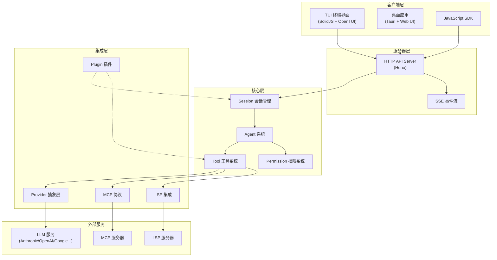
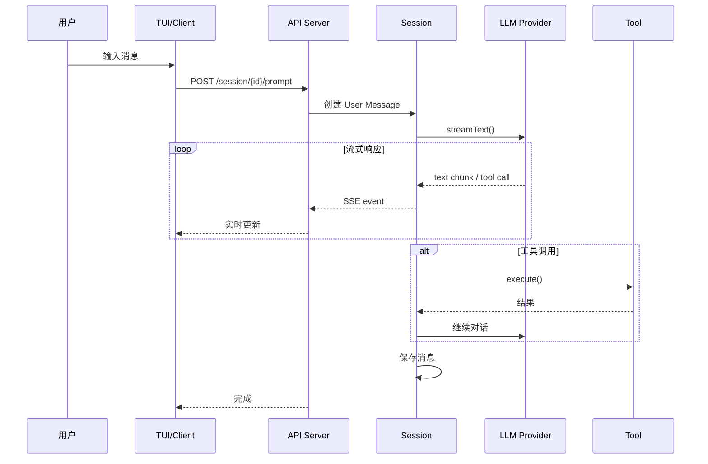

# OpenCode 研究报告

> OpenCode 是一个开源的 AI 编程代理（AI Coding Agent），定位为 Claude Code 的开源替代品。它采用客户端/服务器架构，支持多种 LLM 提供商，提供终端 TUI 界面和桌面应用两种交互方式。

## 要点速览

| 维度   | 说明                                |
| ---- | --------------------------------- |
| 定位   | 开源 AI 编码代理，类似 Claude Code         |
| 技术栈  | TypeScript + Bun + SolidJS + Hono |
| 架构模式 | 客户端/服务器架构 + 事件总线                  |
| 核心特性 | 多 Provider 支持、LSP 集成、MCP 协议、权限系统  |
| 扩展性  | 插件系统 + 自定义 Agent + MCP 服务器        |

---

## 一、项目概览

### 1.1 目录结构

```
opencode/
├── packages/
│   ├── opencode/          # 核心业务逻辑与服务器（最重要）
│   │   ├── src/
│   │   │   ├── agent/     # Agent 定义与管理
│   │   │   ├── bus/       # 事件总线
│   │   │   ├── cli/       # CLI 命令与 TUI
│   │   │   ├── config/    # 配置管理
│   │   │   ├── lsp/       # LSP 客户端集成
│   │   │   ├── mcp/       # MCP 协议支持
│   │   │   ├── permission/# 权限系统
│   │   │   ├── provider/  # LLM 提供商抽象
│   │   │   ├── server/    # HTTP API 服务器
│   │   │   ├── session/   # 会话管理
│   │   │   ├── storage/   # 持久化存储
│   │   │   └── tool/      # 工具定义与实现
│   │   └── test/          # 测试文件
│   ├── app/               # Web UI 组件（SolidJS）
│   ├── desktop/           # 桌面应用（Tauri）
│   ├── plugin/            # 插件 SDK
│   ├── sdk/               # JavaScript SDK
│   └── ui/                # 共享 UI 组件
├── infra/                 # 基础设施配置
└── specs/                 # OpenAPI 规范
```

### 1.2 核心模块职责表

| 模块             | 职责                         | 关键依赖                      | 扩展点             |
| -------------- | -------------------------- | ------------------------- | --------------- |
| **provider**   | LLM 提供商抽象层，统一不同 AI 服务的调用接口 | ai-sdk、各厂商 SDK            | 自定义 Provider 配置 |
| **session**    | 会话生命周期管理，消息持久化，对话历史        | storage、bus               | 会话钩子            |
| **agent**      | Agent 定义与行为控制，权限规则绑定       | permission、provider       | 自定义 Agent       |
| **tool**       | 工具注册与执行，参数校验，结果截断          | permission、file           | MCP 工具扩展        |
| **server**     | HTTP API 服务，SSE 事件推送，路由管理  | hono、session              | 自定义路由           |
| **bus**        | 进程内事件总线，发布/订阅模式            | —                         | 事件监听            |
| **mcp**        | MCP 协议客户端，外部工具集成           | @modelcontextprotocol/sdk | MCP 服务器配置       |
| **permission** | 权限规则评估，模式匹配，用户授权           | storage                   | 自定义权限规则         |
| **lsp**        | LSP 客户端集成，代码诊断，符号查找        | vscode-jsonrpc            | LSP 服务器配置       |
| **config**     | 多层配置加载（全局→项目），配置合并         | storage                   | 配置文件            |
| **storage**    | 文件系统持久化，数据迁移               | fs                        | —               |

---

## 二、核心架构

### 2.1 整体架构图



### 2.2 关键设计取舍

#### 取舍一：客户端/服务器分离 vs 单体应用

**选择**：客户端/服务器架构

**理由**：
- 支持远程操控（如从手机控制本地 OpenCode）
- TUI 只是前端之一，可扩展 Web UI、桌面应用
- 便于多实例管理和资源共享

**代价**：
- 架构复杂度增加
- 需要处理 HTTP/SSE 通信
- 本地单用户场景略显冗余

#### 取舍二：多 Provider 抽象 vs 单一厂商绑定

**选择**：统一的 Provider 抽象层

```typescript
// provider/provider.ts - 统一的提供商抽象
const BUNDLED_PROVIDERS: Record<string, (options: any) => SDK> = {
  "@ai-sdk/anthropic": createAnthropic,
  "@ai-sdk/openai": createOpenAI,
  "@ai-sdk/google": createGoogleGenerativeAI,
  // ... 支持 15+ 提供商
}
```

**理由**：
- 用户不被锁定在单一厂商
- 模型能力差距在缩小，价格在下降
- 便于切换和比较不同模型

**代价**：
- 需要维护多个 SDK 集成
- 不同模型的特性差异需要适配

#### 取舍三：权限系统设计——规则合并 vs 覆盖

**选择**：多层规则合并（默认 → 用户 → Agent）

```typescript
// permission/next.ts - 权限规则评估
export function merge(...rulesets: Ruleset[]): Ruleset {
  return rulesets.flat()  // 简单合并，后来的优先
}

export function evaluate(permission, pattern, ...rulesets) {
  // 从后向前查找第一个匹配的规则
  for (const ruleset of rulesets.toReversed()) {
    for (const rule of ruleset.toReversed()) {
      if (matches(rule, permission, pattern)) return rule
    }
  }
}
```

**理由**：
- 灵活性：用户可覆盖默认行为
- 安全性：默认拒绝敏感操作（如 .env 文件）
- 可组合：Agent 可有独立权限集

---

## 三、关键机制详解

### 3.1 会话流程（Session Flow）



### 3.2 Agent 系统

OpenCode 内置了多种 Agent，通过 `Tab` 键切换：

| Agent | 模式 | 用途 | 权限特点 |
|-------|------|------|----------|
| **build** | primary | 默认开发 Agent，完整访问权限 | 允许编辑、bash、提问 |
| **plan** | primary | 只读分析 Agent，用于探索代码 | 拒绝编辑，bash 需确认 |
| **general** | subagent | 复杂搜索和多步任务 | 禁用 todo 工具 |
| **explore** | subagent | 快速代码库探索 | 仅允许读取类工具 |

```typescript
// agent/agent.ts - Agent 定义示例
const result: Record<string, Info> = {
  build: {
    name: "build",
    permission: PermissionNext.merge(defaults, {
      question: "allow",  // 允许提问
    }),
    mode: "primary",
  },
  plan: {
    name: "plan",
    permission: PermissionNext.merge(defaults, {
      question: "allow",
      edit: { "*": "deny", ".opencode/plan/*.md": "allow" },
    }),
    mode: "primary",
  },
}
```

### 3.3 工具系统（Tool System）

工具系统采用声明式定义，自动处理参数校验和输出截断：

```typescript
// tool/tool.ts - 工具定义接口
export interface Info<Parameters, Metadata> {
  id: string
  init: (ctx?: InitContext) => Promise<{
    description: string
    parameters: Parameters  // Zod schema
    execute(args, ctx): Promise<{
      title: string
      metadata: Metadata
      output: string
      attachments?: FilePart[]
    }>
  }>
}
```

**内置工具一览**：

| 工具 | 功能 | 权限控制 |
|------|------|----------|
| `bash` | 执行 shell 命令 | 高危，默认需确认 |
| `edit` | 编辑文件 | 可按路径模式控制 |
| `read` | 读取文件 | 默认允许，.env 除外 |
| `write` | 写入文件 | 同 edit |
| `glob` | 文件模式匹配 | 默认允许 |
| `grep` | 内容搜索 | 默认允许 |
| `task` | 创建子任务/子 Agent | 默认允许 |
| `websearch` | 网络搜索 | 默认允许 |

### 3.4 事件总线（Event Bus）

采用发布/订阅模式，支持实例级和全局级事件：

```typescript
// bus/index.ts - 事件总线核心
export namespace Bus {
  export async function publish<D extends BusEvent.Definition>(
    def: D,
    properties: z.output<D["properties"]>
  ) {
    const payload = { type: def.type, properties }
    // 1. 通知本地订阅者
    for (const sub of state().subscriptions.get(def.type) ?? []) {
      sub(payload)
    }
    // 2. 通知全局（跨实例）
    GlobalBus.emit("event", { directory: Instance.directory, payload })
  }

  export function subscribe<D extends BusEvent.Definition>(
    def: D,
    callback: (event) => void
  ) {
    // 注册订阅
  }
}
```

### 3.5 MCP 集成

支持通过 MCP（Model Context Protocol）协议扩展工具：

```typescript
// mcp/index.ts - MCP 客户端
export namespace MCP {
  // 支持多种传输方式
  // - stdio: 本地进程
  // - SSE: HTTP 服务器
  // - StreamableHTTP: 流式 HTTP

  async function convertMcpTool(mcpTool: MCPToolDef, client: MCPClient) {
    return dynamicTool({
      description: mcpTool.description,
      inputSchema: jsonSchema(mcpTool.inputSchema),
      execute: async (args) => {
        return client.callTool({ name: mcpTool.name, arguments: args })
      },
    })
  }
}
```

---

## 四、典型用法示例

### 4.1 最小可用配置

在项目根目录创建 `opencode.json`：

```json
{
  "$schema": "https://opencode.ai/config.json",
  "provider": {
    "anthropic": {
      "env": ["ANTHROPIC_API_KEY"]
    }
  }
}
```

运行：

```bash
# 安装
curl -fsSL https://opencode.ai/install | bash

# 启动
opencode
```

### 4.2 自定义 Agent

在 `.opencode/agent/` 目录创建自定义 Agent：

```markdown
<!-- .opencode/agent/reviewer.md -->
---
description: 代码审查专家
model: anthropic/claude-sonnet-4-20250514
temperature: 0.3
permission:
  edit: deny
  bash: deny
---

你是一个代码审查专家，专注于发现潜在问题和改进建议。
审查时关注：
1. 安全漏洞
2. 性能问题
3. 代码风格
4. 最佳实践
```

### 4.3 扩展 MCP 工具

配置外部 MCP 服务器：

```json
{
  "mcp": {
    "servers": {
      "database": {
        "command": "npx",
        "args": ["-y", "@modelcontextprotocol/server-sqlite", "db.sqlite"]
      },
      "github": {
        "command": "npx",
        "args": ["-y", "@modelcontextprotocol/server-github"],
        "env": {
          "GITHUB_TOKEN": "${GITHUB_TOKEN}"
        }
      }
    }
  }
}
```

---

## 五、与 Claude Code 对比

| 维度 | OpenCode | Claude Code |
|------|----------|-------------|
| **开源** | 100% 开源 (MIT) | 闭源 |
| **Provider** | 多 Provider（15+） | 仅 Anthropic |
| **LSP** | 开箱即用 | 需额外配置 |
| **TUI** | 核心特性，由 neovim 用户打造 | 标准终端 |
| **架构** | 客户端/服务器分离 | 单体 |
| **MCP** | 支持 | 支持 |
| **定价** | 按 Provider 定价 | Anthropic 定价 |

---

## 六、结论与建议

### 6.1 设计亮点

1. **Provider 抽象层**：通过 ai-sdk 统一抽象，支持快速切换模型，避免厂商锁定
2. **权限系统**：基于模式匹配的灵活权限控制，平衡安全性与易用性
3. **客户端/服务器架构**：为未来扩展（移动端、远程控制）奠定基础
4. **MCP 集成**：借助标准协议扩展能力边界
5. **实例隔离**：通过 Instance 模式实现多项目独立管理

### 6.2 可改进方向

1. **server.ts 体积过大**（约 2500 行），可拆分为独立路由模块
2. **Provider 适配差异**：不同模型的特性需要更多适配代码
3. **文档完善度**：部分高级功能（如插件开发）文档较少

### 6.3 落地建议

| 场景 | 建议 |
|------|------|
| **个人开发者** | 直接使用，配置 OpenCode Zen 或自有 API Key |
| **团队使用** | 部署私有服务，统一 Provider 配置 |
| **二次开发** | 从 plugin 机制入手，或 fork 后修改 Agent 定义 |
| **学习参考** | 重点研究 session/prompt.ts 和 tool/ 目录的设计模式 |

### 6.4 推荐学习路径

1. **入门**：阅读 README + 运行 `bun dev`
2. **理解架构**：`index.ts` → `cli/cmd/run.ts` → `session/prompt.ts`
3. **深入工具**：`tool/tool.ts` → 具体工具实现（如 `bash.ts`）
4. **扩展开发**：`plugin/` → MCP 配置 → 自定义 Agent

---

## 参考资料

- [OpenCode 官方文档](https://opencode.ai/docs)
- [OpenCode GitHub 仓库](https://github.com/anomalyco/opencode)
- [Model Context Protocol](https://modelcontextprotocol.io)
- [Vercel AI SDK](https://sdk.vercel.ai)
