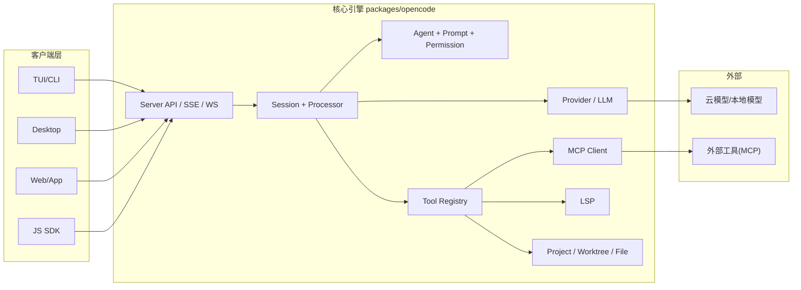

# OpenCode 研究报告（基于仓库源码）

> 面向开发者的设计思想与架构取舍解读，按“总-分”结构组织。

---

## 要点速览
- **核心定位**：可插拔 + 多客户端 + 多模型的 AI 编码代理系统，核心在 `packages/opencode`。
- **关键取舍**：客户端/服务端分离带来多端协作能力，但引入会话/权限/工具注册的复杂度。
- **扩展方式**：插件 hooks + 自定义工具 + MCP 外部工具是主扩展通道。

---

# 一、概览（目录 / 边界 / 设计目标）

## 目录结构概览（精简树）
```text
opencode/
├─ packages/
│  ├─ opencode/    # 核心引擎：CLI/TUI、Server、Session、Provider、Tool、MCP
│  ├─ app/         # 应用前端（Solid）供桌面壳/网页复用
│  ├─ desktop/     # Tauri 桌面壳
│  ├─ ui/          # 共享 UI 组件与主题
│  ├─ sdk/         # JS SDK（客户端/服务端）
│  ├─ plugin/      # 插件 API（hooks + tool 定义）
│  ├─ console/     # Web 控制台/后台（多子包）
│  ├─ function/    # 服务函数
│  ├─ web/         # 官网/营销页
│  ├─ docs/        # 文档
│  └─ util/        # 通用工具库
├─ sdks/vscode/    # VSCode 扩展
├─ infra/          # 基础设施/部署
├─ specs/          # 设计/性能规格
└─ .opencode/      # 本地配置/工具/代理模板
```

## 项目边界
- **核心引擎**：`packages/opencode`（命令行 + 本地服务 + 会话/工具/模型调用）。
- **客户端层**：`packages/app` / `packages/desktop` / `packages/ui` / `packages/sdk`。
- **平台配套**：`packages/console`（Web 控制台）、`sdks/vscode`、`infra`。

## 设计目标与取舍（通俗版）
- **目标 1：多端驱动**  
  用本地 Server + 事件流，让 TUI/桌面/Web/SDK 都能连接同一会话。  
  **取舍**：引入服务器与会话管理，复杂度上升。

- **目标 2：多模型 + 供应商无关**  
  Provider 抽象统一接入 OpenAI/Anthropic/Google 等。  
  **取舍**：需要适配不同模型差异（如 chat vs responses）。

- **目标 3：安全可控的工具执行**  
  工具注册 + 权限规则集，允许“问询/拒绝/允许”。  
  **取舍**：体验上更安全，但会有交互摩擦。

- **目标 4：可扩展生态**  
  插件 hooks + MCP 外部工具，构建生态。  
  **取舍**：插件/依赖/认证管理成本更高。

---

# 二、核心架构图（Mermaid）
用途：**展示“多客户端 → 本地服务 → 会话/工具/模型”主通路**



---

# 三、核心模块职责表（必须项）

| 模块（路径） | 职责 | 关键依赖 | 扩展点 |
|---|---|---|---|
| `packages/opencode/src/cli` | CLI/TUI 入口、命令分发、接入/启动 Server | yargs、@opentui | 新命令 / UI 组件 |
| `packages/opencode/src/server` | API、SSE/WS、OpenAPI、路由聚合 | hono、zod | 新路由、事件 |
| `packages/opencode/src/session` | 会话、消息分块、重试、压缩、摘要 | Storage、LLM | 插件钩子 |
| `packages/opencode/src/tool` | 内置工具、注册表、截断输出 | Config、Plugin | 自定义工具 |
| `packages/opencode/src/permission` | 规则化 allow/deny/ask 权限 | Storage、Bus | 权限策略 |
| `packages/opencode/src/provider` | 多模型适配、鉴权、选型 | ai-sdk | 新 Provider |
| `packages/opencode/src/mcp` | MCP 协议工具接入 | modelcontextprotocol/sdk | MCP 配置 |
| `packages/plugin` | 插件 API（hooks + tool） | SDK | 插件生态 |
| `packages/sdk` | 客户端/服务端 SDK | OpenAPI 生成 | 新 API 版本 |
| `packages/app` / `packages/desktop` / `packages/ui` | UI 客户端与桌面封装 | Solid、Tauri | UI 功能扩展 |
| `packages/console` | Web 控制台 / 管理后台 | Solid、Cloudflare | 管理能力扩展 |

---

# 四、关键机制拆解（分模块、说清取舍）

## 1) 客户端/服务端架构
- CLI/TUI、桌面、Web、SDK 都**连接本地 Server**。
- 事件通过 SSE/WS 流式推送，便于多端实时同步。
- **取舍**：统一体验 + 可远程操控，但 Server 成为复杂性中心。

## 2) 会话与消息分块（Session + Processor）
- 会话消息拆为多段（文本、工具调用、推理等），便于流式渲染与回放。
- Processor 负责处理工具调用循环、防止“重复工具死循环”。
- **取舍**：细粒度追踪提高可观测性，但增加存储与状态管理成本。

## 3) 工具系统 + 权限栅栏
- ToolRegistry 收集内置工具 + `.opencode/tool/*.ts` + 插件工具。
- Permission 采用规则集（allow/deny/ask），按工具/路径细粒度控制。
- **取舍**：更安全，但需要用户理解与授权。

## 4) Provider 抽象（多模型适配）
- 统一对接多家模型（chat / responses 分流），并支持 provider 级自定义逻辑。
- **取舍**：兼容性增强，但对每家差异要维护适配层。

## 5) MCP 集成（外部工具生态）
- 通过 MCP 协议将外部工具映射为可调用工具。
- 支持 OAuth、SSE/HTTP/stdio 多种传输方式。
- **取舍**：扩展强，但认证与连接失败处理复杂。

## 6) 配置分层与 `.opencode` 目录
- config 具多层优先级（远端/全局/项目/环境），适合团队协作。
- `.opencode` 目录可放 agent/tool/command/config。
- **取舍**：灵活但学习成本上升。

---

# 五、典型用法 / 示例（2 段）

## 示例 1：最小可用（本地服务 + CLI）
```bash
# 终端 1：启动本地服务
opencode serve

# 终端 2：发送任务
opencode run "请分析当前项目的依赖结构"
```

## 示例 2：扩展点（自定义工具）
在项目或用户目录的 `.opencode/tool/hello.ts` 中添加工具：

```ts
import { tool } from "@opencode-ai/plugin/tool"

export default tool({
  description: "简单问候工具",
  args: {
    name: tool.schema.string(),
  },
  async execute(args) {
    return `你好，${args.name}！`
  },
})
```

这样工具会被 ToolRegistry 自动扫描并注册（名称默认为文件名）。

---

# 六、术语解释（可读性辅助）
- **MCP**：Model Context Protocol，用于“外部工具统一接入”。
- **Session 分块**：把消息拆成多个 part（文本、工具调用、推理），便于流式渲染。
- **Provider**：模型供应商适配层，屏蔽各家 SDK 差异。

---

# 七、同类库对比维度（帮助理解取舍）
- **架构形态**：单进程 CLI vs 本地 Server + 多客户端  
- **工具扩展**：内置工具为主 vs 插件 + MCP  
- **权限体系**：无权限 vs 细粒度 allow/deny/ask  
- **模型适配**：单厂商 vs 多 Provider + 变体  

---

# 八、结论与建议（必须落地）

**结论**：  
OpenCode 的核心价值在“统一服务 + 事件流会话 + 多模型 + 强扩展”。它不是单一 CLI，而是一个 **可扩展的 AI 开发平台内核**。

**落地建议**：  
1. **学习路径**：先读 `packages/opencode/src/index.ts`（CLI入口）→ `server/` → `session/` → `tool/` → `provider/`。  
2. **如果要扩展工具**：优先用 `.opencode/tool/*.ts`，并配合 `opencode.json` 做权限控制。  
3. **如果要接新模型**：优先走现有 Provider 抽象；只有确实不兼容时再写自定义 loader。  
4. **如果要做新客户端**：直接基于 `packages/sdk` 接入 Server，复用现有会话事件流。  

