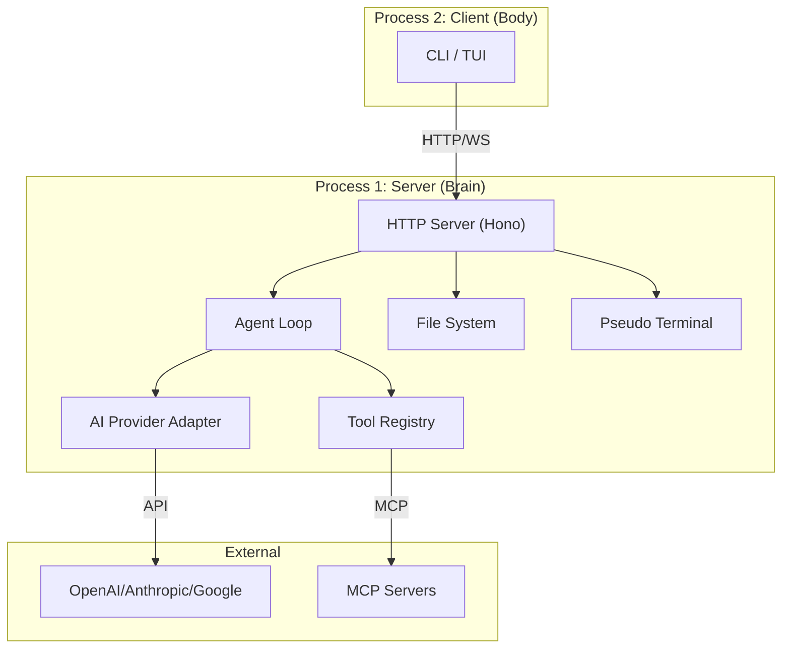
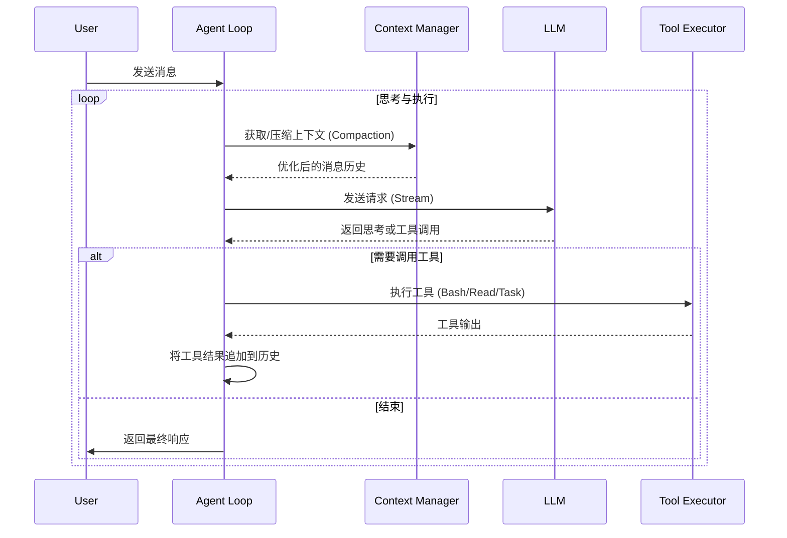

# OpenCode 研究报告

> **声明**：本报告基于 `opencode` 源码分析，侧重于设计思想与架构取舍。

## 1. 概览

### 1.1 项目简介
**OpenCode** 是一个开源的 AI Coding Agent，旨在成为 Claude Code 的开源替代品。它由 Neovim 爱好者打造，深受 Unix 哲学影响，致力于提供一个**模型无关 (Provider-Agnostic)**、**高度可扩展**且**专注于终端体验 (TUI-First)** 的开发助手。

### 1.2 核心设计哲学
*   **Client/Server 架构**：将“大脑”（Agent 逻辑与状态）与“躯体”（用户界面）彻底分离。Server 负责思考与执行，Client (TUI) 仅负责展示与交互。这种设计天然支持本地运行、远程驱动以及多端接入。
*   **Provider-Agnostic（模型无关）**：不绑定特定 AI 厂商。通过适配层支持 OpenAI, Anthropic, Google Gemini 以及本地模型，用户拥有完全的模型选择权。
*   **配置驱动的权限控制**：安全是核心考量。系统预设了不同权限等级的 Agent（如只读的 `plan` 模式与全权限的 `build` 模式），并通过细粒度的规则（Allow/Deny/Ask）控制文件读写与命令执行。
*   **TUI 优先**：界面构建于终端之上，利用 `ink` (React for CLI) 或类似技术提供富交互体验，同时保留了命令行的效率。

### 1.3 目录结构概览

| 目录 | 说明 |
| :--- | :--- |
| `packages/opencode` | **核心包**。包含 CLI 入口、Server 实现、Agent 逻辑与 TUI 代码。 |
| `packages/opencode/src/agent` | **Agent 定义**。定义了 `build`, `plan` 等预置 Agent 及其权限配置。 |
| `packages/opencode/src/session` | **会话与思考**。包含核心 Loop (`prompt.ts`)、消息模型与上下文压缩机制。 |
| `packages/opencode/src/server` | **服务端**。基于 Hono 的 HTTP/WebSocket 服务器，暴露 API 供客户端调用。 |
| `packages/opencode/src/cli` | **CLI 入口**。处理启动流程，管理 Server 与 TUI 进程的生命周期。 |
| `packages/opencode/src/tool` | **工具链**。内置工具（Bash, Read, Grep 等）与 MCP (Model Context Protocol) 集成。 |
| `packages/plugin` | **插件系统**。定义了扩展接口，允许开发者添加自定义工具。 |

## 2. 核心架构与机制

### 2.1 架构总览：分离的神经系统

OpenCode 采用典型的 C/S 架构，但针对本地开发体验进行了优化。



**启动流程机制**：
1.  用户执行 `opencode` 命令。
2.  **Bootstrap**：CLI 进程首先启动一个 HTTP Server (监听本地端口)。
3.  **Spawn**：Server 准备就绪后，CLI 衍生 (Spawn) 一个子进程运行 TUI。
4.  **Connect**：TUI 子进程通过 HTTP 和 WebSocket 连接回父进程的 Server。
5.  **Lifecycle**：当 TUI 退出时，Server 随之关闭。

### 2.2 思考引擎：The Loop

Agent 的核心智能体现为一个持续运行的 `while(true)` 循环，位于 `src/session/prompt.ts`。



**关键机制**：
*   **上下文压缩 (Compaction)**：当上下文过长时，Agent 会自动触发压缩任务，将旧的历史记录摘要化，确保持续对话不超出 Token 限制。
*   **多模态消息 (MessageV2)**：消息不仅仅是文本，而是一个包含多个 `Part` 的结构体。`Part` 可以是文本、文件引用、工具调用结果，甚至是 MCP 资源。
*   **任务分发 (Subtask)**：Agent 可以生成 `subtask`，递归调用另一个 Agent 来解决子问题。

### 2.3 权限与安全

OpenCode 没有简单地给予 AI “上帝权限”，而是构建了一个基于规则的权限系统。

*   **模式隔离**：
    *   `build` 模式：默认允许读写，适合开发。
    *   `plan` 模式：**只读**。明确 Deny 所有 `edit` 操作（除了自身的计划文件），适合代码审查和探索。
*   **动态询问**：遇到未授权操作（如执行 `rm -rf` 或访问敏感目录），系统会挂起 Agent，通过 TUI 向用户发起确认请求 (`PermissionNext.ask`)。

### 2.4 扩展性：MCP 与插件

*   **原生 MCP 支持**：OpenCode 拥抱 [Model Context Protocol (MCP)](https://modelcontextprotocol.io/)。它不仅能作为 MCP Client 连接外部服务器，内部的工具注册机制也与 MCP 标准对齐。这意味着现有的 MCP 生态工具可以直接接入 OpenCode。
*   **文件即插件**：系统会扫描 `tool/*.{js,ts}`，自动加载自定义脚本作为工具。

## 3. 典型用法示例

### 3.1 启动与模式切换

```bash
# 默认进入 build 模式（全权限）
opencode

# 在 TUI 中：
# 按 Tab 键可在 build (开发) 和 plan (规划) 模式间快速切换
```

### 3.2 探索代码库 (Explore Agent)

用户可以使用专门的 `explore` agent 快速理解项目，而不消耗过多的 Context Window。

```typescript
// 伪代码演示内部调用逻辑
await Agent.run({
  agent: "explore", 
  prompt: "分析一下 auth 模块的登录流程",
  level: "quick" // 或 "thorough"
});
```

### 3.3 插件扩展 (自定义工具)

在项目根目录创建 `tool/my-tool.ts`，即可立即获得一个新工具。

```typescript
// tool/deploy.ts
import { tool } from "opencode/plugin";
import { z } from "zod";

export const deploy = tool({
  description: "部署当前分支到测试环境",
  args: {
    env: z.enum(["staging", "prod"]).describe("目标环境")
  },
  execute: async ({ env }, { run }) => {
    await run(`npm run deploy:${env}`);
    return `部署到 ${env} 已触发`;
  }
});
```

## 4. 结论与建议

### 4.1 优势
*   **极致的解耦**：C/S 架构为未来扩展移动端控制、Web IDE 集成打下了完美基础。
*   **安全感**：显式的权限控制和 `plan` 模式解决了开发者让 AI 修改代码时的“不信任感”。
*   **生态友好**：通过支持 MCP，它不需要重复造轮子就能获得数据库连接、浏览器控制等能力。

### 4.2 落地建议
*   **作为代码伴侣**：推荐在复杂重构前，先使用 `plan` 模式让 AI 阅读代码并生成重构计划文档，人工确认无误后，再切换到 `build` 模式执行。
*   **企业级集成**：利用其 Provider-Agnostic 特性，企业可以将后端对接至内部部署的私有大模型（如 Llama 3 或 DeepSeek），在保障数据隐私的前提下提供编码辅助。
*   **自定义工作流**：通过编写简单的 TS 脚本扩展 `tool/` 目录，可以将内部的 CI/CD 触发、Jira 票据创建等操作集成到 AI 的能力范围中。
