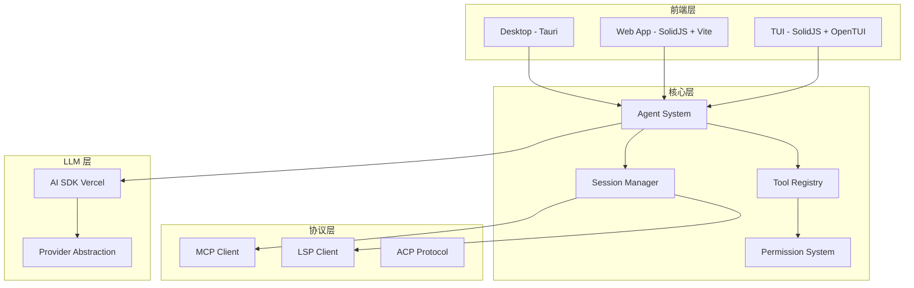
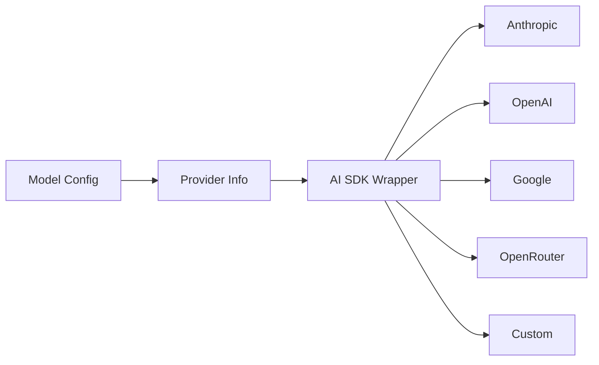
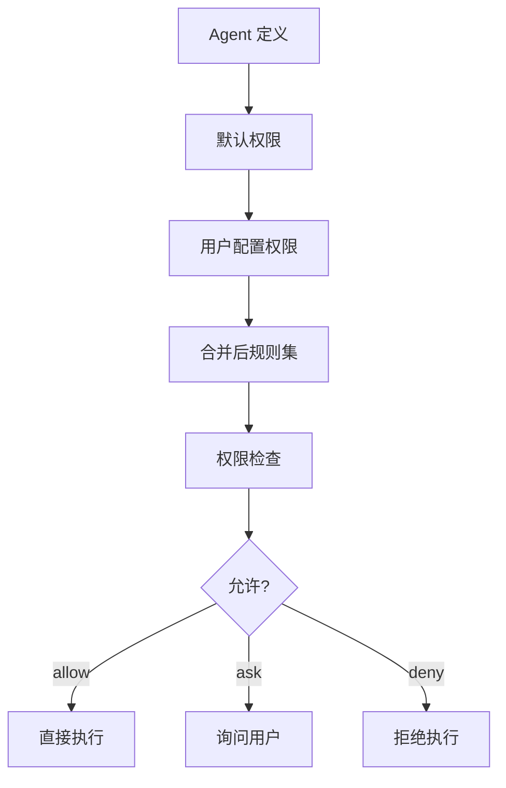
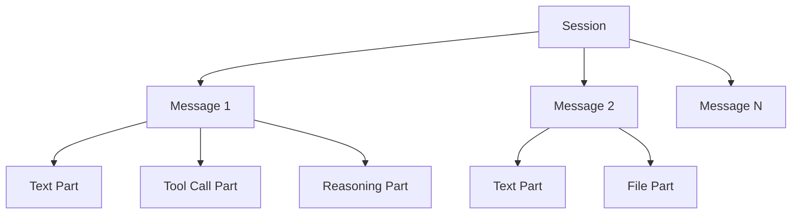
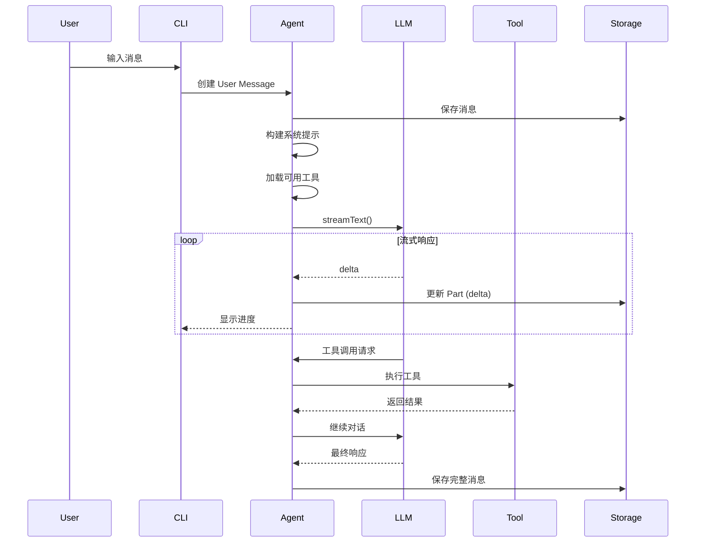
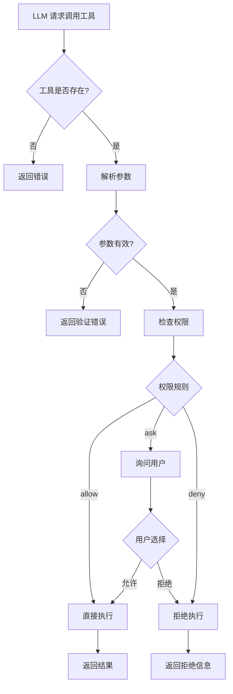

# OpenCode 研究报告

> 本报告基于 OpenCode 项目（https://github.com/anomalyco/opencode）的源码分析，重点阐述其设计思想、架构取舍与核心模块协作机制。

---

## 一、项目概览

### 1.1 项目定位

OpenCode 是一个**开源的 AI Coding Agent**，功能类似于 Anthropic 的 Claude Code，但有以下核心差异：

| 维度 | OpenCode | Claude Code |
|------|----------|-------------|
| 开源状态 | 100% 开源 (MIT) | 闭源 |
| Provider 支持 | Provider-agnostic | 仅限 Anthropic Claude |
| 终端界面 | 聚焦 TUI | CLI 工具 |
| 架构 | 客户端/服务器分离 | 单体 CLI |
| LSP 支持 | 内置 | 无 |
| 多模态 | 支持图片、PDF 等 | 支持图片 |

### 1.2 技术栈总览



**核心技术选型：**

- **运行时**：Bun（性能优化的 JavaScript 运行时）
- **语言**：TypeScript (ESM)
- **前端**：SolidJS（响应式 UI 框架）+ OpenTUI（终端 UI 组件库）
- **LLM SDK**：Vercel AI SDK
- **存储**：文件系统 (JSON)
- **包管理**：Bun workspaces

---

## 二、目录结构与模块边界

### 2.1 Monorepo 结构

```
packages/
├── opencode/          # 核心 CLI 包
├── app/               # Web/TUI 应用
├── desktop/           # 桌面应用
├── console/           # 管理控制台
├── ui/                # 共享 UI 组件
├── plugin/            # 插件系统
├── sdk/               # TypeScript SDK
├── function/          # Cloud Functions
├── identity/          # 身份认证
├── enterprise/        # 企业版功能
└── util/              # 工具函数
```

### 2.2 核心模块职责表

| 模块             | 职责                         | 关键依赖                      | 扩展点          |
| -------------- | -------------------------- | ------------------------- | ------------ |
| **Agent**      | Agent 定义、权限配置、子 Agent 调度   | Config, Permission        | 自定义 Agent    |
| **Tool**       | 工具定义、参数验证、执行封装             | Zod, Permission           | 自定义工具        |
| **Session**    | 会话/消息/Part 管理、快照、压缩        | Storage, Bus              | 消息处理中间件      |
| **Provider**   | LLM 提供商抽象、模型加载             | AI SDK, Auth              | 自定义 Provider |
| **LLM**        | 流式对话、工具调用、重试机制             | Provider, AI SDK          | -            |
| **MCP**        | Model Context Protocol 客户端 | @modelcontextprotocol/sdk | MCP 服务器集成    |
| **Permission** | 权限规则引擎、策略合并                | -                         | 自定义权限规则      |
| **Plugin**     | 插件加载、钩子系统                  | -                         | 插件开发         |

### 2.3 架构分层

```mermaid
layered
    title OpenCode 架构分层
    layer Presentation [表示层]
    layer Application [应用层]
    layer Domain [领域层]
    layer Infrastructure [基础设施层]

    Presentation: TUI/Web UI
    Presentation: CLI Commands

    Application: Agent Orchestrator
    Application: Tool Registry
    Application: Session Processor

    Domain: Permission Rules
    Domain: Message Model
    Domain: Provider Abstraction

    Infrastructure: Storage
    Infrastructure: LLM Providers
    Infrastructure: MCP/LSP Clients
```

---

## 三、核心设计思想与取舍

### 3.1 Provider-Agnostic 设计

**问题**：如何避免绑定单一 LLM 提供商？

**方案**：三层抽象



**设计要点：**

1. **统一模型定义** (`Provider.Model` schema)
   ```typescript
   export const Model = z.object({
     id: z.string(),
     providerID: z.string(),
     api: z.object({
       id: z.string(),
       url: z.string(),
       npm: z.string(),  // AI SDK 包名
     }),
     capabilities: z.object({
       temperature: z.boolean(),
       reasoning: z.boolean(),
       toolcall: z.boolean(),
       // ...
     }),
     cost: z.object({
       input: z.number(),
       output: z.number(),
       cache: z.object({ read, write }),
     }),
   })
   ```

2. **动态 Provider 加载**：支持内置和外部 Provider
   ```typescript
   const BUNDLED_PROVIDERS: Record<string, (options: any) => SDK> = {
     "@ai-sdk/anthropic": createAnthropic,
     "@ai-sdk/openai": createOpenAI,
     // ...
   }
   ```

3. **自定义 Loader**：特殊 Provider 支持定制逻辑
   ```typescript
   const CUSTOM_LOADERS: Record<string, CustomLoader> = {
     async "amazon-bedrock"(input) {
       return {
         autoload: true,
         options: { region, credentialProvider },
         async getModel(sdk, modelID, options) {
           // 区域前缀处理逻辑
           return sdk.languageModel(modelID)
         },
       }
     },
   }
   ```

**取舍**：
- ✅ 支持 20+ 主流 LLM 提供商
- ✅ 用户可自由切换和对比模型
- ✅ 降低供应商锁定风险
- ❌ 增加了抽象层复杂度
- ❌ 需维护大量 Provider 适配代码

### 3.2 Agent 权限系统

**问题**：如何平衡 Agent 能力与安全性？

**方案**：基于规则的权限引擎



**权限规则类型：**

| 权限类型                 | 说明     | 示例                   |
| -------------------- | ------ | -------------------- |
| `*`                  | 全局通配符  | `"*": "allow"`       |
| `tool:ID`            | 特定工具   | `"bash": "ask"`      |
| `edit:pattern`       | 文件编辑   | `"*.env": "ask"`     |
| `read:pattern`       | 文件读取   | `"*.secret": "deny"` |
| `external_directory` | 外部目录访问 | `"/tmp/*": "ask"`    |
| `doom_loop`          | 防止死循环  | `"doom_loop": "ask"` |

**内置 Agent 对比：**

| Agent | 模式 | 特点 | 默认权限 |
|-------|------|------|----------|
| **build** | primary | 默认模式，完整开发能力 | 大部分允许 |
| **plan** | primary | 只读规划模式 | 编辑工具全部 deny |
| **general** | subagent | 通用子 Agent | 禁用 todo 读写 |
| **explore** | subagent | 代码探索专用 | 只允许搜索/读取 |

**设计亮点：**

1. **权限合并策略**：默认 → 用户配置 → Agent 特定配置
2. **模式切换**：通过 `Tab` 键快速切换 Agent
3. **子 Agent 调用**：Agent 可调用其他 subagent 完成任务

### 3.3 Tool 定义模式

**问题**：如何统一工具接口并保证类型安全？

**方案**：Zod 驱动的 Tool 定义

```typescript
export namespace Tool {
  export interface Info<Parameters extends z.ZodType = z.ZodType> {
    id: string
    init: (ctx?: InitContext) => Promise<{
      description: string
      parameters: Parameters  // Zod schema
      execute(
        args: z.infer<Parameters>,
        ctx: Context,
      ): Promise<{
        title: string
        metadata: Record<string, any>
        output: string
        attachments?: MessageV2.FilePart[]
      }>
    }>
  }

  export function define<Parameters extends z.ZodType>(
    id: string,
    init: Info<Parameters>["init"],
  ): Info<Parameters> { /* ... */ }
}
```

**典型工具示例：**

```typescript
// read.ts
export const read = Tool.define(
  "read",
  {
    description: "Read a file from the filesystem",
    parameters: z.object({
      file_path: z.string(),
      offset: z.number().optional(),
      limit: z.number().optional(),
    }),
    async execute(args, ctx) {
      const content = await readFile(args.file_path, {
        offset: args.offset,
        limit: args.limit,
      })
      return {
        title: `Read ${args.file_path}`,
        metadata: {},
        output: content,
      }
    },
  },
)
```

**设计优势：**
- Zod 自动验证参数，错误信息友好
- 类型推断 (`z.infer<Parameters>`)
- 统一的错误处理和输出截断

### 3.4 Session 与消息模型

**问题**：如何管理长期对话历史和增量生成？

**方案**：Session → Message → Part 三层结构



**数据模型简化：**

```typescript
// Session.Info
interface Session {
  id: string
  slug: string                    // 共享链接标识
  title: string
  time: { created, updated, compacting, archived }
  permission?: PermissionNext.Ruleset
  summary?: { additions, deletions, files, diffs }
  revert?: { messageID, snapshot, diff }
}

// MessageV2.Info
interface Message {
  id: string
  sessionID: string
  role: "user" | "assistant"
  parentID?: string               // 构建消息树
  status: "pending" | "active" | "done"
  error?: { code, message }
}

// Part 类型
type Part =
  | TextPart          // 文本内容
  | ReasoningPart     // 推理过程
  | ToolCallPart      // 工具调用
  | FilePart          // 文件附件
  | DiffPart          // 代码差异
```

**关键设计点：**

1. **增量更新**：Part 级别的 delta 更新，支持流式输出
   ```typescript
   export const updatePart = fn(UpdatePartInput, async (input) => {
     const part = "delta" in input ? input.part : input
     const delta = "delta" in input ? input.delta : undefined
     await Storage.write(["part", part.messageID, part.id], part)
     Bus.publish(MessageV2.Event.PartUpdated, { part, delta })
     return part
   })
   ```

2. **会话压缩**：当 token 超限时自动压缩历史
3. **快照与恢复**：支持回到任意消息状态

---

## 四、关键流程分析

### 4.1 LLM 对话流程



**核心代码片段：**

```typescript
// llm.ts stream()
export async function stream(input: StreamInput) {
  const [language, cfg, provider, auth] = await Promise.all([
    Provider.getLanguage(input.model),
    Config.get(),
    Provider.getProvider(input.model.providerID),
    Auth.get(input.model.providerID),
  ])

  // 构建系统提示
  const system = [
    ...(input.agent.prompt ? [input.agent.prompt] : SystemPrompt.provider(input.model)),
    ...input.system,
    ...(input.user.system ? [input.user.system] : []),
  ].filter(x => x).join("\n")

  // 解析工具
  const tools = await resolveTools(input)

  return streamText({
    temperature: input.agent.temperature ?? ProviderTransform.temperature(input.model),
    tools,
    maxOutputTokens: OUTPUT_TOKEN_MAX,
    messages: [
      { role: "system", content: system },
      ...input.messages,
    ],
    model: wrapLanguageModel({
      model: language,
      middleware: [extractReasoningMiddleware()],
    }),
  })
}
```

### 4.2 Tool 调用与权限检查



### 4.3 子 Agent 调用机制

OpenCode 支持子 Agent 并行执行多个任务：

```typescript
// task.ts
export const task = Tool.define(
  "task",
  {
    description: "Launch a specialized agent",
    parameters: z.object({
      description: z.string(),
      subagent_type: z.enum(["bash", "general-purpose", "explore", "plan"]),
    }),
    async execute(args, ctx) {
      const agent = await Agent.get(args.subagent_type)
      // 创建子会话，执行任务，返回结果
      return { /* ... */ }
    },
  },
)
```

**典型使用场景：**
- 用户请求复杂搜索 → 调用 `explore` 子 Agent
- 需要并行多个任务 → 调用 `general-purpose` 子 Agent
- 需要规划后执行 → 先 `plan` 再 `build`

---

## 五、扩展机制

### 5.1 插件系统

插件可以扩展以下能力：

```typescript
interface Plugin {
  name: string
  auth?: {                      // 认证扩展
    provider: string
    loader: () => Promise<any>
  }
  tools?: Tool.Info[]           // 自定义工具
  agents?: Agent.Info[]         // 自定义 Agent
}
```

### 5.2 MCP (Model Context Protocol)

OpenCode 内置 MCP 客户端，可连接 MCP 服务器获取额外工具：

```
.mcp/
├── filesystem/
├── github/
├── puppeteer/
└── custom-servers/
```

### 5.3 自定义 Agent

用户可在配置文件中定义自定义 Agent：

```json
{
  "agent": {
    "code-review": {
      "description": "专注于代码审查的 Agent",
      "prompt": "你是一个代码审查专家...",
      "permission": {
        "*": "deny",
        "read": "allow",
        "grep": "allow"
      },
      "model": "anthropic/claude-sonnet-4"
    }
  }
}
```

---

## 六、典型使用场景

### 6.1 基础代码开发

```
$ opencode
> 帮我实现一个二分查找函数
```

### 6.2 代码库探索

```
$ opencode
> 这个项目里 API 路由是怎么定义的？
[自动调用 explore 子 Agent]
```

### 6.3 规划模式

```
$ opencode
[按 Tab 切换到 plan 模式]
> 分析这个项目的性能瓶颈
[只读分析，生成规划文档]
```

---

## 七、总结与建议

### 7.1 核心设计优势

1. **Provider-Agnostic**：不被单一 LLM 厂商绑定
2. **权限粒度**：细粒度的权限控制，平衡能力与安全
3. **模块化**：清晰的模块边界，易于扩展
4. **开源**：完全透明，可自主部署和定制

### 7.2 可借鉴的设计

| 设计 | 适用场景 | 核心思想 |
|------|----------|----------|
| 三层 Provider 抽象 | 需支持多厂商的 SDK | 统一模型定义 + 动态加载 |
| Zod 驱动 Tool | 需类型安全的工具系统 | Schema 作为契约 |
| 权限规则引擎 | AI Agent 安全控制 | 规则合并 + 默认拒绝 |
| Session/Message/Part | 流式对话系统 | 增量更新 + 快照 |
| 子 Agent 并行 | 复杂任务分解 | 专业分工 + 并行执行 |

### 7.3 落地建议

**如果你要：**

1. **构建 AI Coding Agent**
   - 采用 Provider-Agnostic 设计，避免厂商锁定
   - 实现细粒度权限系统
   - 支持 MCP 等标准协议

2. **设计 LLM 应用架构**
   - 分离表示层、应用层、领域层
   - 使用 Zod 等 Schema 库保证类型安全
   - 设计良好的插件系统

3. **选择 OpenCode**
   - 需要开源 AI Coding Agent
   - 需要使用非 Claude 模型
   - 需要深度定制和集成

### 7.2 潜在改进方向

1. **文档完善**：部分模块文档较简略
2. **测试覆盖**：可增加集成测试
3. **性能优化**：大文件操作仍有优化空间
4. **多语言支持**：当前 TypeScript 代码库为主

---

## 附录：术语解释

| 术语 | 解释 |
|------|------|
| **Provider-Agnostic** | 不依赖特定服务提供商的设计 |
| **LSP** | Language Server Protocol，语言服务协议 |
| **MCP** | Model Context Protocol，模型上下文协议 |
| **TUI** | Terminal User Interface，终端用户界面 |
| **Zod** | TypeScript 优先的模式验证库 |
| **AI SDK** | Vercel 开发的 LLM 统一 SDK |

---

**参考资料：**
- [OpenCode GitHub 仓库](https://github.com/anomalyco/opencode)
- [OpenCode 官方文档](https://opencode.ai/docs)
- [Vercel AI SDK](https://sdk.vercel.ai/docs)
- [Model Context Protocol](https://modelcontextprotocol.io/)
