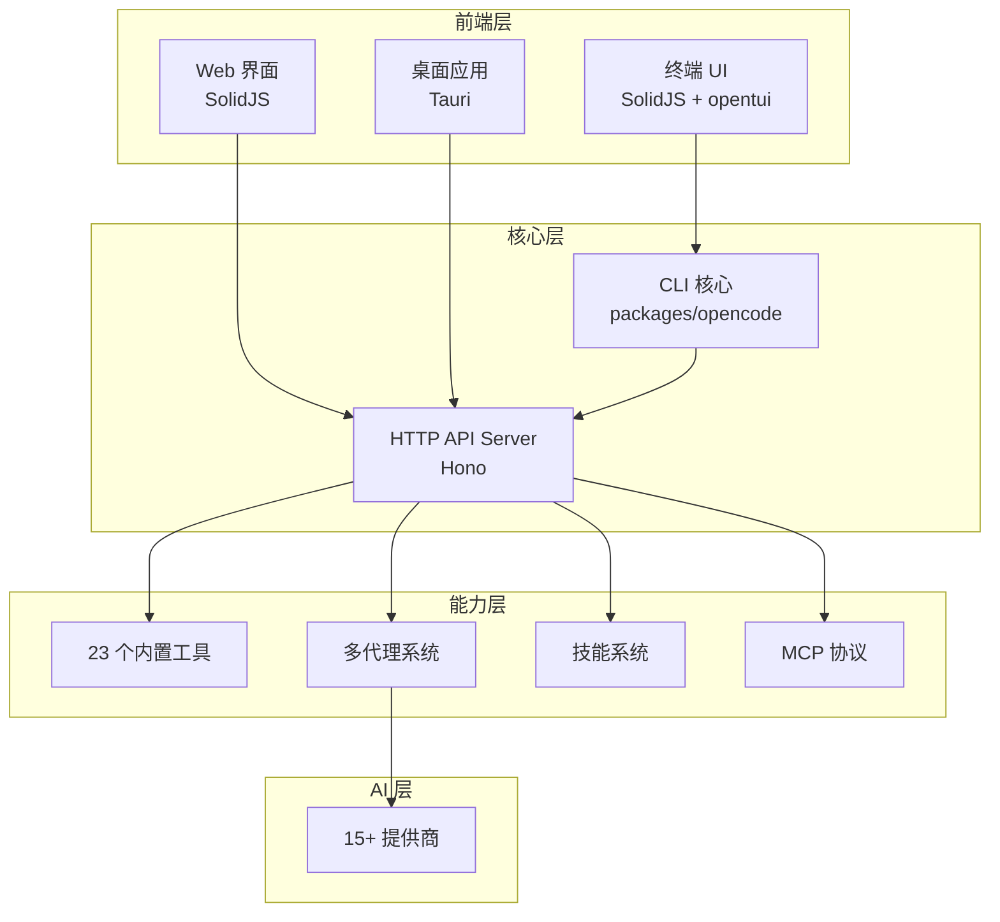
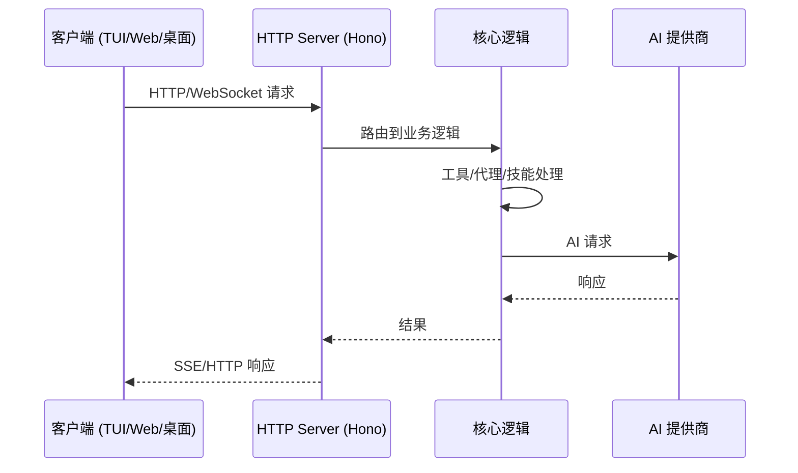

# OpenCode 研究报告

## 要点速览

| 维度       | 说明                                        |
| -------- | ----------------------------------------- |
| **定位**   | 开源 AI 编码代理，Claude Code 的替代品               |
| **核心特点** | 100% 开源、多模型提供商支持、客户端/服务器架构                |
| **技术栈**  | Bun + TypeScript + SolidJS + Hono         |
| **包管理**  | Bun workspaces (monorepo)                 |
| **提供商**  | 15+ AI 提供商（OpenAI、Anthropic、Google、本地模型等） |
| **代码规模** | ~40,616 行 TypeScript，535+ 文件              |

---

## 一、整体概览

### 1.1 项目定位

OpenCode 是一个**开源的 AI 编码代理**，与 Claude Code 类似但在架构上有显著差异。它不仅是一个 CLI 工具，更是一个**可扩展的 AI 开发平台**，支持：

- 终端 UI（TUI）交互
- Web 界面
- 桌面应用（Tauri）
- 无头 API 服务器
- 丰富的插件系统



### 1.2 设计哲学

| 特点            | 说明                                      |
| ------------- | --------------------------------------- |
| **提供商无关**     | 不绑定任何 AI 提供商，用户可自由选择                    |
| **客户端/服务器架构** | 支持远程驱动，TUI 只是客户端之一                      |
| **TUI 优先**    | 由 neovim 用户和 terminal.shop 创作者打造，追求终端极限 |
| **开源优先**      | 100% 开源，社区驱动                            |

---

## 二、目录结构

```
vendors/opencode/
├── packages/                    # 核心 monorepo
│   ├── opencode/               # ⭐ CLI 和核心逻辑
│   │   ├── src/
│   │   │   ├── cli/cmd/        # CLI 命令（run, serve, agent 等）
│   │   │   ├── agent/          # 代理系统
│   │   │   ├── session/        # 会话管理
│   │   │   ├── tool/           # 23 个内置工具
│   │   │   ├── provider/       # AI 提供商集成
│   │   │   ├── server/         # HTTP API 服务器
│   │   │   ├── lsp/            # LSP 客户端
│   │   │   ├── mcp/            # Model Context Protocol
│   │   │   ├── skill/          # 技能系统
│   │   │   └── plugin/         # 插件系统
│   │   └── bin/opencode        # 二进制入口
│   ├── app/                    # Web UI 组件（SolidJS）
│   ├── desktop/                # 桌面应用（Tauri）
│   ├── console/                # 控制台应用
│   ├── sdk/js/                 # JavaScript SDK
│   ├── plugin/                 # 插件接口定义
│   ├── slack/                  # Slack 集成
│   └── extensions/             # VS Code 扩展
├── .opencode/                  # OpenCode 配置
├── .github/                    # GitHub 工作流
├── infra/                      # SST 基础设施
├── specs/                      # 技术规范
└── README.*.md                 # 13 种语言国际化
```

---

## 三、核心模块职责

| 模块         | 职责                             | 关键文件                   | 扩展点               |
| ---------- | ------------------------------ | ---------------------- | ----------------- |
| **CLI 命令** | 处理用户输入，启动各类模式                  | `cli/cmd/*.ts`         | 可添加新命令            |
| **代理系统**   | 管理不同模式的代理（build/plan/general）  | `agent/agent.ts`       | 可自定义代理配置          |
| **工具系统**   | 提供 23 个内置工具（bash、read、write 等） | `tool/*.ts`            | 插件可扩展工具           |
| **提供商**    | 管理 15+ AI 提供商的认证和调用            | `provider/provider.ts` | 支持自定义提供商          |
| **会话管理**   | 处理消息、待办事项、提示词                  | `session/*.ts`         | 可自定义会话存储          |
| **技能系统**   | 加载 Claude Code 格式的技能           | `skill/skill.ts`       | 兼容 .claude/skills |
| **服务器**    | HTTP API 和事件流                  | `server/server.ts`     | 可添加路由             |
| **LSP**    | 代码智能（补全、诊断等）                   | `lsp/*.ts`             | 支持多种语言服务器         |
| **MCP**    | Model Context Protocol 支持      | `mcp/*.ts`             | 可连接 MCP 服务器       |
| **插件**     | 扩展系统功能                         | `plugin/*.ts`          | 完整的插件 API         |

---

## 四、关键机制详解

### 4.1 多代理系统

OpenCode 内置了**多个专用代理**，可按 `Tab` 键切换：

| 代理 | 模式 | 权限 | 用途 |
|------|------|------|------|
| **build** | primary | 完整读写 | 默认开发代理 |
| **plan** | primary | 只读 | 探索代码库、规划变更 |
| **general** | subagent | 无 Todo 权限 | 复杂搜索、多步任务 |
| **explore** | subagent | 受限 | 快速代码库探索 |
| **compaction** | primary | 无 | 会话压缩（隐藏） |
| **title/summary** | primary | 无 | 生成标题/摘要（隐藏） |

**权限系统设计：**
```typescript
// 使用 PermissionNext 规则集
permission: PermissionNext.merge(
  defaults,
  PermissionNext.fromConfig({
    "*": "allow",           // 默认允许
    edit: { "*": "deny" },  // plan 模式禁止编辑
    question: "allow",
  })
)
```

### 4.2 工具系统架构

工具采用**定义-初始化-执行**三层架构：

```typescript
// 1. 定义工具
export const BashTool = Tool.define("bash", async () => {
  // 2. 初始化（返回描述、参数、执行函数）
  return {
    description: "...",
    parameters: z.object({
      command: z.string(),
      timeout: z.number().optional(),
      description: z.string(), // 5-10 字清晰描述
    }),
    async execute(params, ctx) {
      // 3. 执行
      // ... 权限检查
      // ... 执行命令
      return {
        title: params.description,
        metadata: { output, exit },
        output,
      }
    },
  }
})
```

**关键设计：**
- 每个工具必须有 `description` 参数（5-10 字描述命令用途）
- 自动权限检查（`ctx.ask`）
- 自动输出截断（`Truncate.output`）
- Zod 参数验证

### 4.3 提供商系统

**15+ 支持的提供商：**

| 提供商 | SDK 包 | 特点 |
|--------|--------|------|
| Anthropic | `@ai-sdk/anthropic` | Claude 系列 |
| OpenAI | `@ai-sdk/openai` | GPT 系列 |
| Google | `@ai-sdk/google` | Gemini 系列 |
| Google Vertex | `@ai-sdk/google-vertex` | 企业级 |
| Amazon Bedrock | `@ai-sdk/amazon-bedrock` | AWS 集成 |
| Azure | `@ai-sdk/azure` | Microsoft |
| GitHub Copilot | 内置 | Copilot 集成 |
| OpenRouter | `@openrouter/ai-sdk-provider` | 多模型聚合 |
| Groq | `@ai-sdk/groq` | 快速推理 |
| Mistral | `@ai-sdk/mistral` | 欧洲模型 |
| Cohere | `@ai-sdk/cohere` | 企业模型 |
| Together AI | `@ai-sdk/togetherai` | 开源模型 |
| Perplexity | `@ai-sdk/perplexity` | 搜索增强 |
| xAI | `@ai-sdk/xai` | Grok |
| GitLab | `@gitlab/gitlab-ai-provider` | Duo 代理 |
| 本地模型 | `@ai-sdk/openai-compatible` | 自托管 |

**自定义加载器设计：**
```typescript
const CUSTOM_LOADERS: Record<string, CustomLoader> = {
  async anthropic() {
    return {
      autoload: false,
      options: {
        headers: {
          "anthropic-beta": "claude-code-20250219,..."
        }
      }
    }
  },
  // ... 更多提供商特定配置
}
```

### 4.4 客户端/服务器架构

OpenCode 采用**分层架构**，支持多种使用方式：



**关键特性：**
- **无头模式**：`opencode serve` 启动纯 API 服务器
- **远程驱动**：可在手机 App 上驱动本地 OpenCode
- **事件流**：SSE 实时推送事件
- **WebSocket**：PTY 终端交互

### 4.5 技能系统

OpenCode **兼容 Claude Code 技能格式**：

```markdown
---
name: skill-name
description: Use when ...
---

# Skill Content
```

**技能扫描路径：**
1. `.claude/skills/**/*.md`（项目级）
2. `~/.claude/skills/**/*.md`（全局）
3. `.opencode/skill/**/*.md`（OpenCode 专有）

**与 Superpowers 的关系：**
OpenCode 可以直接使用 Superpowers 的技能，实现生态兼容。

### 4.6 插件系统

OpenCode 提供**完整的插件 API**：

```typescript
export type Hooks = {
  // 生命周期钩子
  event?: (input: { event: Event }) => Promise<void>

  // 自定义工具
  tool?: { [key: string]: ToolDefinition }

  // 认证钩子
  auth?: AuthHook

  // 聊天钩子
  "chat.message"?: (...) => Promise<void>
  "chat.params"?: (...) => Promise<void>
  "chat.headers"?: (...) => Promise<void>

  // 系统提示词转换
  "experimental.chat.system.transform"?: (
    input: { sessionID?: string; model: Model },
    output: { system: string[] }
  ) => Promise<void>

  // 工具执行钩子
  "tool.execute.before"?: (...) => Promise<void>
  "tool.execute.after"?: (...) => Promise<void>
}
```

---

## 五、核心设计取舍

### 5.1 为什么选择 Bun 而不是 Node？

| 特性 | Bun | Node |
|------|-----|------|
| 包管理 | 内置，快速 | npm/yarn/pnpm |
| TypeScript | 原生支持 | 需 tsc/tsx |
| 性能 | 更快 | 标准 |
| 兼容性 | 较好 | 完美 |

**取舍理由：** 团队追求极致性能，Bun 的原生 TypeScript 支持简化了工具链。

### 5.2 为什么客户端/服务器分离？

| 架构 | 优点 | 缺点 |
|------|------|------|
| **C/S 分离** | 支持远程、多客户端、可扩展 | 复杂性增加 |
| **单体** | 简单、低延迟 | 无法远程、难以扩展 |

**取舍理由：** 为未来的移动端、Web 端、协作功能铺路。

### 5.3 为什么兼容 Claude Code 技能？

| 方案 | 优点 | 缺点 |
|------|------|------|
| **兼容格式** | 复用生态、降低迁移成本 | 受限于他人标准 |
| **自创格式** | 完全掌控 | 生态从零开始 |

**取舍理由：** 技能格式本质上是 Markdown + YAML，兼容成本 low，生态收益 high。

### 5.4 代码风格取舍

从 `AGENTS.md` 可见独特的风格偏好：

| 偏好 | 说明 |
|------|------|
| **避免 `let`** | 使用 `const` + 三元表达式 |
| **避免 `else`** | 使用 early return |
| **单字命名** | `foo`, `bar`, `baz` 而非 `fooBar` |
| **不解构** | 用 `obj.a` 而非 `const { a } = obj` |
| **避免 `try/catch`** | 优先 `.catch()` |
| **类型推断** | 避免显式注解 |

---

## 六、典型用法示例

### 6.1 启动不同模式

```bash
# 开发模式（默认在当前目录）
bun dev

# 指定目录
bun dev /path/to/project

# 无头服务器
bun dev serve --port 8080

# Web 界面
bun dev web

# 连接到运行中的服务器
opencode attach http://localhost:4096
```

### 6.2 配置多个提供商

```jsonc
// .opencode/opencode.jsonc
{
  "provider": {
    "anthropic": {
      "default": true
    },
    "openai": {
      "models": {
        "gpt-4": { "enabled": true }
      }
    }
  },
  "mcpServers": {
    "context7": {
      "command": "npx",
      "args": ["-y", "@upstash/context7-mcp"]
    }
  }
}
```

### 6.3 自定义代理

```bash
# 创建自定义代理
opencode agent create "只读安全代理，禁止修改文件"

# 使用代理
# 在 TUI 中按 Tab 切换
```

### 6.4 插件开发

```typescript
// my-plugin.ts
import type { Plugin } from "@opencode-ai/plugin"

export default (async ({ client, project, $ }) => {
  return {
    "experimental.chat.system.transform": async (input, output) => {
      output.system.push("额外系统提示词...")
    },
    tool: {
      "my-custom-tool": {
        // 工具定义
      }
    }
  }
}) satisfies Plugin
```

---

## 七、落地建议

### 7.1 适用场景

✅ **推荐使用：**
- 需要**开源** AI 编码工具的团队
- 需要**多模型**支持（不绑定单一提供商）
- 需要**自托管**或**私有部署**
- 需要**远程/移动端**控制开发环境
- 需要**深度定制**（插件系统）

❌ **不太适合：**
- 追求开箱即用的简单场景（Claude Code 更简单）
- 不需要多提供商的团队
- 对 Bun 生态有顾虑的项目

### 7.2 迁移路径


### 7.3 团队集成

| 场景 | 建议 |
|------|------|
| 标准化开发环境 | 使用 Nix flake + Bun 锁定版本 |
| 共享配置 | 提交 `.opencode/opencode.jsonc` 到仓库 |
| 自定义工具 | 开发内部插件，发布到私有 registry |
| CI/CD 集成 | 使用 `opencode serve` + API 调用 |

### 7.4 性能优化

| 策略 | 说明 |
|------|------|
| 本地模型 | 使用 Ollama/LM Studio 减少延迟 |
| 智能路由 | 小任务用小模型（gpt-5-nano） |
| 会话压缩 | 自动压缩长会话上下文 |
| LSP 缓存 | 复用语言服务器连接 |

---

## 八、总结

OpenCode 是一个**架构先进、生态开放**的 AI 编码平台。其核心优势在于：

1. **完全开源** - 无供应商锁定，可自由定制
2. **多提供商** - 15+ AI 提供商，灵活选择
3. **架构分层** - C/S 架构支持远程、多客户端
4. **生态兼容** - 兼容 Claude Code 技能，复用生态
5. **扩展性强** - 完整的插件系统，可深度定制

### 关键启示

> "客户端/服务器架构让 OpenCode 不仅是一个 CLI 工具，而是一个可编程的 AI 开发平台。"

这是 OpenCode 与 Claude Code 最大的架构差异，也是其最大潜力所在。

---

## 参考资源

- 官方网站：https://opencode.ai
- GitHub：https://github.com/anomalyco/opencode
- 文档：https://opencode.ai/docs
- Discord：https://discord.gg/opencode

---

*报告生成时间：2026-01-28*
*基于 OpenCode v1.1.36*
