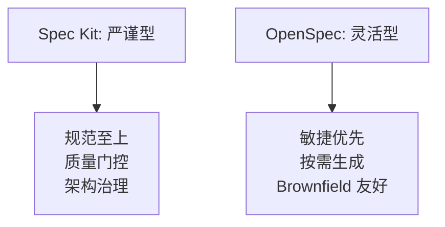
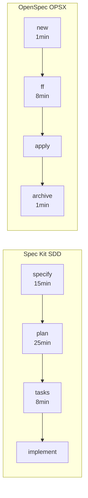
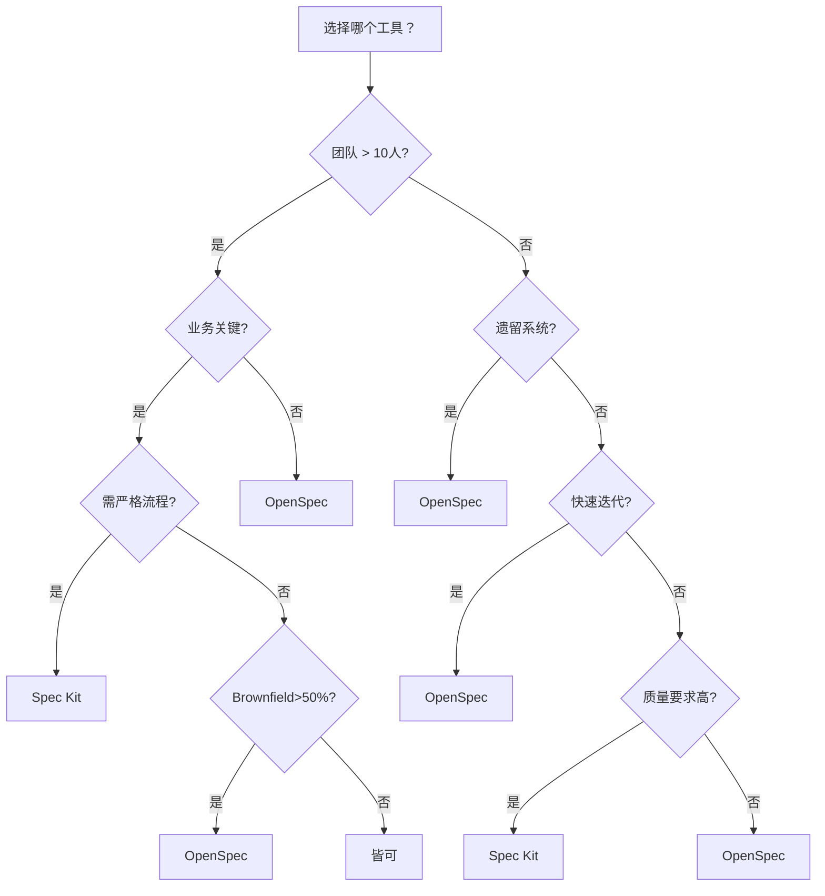

# Spec Kit 与 OpenSpec 对比报告

> **阅读导航**：快速决策看 "3.2 决策树"，数据对比看 "量化对比"，落地执行看 "5. 迁移与结合"。

## 要点速览

| 维度 | Spec Kit | OpenSpec |
|------|----------|----------|
| **出品方** | GitHub | Fission AI |
| **核心理念** | 规范至上，质量门控 | 灵活迭代，轻量快速 |
| **流程风格** | 严格（阶段门控） | 灵活（无门控） |
| **支持工具** | 16+ AI 代理 | 20+ AI 工具 |
| **技术栈** | Python + Bash/PowerShell | TypeScript + Node.js |
| **Brownfield** | 支持 | 原生设计 |
| **初始化时间** | 5-10 min | 30 sec |

**量化对比：**

| 指标      | Spec Kit  | OpenSpec       | 胜出              |
| ------- | --------- | -------------- | --------------- |
| 单功能规范时间 | 45-60 min | 15-25 min      | OpenSpec 快 2-3x |
| 流程开销占比  | 25-30%    | 10-15%         | OpenSpec 低 50%  |
| 规范完整度   | 85-95%    | 60-80%         | Spec Kit 高 20%  |
| 新人上手时间  | 1-2 周     | 2-3 天          | OpenSpec 快 3x   |
| 架构一致性   | 高（宪法约束）   | 中（依赖自律）        | Spec Kit        |
| 扩展性     | 有限        | 强（schema.yaml） | OpenSpec        |

---

## 一、设计哲学对比



| 方面 | Spec Kit | OpenSpec |
|------|----------|----------|
| **规范角色** | "代码之母"，首要产物 | "沟通桥梁"，对齐工具 |
| **流程设计** | "防呆"设计，强制检查 | "信任"开发者，依赖自律 |
| **阶段要求** | 强制顺序（specify→plan→tasks） | 任意顺序（new→ff/continue→apply） |
| **不确定性** | 显式标记，上限 3 个 | 边做边明确 |

---

## 二、功能对比

### 2.1 工作流程对比



| Spec Kit | OpenSpec | 时间对比 |
|----------|----------|----------|
| `/speckit.specify` | `/opsx:new` + proposal | 15min vs 5min |
| `/speckit.plan` | `/opsx:ff` 或 `continue` | 25min vs 8min |
| `/speckit.tasks` | `/opsx:ff`（包含） | 8min vs 0min |
| 无归档 | `/opsx:archive` | - |

### 2.2 制品/模板对比

| 特性 | Spec Kit | OpenSpec |
|------|----------|----------|
| **核心制品** | spec, plan, tasks, checklist | proposal, specs, design, tasks |
| **模板章节** | spec(7), plan(11), tasks(6) | proposal(5), specs(4), design(6), tasks(4) |
| **约束强度** | 严格（必填） | 宽松（可跳过） |
| **Delta 规范** | 支持（2 种标记） | 原生（4 种标记） |
| **research/data-model** | 内置自动生成 | 需手动创建 |

### 2.3 质量保障对比


| 机制 | Spec Kit | OpenSpec |
|------|----------|----------|
| 防过早实施 | 模板强制 | 依赖提示 |
| 不确定性标记 | `[NEEDS CLARIFICATION]` ≤ 3 | 无内置限制 |
| 架构治理 | 9 条款宪法 | 无 |
| 验证引擎 | 模板约束 | Zod + DAG |

### 2.4 AI 工具与扩展性对比

| 方面 | Spec Kit | OpenSpec |
|------|----------|----------|
| **支持数量** | 16+ | 20+ |
| **配置方式** | `AGENT_CONFIG` Python Dict | 适配器工厂模式 |
| **自定义适配器** | 需修改源码 | 插件化添加 |
| **自定义制品** | 不支持 | `schema.yaml` 定义 |
| **工作流定制** | 不支持 | `schema.yaml` 自定义 |

---

## 三、适用场景对比

### 3.1 场景推荐

| 场景 | Spec Kit | OpenSpec | 推荐 |
|------|----------|----------|------|
| 中大型团队（10+） | ★★★★★ | ★★★★☆ | **Spec Kit** |
| 关键业务（支付/订单） | ★★★★★ | ★★★★☆ | **Spec Kit** |
| 遗留系统改造 | ★★★★☆ | ★★★★★ | **OpenSpec** |
| 快速迭代团队 | ★★★☆☆ | ★★★★★ | **OpenSpec** |
| 个人/小团队 | ★★☆☆☆ | ★★★★★ | **OpenSpec** |
| 严格合规要求 | ★★★★★ | ★★★☆☆ | **Spec Kit** |
| 探索性项目 | ★★☆☆☆ | ★★★★★ | **OpenSpec** |

### 3.2 决策树



### 3.3 团队评估清单

**选 Spec Kit：**
- [ ] 团队 > 10 人，有专职架构师
- [ ] 业务关键（金融、医疗等）
- [ ] 能接受 25-30% 流程开销
- [ ] 需合规/审计

**选 OpenSpec：**
- [ ] 团队 < 10 人，需快速迭代
- [ ] 遗留系统改造占比高
- [ ] 希望流程开销 < 15%
- [ ] 探索性项目多

---

## 四、成本与风险分析

### 4.1 成本对比

| 成本类型 | Spec Kit | OpenSpec |
|----------|----------|----------|
| **时间成本** | 高（45-60min/功能） | 中（15-25min/功能） |
| **学习成本** | 高（1-2 周） | 低（2-3 天） |
| **维护成本** | 中（模板更新） | 低（schema.yaml 自描述） |
| **迁移成本** | 高（流程固化） | 低（灵活调整） |

### 4.2 风险分析

| 风险类型 | Spec Kit | OpenSpec |
|----------|----------|----------|
| **采用风险** | 流程过重，团队抵触 | 质量参差，规范不完整 |
| **技术债风险** | 低（宪法约束） | 中（依赖自律） |
| **供应商风险** | 低（GitHub 官方） | 中（Fission AI 社区） |
| **扩展风险** | 高（工作流难改） | 低（schema.yaml 自定义） |

---

## 五、迁移与结合

### 5.1 渐进式采用策略


### 5.2 迁移步骤

**OpenSpec → Spec Kit（团队扩大时）：**

| 步骤 | 行动 | 时间 |
|------|------|------|
| 1 | 映射 `specs/` 目录 | 1 天 |
| 2 | 补充 `plan.md` 和宪法检查 | 2 天 |
| 3 | 添加 CL 标记机制 | 1 天 |
| 4 | 调整命令 | 0.5 天 |
| 5 | 团队培训 | 1 天 |

**Spec Kit → OpenSpec（流程过重时）：**

| 步骤 | 行动 | 时间 |
|------|------|------|
| 1 | 保留 `specs/` 结构 | 0.5 天 |
| 2 | 简化模板 | 1 天 |
| 3 | 移除宪法检查 | 0.5 天 |
| 4 | 配置归档机制 | 0.5 天 |

### 5.3 混合使用（推荐）

```yaml
# 混合配置示例
modules:
  core:        # 支付/订单/认证
    tool: spec-kit
  standard:    # 管理后台/报表
    tool: openspec
  legacy:      # API 重构/迁移
    tool: openspec
```

---

## 六、结论

### 6.1 维度胜出

| 维度 | 胜出方 |
|------|--------|
| 质量保障 | Spec Kit |
| 灵活性 | OpenSpec |
| 易用性 | OpenSpec |
| 扩展性 | OpenSpec |
| Brownfield | OpenSpec |
| 团队协同 | Spec Kit |
| 长期维护 | Spec Kit |
| 快速启动 | OpenSpec |

### 6.2 最终建议

**选 Spec Kit：**
- 中大型团队（10+ 人）
- 关键业务系统（金融、支付、医疗）
- 需严格流程和质量门控
- 有合规/审计要求

**选 OpenSpec：**
- 小团队或个人开发者
- 需快速迭代
- 遗留系统改造
- 低门槛启动

**渐进策略（推荐）：**
1. 先用 OpenSpec 建立规范习惯（1-3 个月）
2. 识别核心模块，逐步迁移到 Spec Kit
3. 形成混合模式：核心用 Spec Kit，边缘用 OpenSpec

---

## 附录

### A. 速查

| 问题 | 答案 |
|------|------|
| 更快上手？ | OpenSpec（2-3 天） |
| 质量更高？ | Spec Kit（85-95% vs 60-80%） |
| 遗留系统？ | OpenSpec（Delta 规范） |
| 更灵活？ | OpenSpec（无门控） |
| 扩展更好？ | OpenSpec（schema.yaml） |
| 社区更大？ | Spec Kit（GitHub 官方） |

### B. 资源

| 资源 | 位置 |
|------|------|
| Spec Kit 报告 | `vendors/spec-kit/research/` |
| OpenSpec 报告 | `vendors/OpenSpec/research/` |
