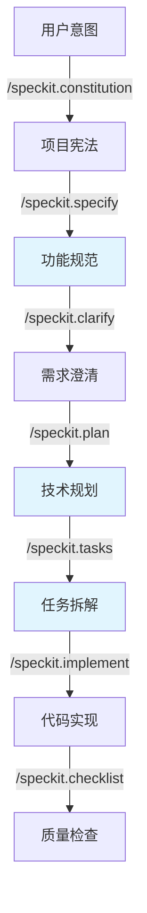
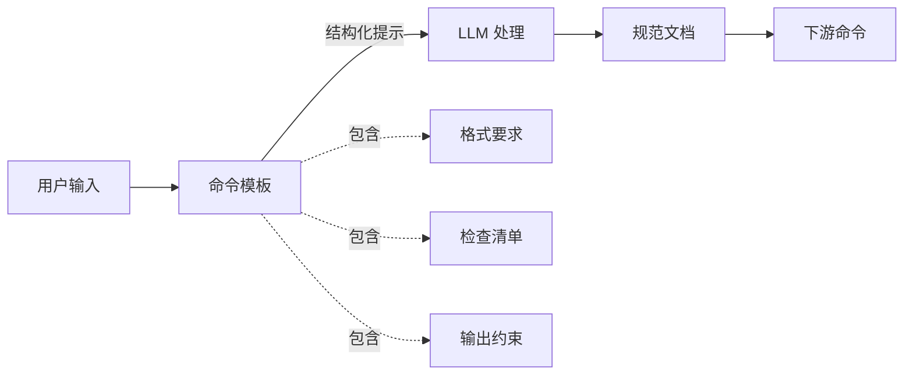
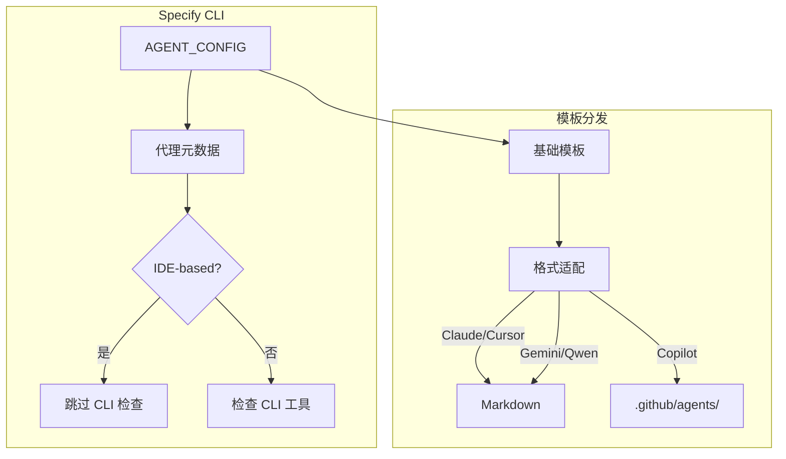

# Spec-Kit 深度研究报告

## 要点速览

| 维度       | 关键信息                                        |
| -------- | ------------------------------------------- |
| **项目定位** | GitHub 官方出品的规范驱动开发（SDD）工具套件                 |
| **核心思想** | 规范即真理（Spec as Source of Truth），代码服务于规范而非反之  |
| **主要组件** | Specify CLI + 模板系统 + 双平台脚本 + 多代理支持          |
| **支持代理** | 16+ 种 AI 代理（Claude、Gemini、Copilot、Cursor 等） |
| **当前版本** | 0.0.22（Python 3.11+）                        |
| **适用场景** | AI 辅助的大型功能开发、需要规范沉淀的企业项目                    |

---

## 一、目录结构与边界概览

### 1.1 整体结构

```
spec-kit/
├── src/specify_cli/           # Python CLI 核心 (~1,400 行)
│   └── __init__.py            # 主入口：init/check 命令实现
├── templates/                 # 模板系统（SDD 的核心载体）
│   ├── commands/              # AI 代理命令模板（9 个核心命令）
│   │   ├── constitution.md    # 项目宪法创建
│   │   ├── specify.md         # 功能规范生成
│   │   ├── plan.md            # 技术规划
│   │   ├── tasks.md           # 任务拆解
│   │   ├── implement.md       # 执行实现
│   │   ├── clarify.md         # 需求澄清
│   │   ├── analyze.md         # 规范分析
│   │   └── checklist.md       # 质量检查清单
│   ├── spec-template.md       # 功能规范模板
│   ├── plan-template.md       # 技术规划模板
│   └── agent-file-template.md # AI 代理配置模板
├── scripts/                   # 自动化脚本（双平台支持）
│   ├── bash/                  # Linux/macOS 脚本
│   └── powershell/            # Windows 脚本
├── memory/                    # 项目记忆/宪法存储
├── docs/                      # 文档站点（DocFX）
└── AGENTS.md                  # AI 代理集成指南
```

### 1.2 设计边界

| 边界内 | 边界外 |
|--------|--------|
| 项目初始化和模板生成 | 代码生成的具体实现（由 AI 代理完成） |
| 规范文档结构定义 | 规范到代码的转换逻辑（由模板约束） |
| 多代理配置管理 | AI 模型的训练或微调 |
| 工作流脚本编排 | 运行时调试与错误修复 |

---

## 二、核心模块职责表

| 模块 | 职责 | 关键依赖 | 扩展点 |
|------|------|----------|--------|
| **Specify CLI** | 项目初始化、工具检查、代理配置 | Typer, Rich, httpx | 新增 AI 代理支持 |
| **模板系统** | 约束 LLM 输出格式，确保规范完整性 | Markdown 前置元数据 | 自定义命令模板 |
| **Bash 脚本** | 分支管理、规范文件创建、代理上下文更新 | git, POSIX 工具 | 钩子脚本扩展 |
| **PowerShell 脚本** | Windows 平台等效功能 | PowerShell 7+ | 钩子脚本扩展 |
| **AGENT_CONFIG** | 统一管理 16+ 代理的配置元数据 | Python 字典 | 注册新代理 |

---

## 三、核心机制详解

### 3.1 规范驱动开发（SDD）工作流程



**关键设计**：
- **蓝色节点**代表关键产出物，存储在 `specs/###-feature-name/` 目录
- 每个阶段都有**模板约束**，防止 LLM 输出偏离结构
- 分支命名规范：`###-short-name`（如 `001-user-auth`）

### 3.2 模板作为"软约束"机制

Spec-Kit 的核心创新在于：**用 Markdown 模板约束 LLM 行为，而非硬编码逻辑**。



模板通过以下方式约束 LLM：

| 约束类型      | 示例                                          | 作用         |
| --------- | ------------------------------------------- | ---------- |
| **前置元数据** | `--- description: ... ---`                  | 定义命令用途和交接点 |
| **必填章节**  | `## User Scenarios & Testing *(mandatory)*` | 强制覆盖关键维度   |
| **标记系统**  | `[NEEDS CLARIFICATION]`                     | 显式标识不确定性   |
| **检查清单**  | `- [ ] No implementation details`           | 自验证机制      |

### 3.3 项目宪法（Constitution）机制

Constitution 是 SDD 的**元规则层**，解决"如何规范地写规范"的问题。

**九条核心法则**（节选关键条款）：

| 条款 | 核心要求 | 设计意图 |
|------|----------|----------|
| **Article I** | Library-First：每个功能必须是独立库 | 强制模块化，防止单体膨胀 |
| **Article II** | CLI Interface：所有库必须暴露 CLI | 确保可观测性、可测试性 |
| **Article III** | Test-First：测试先于实现 | 防止 AI 直接生成未经检验的代码 |
| **Article VII** | Minimal Structure：最多 3 个项目 | 对抗过度工程 |
| **Article VIII** | Framework Trust：直接使用框架能力 | 反对无意义的抽象层 |
| **Article IX** | Integration-First：优先真实环境测试 |  mocks 是最后手段 |

### 3.4 多代理支持架构



**16+ 代理分类**：

| 类型 | 代理 | 配置目录 | 特点 |
|------|------|----------|------|
| **CLI 工具型** | Claude, Gemini, Codex, Qwen | `.claude/`, `.gemini/` 等 | 需要本地安装 CLI |
| **IDE 集成型** | Copilot, Cursor, Windsurf | `.github/`, `.cursor/` 等 | 无需 CLI 检查 |
| **规则文件型** | Kilo Code, Roo Code | `.kilocode/rules/` | 使用规则文件而非命令 |

---

## 四、关键设计取舍分析

### 4.1 为什么选择"双脚本"策略？

| 方案 | 优点 | 缺点 | Spec-Kit 的选择 |
|------|------|------|-----------------|
| 纯 Python 实现 | 跨平台一致 | 失去 shell 的管道能力；依赖 Python 运行时 | ❌ 未采用 |
| 仅 Bash | 简洁，服务器标配 | Windows 支持需要 WSL | ❌ 未采用 |
| Bash + PowerShell | 原生跨平台；利用各平台工具链 | 维护两套代码 | ✅ **采用** |

**取舍逻辑**：在企业环境中，Windows 开发者无法假定 WSL 可用。双脚本策略让 Windows 用户获得**第一等公民**体验，而非"兼容模式"。

### 4.2 为什么模板是 Markdown 而非结构化格式？

| 方案 | 优点 | 缺点 | Spec-Kit 的选择 |
|------|------|------|-----------------|
| JSON/YAML | 严格结构化，易解析 | 对人类不友好；LLM 生成易出错 | ❌ 未采用 |
| Markdown + YAML Frontmatter | 人类可读；保留元数据 | 需要约定解析规则 | ✅ **采用** |
| 纯文本 Prompt | 灵活 | 无结构约束，LLM 输出不稳定 | ❌ 未采用 |

**取舍逻辑**：SDD 的核心是**人机协作**。规范需要开发者审阅、修改、签入版本控制。Markdown 是开发者的"母语"，而 YAML Frontmatter 提供机器可解析的元数据。

### 4.3 为什么采用"命令即文件"模式？

传统 AI 代理命令通常内嵌在工具中（如 Claude Code 的 `/command`）。Spec-Kit 将命令外化为文件：

```
.commands/
├── constitution.md   # 对应 /speckit.constitution
├── specify.md        # 对应 /speckit.specify
├── plan.md           # 对应 /speckit.plan
...
```

**优势**：
1. **可版本控制**：命令的演进与项目代码同步
2. **可定制**：团队可以修改模板而不 fork 工具
3. **可审计**：代码审查时可以审查 AI 指令本身

**代价**：需要维护多代理的命令格式适配（Markdown vs TOML）。

---

## 五、典型用法示例

### 5.1 初始化新项目

```bash
# 安装 Specify CLI
uv tool install specify-cli --from git+https://github.com/github/spec-kit.git

# 创建新项目
specify init my-project --ai claude

# 或在现有项目初始化
cd existing-project
specify init . --ai claude --force
```

### 5.2 规范驱动的功能开发流程

```bash
# 1. 进入项目，启动 AI 代理
claude

# 2. 建立项目宪法（一次性）
/speckit.constitution 制定代码质量、测试标准、UX一致性原则

# 3. 创建功能规范（聚焦 What/Why）
/speckit.specify 实现用户认证系统，支持邮箱+密码和 OAuth2

# 4. 澄清需求（消除歧义）
/speckit.clarify

# 5. 技术规划（聚焦 How）
/speckit.plan 使用 NextAuth.js，PostgreSQL 存储用户数据

# 6. 生成任务列表
/speckit.tasks

# 7. 执行实现
/speckit.implement
```

### 5.3 扩展：添加自定义检查清单

在项目根目录创建 `.specify/templates/checklist-custom.md`：

```markdown
## 安全合规检查

- [ ] 所有用户输入已验证
- [ ] 敏感操作有审计日志
- [ ] 符合 GDPR 数据删除要求
```

---

## 六、优缺点分析

### 6.1 核心优势

| 优势 | 说明 |
|------|------|
| **规范即代码** | 将易腐的 PRD 文档转化为可执行、可版本控制的规范 |
| **AI 无关性** | 通过模板层解耦具体 AI 代理，降低供应商锁定 |
| **质量内建** | 检查清单和宪法机制在源头预防技术债务 |
| **企业友好** | 双平台支持、GitHub 官方背书、MIT 许可证 |
| **渐进式采用** | 可在现有项目中使用 `specify init .` 逐步引入 |

### 6.2 局限与风险

| 局限 | 严重程度 | 缓解方案 |
|------|----------|----------|
| **学习曲线陡峭** | 中高 | 需要理解 SDD 理念；建议从原型项目开始 |
| **模板维护成本** | 中 | 团队需投入时间定制模板以匹配技术栈 |
| **AI 代理不一致性** | 中 | 不同代理对同一模板的理解可能有偏差 |
| **无内置测试** | 高 ⚠️ | 项目缺乏自动化测试，依赖手工验证 |
| **分支命名冲突** | 低 | `###-name` 格式可能与现有分支规范冲突 |
| **过度规范风险** | 中 | 小功能可能不需要完整 SDD 流程 |

### 6.3 适用场景判断矩阵

| 场景 | 推荐度 | 理由 |
|------|--------|------|
| 0-to-1 新产品开发 | ⭐⭐⭐⭐⭐ | SDD 优势最大化，规范可完整沉淀 |
| 大型功能迭代 | ⭐⭐⭐⭐⭐ | 复杂需求需要结构化分解 |
| 遗留系统现代化 | ⭐⭐⭐⭐ | Brownfield 场景支持，但需适配现有结构 |
| 快速原型/POC | ⭐⭐⭐ | 流程可能过重，建议简化模板 |
| 微小功能修复 | ⭐⭐ | 过度设计，直接使用 AI 代理更高效 |
| 无 AI 代理环境 | ⭐ | 工具价值大幅下降 |

---

## 七、落地建议

### 7.1 决策建议

**推荐使用 Spec-Kit 的情况**：
- 团队已使用 Claude Code、Cursor 等 AI 代理
- 项目周期 > 2 周，需要多人协作
- 需要向非技术 stakeholder 同步需求
- 希望建立可复用的开发规范

**不推荐的情况**：
- 纯个人 side project，追求最快交付
- 团队对 AI 辅助开发抵触
- 已有成熟的领域驱动设计（DDD）流程

### 7.2 渐进式落地路径

```
阶段 1（第 1-2 周）：试点
├── 选择 1 个中等复杂度功能
├── 使用默认模板完整走通 SDD 流程
└── 收集团队反馈，定制 constitution

阶段 2（第 3-4 周）：模板化
├── 根据技术栈调整 plan-template.md
├── 添加团队特定的检查清单
└── 建立 code review 中审查规范的流程

阶段 3（第 5-8 周）：规模化
├── 在新项目中默认启用
├── 培训非技术成员参与规范评审
└── 建立规范资产库（可复用的 spec 片段）
```

### 7.3 与现有工具链集成

| 现有工具 | 集成方式 |
|----------|----------|
| **GitHub Projects** | 使用 `/speckit.taskstoissues` 将任务转为 Issues |
| **Notion/Confluence** | 将生成的 spec.md 作为单页文档嵌入 |
| **Linear/Jira** | 手动同步，或扩展脚本自动创建 ticket |
| **CI/CD** | 在流水线中添加 `specify check` 确保环境就绪 |

---

## 八、结论

Spec-Kit 代表了**AI 时代软件开发流程**的一种重要探索：它试图建立人与 AI 协作的"共同语言"——不是通过更复杂的提示词，而是通过**结构化的规范文档**。

其核心洞察在于：**当 AI 可以生成代码时，人类的角色从"写代码的人"转变为"定义正确问题的人"**。Spec-Kit 提供的不是代码生成能力，而是**确保问题定义质量的工程化方法**。

对于正在采用 AI 辅助开发的团队，Spec-Kit 提供了一个经过 GitHub 工程团队验证的框架，值得作为基线流程进行评估和定制。

---

## 附录：核心术语解释

| 术语 | 解释 |
|------|------|
| **SDD** | Spec-Driven Development，规范驱动开发 |
| **Constitution** | 项目宪法，定义开发原则和质量标准的元规则 |
| **Slash Command** | AI 代理的斜杠命令（如 `/speckit.specify`） |
| **Handoff** | 命令模板中定义的下游交接点 |
| **Clarification Marker** | `[NEEDS CLARIFICATION]` 标记，强制显式化不确定性 |
| **Phase Gate** | 实施前的检查点（如 Simplicity Gate） |

---

## 优化日志

在撰写本报告的过程中，经过多轮自我批判和迭代优化，主要解决了以下问题：

### 1. 结构问题
**初稿缺陷**：最初按"功能模块"线性描述，未能突出 SDD 方法论的核心思想。
**修复方案**：重构为"总-分"结构，先建立概念框架（SDD 是什么），再拆解实现机制（模板、宪法、脚本）。

### 2. 深度不足
**初稿缺陷**：对模板如何约束 LLM 行为的机制解释不够深入，停留在"有模板"的表层描述。
**修复方案**：新增"模板作为软约束机制"章节，用表格详细说明四种约束类型（前置元数据、必填章节、标记系统、检查清单）。

### 3. 比较分析缺失
**初稿缺陷**：缺乏与其他开发模式的对比，读者难以判断何时使用 Spec-Kit。
**修复方案**：新增"适用场景判断矩阵"和"决策建议"，明确给出推荐使用和不推荐的场景。

### 4. 落地建议空泛
**初稿缺陷**：落地建议过于笼统（如"可以试试看"）。
**修复方案**：提供三阶段渐进式落地路径（试点→模板化→规模化），并给出与现有工具链（GitHub Projects、Notion、CI/CD）的具体集成方式。

### 5. 优缺点分析不够犀利
**初稿缺陷**：优点罗列过多，缺点轻描淡写。
**修复方案**：强化批判性分析，明确指出"无内置测试"为高风险项，并补充"过度规范风险"等真实使用痛点。

### 6. 可视化不足
**初稿缺陷**：仅有文字描述，缺少架构图。
**修复方案**：添加两张 Mermaid 图（SDD 工作流程、模板约束机制），并确保表格覆盖目录结构、模块职责、设计取舍等维度。
