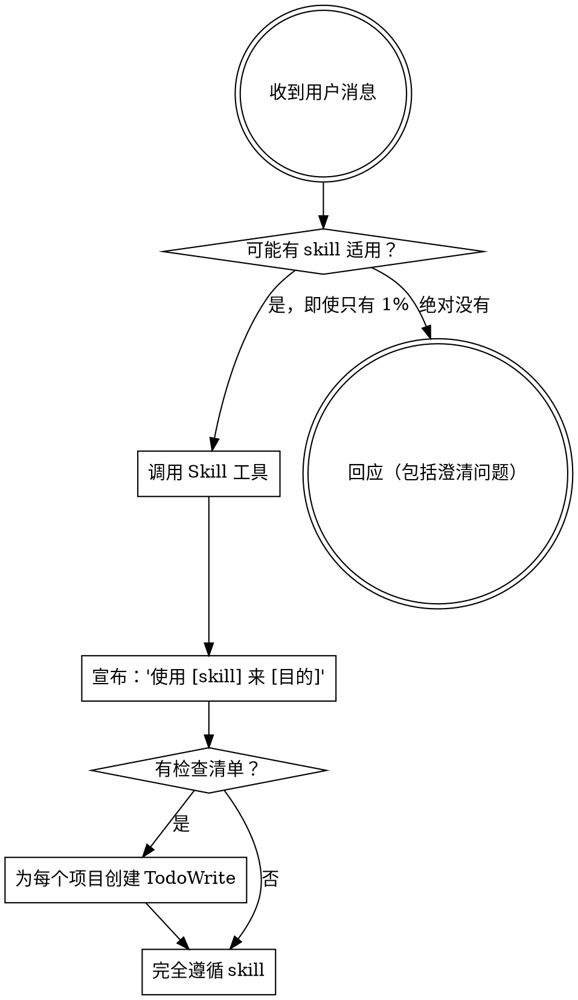

<极其重要>
如果你认为有哪怕 1% 的可能性某个 skill 适用于你正在做的事情，你**绝对必须**调用该 skill。

如果某个 skill 适用于你的任务，你没有选择。**你必须使用它。**

这是不可协商的。这不是可选的。你不能为此找理由。
</极其重要>

## 如何访问 Skills

**在 Claude Code 中：** 使用 `Skill` 工具。当你调用一个 skill 时，其内容会被加载并呈现给你——直接遵循它。永远不要使用 Read 工具读取 skill 文件。

**在其他环境中：** 查看你所在平台的文档了解如何加载 skills。

# 使用 Skills

## 规则

**在做出任何回应或行动之前，先调用相关或请求的 skills。** 即使有 1% 的可能性某个 skill 适用，你也应该调用该 skill 来检查。如果调用的 skill 不适用于当前情况，你就不需要使用它。

## 危险信号

这些想法意味着 STOP——你在为自己找借口：

| 想法 | 现实 |
|------|------|
| "这只是个简单的问题" | 问题就是任务。检查 skills。 |
| "我需要更多背景信息" | Skill 检查在澄清问题**之前**。 |
| "让我先探索代码库" | Skills 告诉你**如何**探索。先检查。 |
| "我可以快速检查 git/文件" | 文件缺乏对话上下文。检查 skills。 |
| "让我先收集信息" | Skills 告诉你**如何**收集信息。 |
| "这不需要正式的 skill" | 如果 skill 存在，就使用它。 |
| "我记得这个 skill" | Skills 会演进。阅读当前版本。 |
| "这不算是任务" | 行动 = 任务。检查 skills。 |
| "这个 skill 大材小用" | 简单的事情会变得复杂。使用它。 |
| "我先做这一件事" | 在做**任何**事情之前先检查。 |
| "这感觉很有成效" | 无纪律的行动浪费时间。Skills 防止这一点。 |
| "我知道那是什么意思" | 知道概念 ≠ 使用 skill。调用它。 |

## Skill 优先级

当多个 skill 可能适用时，按此顺序使用：

1. **先使用流程 skills**（brainstorming、debugging）- 这些决定**如何**处理任务
2. **后使用实现 skills**（frontend-design、mcp-builder）- 这些指导执行

"我们来构建 X" → 先 brainstorming，然后实现 skills。
"修复这个 bug" → 先 debugging，然后领域特定 skills。

## Skill 类型

**刚性**（TDD、debugging）：严格遵循。不要为了省事而变通。

**灵活**（patterns）：根据上下文调整原则。

Skill 本身会告诉你属于哪种类型。

## 用户指令

指令说明**什么**，而不是**如何**做。"添加 X" 或 "修复 Y" 并不意味着跳过工作流程。