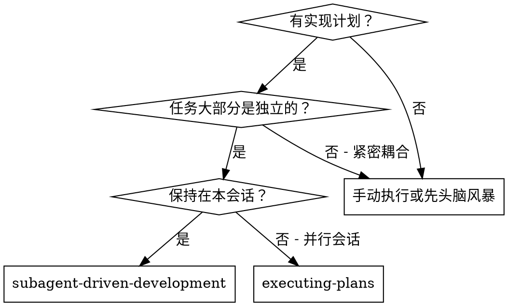
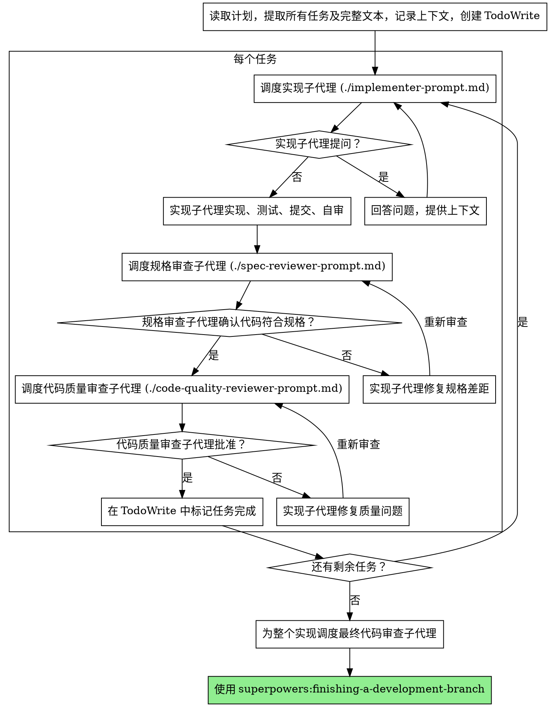

# 子代理驱动开发

## 概述

通过为每个任务调度新鲜子代理来执行计划，每个任务后进行两阶段审查：先规格合规审查，然后代码质量审查。

**核心原则：** 每个任务新鲜子代理 + 两阶段审查（规格然后质量）= 高质量，快速迭代

## 何时使用



**vs. 执行计划（并行会话）：**
- 同一会话（没有上下文切换）
- 每个任务新鲜子代理（没有上下文污染）
- 每个任务后两阶段审查：规格合规，然后代码质量
- 更快迭代（任务间没有人在回路）

## 流程



## 提示模板

- `./implementer-prompt.md` - 调度实现子代理
- `./spec-reviewer-prompt.md` - 调度规格合规审查子代理
- `./code-quality-reviewer-prompt.md` - 调度代码质量审查子代理

## 示例工作流程

```
你：我正在使用子代理驱动开发来执行此计划。

[读取计划文件一次：docs/plans/feature-plan.md]
[提取所有 5 个任务及其完整文本和上下文]
[创建包含所有任务的 TodoWrite]

任务 1：钩子安装脚本

[获取任务 1 的文本和上下文（已提取）]
[用完整任务文本 + 上下文调度实现子代理]

实现者："在我开始之前——钩子应该安装在用户级别还是系统级别？"

你："用户级别 (~/.config/superpowers/hooks/)"

实现者："明白了。现在开始实现..."
[稍后] 实现者：
  - 实现了 install-hook 命令
  - 添加了测试，5/5 通过
  - 自审：发现我漏掉了 --force 标志，已添加
  - 已提交

[调度规格合规审查者]
规格审查者：✅ 规格合规 - 所有需求已满足，没有多余内容

[获取 git SHA，调度代码质量审查者]
代码审查者：优势：测试覆盖良好，代码清晰。问题：无。已批准。

[标记任务 1 完成]

任务 2：恢复模式

[获取任务 2 的文本和上下文（已提取）]
[用完整任务文本 + 上下文调度实现子代理]

实现者：[没有问题，继续]
实现者：
  - 添加了验证/修复模式
  - 8/8 测试通过
  - 自审：一切良好
  - 已提交

[调度规格合规审查者]
规格审查者：❌ 问题：
  - 缺失：进度报告（规格说"每 100 项报告"）
  - 多余：添加了 --json 标志（未请求）

[实现者修复问题]
实现者：移除了 --json 标志，添加了进度报告

[规格审查者重新审查]
规格审查者：✅ 现在规格合规

[调度代码质量审查者]
代码审查者：优势：扎实。问题（重要）：魔法数字（100）

[实现者修复]
实现者：提取了 PROGRESS_INTERVAL 常量

[代码审查者重新审查]
代码审查者：✅ 已批准

[标记任务 2 完成]

...

[所有任务完成后]
[调度最终 code-reviewer]
最终审查者：所有需求已满足，准备好合并

完成！
```

## 优势

**vs. 手动执行：**
- 子代理自然遵循 TDD
- 每个任务新鲜上下文（没有混淆）
- 并行安全（子代理不会互相干扰）
- 子代理可以提问（在工作期间和之前）

**vs. 执行计划：**
- 同一会话（没有交接）
- 持续进展（没有等待）
- 审查检查点自动

**效率提升：**
- 没有文件读取开销（控制器提供完整文本）
- 控制器精确策划需要什么上下文
- 子代理预先获得完整信息
- 问题在工作开始前浮出水面（而不是之后）

**质量关卡：**
- 交接前自审捕获问题
- 两阶段审查：规格合规，然后代码质量
- 审查循环确保修复实际有效
- 规格合规防止过度/欠开发
- 代码质量确保实现构建良好

**成本：**
- 更多子代理调用（每个任务实现者 + 2 个审查者）
- 控制器做更多准备工作（预先提取所有任务）
- 审查循环增加迭代
- 但早期捕获问题（比以后调试更便宜）

## 危险信号

**永远不要：**
- 跳过审查（规格合规 OR 代码质量）
- 在有未修复问题的情况下继续
- 并行调度多个实现子代理（冲突）
- 让子代理读取计划文件（改为提供完整文本）
- 跳过场景设置上下文（子代理需要理解任务适合哪里）
- 忽略子代理问题（在让他们继续之前回答）
- 接受规格合规的"差不多"（规格审查者发现问题 = 未完成）
- 跳过审查循环（审查者发现问题 = 实现者修复 = 再次审查）
- 让实现者自审取代实际审查（两者都需要）
- **在规格合规 ✅ 之前开始代码质量审查**（顺序错误）
- 在任一审查有未解决问题时进入下一个任务

**如果子代理提问：**
- 清晰完整地回答
- 如果需要提供额外上下文
- 不要催促他们进入实现

**如果审查者发现问题：**
- 实现者（同一子代理）修复它们
- 审查者再次审查
- 重复直到批准
- 不要跳过重新审查

**如果子代理任务失败：**
- 用具体指令调度修复子代理
- 不要尝试手动修复（上下文污染）

## 集成

**必需的工作流 skills：**
- **superpowers:writing-plans** - 创建此 skill 执行的计划
- **superpowers:requesting-code-review** - 审查子代理的代码审查模板
- **superpowers:finishing-a-development-branch** - 所有任务后完成开发

**子代理应该使用：**
- **superpowers:test-driven-development** - 子代理为每个任务遵循 TDD

**替代工作流：**
- **superpowers:executing-plans** - 用于并行会话而不是同一会话执行