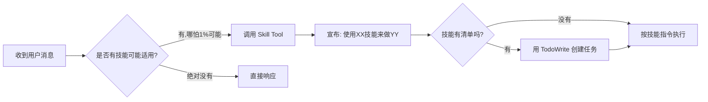
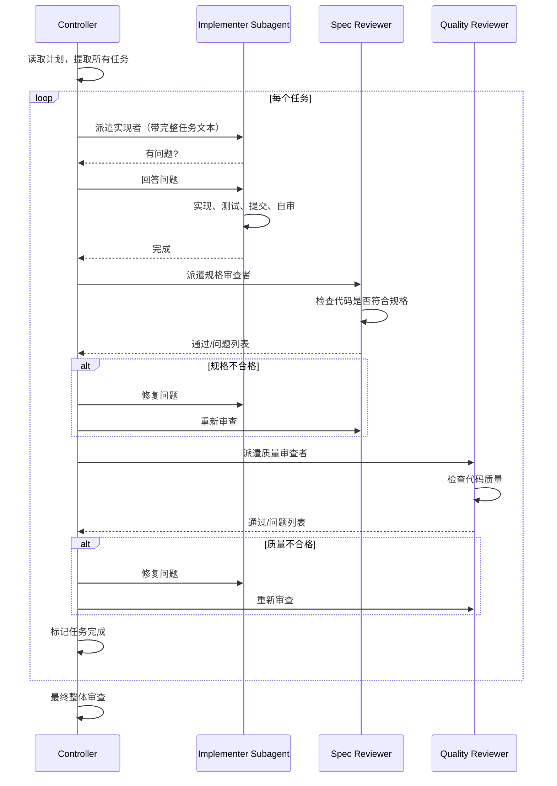
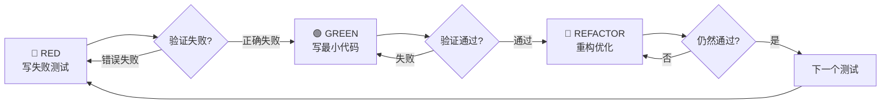

# Superpowers 库研究报告

## 要点速览

| 维度 | 说明 |
|------|------|
| **定位** | AI 编码助手的「开发工作流增强系统」 |
| **核心理念** | 通过强制性 Skill 触发机制，让 AI Agent 遵循结构化的开发流程 |
| **适用平台** | Claude Code、OpenAI Codex、OpenCode |
| **开发者** | Jesse Vincent (obra) |
| **版本** | 4.0.3 |

---

## 一、整体概览

### 1.1 设计目标

Superpowers 解决的核心问题是：**AI 编码助手容易"跳过流程直接写代码"**。

传统 AI 编码助手的问题：
- 用户说"帮我加个功能"，AI 直接开始写代码
- 缺乏需求澄清、设计讨论、测试规划
- 结果往往是"能跑但不好用"的代码

Superpowers 的解决方案：
- 通过「技能（Skill）」定义标准工作流
- 强制 AI 在写代码前先触发相关技能
- 形成「头脑风暴 → 设计文档 → 实现计划 → TDD 开发 → 代码审查」的完整闭环

### 1.2 目录结构

```
superpowers/
├── .claude-plugin/      # Claude Code 插件配置
│   ├── plugin.json      # 插件元信息
│   └── marketplace.json # 市场注册信息
├── .codex/              # Codex 平台适配
├── .opencode/           # OpenCode 平台适配
├── skills/              # 核心技能库（14 个技能）
│   ├── brainstorming/           # 头脑风暴
│   ├── writing-plans/           # 编写实现计划
│   ├── executing-plans/         # 执行计划（批次模式）
│   ├── subagent-driven-development/  # 子代理驱动开发
│   ├── test-driven-development/ # 测试驱动开发
│   ├── systematic-debugging/    # 系统化调试
│   ├── using-git-worktrees/     # Git Worktree 管理
│   ├── requesting-code-review/  # 请求代码审查
│   ├── receiving-code-review/   # 处理审查反馈
│   ├── dispatching-parallel-agents/ # 并行代理调度
│   ├── finishing-a-development-branch/ # 完成开发分支
│   ├── verification-before-completion/ # 完成前验证
│   ├── using-superpowers/       # 技能系统入门（引导技能）
│   └── writing-skills/          # 编写新技能的指南
├── commands/            # 用户可直接调用的命令
│   ├── brainstorm.md
│   ├── write-plan.md
│   └── execute-plan.md
├── hooks/               # 会话启动钩子
│   ├── hooks.json
│   └── session-start.sh
├── lib/                 # 公共工具库
│   └── skills-core.js   # 技能解析核心逻辑
├── agents/              # 预定义的代理角色
│   └── code-reviewer.md
├── tests/               # 测试套件
└── docs/                # 文档
```

### 1.3 核心模块职责表

| 模块 | 职责 | 关键依赖 | 扩展点 |
|------|------|----------|--------|
| **skills/** | 定义开发工作流的标准化"技能" | YAML Frontmatter + Markdown | 新增 `SKILL.md` 即可扩展 |
| **hooks/** | 会话启动时注入技能系统指令 | Claude Code Hook 机制 | `hooks.json` 配置触发条件 |
| **commands/** | 用户快捷命令的入口 | 对应 skill 的代理调用 | 新增 `.md` 文件 |
| **lib/skills-core.js** | 技能文件的发现与解析 | Node.js fs/path | 可自定义技能目录 |
| **.claude-plugin/** | Claude Code 插件集成 | Claude 插件系统 | `plugin.json` 元数据 |

---

## 二、核心架构

### 2.1 架构图

```mermaid
flowchart TB
    subgraph 用户交互层
        USER[用户输入]
        CMD[/brainstorm /write-plan /execute-plan]
    end

    subgraph 触发层
        HOOK[SessionStart Hook]
        SKILL_TOOL[Skill Tool]
    end

    subgraph 技能层
        US[using-superpowers<br/>引导技能]
        BS[brainstorming<br/>头脑风暴]
        WP[writing-plans<br/>编写计划]
        EP[executing-plans<br/>执行计划]
        SDD[subagent-driven-dev<br/>子代理开发]
        TDD[test-driven-dev<br/>测试驱动]
        DEBUG[systematic-debugging<br/>系统化调试]
        CR[code-review<br/>代码审查]
    end

    subgraph 执行层
        AGENT[AI Agent]
        SUBAGENT[Sub-Agent]
    end

    USER --> HOOK
    HOOK -->|注入| US
    USER --> CMD
    CMD --> SKILL_TOOL
    SKILL_TOOL --> BS
    SKILL_TOOL --> WP
    SKILL_TOOL --> EP

    BS --> WP
    WP --> SDD
    WP --> EP
    SDD --> TDD
    SDD --> CR
    EP --> TDD

    TDD --> AGENT
    SDD --> SUBAGENT
    DEBUG --> AGENT
```

### 2.2 设计哲学：强制性工作流

Superpowers 的核心设计哲学是**「强制优于建议」**：

```
传统方式：AI 可以选择是否遵循最佳实践
Superpowers：AI 必须先检查技能，无法绕过
```

这体现在 `using-superpowers` 技能中的关键指令：

> **"IF A SKILL APPLIES TO YOUR TASK, YOU DO NOT HAVE A CHOICE. YOU MUST USE IT."**
>
> 如果技能适用于你的任务，你没有选择。你必须使用它。

这种设计避免了 AI 的"自作聪明"——不会因为觉得"这个简单"就跳过流程。

---

## 三、关键机制详解

### 3.1 技能触发机制

#### 触发流程



#### 技能文件结构

每个技能是一个独立目录，包含 `SKILL.md` 文件：

```yaml
---
name: brainstorming
description: "You MUST use this before any creative work..."
---

# 技能正文（Markdown）
## Overview
...
```

`skills-core.js` 负责解析这些文件：

```javascript
// 提取 YAML Frontmatter
function extractFrontmatter(filePath) {
    const content = fs.readFileSync(filePath, 'utf8');
    // 解析 name 和 description 字段
    ...
}

// 递归查找所有 SKILL.md
function findSkillsInDir(dir, sourceType, maxDepth = 3) {
    // 支持个人技能覆盖系统技能
    ...
}
```

### 3.2 子代理驱动开发（Subagent-Driven Development）

这是 Superpowers 最核心的创新机制。

#### 核心思想

| 传统方式 | Subagent-Driven |
|---------|----------------|
| 一个 Agent 处理所有任务 | 每个任务派遣独立 Subagent |
| 上下文越来越长，容易混乱 | 每个 Subagent 干净上下文 |
| 自己审查自己的代码 | 独立的审查 Subagent |

#### 执行流程



#### 设计取舍

| 优势 | 代价 |
|-----|------|
| 每个任务干净上下文，无污染 | 更多 API 调用 |
| 两阶段审查（规格+质量） | 更多 Token 消耗 |
| 早期发现问题，避免返工 | 初期学习曲线 |
| 可并行执行多个任务 | 任务间协调复杂度 |

### 3.3 测试驱动开发（TDD）强制执行

Superpowers 对 TDD 的态度是**零容忍**：

```
核心规则：NO PRODUCTION CODE WITHOUT A FAILING TEST FIRST
没有失败的测试，就不能写生产代码
```

#### Red-Green-Refactor 循环



#### 反模式警示

技能中列出了常见的"自我欺骗"：

| 借口 | 现实 |
|------|------|
| "太简单了不用测试" | 简单代码也会出错，测试只需30秒 |
| "我先写代码，然后补测试" | 事后测试一通过就证明不了什么 |
| "手动测试更快" | 手动测试无法重现，每次改动都要重测 |
| "删掉 X 小时的工作太浪费" | 沉没成本谬误，保留未验证代码才是技术债 |

### 3.4 会话启动钩子（Session Hook）

当用户启动 Claude Code 会话时，`session-start.sh` 会被触发：

```bash
# 读取引导技能内容
using_superpowers_content=$(cat "${PLUGIN_ROOT}/skills/using-superpowers/SKILL.md")

# 输出 JSON 注入到会话上下文
cat <<EOF
{
  "hookSpecificOutput": {
    "additionalContext": "<EXTREMELY_IMPORTANT>\n
    You have superpowers.\n
    Below is the full content of your 'using-superpowers' skill...\n
    ${using_superpowers_escaped}\n
    </EXTREMELY_IMPORTANT>"
  }
}
EOF
```

这确保了 AI Agent 在每次会话开始时就"知道"自己有技能系统。

---

## 四、典型工作流示例

### 4.1 完整开发流程

```
用户: "帮我加一个用户登录功能"

AI（检查技能）: 这是创建新功能，触发 brainstorming 技能

[头脑风暴阶段]
AI: "你说的登录是指哪种方式？
     A) 用户名密码
     B) 第三方 OAuth（Google、GitHub）
     C) Magic Link（邮件链接登录）"

用户: "用户名密码就行"

AI: "需要支持'记住我'功能吗？"
...（逐个问题澄清需求）

AI: "根据讨论，我整理出设计文档，先看第一部分..."
...（分段展示设计，用户确认）

[设计完成，保存到 docs/plans/2024-01-15-user-login-design.md]

AI: "设计已保存，准备创建实现计划？"

[编写计划阶段 - writing-plans]
AI: "生成实现计划，每个任务 2-5 分钟..."

计划示例：
### Task 1: 用户模型和密码哈希
**Files:** src/models/user.py, tests/test_user.py
**Step 1:** 写测试 - test_password_hash_and_verify
**Step 2:** 运行测试，确认失败
**Step 3:** 实现 User.set_password() 和 User.check_password()
**Step 4:** 运行测试，确认通过
**Step 5:** 提交

[执行阶段 - subagent-driven-development]
AI: "开始子代理驱动开发..."

[派遣实现者子代理处理 Task 1]
Implementer: "实现完成，5/5 测试通过，已提交"

[派遣规格审查子代理]
Spec Reviewer: "✅ 符合规格"

[派遣质量审查子代理]
Quality Reviewer: "发现问题：密码哈希应使用 bcrypt 而非 md5"

[实现者修复]
Implementer: "已修复，改用 bcrypt"

[重新审查通过]

[继续下一个任务...]
```

### 4.2 调试流程

```
用户: "登录功能有时候会报 500 错误"

AI（检查技能）: 这是 Bug 调试，触发 systematic-debugging 技能

[Phase 1: 现象定位]
AI: "先收集信息：
     - 什么时候出现？
     - 错误日志内容？
     - 能复现吗？"

[Phase 2: 根因追踪]
AI: "根据日志，问题在密码验证。写一个失败测试复现它..."

[Phase 3: 修复]
AI: "按 TDD 流程修复..."

[Phase 4: 验证]
AI: "测试通过，确认修复。提交。"
```

---

## 五、与同类工具对比

| 维度 | Superpowers | Cursor Rules | Aider |
|------|-------------|--------------|-------|
| **定位** | 工作流增强系统 | 项目级 AI 指令 | 命令行 AI 编程 |
| **强制性** | ⭐⭐⭐⭐⭐ 强制触发 | ⭐⭐ 建议性 | ⭐ 无内置流程 |
| **TDD 支持** | 内置强制 TDD | 需自行配置 | 无 |
| **子代理** | 核心特性 | 无 | 无 |
| **学习曲线** | 中等（需理解技能概念） | 低 | 低 |
| **扩展性** | 高（自定义技能） | 中 | 低 |

---

## 六、设计取舍分析

### 6.1 为什么选择「强制」而非「建议」

**取舍：用户自由度 vs 流程保证**

- 建议性系统：AI 可以"聪明地"跳过流程，但也可能跳过重要步骤
- 强制性系统：保证流程不被跳过，但用户感觉"啰嗦"

Superpowers 选择强制性，因为：
> "AI Agent 的'聪明'往往是问题根源。它觉得简单的东西，常常出错。"

### 6.2 为什么使用 Markdown 而非代码定义技能

**取舍：表达力 vs 可读性**

- 代码定义：可编程、可动态生成，但门槛高
- Markdown 定义：人类可读、易于编写，但表达力有限

Superpowers 选择 Markdown，因为：
- 技能本质是「给 AI 的指令」，自然语言最直接
- 降低贡献门槛，任何人都能写技能
- Frontmatter（YAML）处理元数据，正文（Markdown）承载指令

### 6.3 子代理模式的 Token 成本

**取舍：质量 vs 成本**

每个任务需要：
1. 实现者子代理
2. 规格审查子代理
3. 质量审查子代理

相比单 Agent 模式，Token 消耗增加 2-3 倍。但换来的是：
- 每个子代理上下文干净，不会被前面任务污染
- 两阶段审查，质量更有保证
- 早期发现问题，避免后期返工

作者认为这是值得的：
> "早期发现问题的成本，远低于后期调试的成本。"

---

## 七、落地建议

### 7.1 适合使用 Superpowers 的场景

- ✅ 需要长时间自主开发的 AI 编码任务
- ✅ 团队希望统一 AI 编码规范
- ✅ 对代码质量有严格要求的项目
- ✅ 学习 TDD、代码审查等最佳实践

### 7.2 不适合的场景

- ❌ 快速原型验证（流程太重）
- ❌ 简单的一次性脚本
- ❌ 不使用 Claude Code/Codex/OpenCode 的环境

### 7.3 自定义技能建议

如果你的团队有特定工作流，可以参考 `skills/writing-skills/SKILL.md` 创建自定义技能：

```markdown
---
name: my-custom-skill
description: Use when [触发条件] - [技能作用]
---

# 技能标题

## Overview
简要说明这个技能做什么

## When to Use
什么时候触发

## The Process
具体步骤（用流程图说明）

## Red Flags
常见错误和警示
```

### 7.4 渐进式采用

1. **第一阶段**：只启用 `brainstorming` 和 `writing-plans`，先习惯"先设计后编码"
2. **第二阶段**：启用 `test-driven-development`，养成 TDD 习惯
3. **第三阶段**：启用 `subagent-driven-development`，让 AI 自主完成完整开发流程

---

## 八、总结

Superpowers 是一个**强制性的 AI 编码工作流增强系统**，核心创新在于：

1. **技能触发机制**：强制 AI 在行动前检查并遵循相关技能
2. **子代理驱动开发**：每个任务独立子代理 + 两阶段审查
3. **TDD 零容忍**：没有失败测试就不能写代码

它的设计哲学是：**与其教 AI「什么时候应该遵循最佳实践」，不如让它「无法不遵循」**。

对于需要 AI 长时间自主开发、且对代码质量有要求的场景，Superpowers 提供了一个经过实践验证的解决方案。
