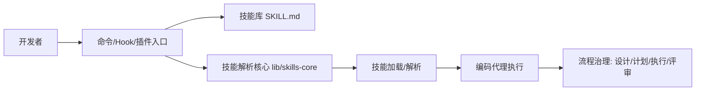

# Superpowers 第三方库研究报告

## 要点速览
- **定位清晰**：这是一个“技能驱动”的开发流程库，用“技能（SKILL）+ 命令 + Hook + 插件”把流程固化下来。
- **跨平台适配**：同一套技能在 Claude / Codex / OpenCode 上复用，通过不同引导与工具映射实现一致体验。
- **设计重心在流程治理**：强调“先设计后实现 + 计划驱动 + 复审”，用强约束换取更稳定的工程质量。
- **技能即协议**：SKILL.md 结构化前置元信息 + 统一解析器，保证技能可发现、可加载、可覆盖。

---

## 1. 概览

### 1.1 目录结构概览（精简）
```
vendors/superpowers/
├── skills/            # 技能库（SKILL.md）
├── commands/          # 命令入口（触发技能）
├── hooks/             # 会话钩子（自动注入）
├── agents/            # 专用子代理定义
├── lib/               # 技能解析与发现核心逻辑
├── .codex/            # Codex 引导与 CLI 工具
├── .opencode/         # OpenCode 插件与工具
├── docs/              # 文档与平台说明
└── tests/             # 测试
```

### 1.2 边界与角色
- **技能库（skills）**：核心资产，定义流程与行为规范。
- **解析核心（lib）**：统一解析 SKILL.md 的前置元信息，并支持技能发现与覆盖规则。
- **平台适配层（.codex / .opencode / .claude-plugin）**：将技能注入不同运行时。
- **命令与钩子（commands / hooks）**：让技能“自动触发”而非用户手动记忆。

### 1.3 设计目标（从代码与文档归纳）
- **把开发流程系统化**：通过技能和命令强制“先设计、后计划、再执行”。
- **降低协作成本**：统一团队的工作节奏（计划、评审、测试）。
- **跨平台复用**：同一技能，在多个 agent 平台上使用。

---

## 2. 核心图（架构视角）



**用途说明**：展示“入口 → 技能解析 → 技能加载 → 流程执行”的主链路。

---

## 3. 核心模块职责表（必须项）

| 模块 | 职责 | 关键依赖 | 扩展点 |
| --- | --- | --- | --- |
| skills/ | 定义流程技能（SKILL.md） | YAML frontmatter | 新增/覆盖技能 |
| lib/skills-core.js | 技能解析、发现、覆盖规则 | fs/path | 新技能解析策略 |
| commands/ | 命令入口（触发技能） | 命令元数据 | 新命令触发器 |
| hooks/ | 会话启动注入 | hooks.json | 新 Hook 事件 |
| .codex/ | Codex CLI 引导与加载 | Node.js | 自定义 CLI 逻辑 |
| .opencode/ | OpenCode 插件 | OpenCode 插件 API | 新工具映射 |
| agents/ | 专用子代理 | 规则约束 | 新评审代理 |

---

## 4. 关键机制与设计取舍

### 4.1 技能即“流程协议”
- **机制**：每个技能以 `SKILL.md` 表示，包含 YAML 元信息（name/description）+ 具体流程。
- **取舍点**：流程被固化，灵活度降低，但执行一致性显著提升。

### 4.2 技能优先级与覆盖
- **机制**：个人技能覆盖 superpowers 技能；OpenCode 支持项目级技能优先级（project > personal > superpowers）。
- **取舍点**：复杂一点，但允许团队与个人定制，不破坏全局规范。

### 4.3 入口统一：命令 + Hook + 插件
- **机制**：
  - `commands/` 里是显式触发入口（如 brainstorming / write-plan）。
  - `hooks/` 在会话启动时自动注入（SessionStart）。
  - `.codex/.opencode` 负责在不同平台挂载技能。
- **取舍点**：需要维护多套入口，但换来“低摩擦触发”。

### 4.4 跨平台适配
- **Codex**：通过 `superpowers-codex` CLI 发现与加载技能。
- **OpenCode**：通过插件注入 bootstrap，并提供 `use_skill` / `find_skills` 工具。
- **取舍点**：维护成本增加，但能统一技能生态。

### 4.5 流程治理风格
- **机制**：强调 TDD、拆分任务、评审与复核（skills 中体现）。
- **取舍点**：上手门槛稍高，但对复杂项目收益大。

---

## 5. 技能分层与职责示意（表格）

| 类别 | 代表技能 | 目的 |
| --- | --- | --- |
| 设计阶段 | brainstorming | 先澄清需求与设计 |
| 计划阶段 | writing-plans | 形成可执行任务 |
| 执行阶段 | executing-plans / subagent-driven-development | 分批执行与复审 |
| 质量阶段 | test-driven-development / requesting-code-review | 强化测试与质量审查 |
| 收尾阶段 | finishing-a-development-branch | 合并/收敛与收尾 |

---

## 6. 典型用法/示例（常用场景 3 段）

### 6.1 初始化/最小可用（Codex）
```bash
# 列出可用技能
~/.codex/superpowers/.codex/superpowers-codex find-skills

# 加载特定技能
~/.codex/superpowers/.codex/superpowers-codex use-skill superpowers:brainstorming
```

### 6.2 扩展点：自定义技能
```bash
# 在个人目录创建技能
mkdir -p ~/.codex/skills/my-skill
```
```markdown
---
name: my-skill
description: 用于某个固定流程
---

# My Skill
[自定义流程内容]
```

### 6.3 典型调用路径（流程风格）
```text
brainstorming → writing-plans → executing-plans → requesting-code-review → finishing-a-development-branch
```

---

## 7. 结论与建议（落地）

- **建议 1：先跑通技能链路再扩展**：优先把 brainstorming → plan → execute → review 跑通，再做个性化技能。
- **建议 2：在团队内定义“最小必选技能集”**：统一入口习惯，减少不同成员的流程差异。
- **建议 3：把平台适配放在边界层**：技能内容尽量保持平台无关，适配逻辑写在 `.codex/.opencode`。
- **建议 4：将测试技能作为默认必触发**：通过强制 TDD 提高长期代码质量。
- **建议 5：用 Hook 自动注入降低摩擦**：新成员无需学习复杂命令即可进入流程。

---

## 附：关键文件与入口（便于进一步深挖）
- `vendors/superpowers/skills/brainstorming/SKILL.md`
- `vendors/superpowers/lib/skills-core.js`
- `vendors/superpowers/.codex/superpowers-codex`
- `vendors/superpowers/.opencode/plugin/superpowers.js`
- `vendors/superpowers/hooks/hooks.json`
- `vendors/superpowers/commands/brainstorm.md`

