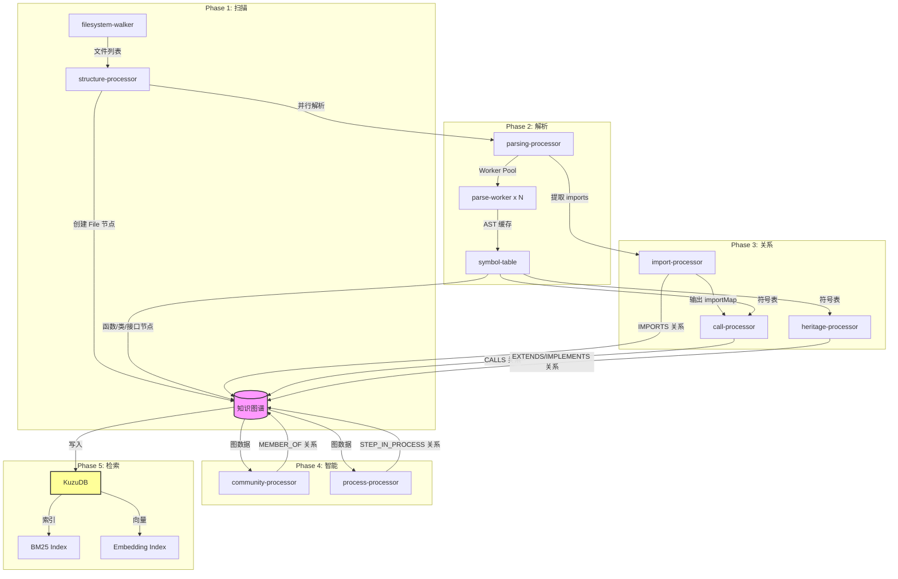

# GitNexus 架构分析报告

> 为 AI 代理构建的代码库知识图谱工具

## 1. 核心矛盾与存在意义

### 痛点还原：AI 开发者的"失明"困境

在 GitNexus 出现之前，AI 编程助手（如 Cursor、Claude Code、Windsurf）面临一个根本性问题：**它们看不到代码的结构性关系**。

想象以下灾难场景：
1. **AI 修改了 `UserService.validate()`**
2. **它不知道有 47 个函数依赖这个方法的返回类型**
3. **破坏性变更悄然上线**

传统 RAG（检索增强生成）只是给 AI 一堆文本片段，让它自己顺着关系链去"探索"。这意味着：
- 一个简单问题需要 4+ 次查询才能得到完整答案
- 小模型根本不具备这种探索能力
- AI 经常"漏看"关键依赖，导致破坏性修改

### 一句话定义

**GitNexus = 给代码库构建知识图谱 + 预计算结构性智能**

它不是在运行时让 AI 去"探索"关系，而是**在索引时就把所有关系算好**。AI 只需要调用一个工具，就能得到完整的上下文。

### 适用场景

| 必须用 | 杀鸡用牛刀 |
|--------|------------|
| 中大型项目（数千个文件） | 单文件脚本 |
| 需要安全重构/修改他人代码 | 简单的 CRUD 生成 |
| AI 代理参与开发流程 | 学习代码基础概念 |
| 多模块依赖追踪 | 一次性分析 |

---

## 2. 静态架构解剖

| 模块名称 | 核心职责 | 复杂度 | 核心地位 |
|----------|----------|--------|----------|
| **ingestion/pipeline** | 索引流水线总控，协调 6 个阶段的图谱构建 | 高 | 灵魂 |
| **ingestion/ingestion** | Tree-sitter AST 解析 + 并行 worker 池 | 高 | 骨架 |
| **ingestion/import-processor** | 解析并解析跨文件 import 关系 | 高 | 骨架 |
| **ingestion/call-processor** | 追踪函数调用链，建立 CALLS 关系 | 高 | 骨架 |
| **ingestion/community-processor** | 基于图算法的代码社区检测（Leiden 算法） | 中 | 皮肉 |
| **ingestion/process-processor** | 识别执行流（从入口点开始的调用路径） | 中 | 皮肉 |
| **search/hybrid-search** | BM25 + 向量 + RRF 混合检索 | 中 | 骨架 |
| **embeddings/embedding-pipeline** | 代码语义向量化（transformers.js） | 中 | 皮肉 |
| **mcp/tools** | MCP 协议工具封装（7 个智能工具） | 低 | 皮肉 |
| **storage/kuzu** | KuzuDB 图数据库持久化 | 中 | 骨架 |

---

## 3. 动态核心链路追踪

### 场景：索引一个 TypeScript 代码库

```
用户执行: npx gitnexus analyze
```

### 数据流转流程图



### 各阶段数据变化说明

| 阶段 | 输入 | 处理 | 输出 |
|------|------|------|------|
| **扫描** | 磁盘文件 | walkRepository 遍历 | File[] + 内容 |
| **解析** | File[] | Tree-sitter AST 提取 | Symbol Table + Function/Class 节点 |
| **Import** | AST | 解析 import 语句 + 路径解析 | IMPORTS 边 |
| **Call** | AST + Import Map | 跨文件调用追踪 | CALLS 边 + 置信度 |
| **Heritage** | AST | 类继承/接口实现追踪 | EXTENDS/IMPLEMENTS 边 |
| **Community** | 全图 | Leiden 图聚类算法 | Community 节点 + MEMBER_OF 边 |
| **Process** | Community + Call 链 | 从入口点追踪执行流 | Process 节点 + STEP_IN_PROCESS 边 |
| **存储** | 完整图 | KuzuDB 持久化 | 可查询的图数据库 |

---

## 4. 架构评价

### 设计亮点：预计算关系智能

GitNexus 最精彩的设计是**把"探索"从运行时移到索引时**。

传统 RAG：
```
用户问 → LLM 收到原始边 → LLM 自己查 4 次 → 得到答案
```

GitNexus：
```
用户问 → impact() 工具 → 预计算好的爆炸半径 → 一次返回
```

这带来了三个关键优势：
1. **可靠性**：AI 不会"漏看"关系，所有上下文已经在工具响应里
2. **Token 效率**：不需要多次查询，一次返回完整答案
3. **模型民主化**：小模型也能做大事，因为工具承担了推理重活

### 潜在代价

| 代价 | 说明 |
|------|------|
| **首次索引慢** | 大型代码库需要数分钟建立图谱 |
| **索引存储** | 需要持久化图数据（.gitnexus/ 目录） |
| **维护成本** | 代码变更后需要重新索引 |
| **内存占用** | 解析和向量生成需要较大内存 |

### 技术选型观察

- **KuzuDB**：选得巧妙，轻量级图数据库，比 Neo4j 适合本地场景
- **Tree-sitter**：正确选择，AST 解析的工业标准
- **Worker 并行**：明智优化，大型代码库解析速度的关键
- **双模式（CLI + Web）**：战略正确，覆盖不同用户场景

---

## 总结

GitNexus 解决了一个真实痛点：AI 编程助手"看不见"代码结构。它的核心创新是**预计算关系智能**，把昂贵的图查询在索引时完成，让 AI 代理在运行时只需要调用一个简单工具就能获得完整的代码上下文。

这本质上是把搜索引擎的"索引-查询"模式搬到了代码理解领域，只是索引的是**结构性关系**，而不仅是文本内容。
