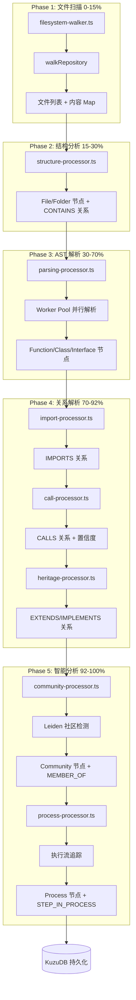
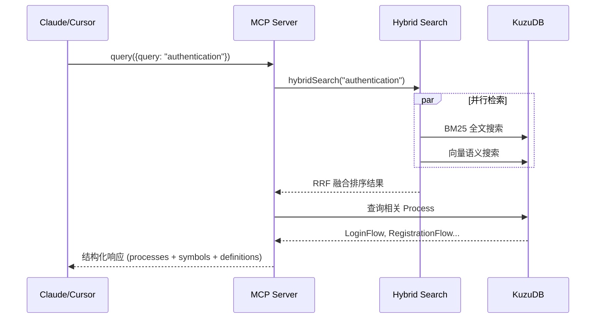

# GitNexus 架构深度分析

> 分析日期: 2026-02-24
> 仓库地址: https://github.com/abhigyanpatwari/GitNexus

---

## 1. 核心矛盾与存在意义

### 痛点还原：AI Agent 的"代码盲区"灾难

在没有 GitNexus 之前，Cursor、Claude Code、Windsurf 等 AI 编程助手面临一个致命问题：**它们对代码库的理解是碎片化的**。

典型灾难场景：
```
AI 编辑 UserService.validate()
    ↓
不知道有 47 个函数依赖它的返回类型
    ↓
参数结构被悄悄修改
    ↓
生产环境崩溃，错误在 10 层调用链之外才暴露
```

更深层的问题是：**传统 RAG 只给 LLM 原始图数据，让 LLM 自己探索**。这导致：
- LLM 需要多次查询才能理解依赖关系
- Token 消耗巨大（每次查询都要重新理解上下文）
- 小模型根本无法胜任复杂的图遍历推理

### 一句话定义

> **GitNexus 是"预处理的关系型智能"** —— 在索引阶段就完成聚类、追踪、评分，让 AI 工具一次调用就能拿到完整的结构化上下文。

### 适用场景判断

| 必须用 | 杀鸡用牛刀 |
|-------|----------|
| 修改核心模块，需要知道影响范围 | 单文件脚本，无依赖关系 |
| 重构遗留代码，理清调用链 | 全新项目，代码量 < 50 行 |
| 多人协作的大型代码库 | 临时原型验证 |
| 让小模型（Haiku/GPT-4o-mini）获得大模型级别的代码理解 | 纯配置文件修改 |

---

## 2. 静态架构解剖

GitNexus 的核心代码位于 `gitnexus/src/`，由 7 个关键模块组成：

| 模块名称                    | 核心职责                     | 复杂度 | 核心地位   |
| :---------------------- | :----------------------- | :-- | :----- |
| **Ingestion Pipeline**  | 代码索引的主流水线，协调 8 个子阶段      | 高   | **灵魂** |
| **Knowledge Graph**     | 内存图数据结构，存储节点和关系          | 低   | 骨架     |
| **KuzuDB Adapter**      | 图数据库持久化层，支持 Cypher 查询    | 中   | 骨架     |
| **Hybrid Search**       | BM25 + 语义向量 + RRF 融合检索   | 中   | 骨架     |
| **MCP Server**          | 向 AI Agent 暴露 7 个工具 + 资源 | 中   | 皮肉     |
| **Community Detection** | Leiden 算法聚类，发现功能社区       | 高   | 皮肉     |
| **Embeddings**          | 代码符号向量化，支持语义搜索           | 中   | 皮肉     |

### 模块详解

#### Ingestion Pipeline（灵魂模块）
```
gitnexus/src/core/ingestion/
├── pipeline.ts           # 主协调器
├── filesystem-walker.ts  # 文件扫描
├── parsing-processor.ts  # Tree-sitter AST 解析
├── import-processor.ts   # import/require 关系解析
├── call-processor.ts     # 函数调用追踪
├── heritage-processor.ts # 类继承/接口实现
├── community-processor.ts# Leiden 社区检测
└── process-processor.ts  # 执行流追踪
```

**设计精髓**：流水线采用 Worker Pool 并行解析，AST 缓存避免重复解析，各阶段可独立回退。

#### Knowledge Graph（骨架模块）
极简的内存图实现，核心就是两个 `Map`：
```typescript
nodeMap: Map<string, GraphNode>
relationshipMap: Map<string, GraphRelationship>
```

节点类型：File, Folder, Function, Class, Interface, Method, Community, Process
关系类型：CONTAINS, DEFINES, CALLS, IMPORTS, EXTENDS, IMPLEMENTS, MEMBER_OF, STEP_IN_PROCESS

#### Community Detection（亮点模块）
使用 **Leiden 算法**（比 Louvain 更精确的社区检测）自动发现"功能聚类"。例如：
- `Authentication` 社区：validateUser, createSession, checkPassword...
- `Database` 社区：query, connect, migrate...

这让 AI Agent 可以按"业务领域"而非"文件路径"导航代码。

---

## 3. 动态核心链路追踪

### 典型场景：`gitnexus analyze` 索引流程



### 数据流转示例：一个函数的"人生旅程"

```
原始代码: src/auth/validateUser.ts
    ↓ [parsing-processor]
AST 节点: FunctionDecl { name: "validateUser", params: [...], returnType: "boolean" }
    ↓ [symbol-table]
符号表: uid = "Function:validateUser:src/auth/validateUser.ts:15"
    ↓ [call-processor]
调用关系:
  - CALLS checkPassword (置信度 0.95)
  - 被 CALLS BY handleLogin (置信度 0.90)
    ↓ [community-processor]
社区归属: MEMBER_OF Community:Authentication (cohesion: 0.87)
    ↓ [process-processor]
执行流参与: STEP_IN_PROCESS Process:LoginFlow (step: 2/7)
    ↓ [KuzuDB]
持久化: 节点 + 5 条关系写入图数据库
```

### MCP 工具调用流程：`query("authentication")`



---

## 4. 架构评价

### 设计亮点：预计算的关系型智能

**核心创新**：GitNexus 不让 LLM 做图遍历，而是在索引阶段就完成所有"推理"工作。

| 传统 Graph RAG | GitNexus |
|---------------|----------|
| LLM 收到原始边，自己探索 | LLM 收到预聚合的结构化响应 |
| 需要 4-10 次查询 | 1 次查询搞定 |
| 小模型无法胜任 | 小模型也能理解复杂依赖 |
| Token 消耗大 | Token 效率高 |

**具体体现**：
```
传统: "谁依赖 UserService?" → 查询调用者 → 查询文件 → 过滤测试 → 评估风险
GitNexus: impact(UserService) → 立即返回 "8 callers, 3 clusters, 90%+ confidence"
```

### 潜在代价

1. **索引时间开销**：首次索引需要 30秒-5分钟（取决于代码库大小），增量索引目前未实现
2. **存储空间**：`.gitnexus/` 目录可能占用 50-500MB（包含向量索引）
3. **语言覆盖**：虽然支持 9 种语言，但动态语言（Python/JS）的调用解析置信度较低
4. **框架特有模式**：装饰器（@Controller, @Get）、依赖注入等尚未完全支持

### 架构权衡决策

| 决策 | 收益 | 代价 |
|-----|------|-----|
| 使用 KuzuDB 而非 Neo4j | 零依赖、嵌入式、WASM 可用 | 社区小、文档少 |
| Worker Pool 并行解析 | 多核利用、索引提速 | 单核机器无收益 |
| 内嵌 Leiden 算法源码 | 不依赖未发布的 npm 包 | 代码维护负担 |
| 内存图 + 持久化双层 | 查询性能好 | 内存占用较大 |

---

## 5. 总结

GitNexus 的核心价值可以用一个公式概括：

```
AI Agent 可靠性 = 预计算结构化上下文 / 查询次数
```

它把传统"让 LLM 探索图"的范式翻转为"预处理一切，一次交付"。这使得：
- 小模型获得大模型级别的代码理解能力
- 代码变更的影响分析从"猜测"变成"精确计算"
- 重构决策从"盲目"变成"有据可依"

对于严肃的大型代码库开发，GitNexus 是让 AI Agent 从"有趣玩具"进化为"可靠伙伴"的关键基础设施。
