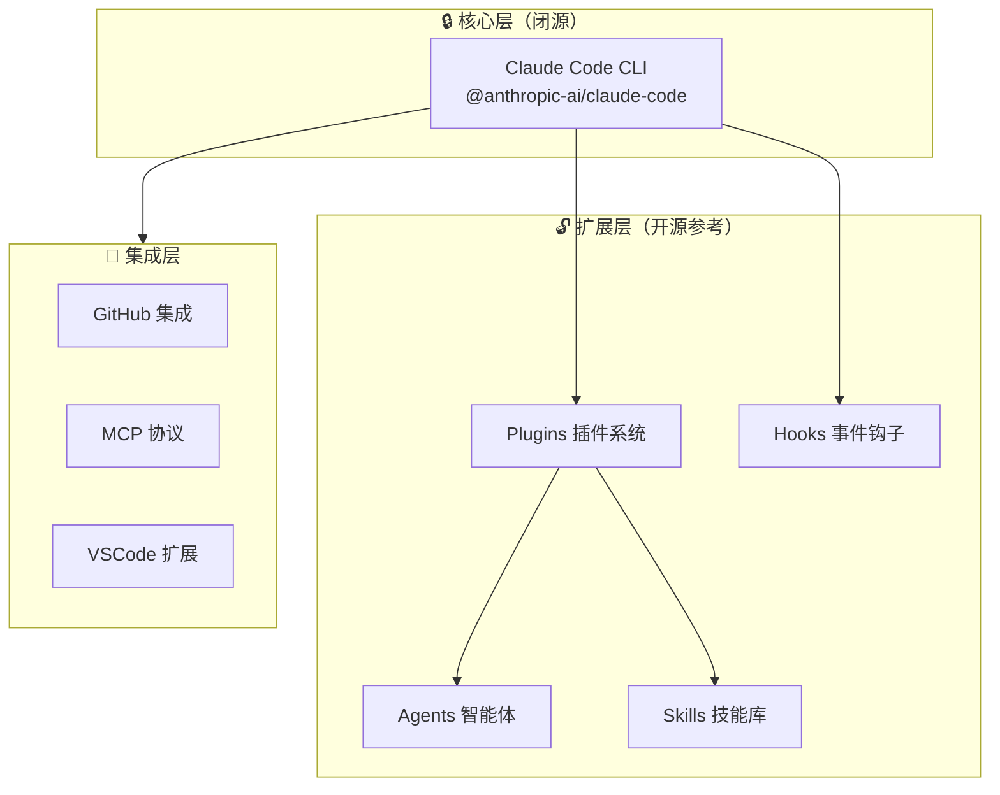
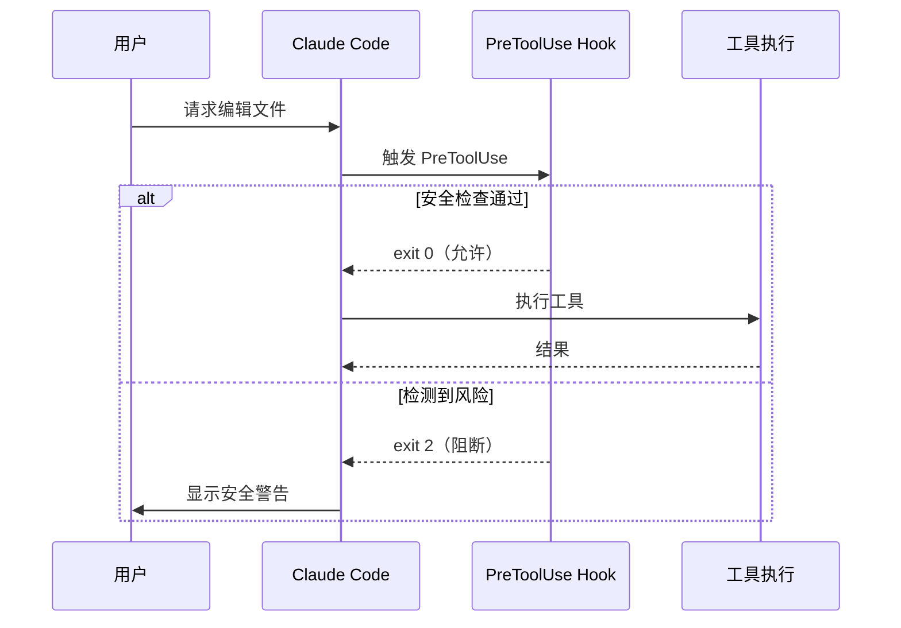
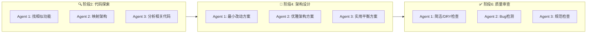
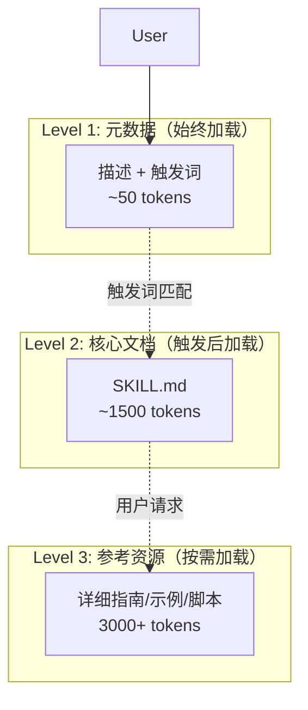

# Claude Code 研究报告

## 要点速览

| 维度 | 说明 |
|------|------|
| **定位** | Anthropic 官方出品的终端 AI 编程助手 |
| **核心形态** | CLI 工具 + 插件化扩展生态 |
| **设计哲学** | "Agentic Coding"——多智能体协作完成复杂开发任务 |
| **关键创新** | Hooks 事件系统 + 并行 Agent 编排 + 渐进式技能披露 |
| **适用场景** | 大型功能开发、代码审查、架构设计、Git 工作流自动化 |

---

## 一、项目概览

### 1.1 目录结构

```
vendors/claude-code/
├── plugins/                    # 官方插件（14个）
│   ├── feature-dev/            # 功能开发工作流（7阶段）
│   ├── plugin-dev/             # 插件开发工具包
│   ├── code-review/            # 多 Agent 代码审查
│   ├── security-guidance/      # 安全提醒 Hook
│   ├── pr-review-toolkit/      # PR 审查工具集
│   └── ...                     # 其他插件
├── examples/hooks/             # Hook 示例
├── .claude/commands/           # 内置全局命令
├── .github/workflows/          # GitHub Actions 集成
└── README.md / CHANGELOG.md    # 文档
```

### 1.2 核心定位

Claude Code 并非传统意义上的开源项目——**其核心 CLI 是闭源的商业产品**，但这个仓库完整展示了其**插件生态与扩展机制**的设计理念。



---

## 二、核心模块职责

| 模块 | 职责 | 关键技术 | 扩展点 |
|------|------|----------|--------|
| **Plugin** | 功能扩展单元，包含完整的功能集合 | `plugin.json` 元数据声明 | 新增 plugin 目录 |
| **Command** | 斜杠命令（如 `/feature-dev`） | Markdown + YAML Frontmatter | `commands/*.md` |
| **Agent** | 专用 AI 智能体，并行执行任务 | 系统提示词 + 工具集定义 | `agents/*.md` |
| **Skill** | 按需加载的领域知识 | 渐进式披露设计 | `SKILL.md` + `resources/` |
| **Hook** | 事件驱动钩子（拦截/增强行为） | `hooks.json` + 脚本 | `hooks/hooks.json` |
| **MCP** | 外部服务集成（Model Context Protocol） | stdio/SSE/HTTP 服务 | `.mcp.json` 配置 |

---

## 三、关键机制详解

### 3.1 Hooks 事件系统：安全的"守门员"

Hooks 是 Claude Code 最强大的安全与扩展机制，允许在关键操作前后插入自定义逻辑。



**支持的事件类型：**

| 事件 | 触发时机 | 典型用途 |
|------|----------|----------|
| `PreToolUse` | 工具执行前 | 命令验证、安全检查 |
| `PostToolUse` | 工具执行后 | 结果处理、日志记录 |
| `SessionStart` | 会话开始 | 环境初始化 |
| `SessionEnd` | 会话结束 | 清理工作 |
| `Stop` | 用户中断时 | 状态保存 |
| `SubagentStop` | 子 Agent 结束时 | 结果聚合 |

**示例：security-guidance 插件的 Hook 配置**

```json
{
  "hooks": {
    "PreToolUse": [
      {
        "hooks": [
          {
            "type": "command",
            "command": "python3 ${CLAUDE_PLUGIN_ROOT}/hooks/security_reminder_hook.py"
          }
        ],
        "matcher": "Edit|Write|MultiEdit"
      }
    ]
  }
}
```

该 Hook 监控 9 类安全风险：`eval()`、XSS、`child_process.exec`、GitHub Actions 注入等。

### 3.2 Agent 编排：多智能体并行协作

Claude Code 的核心创新是**多 Agent 并行工作流**，而非单一大模型对话。



**Agent 定义示例（code-explorer）：**

```yaml
---
name: code-explorer
description: 深度分析代码库功能，追踪执行路径...
tools: Glob, Grep, Read, BashOutput
model: sonnet
color: yellow
---

You are an expert code analyst specializing in tracing...
```

**关键设计取舍：**
- **并行优于串行**：3 个 Agent 同时探索，用计算换时间
- **专用优于通用**：每个 Agent 有明确单一职责
- **置信度过滤**：Agent 报告需 ≥80 置信度才被采纳（减少误报）

### 3.3 Skill 渐进式披露：精准的上下文管理

Skills 解决大模型编程助手的核心问题——**上下文窗口限制**。



**设计原则：**
1. **强触发词**：如 "create a hook" 精确匹配，避免误加载
2. **第三人称描述**："This skill should be used when..."
3. **祈使/不定式语气**："Create a plugin" 而非 "How to create"

### 3.4 7 阶段功能开发工作流

`/feature-dev` 命令展示了完整的结构化开发流程：

| 阶段 | 目标 | 关键动作 | 是否需用户确认 |
|------|------|----------|----------------|
| 1 | 需求澄清 | 询问问题背景、约束 | ✅ |
| 2 | 代码探索 | 并行启动 2-3 个 code-explorer | ❌ |
| 3 | 补充问题 | 确认边界情况、兼容性 | ✅ |
| 4 | 架构设计 | 并行生成 3 种方案对比 | ✅ |
| 5 | 编码实现 | 按选定方案执行 | ✅ |
| 6 | 质量审查 | 并行 code-reviewer 检查 | ✅ |
| 7 | 完成总结 | 文档化、建议后续步骤 | ❌ |

**设计思想：**
- **渐进承诺**：每阶段都可能有确认点，避免方向偏差
- **人类在环**：关键决策点必须人工批准，AI 不擅自做主
- **可审计**：每个阶段产出清晰，便于回溯

---

## 四、典型用法示例

### 4.1 最小可用：基础命令

```bash
# 启动 Claude Code
claude

# 使用功能开发工作流
/feature-dev 添加用户认证功能

# 手动调用 Agent
"启动 code-explorer 分析登录流程"
```

### 4.2 扩展点：创建自定义 Hook

```bash
# 1. 创建插件目录结构
my-plugin/
├── .claude-plugin/
│   └── plugin.json
└── hooks/
    ├── hooks.json
    └── validate-commit.sh

# 2. 配置 Hook（hooks.json）
{
  "hooks": {
    "PreToolUse": [{
      "hooks": [{"type": "command", "command": "./validate-commit.sh"}],
      "matcher": "Bash"
    }]
  }
}
```

### 4.3 典型调用路径：安全拦截

```
用户输入 → PreToolUse Hook → 安全扫描 →
├─ 风险检测 → 阻断 + 警告
└─ 安全通过 → 执行工具 → PostToolUse
```

---

## 五、设计哲学与取舍

### 5.1 与同类工具对比

| 维度 | Claude Code | GitHub Copilot | Cursor | Continue |
|------|-------------|----------------|--------|----------|
| **交互模式** | 终端对话 + 命令 | IDE 内联补全 | IDE 深度集成 | IDE 插件 |
| **Agent 能力** | ⭐⭐⭐ 多 Agent 并行 | ⭐ 单 Agent | ⭐⭐ Agent 序列 | ⭐⭐ Agent 序列 |
| **扩展性** | ⭐⭐⭐ 插件系统 | ⭐ 有限 | ⭐⭐ MCP 支持 | ⭐⭐⭐ 开源可定制 |
| **上下文控制** | ⭐⭐⭐ 精准披露 | ⭐ 自动管理 | ⭐⭐ 可调整 | ⭐⭐ 手动控制 |
| **适用场景** | 复杂任务/工作流 | 日常编码辅助 | 项目级开发 | 自定义工作流 |

### 5.2 核心取舍

| 取舍 | 选择 | 原因 |
|------|------|------|
| 闭源核心 vs 开源生态 | 核心闭源 + 插件开源 | 保护商业产品，同时建立生态 |
| 多 Agent 并行 vs 单 Agent | 多 Agent 并行 | 复杂任务需要专业分工 |
| 渐进披露 vs 全量上下文 | 渐进披露 | 大模型上下文有限，需精准控制 |
| 人工确认 vs 全自动 | 关键节点人工确认 | 高风险操作需人类把关 |

---

## 六、落地建议

### 6.1 适用场景

✅ **推荐使用：**
- 大型功能开发（涉及多文件修改）
- 代码库探索与架构理解
- 规范化代码审查流程
- Git 工作流自动化

❌ **不适用：**
- 单行 Bug 修复
- 紧急热修复
- 简单、明确定义的小任务

### 6.2 团队接入建议

1. **从单个插件开始**：先试用 `feature-dev` 熟悉 7 阶段工作流
2. **建立团队规范**：编写团队的 `CLAUDE.md` 规范文件
3. **定制安全 Hook**：基于 `security-guidance` 扩展团队安全规则
4. **开发内部插件**：将重复工作流封装为团队专用插件

### 6.3 学习路径

```
第1周：熟悉基础命令（/feature-dev, /commit）
第2周：阅读官方插件源码（feature-dev, code-review）
第3周：编写第一个自定义 Hook
第4周：开发完整插件并内部发布
```

---

## 七、关键文件索引

| 文件 | 用途 |
|------|------|
| `plugins/feature-dev/agents/*.md` | Agent 定义模板 |
| `plugins/security-guidance/hooks/*.py` | Hook 实现示例 |
| `plugins/plugin-dev/skills/*/SKILL.md` | Skill 设计规范 |
| `examples/hooks/` | 入门 Hook 示例 |

---

## 结论

Claude Code 代表了**AI 辅助编程的下一形态**——从"智能补全"进化到"多 Agent 协作工作流"。其核心价值不在于单一代码生成能力，而在于：

1. **结构化流程**：将软件开发的最佳实践（探索→设计→实现→审查）编码为可复用工作流
2. **安全优先**：Hooks 机制提供了生产环境必需的拦截与校验能力
3. **精准上下文**：Skill 的渐进披露解决了大模型"上下文爆炸"问题

对于希望系统性提升团队开发效率的组织，Claude Code 的插件架构提供了一个**可定制、可审计、可扩展**的 AI 编程基础设施。

---

*报告生成时间：2026-02-02*
*基于 Claude Code v2.1.29 版本分析*
