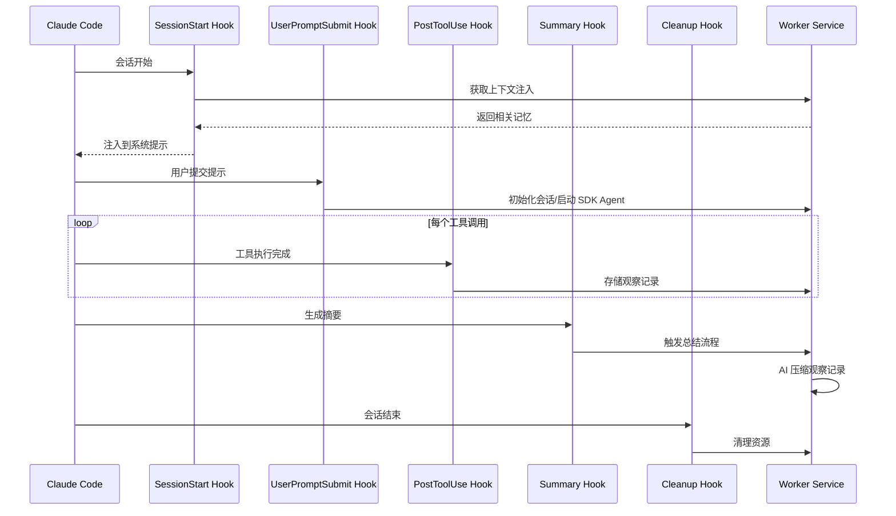
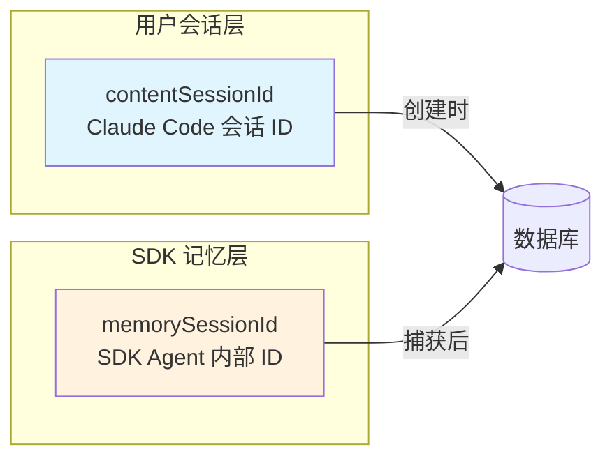
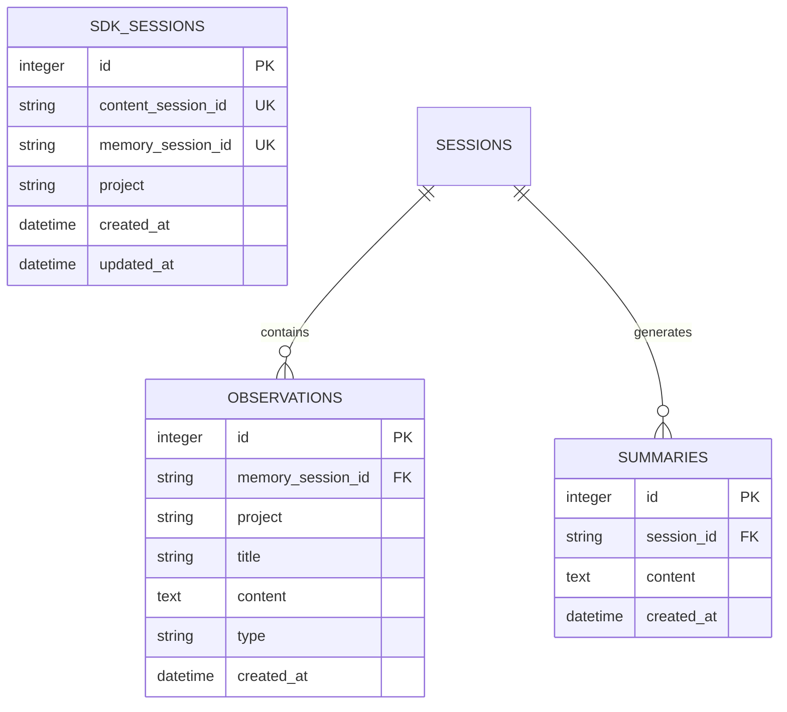
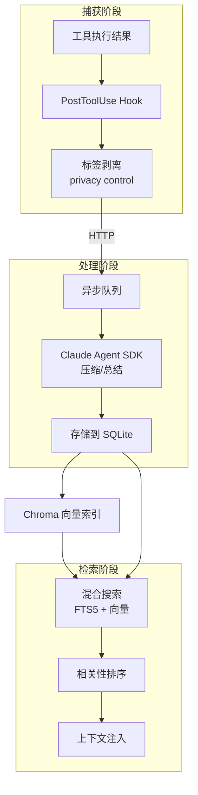
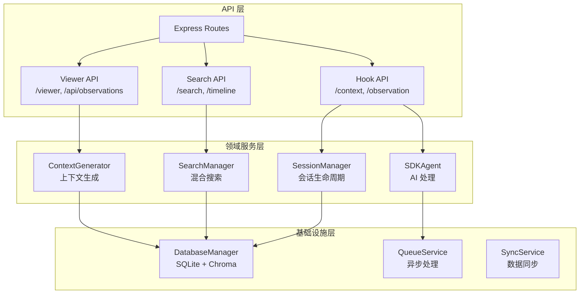
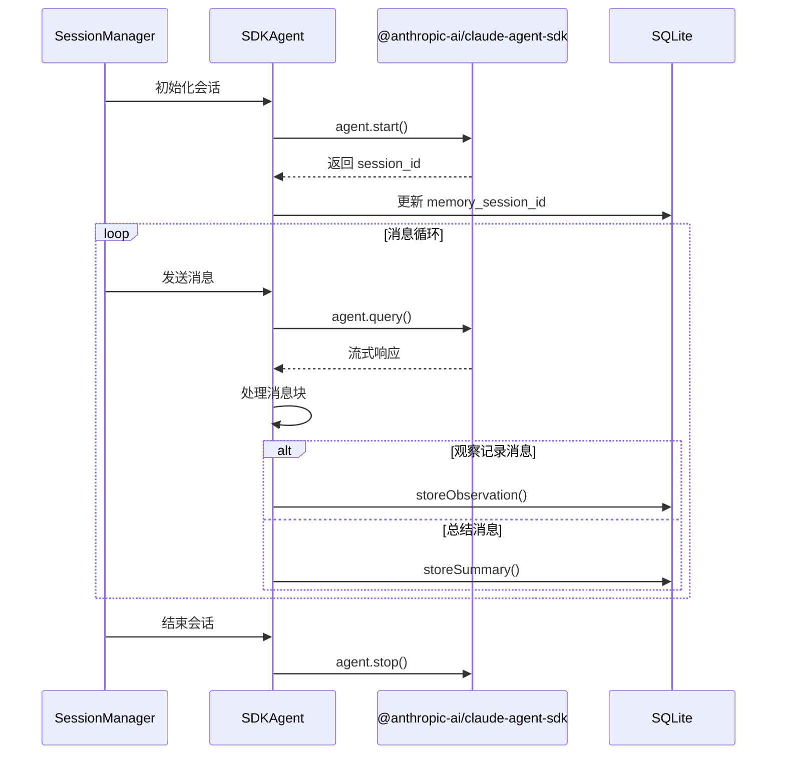
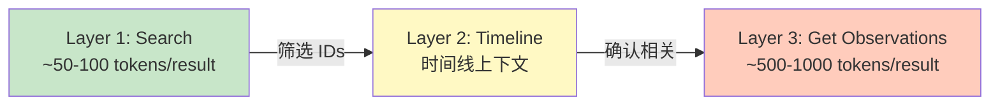
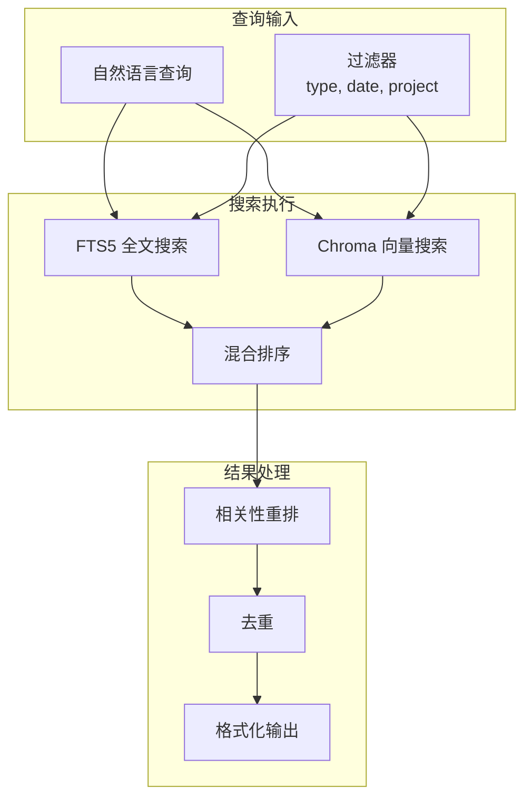
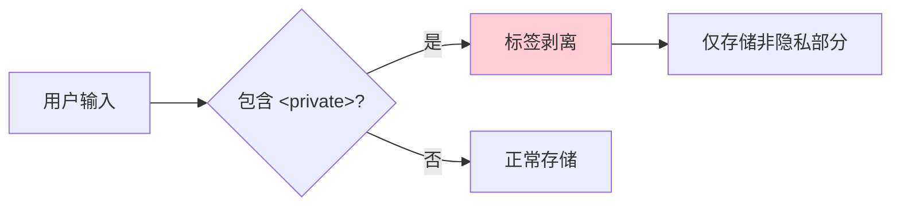
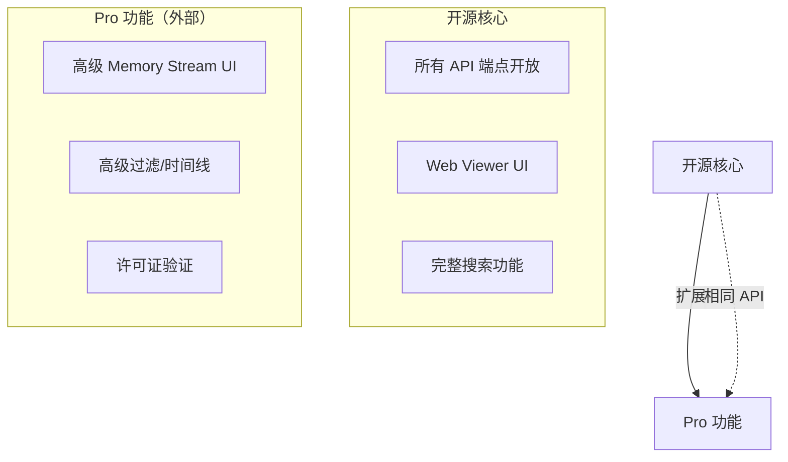

# Claude-Mem 源码分析报告

## 项目概述

**Claude-Mem** 是一个为 Claude Code 设计的持久化记忆压缩系统，由 Alex Newman (@thedotmack) 开发。它通过自动捕获工具使用观察记录、生成语义摘要，并在新会话中注入相关上下文，解决了 Claude Code 会话间上下文丢失的问题。

| 属性 | 信息 |
|------|------|
| **版本** | 9.0.12 |
| **许可证** | AGPL-3.0 |
| **技术栈** | TypeScript, Node.js, Bun, SQLite, Chroma |
| **GitHub** | https://github.com/thedotmack/claude-mem |

---

## 核心架构

### 1. 系统组件全景

```mermaid
flowchart TB
    subgraph "Claude Code 会话层"
        CC[Claude Code CLI]
        HOOKS[生命周期 Hooks]
    end

    subgraph "Claude-Mem 核心"
        WORKER[Worker Service<br/>localhost:37777]
        SQLITE[(SQLite 数据库)]
        CHROMA[(Chroma 向量库)]
        SDK[@anthropic-ai/claude-agent-sdk]
    end

    subgraph "用户界面"
        VIEWER[Web Viewer<br/>React UI]
        MCP[MCP Search Tools]
    end

    CC -->|触发| HOOKS
    HOOKS -->|HTTP API| WORKER
    WORKER -->|存储| SQLITE
    WORKER -->|向量索引| CHROMA
    WORKER -->|AI 处理| SDK
    WORKER -->|提供数据| VIEWER
    WORKER -->|提供接口| MCP
```

### 2. 生命周期 Hooks 架构

Claude-Mem 通过 **5 个生命周期 Hooks** 与 Claude Code 集成：



**Hook 详细职责：**

| Hook | 职责 | 关键操作 |
|------|------|----------|
| **SessionStart** | 上下文注入 | 从数据库检索相关记忆，注入新会话 |
| **UserPromptSubmit** | 会话初始化 | 创建 SDK 会话，启动 SDK Agent |
| **PostToolUse** | 观察捕获 | 捕获工具使用结果，发送到 Worker |
| **Summary** | 记忆压缩 | 触发 AI 总结，生成会话摘要 |
| **SessionEnd** | 资源清理 | 清理临时资源，确保数据持久化 |

---

## 数据流与存储架构

### 1. 双 Session ID 机制

Claude-Mem 使用两个不同的 Session ID 来跟踪会话：



**关键设计原则：**

- `contentSessionId`: 用户的 Claude Code 会话 ID，保持不变
- `memorySessionId`: SDK Agent 的内部会话 ID，首次消息到达后捕获
- **观察记录使用 `contentSessionId` 存储**，确保跨会话可检索
- **Resume 功能仅使用 `memorySessionId`**，避免混淆

### 2. 数据库存储架构



### 3. 观察记录生命周期



---

## Worker Service 架构

### 1. 服务分层设计

Worker Service 采用**领域驱动架构**，端口 37777：



### 2. SDK Agent 事件驱动架构



---

## 搜索架构

### 1. 三层渐进式披露

Claude-Mem 实现了 Token 效率优化的三层搜索工作流：



**Token 节省策略：**

1. **Search**: 返回紧凑的索引（ID + 标题 + 元数据）
2. **Timeline**: 获取特定观察记录周围的时间线上下文
3. **Get Observations**: 仅对筛选后的 ID 获取完整详情

**节省比例：约 10 倍**（相比一次性获取所有详情）

### 2. 混合搜索实现



---

## 隐私控制机制

### 1. 隐私标签系统



**实现位置：** Hook 层（边缘处理），在数据到达 Worker/数据库之前执行

**标签格式：**
```xml
<private>敏感内容不会被存储</private>
正常内容会被存储
```

---

## 技术亮点

### 1. 架构设计优势

| 特性 | 实现 | 价值 |
|------|------|------|
| **渐进式披露** | 三层搜索工作流 | Token 成本降低 90% |
| **双 Session ID** | content + memory 分离 | 支持 Resume 功能，避免 ID 混淆 |
| **边缘处理** | Hook 层标签剥离 | 隐私数据不进入系统 |
| **异步队列** | 观察记录异步处理 | 不阻塞 Claude Code 主流程 |
| **混合搜索** | FTS5 + Chroma 向量 | 语义 + 关键词双重检索 |

### 2. 工程实践

- **TypeScript 严格类型**：完整的类型定义覆盖
- **数据库迁移系统**：版本化的 Schema 迁移
- **事件驱动架构**：SessionManager 和 SDKAgent 使用事件模式
- **错误处理策略**：明确的退出码约定（0=成功，1=非阻塞错误，2=阻塞错误）
- **自动依赖管理**：Bun 和 uv 自动安装

### 3. 扩展性设计



**设计哲学**：Pro 功能通过相同 API 扩展，不修改核心端点，保证开源完整性

---

## 文件结构

```
vendors/claude-mem/
├── src/                          # 源代码
│   ├── hooks/                    # Claude Code Hooks（TypeScript）
│   ├── services/                 # 核心服务
│   │   ├── worker/               # Worker Service 领域服务
│   │   ├── sqlite/               # SQLite 数据库层
│   │   ├── sync/                 # Chroma 同步
│   │   └── server/               # HTTP API 路由
│   ├── types/                    # TypeScript 类型定义
│   ├── ui/                       # React UI 组件
│   └── utils/                    # 工具函数
├── plugin/                       # 构建后的插件
│   ├── hooks/                    # 编译后的 Hook 脚本
│   ├── skills/                   # Claude Skills
│   ├── ui/                       # 构建后的 UI
│   └── scripts/                  # Worker 管理脚本
├── docs/                         # 文档
├── tests/                        # 测试套件
└── scripts/                      # 构建和工具脚本
```

---

## 总结

Claude-Mem 是一个设计精良的 Claude Code 插件，通过以下核心机制实现持久化记忆：

1. **Hook 系统**：5 个生命周期钩子无缝集成 Claude Code
2. **Worker Service**：Express API 服务，协调所有后台处理
3. **双存储系统**：SQLite 持久化 + Chroma 向量索引
4. **AI 压缩**：使用 Claude Agent SDK 自动总结观察记录
5. **Token 优化**：三层渐进式披露搜索，降低 90% Token 成本

项目采用 AGPL-3.0 开源协议，架构上保持核心功能开源，通过 Pro 功能实现可持续开发，是一个值得学习的 AI 工具插件架构范例。
