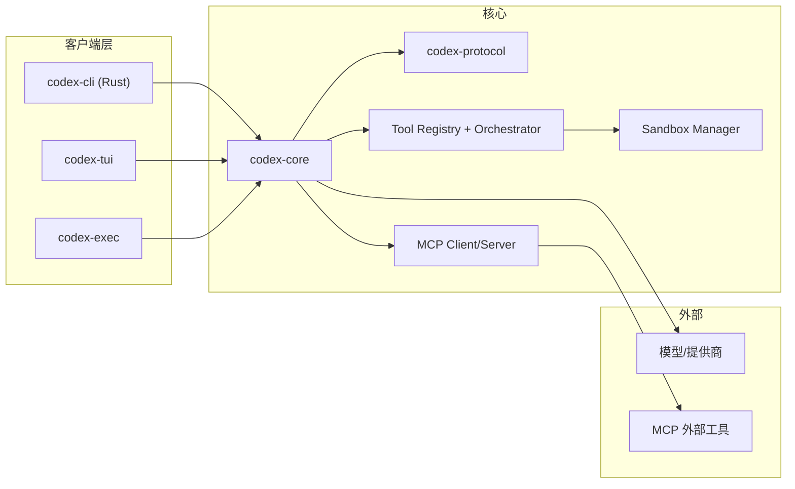

# Codex 研究报告（基于仓库源码）

> 面向开发者的设计思想与架构取舍解读，按“总-分”结构组织。

---

## 要点速览

- **核心定位**：以 Rust 为主的本地 Codex CLI/核心引擎（`codex-rs`），另保留 legacy TS CLI（`codex-cli`）。
- **关键取舍**：将“核心逻辑（codex-core）/协议（codex-protocol）/UI（codex-tui）/执行（codex-exec）”拆分，提高复用性，但引入多 crate 协作复杂度。
- **扩展主线**：工具系统（Tool Registry + Orchestrator）+ MCP 客户端/服务端 + 配置分层。

---

# 一、概览（目录 / 边界 / 设计目标）

## 目录结构概览（精简树）

```text
codex/
├─ codex-rs/                 # Rust 实现（主线）
│  ├─ core/                  # codex-core：业务逻辑
│  ├─ cli/                   # codex CLI 多子命令入口
│  ├─ tui/                   # 交互式终端 UI
│  ├─ exec/                  # 非交互（批处理/CI）
│  ├─ protocol/              # 协议与类型定义
│  ├─ mcp-server/            # Codex 作为 MCP 服务器
│  └─ ...（工具/沙箱/模型/安全等）
├─ codex-cli/                # legacy TS CLI（已被 Rust CLI 取代）
├─ shell-tool-mcp/           # shell 工具 MCP 服务器（独立 Node 包）
├─ docs/                     # 文档
└─ sdk/                      # SDK
```

## 项目边界

- **主线产品**：`codex-rs`（Rust CLI 与核心能力）。  
- **legacy**：`codex-cli` 仅保留旧实现，维护优先级低。  
- **独立扩展**：`shell-tool-mcp` 作为 MCP 服务器提供更强 shell 沙箱能力。

## 设计目标与取舍（通俗版）

- **目标 1：核心可复用**  
  `codex-core` 只做“业务能力”，UI/CLI 只是壳。  
  **取舍**：多 crate 设计更清晰，但跨模块理解成本更高。

- **目标 2：安全可控的自动化**  
  工具执行进入沙箱、审批与策略系统。  
  **取舍**：安全性提高，但引入审批/权限流程的复杂度。

- **目标 3：协议统一**  
  用 `codex-protocol` 统一 core 与 UI/exec 的事件类型。  
  **取舍**：协议稳定性重要，迭代成本更高。

---

# 二、核心架构图（Mermaid）

用途：**展示“CLI/UI/Exec → Core → Tools/Sandbox/Model/MCP”主通路**



---

# 三、核心模块职责表（必须项）

| 模块（路径） | 职责 | 关键依赖 | 扩展点 |
|---|---|---|---|
| `codex-rs/core` | 业务逻辑核心（会话、工具、模型、审批、沙箱） | `codex-protocol` | 新工具/新模型 |
| `codex-rs/cli` | CLI 多子命令入口 | clap | 新子命令 |
| `codex-rs/tui` | 终端 UI | ratatui | 视图/交互 |
| `codex-rs/exec` | 非交互执行（CI/脚本） | `codex-core` | 输出格式 |
| `codex-rs/protocol` | 事件/类型协议 | 最小依赖 | 类型扩展 |
| `codex-rs/mcp-server` | Codex 作为 MCP 服务器 | MCP SDK | 新工具映射 |
| `shell-tool-mcp` | 独立 MCP shell 工具服务器 | Node | 规则/策略 |
| `codex-cli` | legacy TS CLI | Node | 基本维护 |

---

# 四、关键机制/模块拆解（设计思想 + 取舍）

## 1) codex-core：业务逻辑中心

- `codex-rs/core/src/lib.rs` 将核心功能聚合导出：会话、工具、模型、沙箱、权限、MCP 等。
- **思想**：UI/CLI 只负责输入输出，核心统一调度。  
- **取舍**：模块清晰，但理解入口更多。

## 2) 工具系统 + 审批/沙箱编排

- `tools/registry.rs` 负责工具注册与调用分发。  
- `tools/orchestrator.rs` 负责“审批 → 沙箱选择 → 执行 → 失败升级”。  
- **思想**：安全机制统一放在 orchestrator，工具实现只关心逻辑。  
- **取舍**：工具调用链更长，但安全/体验可控。

## 3) 会话/线程管理与事件流

- `codex.rs` 提供高层 `Codex` 结构体，作为“提交请求/接收事件”的管道。  
- 线程/会话相关逻辑散在 `thread_manager`、`rollout` 等模块。  
- **思想**：事件驱动与流式输出易于 UI/CLI 复用。  
- **取舍**：事件类型和状态机复杂。

## 4) 配置分层加载

- `config_loader/README.md` 明确多层配置来源（用户/系统/管理/CLI overrides）。  
- **思想**：配置来源可追溯、适合企业管控。  
- **取舍**：加载与合并逻辑复杂。

## 5) 统一协议（codex-protocol）

- `protocol/README.md` 强调该 crate 只保留“类型与协议”，避免业务逻辑。  
- **思想**：稳定类型层，让 UI/CLI/Server 可以共享。  
- **取舍**：协议更新成本高，但可维护性更好。

## 6) MCP 生态

- `codex-rs/mcp-server` 允许 Codex 作为 MCP Server。  
- `shell-tool-mcp` 提供更严格的 shell 执行控制（拦截 execve）。  
- **思想**：通过 MCP 扩展工具生态、隔离执行风险。  
- **取舍**：需要管理 MCP 版本与兼容性。

---

# 五、典型用法 / 示例（2-3 段）

## 示例 1：最小可用（交互式）

```bash
codex
```

## 示例 2：非交互执行（批处理/CI）

```bash
codex exec "请总结当前仓库架构并输出要点"
```

## 示例 3：启用 MCP shell 工具（配置片段）

```toml
[features]
shell_tool = false

[mcp_servers.shell-tool]
command = "npx"
args = ["-y", "@openai/codex-shell-tool-mcp"]
```

---

# 六、术语解释

- **MCP**：Model Context Protocol，用于统一外部工具接入。  
- **Tool Orchestrator**：工具执行调度器，负责审批与沙箱。  
- **Protocol crate**：只定义类型与事件结构的“中立层”。

---

# 七、同类库对比维度（帮助理解取舍）

- **架构形态**：单体 CLI vs Core + UI/Exec 分层  
- **安全体系**：无沙箱 vs 统一审批+沙箱  
- **扩展能力**：内置工具 vs MCP + 插件  
- **协议抽象**：弱类型 vs 独立协议 crate  

---

# 八、结论与建议（必须落地）

**结论**：  
Codex 的设计重点在“核心能力可复用 + 安全可控执行 + 协议统一”。它不是简单 CLI，而是一个 **分层式的 AI 编码平台代理**。

**落地建议**：  

1. **学习路径**：先读 `codex-rs/core/src/lib.rs` → `codex.rs` → `tools/orchestrator.rs` → `protocol/README.md`。  
2. **扩展工具**：优先考虑 MCP（可插拔、隔离执行风险）。  
3. **做 UI 或集成**：复用 `codex-protocol` 事件模型，避免自定义协议。  
4. **需要自动化/CI**：直接使用 `codex exec` 作为入口。
