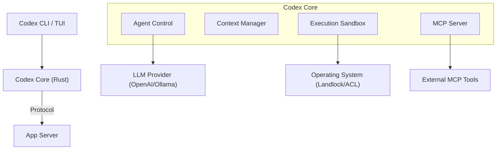

# Codex 研究报告

> **声明**：本报告基于 `codex` 源码分析，侧重于设计思想与架构取舍。

## 1. 概览

### 1.1 项目简介
**Codex** 是 OpenAI 推出的一个本地运行的 Coding Agent。与许多基于 Python 或 Node.js 的 Agent 不同，Codex 的核心逻辑采用了 **Rust** 编写，追求极致的性能、内存安全和底层系统控制能力。它提供了一个功能强大的终端用户界面 (TUI)，并支持 IDE 集成。

### 1.2 核心设计哲学
*   **Performance First (性能优先)**：核心逻辑全 Rust 实现，确保在处理大规模文件搜索、Diff 计算和沙箱执行时保持低延迟和低资源占用。
*   **Safety by Design (安全设计)**：高度重视本地执行的安全性。在 Linux 上利用 **Landlock** LSM，在 Windows 上利用复杂的 ACL 和 Token 机制，构建了非特权的安全沙箱。
*   **Local-First & Multi-Agent**：支持本地模型 (Ollama/LMStudio) 和 Multi-Agent 协作架构，允许不同职责的 Agent（如执行者、规划者）协同工作。
*   **Protocol-Oriented**：深度集成 [Model Context Protocol (MCP)](https://modelcontextprotocol.io/)，将其作为连接外部世界和扩展能力的标准方式。

### 1.3 目录结构概览 (Hybrid Monorepo)

| 目录                            | 说明                                                   |
| :---------------------------- | :--------------------------------------------------- |
| `codex-rs`                    | **Rust Workspace (核心)**。包含所有核心逻辑、Agent 实现、沙箱和 TUI。   |
| `codex-cli`                   | **Node.js Wrapper**。主要作为分发层，通过 npm 分发二进制文件。          |
| `codex-rs/core`               | **大脑**。Agent 的状态管理、思考循环、工具调度和上下文管理。                  |
| `codex-rs/tui`                | **交互**。基于 Ratatui (推测) 构建的终端界面，支持 Markdown渲染、Diff对比。 |
| `codex-rs/linux-sandbox`      | **Linux 安全**。基于 Landlock LSM 的沙箱实现。                  |
| `codex-rs/windows-sandbox-rs` | **Windows 安全**。基于 ACL/Token/Firewall 的沙箱实现。          |
| `codex-rs/mcp-server`         | **扩展能力**。MCP 协议的服务端实现。                               |

## 2. 核心架构与机制

### 2.1 架构总览：Rust 驱动的系统级 Agent

Codex 的架构明显区别于脚本语言编写的 Agent，它更像是一个系统级服务。

### 2.2 思考与执行：Actor 模型与事件驱动

`AgentControl` (`codex-rs/core/src/agent/control.rs`) 展示了 Codex 采用类似 Actor 模型的并发设计：
*   **Thread Manager**：管理多个 Agent 线程的生命周期。
*   **异步消息传递**：Agent 之间、UI 与 Agent 之间通过异步通道 (`async_channel`) 传递 `Op` (操作) 和 `Event` (事件)。
*   **Headless 支持**：设计上支持无头模式运行，允许 Agent 在后台独立执行任务，通过 `spawn_headless_drain` 处理事件流，防止内存泄漏。

### 2.3 安全沙箱：硬核隔离

Codex 在安全隔离上投入了巨大精力，针对不同操作系统实现了原生的隔离机制，而非仅仅依赖 Docker。

*   **Linux (Landlock)**：使用 Landlock LSM，允许非特权进程限制自身的文件系统访问权限。这是一个非常轻量且安全的现代 Linux 特性。
*   **Windows (ACL/Token)**：通过复杂的 Windows API 操作（防火墙规则、用户隐藏、受限 Token 生成、ACL 权限控制）来创建一个受限的执行环境。

### 2.4 交互体验：TUI

Codex 的 TUI (`codex-rs/tui`) 实现非常完善，不仅是简单的聊天界面，还集成了：
*   **Markdown 渲染**：支持富文本展示。
*   **Git Diff 视图**：直接在终端内审查代码变更。
*   **Slash Command**：支持 `/` 命令体系。
*   **Input History**：完善的历史记录管理。

## 3. 典型用法与扩展

### 3.1 本地模型支持

Codex 原生支持 `codex-ollama` 和 `codex-lmstudio`，这意味着用户可以完全离线运行 Agent，配合其本地沙箱，提供极致的数据隐私保护。

### 3.2 协作模式

`codex-delegate` 模块暗示了 Codex 支持将任务委托给其他 Agent。这对于处理复杂任务（如一个 Agent 负责写代码，另一个负责写测试）至关重要。

## 4. 结论与建议

### 4.1 优势
*   **系统级性能**：Rust 带来的启动速度和运行时效率远超基于 Node/Python 的竞品。
*   **极致安全**：原生沙箱实现展示了对安全的极致追求，不依赖 Docker 也能提供强隔离。
*   **架构先进**：基于 Actor 模型的多 Agent 架构和 MCP 支持，使其具备极强的扩展性和未来适应性。

### 4.2 落地建议
*   **高性能场景首选**：对于大仓库（Monorepo）的代码分析和操作，Codex 的性能优势将非常明显。
*   **安全敏感环境**：在无法使用 Docker 或需要极低权限运行的环境中，Codex 的原生沙箱提供了不可替代的价值。
*   **混合部署**：利用其 Multi-Agent 能力，可以将其作为“执行节点”，接受上层更高级的规划 Agent（可能是云端的 GPT-4）的指令。
