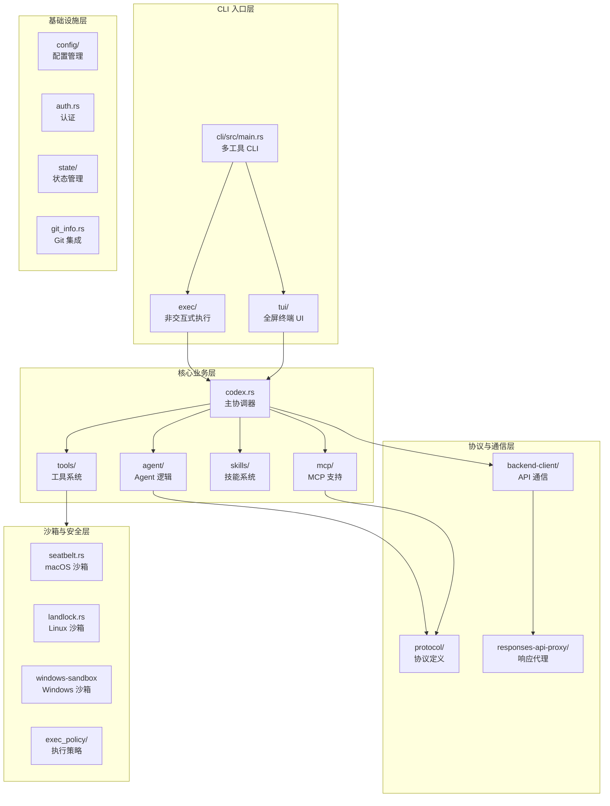
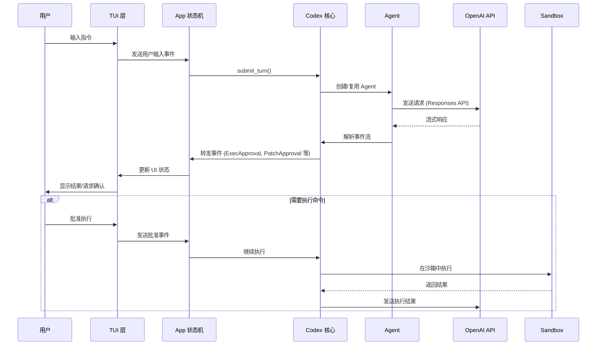
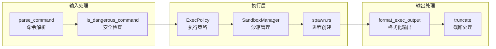
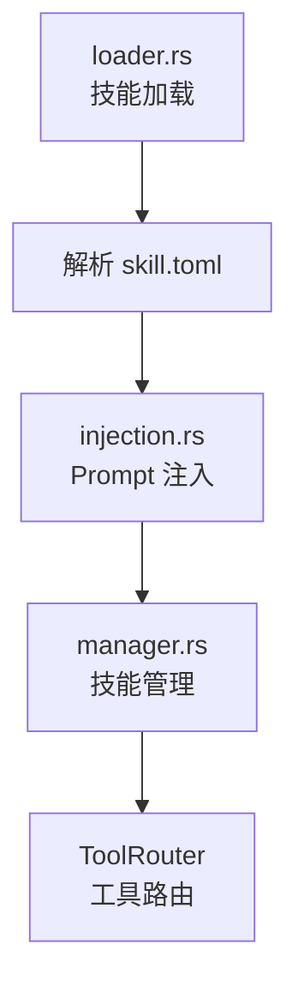

# OpenAI Codex CLI 源码分析报告

## 1. 项目概述

**Codex CLI** 是 OpenAI 推出的开源 AI 编程助手命令行工具，能够在本地终端运行，理解自然语言指令并执行代码编辑、文件操作、命令执行等任务。

### 1.1 基本信息

| 属性 | 内容 |
|------|------|
| **仓库** | https://github.com/openai/codex |
| **许可证** | Apache-2.0 |
| **技术栈** | Rust (主) + TypeScript (遗留) |
| **包管理** | Cargo (Rust) + pnpm (Node.js) |
| **构建工具** | Bazel + Cargo |

### 1.2 版本演进

- **遗留版本**: `codex-cli/` 目录下的 TypeScript 实现（已弃用）
- **当前版本**: `codex-rs/` 目录下的 Rust 实现（默认体验）

Rust 版本提供了 TS 版本不支持的新特性：MCP 支持、通知系统、`codex exec` 非交互模式、更完善的沙箱策略等。

---

## 2. 架构总览

### 2.1 整体架构图



### 2.2 模块职责

| 模块 | 职责 |
|------|------|
| `cli` | 多工具 CLI 入口，整合所有子命令 |
| `exec` | 非交互式/自动化执行模式 |
| `tui` | 基于 Ratatui 的全屏交互式终端 UI |
| `core` | 业务逻辑核心，包含 Agent、工具、技能等 |
| `protocol` | 协议类型定义，事件、请求/响应模型 |
| `backend-client` | 与 OpenAI API 的后端通信 |
| `mcp-server` | MCP 服务器实现，允许其他 Agent 调用 Codex |
| `mcp-types` | MCP 协议类型定义 |

---

## 3. 核心流程分析

### 3.1 交互式会话流程



### 3.2 工具调用流程



---

## 4. 关键技术实现

### 4.1 沙箱安全机制

Codex 实现了多平台沙箱系统，根据操作系统选择不同的隔离技术：

| 平台 | 技术 | 实现文件 |
|------|------|----------|
| macOS | Seatbelt (sandbox-exec) | `seatbelt.rs` + `seatbelt_base_policy.sbpl` |
| Linux | Landlock + seccomp | `landlock.rs`, `linux-sandbox/` |
| Windows | Restricted Token | `windows-sandbox.rs` |

沙箱策略分级：

```rust
// SandboxPolicy 枚举
danger-full-access      // 无限制（危险）
read-only               // 只读（默认）
workspace-write         // 工作区可写
external-sandbox        // 外部沙箱
```

### 4.2 MCP (Model Context Protocol) 支持

Codex 同时作为 **MCP Client** 和 **MCP Server**：

**作为 Client** (`mcp_connection_manager.rs`):
- 启动时连接配置的 MCP 服务器
- 将 MCP Tools 注册到 ToolRouter
- 支持动态工具发现和调用

**作为 Server** (`mcp-server/`):
- `codex mcp-server` 启动 stdio 传输的 MCP 服务器
- 暴露 Codex 能力给其他 Agent
- 支持 exec_approval、patch_approval 等交互

### 4.3 技能系统 (Skills)

技能是可插拔的扩展模块：



技能通过 `skill.toml` 定义：
- 名称、描述、版本
- 环境变量依赖
- 系统提示注入
- 工具声明

### 4.4 配置系统

使用 TOML 格式的分层配置：

```
~/.codex/config.toml          # 全局配置
./.codex/config.toml          # 项目级配置（可选）
环境变量                      # 运行时覆盖
-c/--config 参数              # CLI 即时覆盖
```

配置包含：模型选择、沙箱模式、MCP 服务器、通知脚本、自定义指令等。

---

## 5. 代码质量与工程实践

### 5.1 优点

1. **严格的代码规范**
   - 使用 `clippy` 进行大量 lint 检查
   - 禁止 `unwrap()` 和 `expect()`（生产代码）
   - 强制内联 format 参数

2. **模块化设计**
   - 清晰的 crate 边界
   - 协议与实现分离
   - 平台特定代码隔离

3. **测试策略**
   - Snapshot 测试 (insta)
   - 集成测试支持
   - Mock 响应服务器

4. **安全优先**
   - 默认只读沙箱
   - 危险命令检测
   - 执行前用户确认

### 5.2 可改进点

1. **代码复杂度**
   - `codex.rs` 超过 2000 行，职责过重
   - `app.rs` (TUI) 超过 1200 行
   - 建议进一步拆分子模块

2. **文档覆盖**
   - 部分内部模块缺少文档注释
   - 架构决策记录 (ADR) 缺失

3. **错误处理**
   - 错误类型较多但统一处理不够
   - 部分错误信息对用户不够友好

---

## 6. 与 Claude Code 的对比

| 维度 | Codex CLI | Claude Code |
|------|-----------|-------------|
| **开发商** | OpenAI | Anthropic |
| **技术栈** | Rust | TypeScript |
| **架构** | 模块化多 crate | 单体但分层清晰 |
| **沙箱** | 多平台原生沙箱 | 依赖系统隔离 |
| **MCP 支持** | Client + Server | Client |
| **扩展性** | Skills 系统 | 内置 Tools |
| **配置** | TOML 文件 | 交互式配置 |
| **开源程度** | 完全开源 | 部分开源 |

---

## 7. 总结

Codex CLI 是一个工程化程度很高的开源 AI 编程助手，其亮点包括：

1. **Rust 重写** 带来的性能和安全优势
2. **多平台沙箱** 实现的安全保障
3. **MCP 协议** 的率先支持，展现开放性
4. **模块化架构** 便于扩展和维护

对于希望构建类似 AI 编程助手的开发者，Codex 的以下部分值得深入研究：
- `core/src/sandboxing/` - 沙箱实现
- `core/src/mcp/` - MCP 客户端集成
- `core/src/tools/` - 工具系统设计
- `tui/` - 终端 UI 实现
