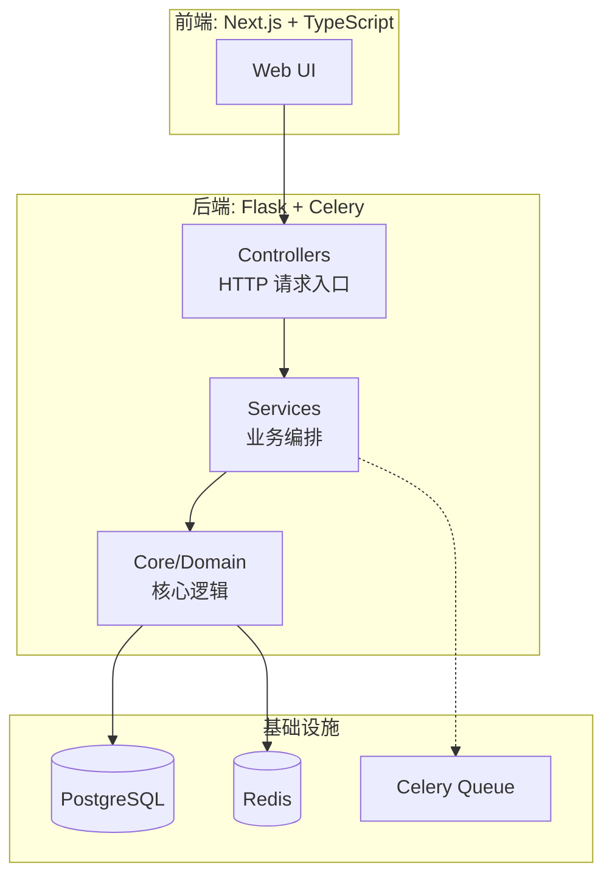
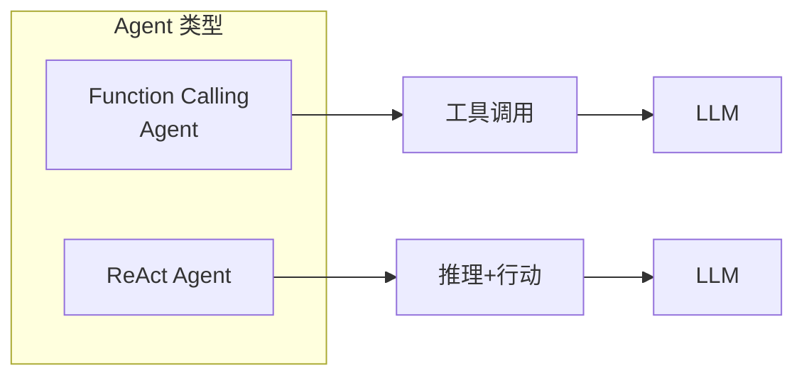
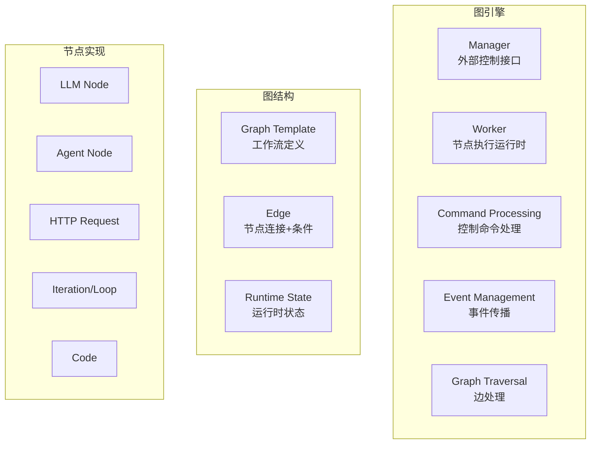
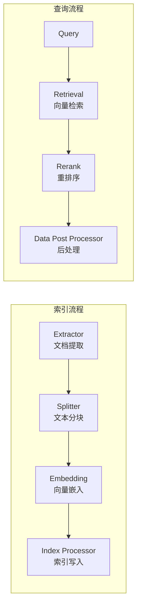
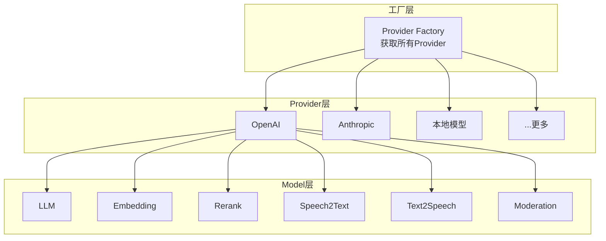
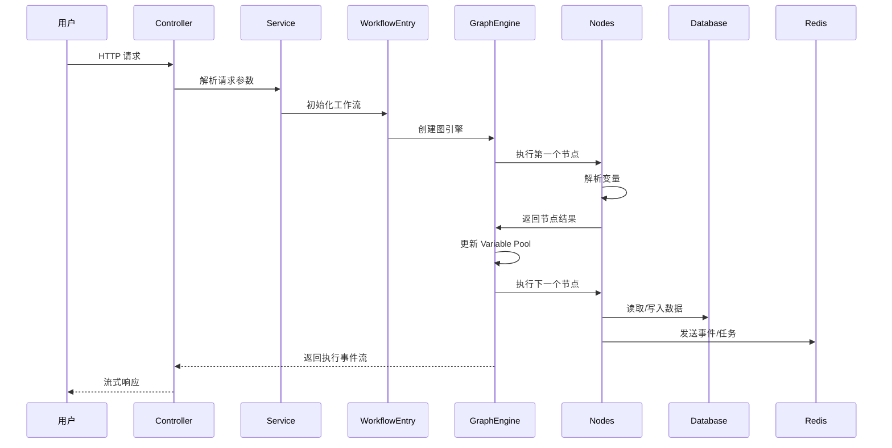
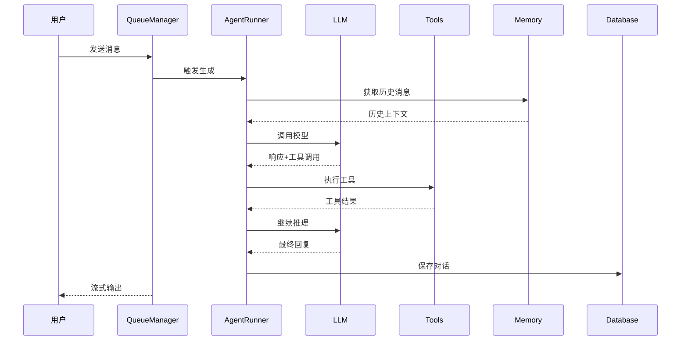

# Dify Mini 技术报告

## 1. 整体架构设计

Dify 采用典型的 DDD（领域驱动设计）+ 分层架构，整体分为三层：



**分层职责**：
- **Controllers**: 接收 HTTP 请求，使用 Pydantic 解析输入，调用 Service，返回序列化响应
- **Services**: 编排业务逻辑，协调Repositories和Providers，处理副作用
- **Core/Domain**: 包含核心业务逻辑（Agent、Workflow、RAG、Model Runtime等）

**技术栈**：
- 后端：Python 3.11+, Flask 3.1, SQLAlchemy 2.0, Celery 5.5
- 前端：Next.js + TypeScript + React
- 数据库：PostgreSQL + Redis
- 向量数据库：支持 ChromaDB、Milvus、Qdrant、Weaviate 等

---

## 2. 核心模块功能

### 2.1 Agent 模块 (`core/agent/`)

Agent 模块提供基于 LLM 的智能体能力，支持两种模式：



**核心文件**：
- `base_agent_runner.py`: Agent 基础 runner，继承自 `AppRunner`
- `fc_agent_runner.py`: Function Calling 模式的 Agent 实现
- `cot_agent_runner.py`: Chain-of-Thought 模式实现

**Agent 执行流程**：
```
用户输入 → 组织历史消息 → LLM 生成 → 解析工具调用 → 执行工具 → 循环直到完成
```

**关键设计**：
- 集成 `DifyAgentCallbackHandler` 处理 Agent 回调
- 集成 `DatasetRetrieverTool` 支持知识库检索
- 使用 `TokenBufferMemory` 管理对话上下文

---

### 2.2 Workflow 模块 (`core/workflow/`)

Workflow 是 Dify 的核心亮点，提供可视化编排能力：



**核心特性**：
- **并行执行**: 支持多节点同时运行
- **条件分支**: 根据变量值选择不同执行路径
- **循环/迭代**: 支持对集合进行遍历处理
- **外部控制**: 通过 Redis 或内存通道实现 stop/pause/resume

**关键类**：
- `WorkflowEntry`: 工作流入口，负责初始化和执行
- `GraphEngine`: 图引擎核心，协调节点执行
- `VariablePool`: 集中式变量存储，按节点 ID 隔离命名空间
- `Layer System`: 可插拔的中间件系统（调试日志、执行限制、可观测性）

---

### 2.3 RAG 模块 (`core/rag/`)

RAG 模块提供完整的检索增强生成管道：



**核心组件**：
- **Extractor** (`extractor/`): 支持 PDF、PPT、DOC 等多种格式
- **Splitter** (`splitter/`): 文本分块策略
- **Embedding** (`embedding/`): 向量嵌入模型
- **Retrieval** (`retrieval/`): 向量检索，支持多种向量数据库
- **Rerank** (`rerank/`): 重排序模型

---

### 2.4 Model Runtime 模块 (`core/model_runtime/`)

Model Runtime 提供统一的模型抽象层：



**支持的模型类型**（6种）：
1. LLM - 文本补全、对话、预计算 token
2. Text Embedding Model - 文本嵌入
3. Rerank Model - 段落重排
4. Speech-to-Text - 语音转文字
5. Text-to-Speech - 文字转语音
6. Moderation - 内容审核

**架构优势**：
- Provider 层支持横向扩展（添加新 Provider 无需修改上游代码）
- Model 层支持同一 Provider 下的多模型扩展
- 统一的凭证认证和模型列表展示

---

## 3. 数据流和执行流程

### 3.1 典型工作流执行流程



### 3.2 Agent 对话流程



---

## 4. 技术选型分析

### 4.1 优点

| 方面 | 评价 |
|------|------|
| **架构设计** | DDD 分层清晰，依赖规则通过 import-linter 强制执行 |
| **可扩展性** | Model Runtime 和 Tool 系统支持灵活的横向扩展 |
| **工作流引擎** | 图引擎设计优秀，支持并行、条件、循环等复杂逻辑 |
| **可观测性** | 集成 OpenTelemetry，支持分布式追踪 |
| **异步处理** | Celery + Redis 实现可靠的异步任务队列 |

### 4.2 潜在问题

| 方面 | 说明 |
|------|------|
| **复杂度** | 图引擎分层较多（graph_engine → graph → nodes），学习曲线较陡 |
| **性能** | 同步执行模式可能导致长尾延迟，GraphEngine 虽支持 worker pool，但需要合理配置 |
| **依赖管理** | 使用 `uv` 管理依赖，但生态中部分库版本较旧（如 some旧 pinned 版本） |
| **测试** | 集成测试仅在 CI 环境运行，本地调试成本较高 |

---

## 5. 总结

Dify 是一个功能完备的 LLM 应用开发平台，架构设计体现了工程化思维：

- **Workflow** 是最核心的差异化能力，支持可视化编排复杂 AI 流程
- **Model Runtime** 抽象层设计优秀，轻松接入新模型 Provider
- **RAG** 管道完整，从文档提取到检索全链路覆盖

适合需要快速构建 LLM 应用的团队，尤其是需要复杂工作流编排的场景。
