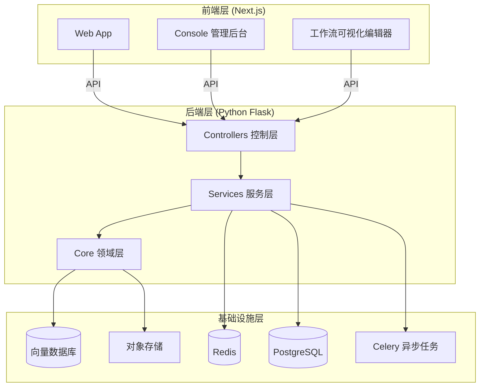
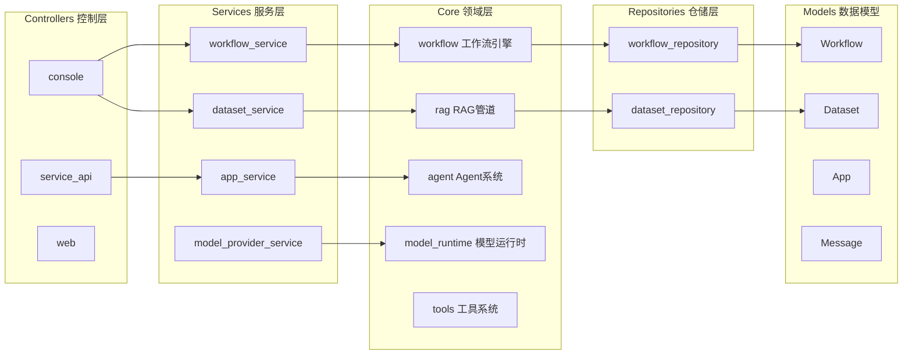
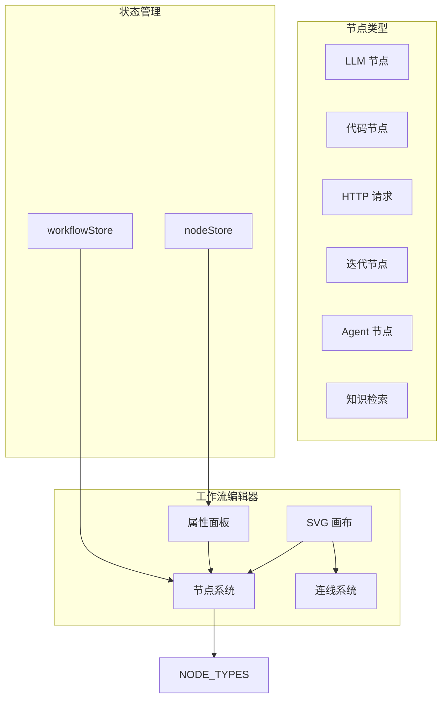
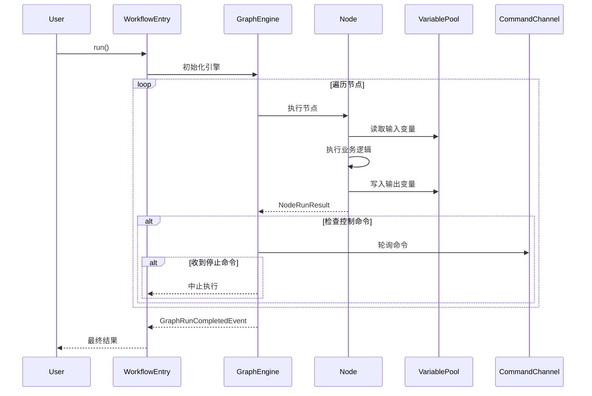
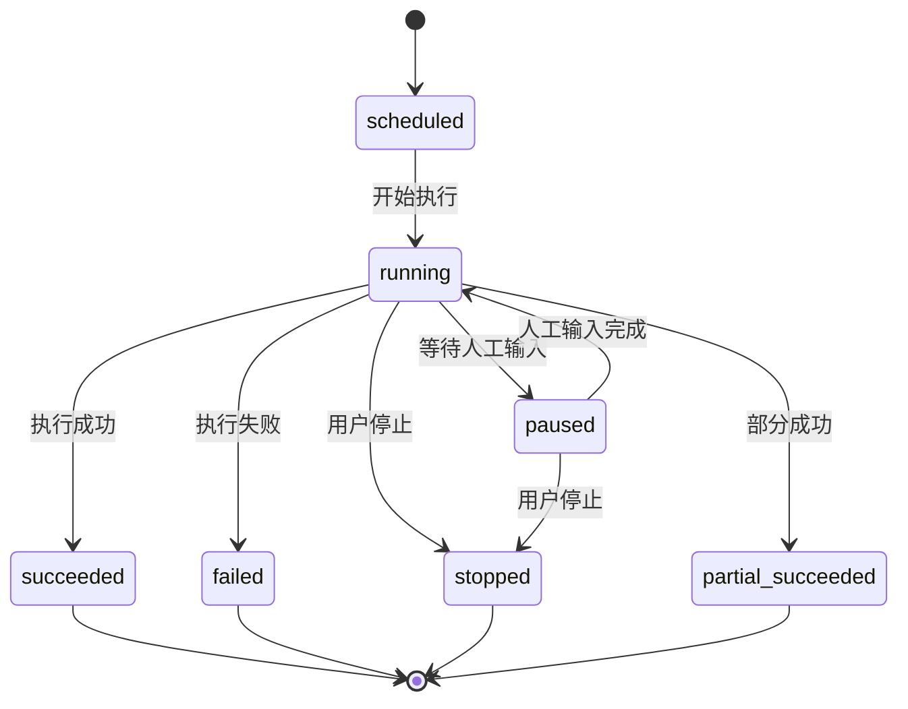
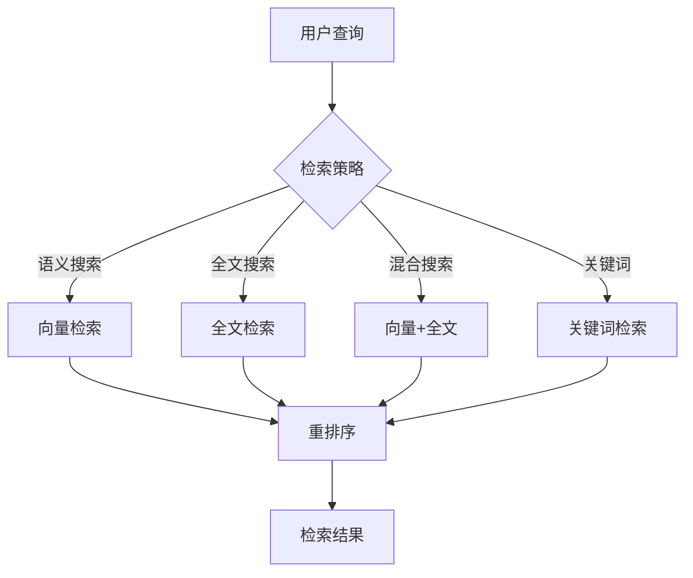
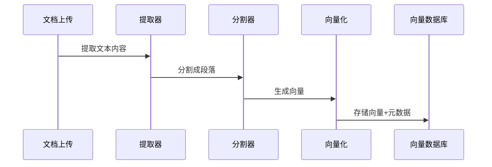
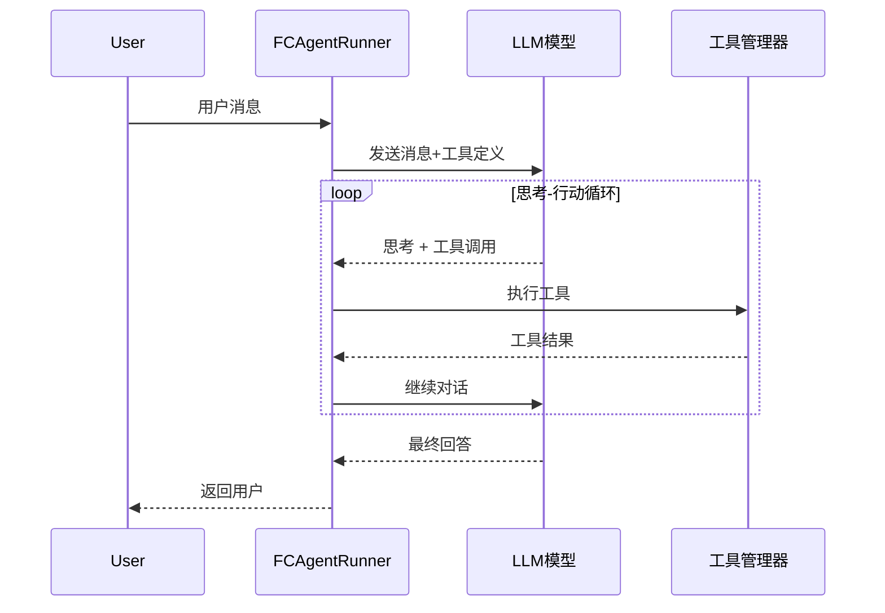
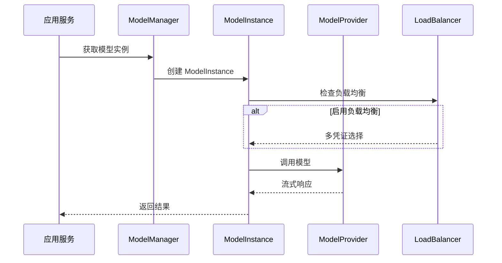

# Dify 源码分析报告

## 项目简介

Dify 是一个开源的 LLM 应用开发平台，提供了可视化的工作流编辑器、RAG 管道、Agent 能力、模型管理和可观测性功能，帮助开发者快速从原型过渡到生产环境。

**核心定位**: 一站式 AI 应用开发平台，让非技术用户也能通过可视化界面构建复杂的 AI 应用。

**项目特点**:
- 完全开源，支持私有化部署
- 可视化工作流编排
- 支持数十种 LLM 提供商
- 内置 50+ 工具的 Agent 系统
- 企业级的 RAG 能力

## 整体架构

Dify 采用典型的前后端分离架构，后端使用 Python Flask + DDD 设计，前端使用 Next.js + TypeScript。



## 后端架构

### DDD 分层设计

Dify 后端严格遵循领域驱动设计（DDD）原则，代码组织清晰：



### 目录结构

```
api/
├── controllers/          # 控制层 - 处理 HTTP 请求
│   ├── console/         # 控制台 API
│   ├── service_api/     # 服务 API
│   └── web/             # Web 应用 API
├── services/            # 服务层 - 业务逻辑编排
│   ├── workflow_service.py
│   ├── dataset_service.py
│   ├── app_service.py
│   └── model_provider_service.py
├── core/                # 领域层 - 核心业务逻辑
│   ├── workflow/        # 工作流引擎
│   ├── rag/             # RAG 管道
│   ├── agent/           # Agent 系统
│   ├── model_runtime/   # 模型运行时
│   └── tools/           # 工具系统
├── models/              # 数据模型 - SQLAlchemy ORM
│   ├── workflow.py
│   ├── dataset.py
│   └── model.py
├── repositories/        # 仓储层 - 数据访问抽象
│   └── sqlalchemy_*.py
├── tasks/               # Celery 异步任务
└── extensions/          # 扩展 - 数据库、Redis、存储
```

### 架构原则

1. **依赖方向**: Controller → Service → Core → Model
2. **领域隔离**: 领域模型不依赖基础设施层
3. **租户感知**: `tenant_id` 贯穿所有层级
4. **异步任务**: 通过 Celery + Redis 处理长时间运行的任务

## 前端架构

### 技术栈

- **框架**: Next.js 14 (App Router)
- **语言**: TypeScript (严格模式)
- **状态管理**: TanStack Query + Zustand
- **样式**: Tailwind CSS
- **组件库**: 自研组件系统 (`app/components/base/`)
- **图形**: SVG.js (工作流画布)
- **国际化**: 自研 i18n 系统

### 目录结构

```
web/
├── app/
│   ├── components/
│   │   ├── app/           # 应用组件
│   │   ├── base/          # 基础组件库
│   │   ├── workflow/      # 工作流编辑器
│   │   ├── datasets/      # 数据集管理
│   │   └── tools/         # 工具管理
│   ├── (commonLayout)/    # 通用布局
│   ├── (shareLayout)/     # 分享布局
│   └── services/          # API 服务层
├── i18n/                  # 国际化资源
├── hooks/                 # 自定义 Hooks
├── types/                 # TypeScript 类型定义
├── utils/                 # 工具函数
└── context/               # React Context
```

### 工作流编辑器架构

工作流编辑器是 Dify 前端的核心组件，实现了完整的可视化编排能力：



## 核心功能深度分析

### Workflow 工作流引擎

工作流引擎是 Dify 的核心，采用**队列化分布式执行架构**。

#### 核心组件

```
core/workflow/
├── graph_engine/          # 图执行引擎
│   ├── orchestration/     # 编排逻辑
│   ├── command_processing/ # 命令处理
│   ├── event_management/  # 事件管理
│   └── graph_traversal/   # 图遍历
├── graph/                 # 图结构定义
│   ├── graph.py          # 图模板
│   └── edge.py           # 边定义
├── nodes/                 # 节点实现
│   ├── llm/              # LLM 节点
│   ├── code/             # 代码执行
│   ├── agent/            # Agent 节点
│   ├── iteration/        # 迭代节点
│   └── ...
├── runtime/               # 运行时状态
│   ├── variable_pool.py  # 变量池
│   └── graph_runtime_state.py
└── enums.py               # 枚举定义
```

#### 工作流执行流程



#### 节点系统架构

所有节点继承自 `Node` 基类，实现 `_run()` 方法：

```python
# 节点类型映射
NODE_TYPE_CLASSES_MAPPING: Mapping[NodeType, type[Node]] = {
    NodeType.START: StartNode,
    NodeType.END: EndNode,
    NodeType.LLM: LLMNode,
    NodeType.CODE: CodeNode,
    NodeType.AGENT: AgentNode,
    NodeType.IF_ELSE: IfElseNode,
    NodeType.ITERATION: IterationNode,
    # ... 更多节点类型
}
```

#### 工作流状态机



### RAG 检索增强生成

Dify 的 RAG 系统提供了完整的文档处理、向量化和检索能力。

#### RAG 管道架构

```
core/rag/
├── extractor/            # 文档提取器
│   ├── text/
│   ├── pdf/
│   ├── docx/
│   └── ...
├── splitter/             # 文档分割器
├── embedding/            # 向量化
├── datasource/           # 数据源
│   ├── vdb/             # 向量数据库
│   └── keyword/         # 关键词检索
├── retrieval/            # 检索方法
├── rerank/               # 重排序
└── pipeline/             # RAG 管道
```

#### 检索方法



#### 索引处理流程



### Agent 智能体

Dify 支持两种 Agent 实现模式：

```
core/agent/
├── base_agent_runner.py      # 基础 Agent 运行器
├── fc_agent_runner.py        # Function Calling 模式
├── cot_agent_runner.py       # ReAct/CoT 模式
└── strategy/                 # 策略实现
```

#### Function Calling 模式



#### 工具系统架构

```
core/tools/
├── __base/
│   ├── tool.py              # 工具基类
│   └── tool_runtime.py      # 运行时
├── builtin/                 # 内置工具
│   ├── search/              # 搜索工具
│   ├── image_gen/           # 图像生成
│   └── ...
├── custom/                  # 自定义工具
└── tool_manager.py          # 工具管理器
```

### 模型管理层

Dify 实现了统一的多模型提供商抽象层，支持数十种 LLM、Embedding、Rerank 模型。

#### 模型提供者架构

```
core/model_runtime/
├── model_providers/
│   ├── __base/              # 基类定义
│   │   ├── large_language_model.py
│   │   ├── text_embedding_model.py
│   │   └── rerank_model.py
│   ├── openai/              # OpenAI
│   ├── anthropic/           # Anthropic
│   ├── azure_openai/        # Azure OpenAI
│   └── ...                  # 更多提供商
└── entities/                # 实体定义
```

#### 模型调用流程



#### 模型特性支持

- **流式输出**: 所有 LLM 节点支持流式响应
- **多模态**: 支持图像输入/输出
- **结构化输出**: 支持 JSON Schema 约束
- **工具调用**: 原生支持 Function Calling
- **负载均衡**: 支持多凭证负载均衡

## 技术栈

### 后端技术栈

| 类别 | 技术 |
|------|------|
| 框架 | Flask 3.1 |
| Python 版本 | 3.11 - 3.12 |
| ORM | SQLAlchemy 2.0 |
| 数据库 | PostgreSQL |
| 缓存/队列 | Redis |
| 异步任务 | Celery + Gevent |
| 数据验证 | Pydantic v2 |
| 文档处理 | unstructured, pypdfium2 |
| 向量数据库 | Weaviate, Qdrant, Milvus 等 |
| 可观测性 | OpenTelemetry, Sentry |

### 前端技术栈

| 类别 | 技术 |
|------|------|
| 框架 | Next.js 14 (App Router) |
| 语言 | TypeScript 5.x |
| 状态管理 | TanStack Query, Zustand |
| 样式 | Tailwind CSS |
| 图形 | SVG.js |
| 组件库 | 自研组件系统 |
| 构建 | Turbopack |
| 包管理 | pnpm |
| 测试 | Vitest, Testing Library |

## 设计亮点

### 1. 领域驱动设计（DDD）

后端严格遵循 DDD 原则，实现清晰的分层架构：
- **Controllers**: 仅处理 HTTP 请求/响应
- **Services**: 编排业务逻辑
- **Core**: 纯粹的领域逻辑
- **Models**: 数据模型定义

这种设计使得代码易于维护和扩展。

### 2. 工作流引擎

- **事件驱动**: 所有节点执行 emit 事件，便于监控和集成
- **命令通道**: 支持 Redis/内存通道实现外部控制（停止、暂停、恢复）
- **Layer 系统**: 可插拔的中间件机制（Debug、Limits、Observability）
- **变量池**: 集中式变量存储，支持命名空间隔离

### 3. 多租户架构

`tenant_id` 贯穿所有层级，确保租户数据隔离：
- 所有数据库查询自动带上 `tenant_id` 过滤
- 存储资源按租户隔离
- 模型配置按租户管理

### 4. 可扩展性

- **节点系统**: 通过继承 `Node` 基类轻松扩展新节点
- **工具系统**: 支持内置工具、自定义工具、API 工具
- **模型提供者**: 统一接口支持新模型提供商
- **向量数据库**: 抽象层支持多种向量数据库

### 5. 类型安全

- **后端**: 全面使用 Python Type Hints，避免 `Any` 类型
- **前端**: TypeScript 严格模式，配合 ESLint 检查

### 6. 可观测性

- **OpenTelemetry 集成**: 分布式追踪
- **结构化日志**: 统一的日志格式
- **事件系统**: 工作流执行全链路事件

### 7. 错误处理

- **领域异常**: 在核心层定义业务异常
- **错误策略**: 节点级错误处理（失败分支、默认值）
- **用户友好**: 错误消息本地化

## 参考资料

- [Dify 官方文档](https://docs.dify.ai)
- [Dify GitHub 仓库](https://github.com/langgenius/dify)
- [后端开发指南](/Users/jiangnan/Desktop/T1-UZI/vendors/dify/api/AGENTS.md)
- [前端开发指南](/Users/jiangnan/Desktop/T1-UZI/vendors/dify/web/AGENTS.md)
- [工作流引擎文档](/Users/jiangnan/Desktop/T1-UZI/vendors/dify/api/core/workflow/README.md)
