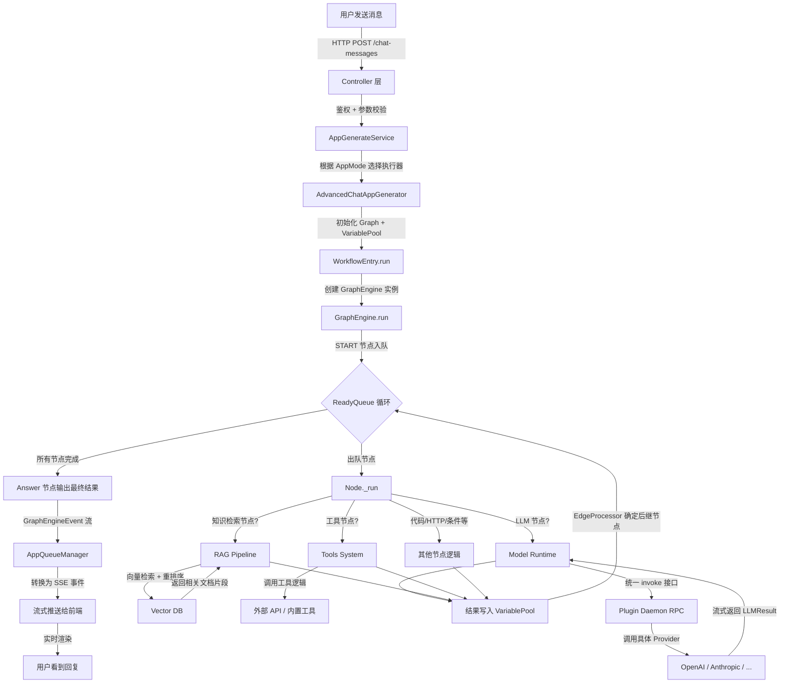

# Dify 架构研究报告

> 仓库地址：https://github.com/langgenius/dify
> 分析日期：2026-02-17

---

## 1. 核心矛盾与存在意义 (The "Why")

### 痛点还原

在 Dify 出现之前，想要把一个 LLM 应用从"Demo"推到"生产"，开发者面临的是一场噩梦：

- **碎片化的接入成本**：OpenAI、Anthropic、通义千问、Llama……每换一个模型就要改一套 SDK 调用逻辑，Token 计费方式不同，错误处理不同，流式返回格式不同。一个团队可能花 30% 的时间在"对接模型 API"上。
- **RAG 是个系统工程，不是一个函数调用**：做知识库检索不是调一下 embedding 就完了——你需要文档解析（PDF/Word/Notion）、分块策略、向量库选型（Weaviate/Milvus/PGVector……20 多种）、召回排序、重排序……每一步都有坑，每换一个向量库就要重写一遍适配代码。
- **Workflow 编排缺乏标准化工具**：LangChain 提供了链式调用的代码抽象，但对于非工程背景的人来说，它本质上还是"用代码画流程图"。产品经理和运营人员无法参与 AI 应用的搭建过程。
- **从原型到生产的鸿沟**：一个 Jupyter Notebook 里跑通的 Demo，要变成生产级服务，你需要自己搞定鉴权、速率限制、日志追踪、对话记忆、内容审核、多租户隔离……这些基础设施工作量远超"写 AI 逻辑"本身。

### 一句话定义

**Dify 是一个"LLM 应用的全栈操作系统"**——它用可视化 Workflow 编排 + 统一的模型/工具/知识库抽象层，让你在浏览器里拖拖拽拽就能搭出生产级的 AI 应用，不需要从零搭建任何基础设施。

### 适用场景

| 场景 | 是否适合 | 原因 |
| :--- | :---: | :--- |
| 企业内部 AI 助手（客服、知识问答） | **必须用** | 开箱即用的 RAG + 对话管理 + 多模型切换 |
| 需要复杂业务逻辑的 AI 工作流 | **必须用** | 可视化 Workflow 支持条件分支、循环、人工审批 |
| 快速验证 AI 产品想法 | **必须用** | 从搭建到发布可以在一天内完成 |
| 需要深度定制模型推理逻辑 | **杀鸡用牛刀** | 如果你只是想微调一个模型跑推理，直接用 vLLM |
| 简单的单轮 API 调用 | **杀鸡用牛刀** | 如果只是包装一个 ChatGPT API，用 FastAPI 写 20 行代码就够了 |
| 对延迟极度敏感的实时推理场景 | **不太适合** | 平台层的抽象会引入额外开销 |

---

## 2. 静态架构解剖 (The "Static Structure")

Dify 整体是前后端分离架构：后端 `api/` 是 Python Flask 应用（DDD 风格），前端 `web/` 是 Next.js 应用。核心业务逻辑全部在后端 `api/core/` 目录下。

### 核心模块一览

| 模块名称 | 核心职责 (大白话) | 复杂度 | 核心地位 |
| :--- | :--- | :---: | :---: |
| **Workflow Engine** (`core/workflow/`) | 整个平台的"大脑"。把用户在前端拖拽的流程图变成可执行的 DAG，按拓扑序逐节点运行，支持暂停/恢复/中断。内含 31 种节点类型（LLM调用、代码执行、HTTP请求、条件分支、循环等）。 | 高 | 灵魂 |
| **Model Runtime** (`core/model_runtime/`) | 统一的"模型翻译官"。不管你用 OpenAI 还是通义千问，对上层暴露的都是同一套 `invoke()` 接口。通过插件机制支持 LLM、Embedding、Rerank、TTS、STT、Moderation 六大类模型。 | 高 | 灵魂 |
| **RAG Pipeline** (`core/rag/`) | 完整的知识库"流水线"。从文档提取（支持 19 种格式）→ 分块 → Embedding → 向量入库 → 检索 → 重排序，全链路覆盖。适配 20+ 种向量数据库。 | 高 | 灵魂 |
| **App Runner** (`core/app/`) | 应用的"调度中心"。根据应用类型（Chat / Completion / Workflow / Agent Chat）选择对应的执行器，管理消息队列和 SSE 流式推送。 | 中 | 骨架 |
| **Tools System** (`core/tools/`) | 工具的"市场+运行时"。管理 5 种工具来源（内置工具、自定义 API 工具、插件工具、MCP 工具、Workflow 即工具），统一调度执行。 | 中 | 骨架 |
| **Plugin System** (`core/plugin/`) | 平台的"扩展机制"。通过 RPC 与外部 Plugin Daemon 通信，实现模型 Provider、工具、扩展的热插拔。 | 中 | 骨架 |
| **前端应用** (`web/`) | 用户看到的一切。Next.js App Router 架构，包含 Workflow 可视化编辑器、知识库管理、应用配置面板、日志监控、多租户 Workspace 等完整管理界面。 | 中 | 皮肉 |

### 模块间关系（从上到下）

```
┌────────────────────────────────────────────────────────┐
│                   Frontend (Next.js)                   │
│   Workflow Editor │ App Console │ Knowledge Base UI    │
└─────────────┬──────────────────────────────────────────┘
              │ REST API / SSE
┌─────────────▼──────────────────────────────────────────┐
│               Controllers (Flask Blueprints)           │
│   console/ │ service_api/ │ web/ │ inner/              │
└─────────────┬──────────────────────────────────────────┘
              │
┌─────────────▼──────────────────────────────────────────┐
│                   Services Layer                       │
│  WorkflowService │ AppService │ DatasetService │ ...   │
└─────────────┬──────────────────────────────────────────┘
              │
┌─────────────▼──────────────────────────────────────────┐
│                    Core Domain                         │
│  ┌──────────────────────────────────────────────┐      │
│  │           Workflow Engine (DAG)              │      │
│  │  GraphEngine → ReadyQueue → Node Execution   │      │
│  │  31 Node Types │ VariablePool │ Events       │      │
│  └──────┬───────────┬────────────┬──────────────┘      │
│         │           │            │                      │
│  ┌──────▼──┐  ┌─────▼─────┐  ┌──▼──────────┐          │
│  │ Model   │  │   RAG     │  │   Tools     │          │
│  │ Runtime │  │ Pipeline  │  │   System    │          │
│  └──────┬──┘  └─────┬─────┘  └──┬──────────┘          │
│         │           │            │                      │
│  ┌──────▼───────────▼────────────▼──────────┐          │
│  │            Plugin System (RPC)           │          │
│  └──────────────────────────────────────────┘          │
└────────────────────────────────────────────────────────┘
              │
┌─────────────▼──────────────────────────────────────────┐
│              Infrastructure                            │
│  PostgreSQL │ Redis │ Celery │ Vector DB │ S3/Storage  │
└────────────────────────────────────────────────────────┘
```

### 后端分层架构详细说明

**Controllers 层** (`api/controllers/`)：Flask Blueprints，分为四组 API 路由：
- `console/` — 管理后台 API（应用管理、Workflow 编辑、知识库管理、模型配置）
- `service_api/` — 对外开放的 Service API（应用调用、会话管理）
- `web/` — 面向终端用户的 WebApp API
- `inner/` — 内部服务间调用

**Services 层** (`api/services/`)：业务编排层，协调多个 Core 模块完成一个完整的业务操作。例如 `WorkflowService` 负责 Workflow 的 CRUD + 试运行 + 发布。

**Core 层** (`api/core/`)：核心领域逻辑，各模块独立内聚，通过明确的接口互相调用。

**Models 层** (`api/models/`)：SQLAlchemy ORM 模型，对应 PostgreSQL 表结构。核心实体包括 `App`、`Workflow`、`Conversation`、`Message`、`Dataset`、`Document` 等。

**Repositories 层** (`api/repositories/`)：数据访问抽象，遵循 Repository 模式，将数据库操作与业务逻辑分离。

---

## 3. 动态核心链路追踪 (The "Dynamic Flow")

### 场景：用户在 Chat 应用中发送一条消息，触发 Workflow 执行

这是 Dify 最典型的端到端场景，数据会流经几乎所有核心模块。



### 数据变化轨迹

```
用户输入 "帮我总结一下这份报告的核心观点"
    │
    ▼
[Controller] 原始请求 → 提取 query, conversation_id, files
    │
    ▼
[AppGenerator] 加载 Workflow 定义 (JSON DAG) → 创建 Graph 实例
    │
    ▼
[START Node] 用户输入注入 VariablePool["start"]["query"] = "帮我总结..."
    │
    ▼
[Knowledge Retrieval Node]
  - 输入: query 文本
  - RAG Pipeline: query → embedding → 向量检索(top-k) → rerank
  - 输出: VariablePool["knowledge_retrieval"]["result"] = [文档片段1, 片段2, ...]
    │
    ▼
[LLM Node]
  - 输入: 从 VariablePool 取 query + 检索到的文档片段
  - 构建 Prompt: system_prompt + context(文档片段) + user_query
  - Model Runtime: invoke(prompt_messages) → stream LLMResult
  - 输出: VariablePool["llm"]["text"] = "这份报告的核心观点包括..."
    │
    ▼
[Answer Node]
  - 输入: 引用 VariablePool["llm"]["text"]
  - 输出: 最终回复文本 → 推送给前端
```

### 关键机制说明

1. **VariablePool 是所有节点间通信的唯一媒介**：每个节点只能通过 `[node_id, variable_name]` 二元组读写数据，不存在节点间直接调用。这是"共享黑板"模式（Blackboard Pattern）。

2. **GraphEngine 用 ReadyQueue 实现拓扑序执行**：当一个节点完成后，EdgeProcessor 检查所有出边，如果目标节点的所有入边都已满足（前驱节点都执行完），就把它入队。这样天然支持并行分支。

3. **事件驱动的流式传输**：节点执行过程中产生的 `GraphNodeEventBase` 会逐个 yield 出来，经 AppQueueManager 转换为 SSE 事件，实现打字机效果的流式输出。

4. **命令通道（Command Channel）**：支持通过 Redis 或内存通道发送 Abort/Pause 命令，实现运行时中断或暂停恢复。

5. **中间件层（Layers）**：GraphEngine 的执行被包裹在可插拔的中间件层中（debug、limits、observability），实现日志记录、执行限制、链路追踪等横切关注点，而不污染核心执行逻辑。

---

## 4. 架构评价 (The Trade-off)

### 设计亮点：统一的 VariablePool + DAG 执行模型

Dify 最精彩的设计决策是**把 Workflow 的运行时抽象成"DAG 图 + 共享变量池"**。

这个设计带来了三个核心优势：

1. **节点完全解耦**：LLM 节点不知道 RAG 节点的存在，它只知道"从 VariablePool 的某个地址取一个变量"。这意味着你可以自由组合任何节点，不需要修改节点内部代码。

2. **天然支持暂停/恢复**：因为所有中间状态都在 VariablePool 里，序列化整个 VariablePool 就能冻结工作流状态。Human Input 节点（人工审批）就是靠这个实现的——暂停时把 VariablePool 存起来，用户操作后恢复执行。

3. **可观测性极强**：每个节点的输入输出都记录在 VariablePool 中，结合 GraphEngineEvent 事件流，可以精确回溯"这个 LLM 收到了什么 prompt、返回了什么、花了多少 token"。

### 潜在代价

1. **平台复杂度极高**：`api/core/` 目录下有几十个子模块，Workflow 引擎本身就有 220+ 个 Python 文件。对于只想做简单 chatbot 的团队来说，这套系统的理解成本和运维成本远超实际需求。

2. **抽象层的性能税**：每一次 LLM 调用都要经过 Plugin Daemon RPC → Model Runtime → Provider 三层间接调用。每一次变量读取都要经过 VariablePool 的序列化/反序列化。在高并发场景下，这些中间层的开销不可忽视。

3. **向量数据库适配的维护负担**：支持 20+ 种向量数据库听起来很美好，但每个数据库的 API、一致性语义、性能特征都不同。每次某个向量库升级 API，Dify 都需要跟进维护。这是典型的"适配器膨胀"问题。

4. **插件系统引入了分布式复杂性**：模型 Provider 通过 Plugin Daemon（独立进程）以 RPC 方式调用，这意味着引入了网络延迟、序列化开销、进程管理等分布式系统的经典难题。相比直接在进程内调用 SDK，这是一个显著的架构代价。

5. **前端重量级**：109 个 base 组件目录、41 个 workflow 相关组件目录——前端代码体量庞大，新贡献者的上手曲线陡峭。

### 总结

Dify 的架构选择本质上是**用平台复杂度换取终端用户的简单性**。它把"对接模型、搭建 RAG、编排工作流"这些原本需要工程师手写代码的事情，封装成了可视化操作。这个取舍对于企业级场景是合理的——维护一套 Dify 平台的成本，远低于每个业务团队各自重复造轮子的总成本。
