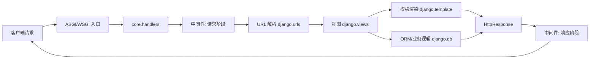

# Django 第三方库研究报告

## 要点速览
- **“电池齐全”路线**：内置 ORM、模板、管理后台、认证、表单等，降低项目起步成本，但学习面更广。
- **MTV 分层清晰**：URL 路由 + 视图 + 模板 + ORM 各司其职，强调可维护与可扩展。
- **可插拔应用体系**：通过 `apps` 与 `contrib` 生态，强调“组合式能力”。
- **中间件流水线**：把横切关注点（安全、认证、缓存）收敛到统一入口。

---

## 1. 概览

### 1.1 目录结构概览（精简）
```
vendors/django/
├── django/              # 核心框架源码
│   ├── core/            # 请求处理、WSGI/ASGI、管理命令
│   ├── db/              # ORM 与数据库后端
│   ├── urls/            # 路由与解析
│   ├── http/            # 请求/响应对象
│   ├── template/        # 模板引擎
│   ├── middleware/      # 中间件体系
│   ├── forms/           # 表单与验证
│   ├── contrib/         # 官方可插拔应用
│   └── apps/conf/utils/ # 应用注册、配置、工具
├── docs/                # 官方文档（包含概览/教程/主题）
├── tests/               # 大量测试
└── scripts/extras       # 工具与辅助内容
```

### 1.2 边界与角色
- **框架核心（django/）**：请求处理、ORM、模板、路由、中间件等核心机制。
- **内置应用（django/contrib）**：可选插件式能力（admin、auth、sessions 等）。
- **文档与测试**：框架学习与行为规范的主要依据。

### 1.3 设计目标（从文档与结构归纳）
- **快速开发**：提供“开箱即用”的全栈能力。
- **分层清晰**：核心机制与业务逻辑分离，减少耦合。
- **可复用与可扩展**：应用（app）是组织与复用的基本单元。

---

## 2. 核心图（请求处理视角）



**用途说明**：展示请求从入口到视图/ORM/模板，再回到响应的完整主链路。

---

## 3. 核心模块职责表（必须项）

| 模块 | 职责 | 关键依赖 | 扩展点 |
| --- | --- | --- | --- |
| django/core | 请求处理、ASGI/WSGI、管理命令 | handlers、management | 自定义命令、运行时接入 |
| django/urls | URL 路由解析 | path/resolve | 自定义路由策略 |
| django/http | Request/Response 对象 | HttpRequest/HttpResponse | 自定义响应类 |
| django/db | ORM、迁移、数据库后端 | models/query | 自定义数据库后端、字段 |
| django/template | 模板引擎与加载器 | loaders/engine | 自定义模板标签 |
| django/middleware | 横切处理链 | middleware 类 | 自定义中间件 |
| django/forms | 表单与校验 | fields/validators | 自定义表单组件 |
| django/contrib | 官方可插拔应用 | admin/auth 等 | 按需启用/扩展 |
| django/apps/conf | 应用注册与配置 | AppConfig/settings | 自定义应用配置 |

---

## 4. 关键机制与设计取舍

### 4.1 MTV 分层：职责清晰优先
- **机制**：URL 路由将请求分发给视图；视图组织业务；模板负责展示；ORM 管理数据。
- **取舍**：层次多、学习成本高，但团队协作与长期维护更稳定。

### 4.2 ORM 抽象：通用性优先
- **机制**：模型定义驱动数据库迁移与查询 API。
- **取舍**：跨数据库更友好，但复杂 SQL 时需要权衡（可使用原生 SQL）。

### 4.3 中间件：横切逻辑统一治理
- **机制**：请求/响应两阶段统一处理。
- **取舍**：入口逻辑集中，有利于全局控制，但调试链路更复杂。

### 4.4 可插拔应用（apps + contrib）
- **机制**：应用作为可复用单元；官方提供大量 contrib 应用。
- **取舍**：生态丰富，但“选择与配置”的决策成本更高。

### 4.5 管理命令与自动化
- **机制**：`manage.py` 命令体系驱动开发工作流。
- **取舍**：一致性高，但增加了框架特定工作方式依赖。

---

## 5. 典型用法/示例（常用场景 3 段）

### 5.1 初始化/最小可用：视图 + 路由
```python
# urls.py
from django.urls import path
from . import views

urlpatterns = [
    path("hello/", views.hello),
]
```
```python
# views.py
from django.http import HttpResponse

def hello(request):
    return HttpResponse("Hello Django")
```

### 5.2 ORM 模型与迁移（典型数据层）
```python
# models.py
from django.db import models

class Article(models.Model):
    title = models.CharField(max_length=200)
    created_at = models.DateTimeField(auto_now_add=True)
```
```bash
python manage.py makemigrations
python manage.py migrate
```

### 5.3 中间件（横切能力示例）
```python
# middleware.py
class RequestIdMiddleware:
    def __init__(self, get_response):
        self.get_response = get_response

    def __call__(self, request):
        request.request_id = "RID-123"  # 示例
        response = self.get_response(request)
        response["X-Request-ID"] = request.request_id
        return response
```

---

## 6. 结论与建议（落地）

- **建议 1：先掌握请求链路**：URL → 视图 → 模板/ORM → 响应是核心主线。
- **建议 2：优先按应用（app）拆分**：小而清晰的 app 更易复用与测试。
- **建议 3：把横切逻辑放到中间件**：如认证、日志、权限等更易维护。
- **建议 4：ORM 与原生 SQL 并存**：80% 用 ORM，复杂场景用原生 SQL。
- **建议 5：善用 contrib 但避免过度依赖**：按需启用，保持系统可控性。

---

## 附：关键文件与入口（便于进一步深挖）
- `vendors/django/django/core/handlers`
- `vendors/django/django/urls`
- `vendors/django/django/db`
- `vendors/django/django/template`
- `vendors/django/docs/intro/overview.txt`

