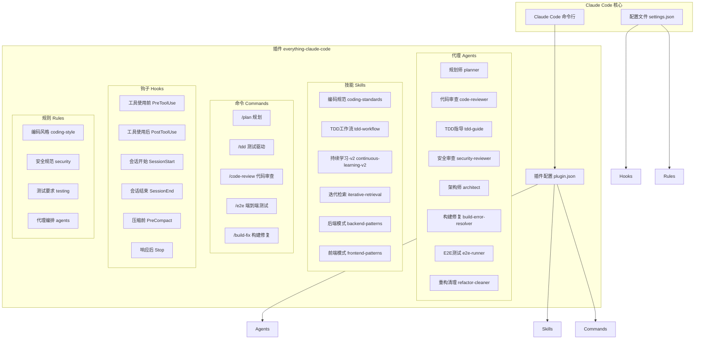
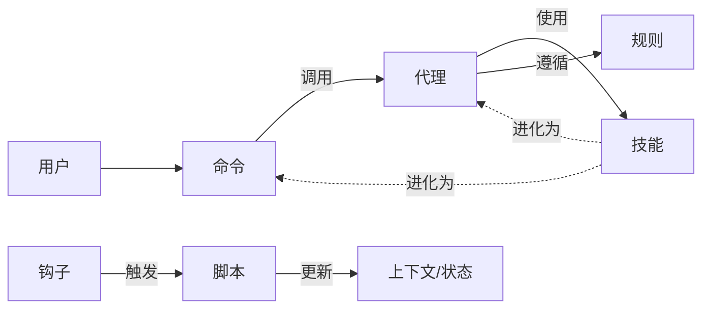
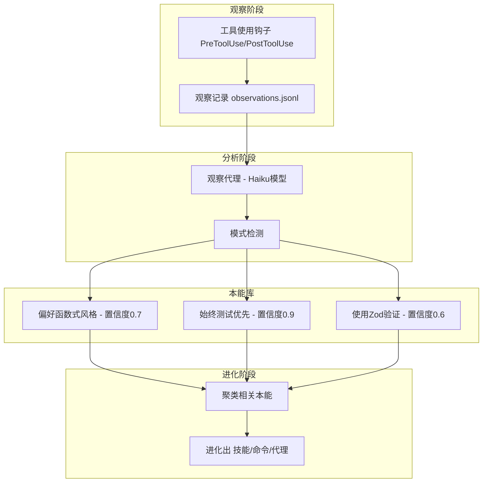
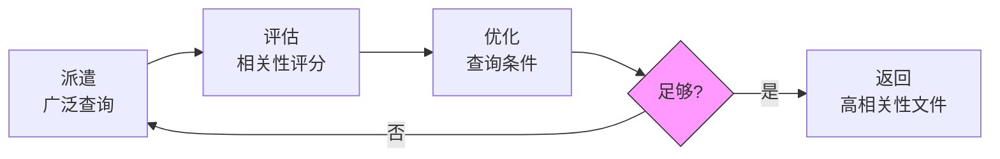
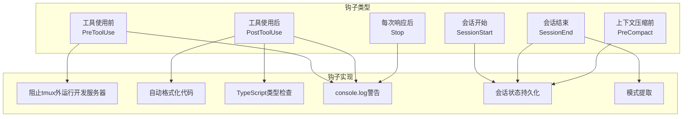
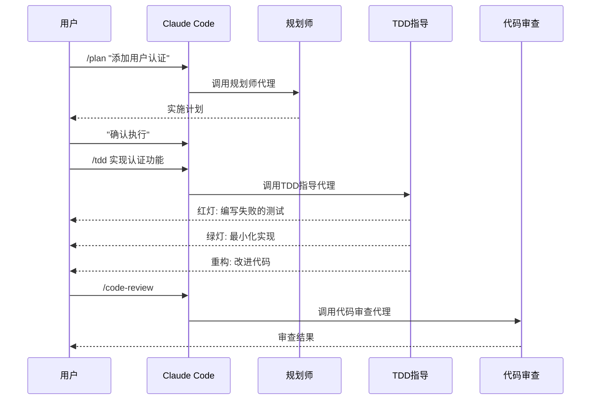
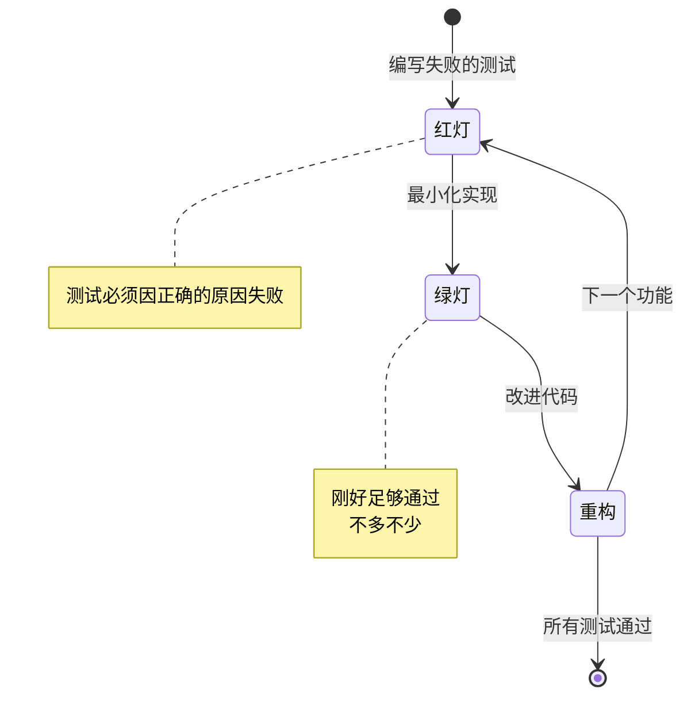

# everything-claude-code 源码分析报告

## 项目概述

**everything-claude-code** 是由 Anthropic Hackathon 获奖者 Affaan Mustafa 开源的 Claude Code 配置集合。这是一个生产级的 Claude Code 插件，包含 10 个月以上密集日常使用演进出的 agents、skills、hooks、commands 和 rules。

| 属性 | 内容 |
|------|------|
| 作者 | Affaan Mustafa (@affaanmustafa) |
| 许可证 | MIT |
| 定位 | Claude Code 插件 |
| 核心价值 | 提供开箱即用的 AI 辅助开发工作流 |

---

## 架构设计

### 整体架构



### 核心组件关系



---

## 核心模块详解

### 1. Agents（专业化子代理）

位于 `agents/` 目录，共 13 个专业化代理：

| Agent                    | 用途          | 触发场景         |
| ------------------------ | ----------- | ------------ |
| **planner**              | 实现规划专家      | 复杂功能、重构任务    |
| **code-reviewer**        | 代码审查专家      | 代码编写/修改后     |
| **tdd-guide**            | TDD 指导      | 新功能、Bug 修复   |
| **security-reviewer**    | 安全分析        | 提交前          |
| **architect**            | 系统设计        | 架构决策         |
| **build-error-resolver** | 构建错误修复      | 构建失败时        |
| **e2e-runner**           | E2E 测试      | 关键用户流程       |
| **refactor-cleaner**     | 死代码清理       | 代码维护         |
| **doc-updater**          | 文档更新        | 文档同步         |
| **go-reviewer**          | Go 代码审查     | Go 项目        |
| **python-reviewer**      | Python 代码审查 | Python 项目    |
| **database-reviewer**    | 数据库审查       | 涉及 schema 变更 |

Agent 定义格式（以 planner 为例）：

```yaml
---
name: planner
description: Expert planning specialist for complex features...
tools: ["Read", "Grep", "Glob"]
model: opus
---

# 角色定义
You are an expert planning specialist...

## 工作流程
1. Requirements Analysis
2. Architecture Review
3. Step Breakdown
4. Implementation Order
```

### 2. Skills（工作流定义）

位于 `skills/` 目录，共 28 个 skill：

#### 2.1 核心 Skill

**continuous-learning-v2**：基于本能的学习系统



关键特性：
- **Atomic Instincts**：原子化的本能行为
- **Confidence Scoring**：0.3-0.9 的置信度评分
- **100% Reliable**：使用 Hooks 确保每次工具调用都被观察

**iterative-retrieval**：解决子代理上下文问题



4 阶段循环：
1. **DISPATCH**：初始广泛查询
2. **EVALUATE**：评估相关性 (0-1 评分)
3. **REFINE**：基于评估优化查询条件
4. **LOOP**：最多 3 次循环

### 3. Commands（快捷命令）

位于 `commands/` 目录，共 24 个命令：

| 命令 | 功能 | 对应 Agent |
|------|------|------------|
| `/plan` | 创建实现计划 | planner |
| `/tdd` | TDD 工作流 | tdd-guide |
| `/code-review` | 代码审查 | code-reviewer |
| `/e2e` | E2E 测试 | e2e-runner |
| `/build-fix` | 修复构建错误 | build-error-resolver |
| `/refactor-clean` | 清理死代码 | refactor-cleaner |
| `/learn` | 提取模式 | - |
| `/checkpoint` | 保存验证状态 | - |
| `/verify` | 运行验证循环 | - |
| `/evolve` | 聚类本能为技能 | - |
| `/instinct-status` | 查看学习到的本能 | - |
| `/skill-create` | 从 git 历史生成技能 | - |

Command 定义示例（plan）：

```markdown
---
description: Restate requirements, assess risks, and create step-by-step implementation plan...
---

# Plan Command

## What This Command Does
1. Restate Requirements
2. Identify Risks
3. Create Step Plan
4. Wait for Confirmation

## When to Use
- Starting a new feature
- Making significant architectural changes
...
```

### 4. Hooks（事件钩子）

位于 `hooks/hooks.json`，支持 6 种事件类型：



关键 Hooks：

| Hook | 功能 |
|------|------|
| **tmux blocker** | 阻止在 tmux 外运行 dev server |
| **prettier** | 保存后自动格式化 |
| **tsc check** | TypeScript 类型检查 |
| **console.log warning** | 检测并警告 console.log |
| **session persistence** | 跨会话状态保存/恢复 |
| **pattern extraction** | 会话结束自动提取模式 |

### 5. Rules（始终遵循的规则）

位于 `rules/` 目录，需手动复制到 `~/.claude/rules/`：

| Rule | 内容 |
|------|------|
| **coding-style.md** | 不可变性、文件组织、错误处理 |
| **security.md** | 安全检查清单 |
| **testing.md** | TDD、覆盖率要求 |
| **agents.md** | 代理编排指南 |
| **git-workflow.md** | Git 提交格式、PR 流程 |
| **performance.md** | 模型选择、上下文管理 |
| **hooks.md** | Hooks 使用规范 |
| **patterns.md** | 设计模式指南 |

coding-style 核心原则：

```markdown
## Immutability (CRITICAL)
ALWAYS create new objects, NEVER mutate:

// WRONG: Mutation
function updateUser(user, name) {
  user.name = name  // MUTATION!
  return user
}

// CORRECT: Immutability
function updateUser(user, name) {
  return { ...user, name }
}

## File Organization
MANY SMALL FILES > FEW LARGE FILES:
- 200-400 lines typical, 800 max
- Extract utilities from large components
- Organize by feature/domain
```

---

## 工作流程示例

### 典型开发流程



### TDD 工作流程



---

## 设计亮点

### 1. 分层代理架构

- **主 Claude**：协调者，决定何时调用哪个代理
- **专业 Agents**：执行特定任务，有明确边界
- **Hooks**：透明地增强行为，无需显式调用

### 2. 渐进式上下文管理

- **iterative-retrieval**：解决子代理"不知道需要什么上下文"的问题
- **strategic-compact**：在逻辑间隔建议手动压缩
- **session persistence**：跨会话保持状态

### 3. 持续学习系统

```
v1 (Skill-based) → v2 (Instinct-based)

v1 问题：
- Skills 是概率性的 (~50-80% 触发)
- 可能错过模式

v2 改进：
- Hooks 100% 可靠
- 原子化 Instincts
- 置信度评分
- 可进化的知识
```

### 4. 工程实践集成

- **TDD 强制执行**：RED → GREEN → REFACTOR 循环
- **代码审查自动化**：每次修改后自动审查
- **安全检查**：硬编码凭证、SQL 注入、XSS 检测
- **性能意识**：模型选择、上下文管理

---

## 使用建议

### 快速开始

```bash
# 1. 添加 marketplace
/plugin marketplace add affaan-m/everything-claude-code

# 2. 安装插件
/plugin install everything-claude-code@everything-claude-code

# 3. 手动安装 rules（重要！）
cp -r everything-claude-code/rules/* ~/.claude/rules/
```

### 最佳实践

1. **始终使用 `/plan` 开始复杂任务**
   - 获得清晰的实施计划
   - 识别风险和依赖
   - 等待用户确认后再执行

2. **新功能强制 TDD**
   - `/tdd` 命令确保测试先行
   - 80%+ 覆盖率要求
   - RED → GREEN → REFACTOR 循环

3. **代码审查自动化**
   - 每次修改后运行 `/code-review`
   - 关注 Critical 和 High 级别问题
   - 自定义项目特定的检查项

4. **谨慎管理 MCP**
   - 20-30 个 MCP 配置即可
   - 每项目保持 <10 个启用
   - 总工具数 <80 个

---

## 总结

everything-claude-code 是一个**生产级的 Claude Code 配置框架**，其价值在于：

1. **开箱即用**：10 个月实战验证的配置
2. **系统化方法**：TDD、代码审查、安全检查集成到工作流
3. **可进化**：通过 continuous-learning-v2 不断适应个人习惯
4. **模块化**：按需使用 agents、skills、commands、hooks

这是一个**AI 辅助开发的完整解决方案**，而非简单的配置集合。
