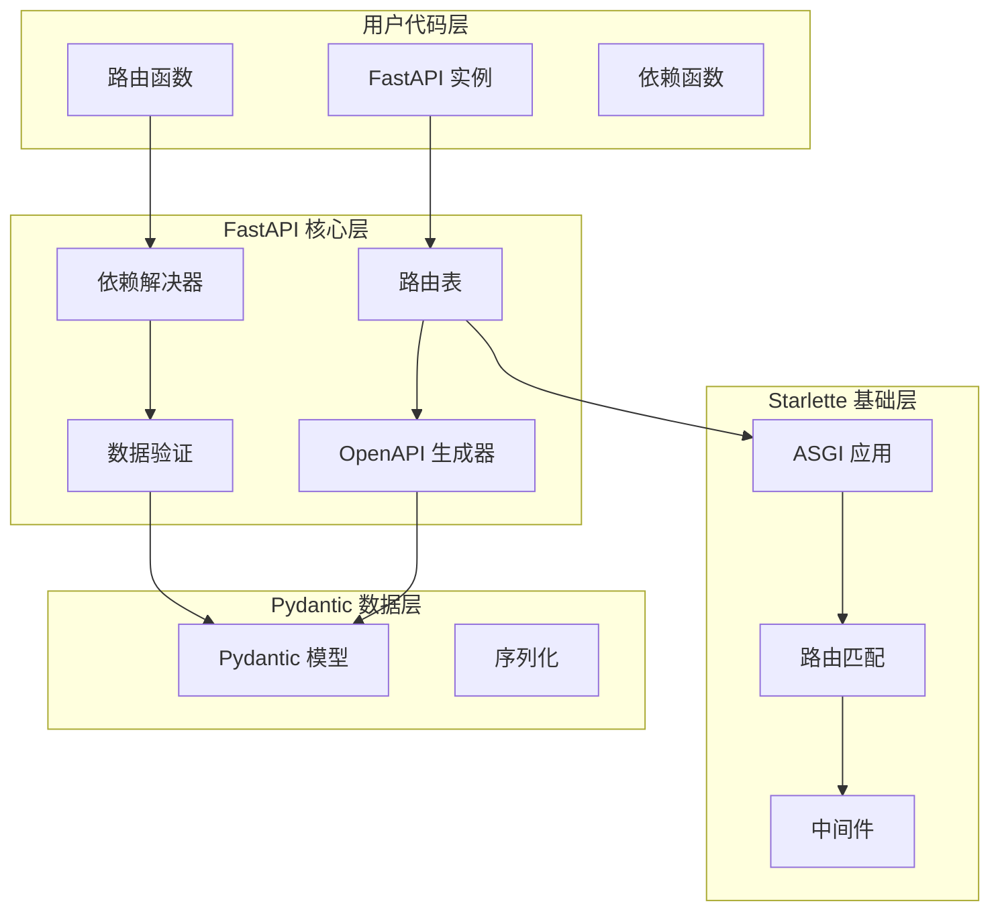
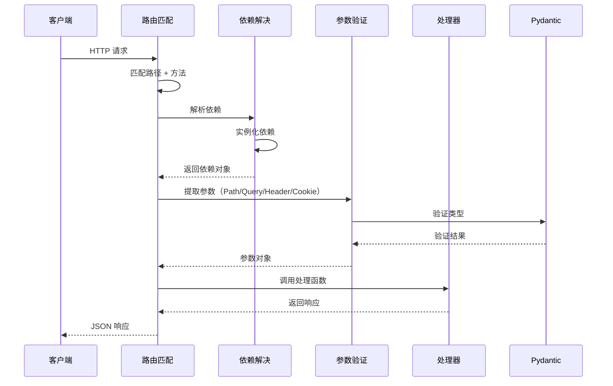
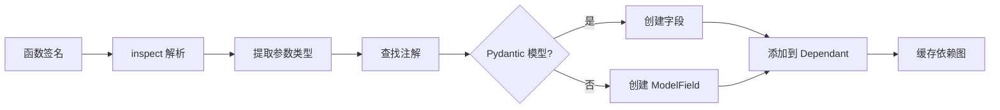
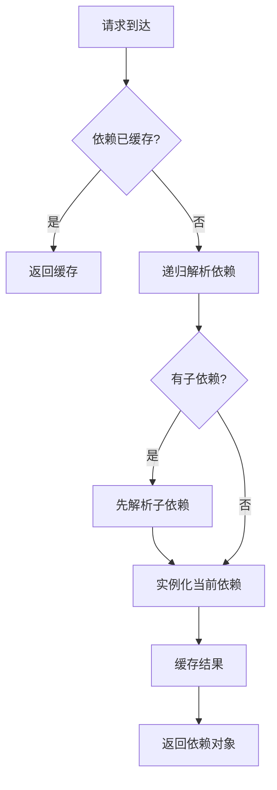
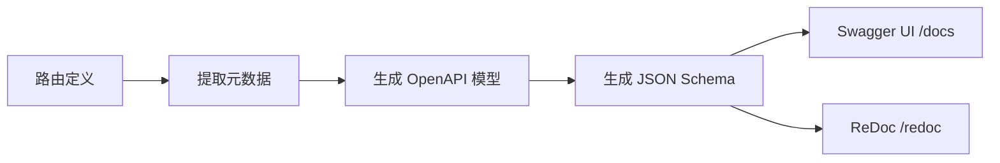

# FastAPI 研究报告（Mini版）

## 一、项目概览

### 1.1 是什么

FastAPI 是一个**现代、高性能的 Python Web 框架**，用于构建 API。它的核心特点：

| 特性        | 说明                                          |
| --------- | ------------------------------------------- |
| **高性能**   | 与 NodeJS、Go 框架性能相当（基于 Starlette + Pydantic） |
| **易编码**   | 开发速度提升 200%-300%                            |
| **少 Bug** | 减少约 40% 的人为错误                               |
| **自动文档**  | 自动生成 OpenAPI / Swagger UI / ReDoc           |

### 1.2 核心依赖

```
FastAPI = Starlette (Web 部分) + Pydantic (数据部分)
```

- **Starlette**：提供 ASGI 服务器、路由、中间件等 Web 功能
- **Pydantic**：提供数据验证、序列化、类型提示

### 1.3 安装

```bash
pip install fastapi
pip install "uvicorn[standard]"  # ASGI 服务器
```

---

## 二、目录结构

```
fastapi/
├── __init__.py              # 导出公开 API
├── applications.py          # FastAPI 主类
├── routing.py               # 路由系统（核心，178KB）
├── param_functions.py       # 参数装饰器函数（Path, Query, Body...）
├── params.py                # 参数类定义
├── exceptions.py            # 异常定义
├── dependencies/            # 依赖注入系统
│   ├── models.py            # Dependant 数据模型
│   └── utils.py             # 依赖解析和解决逻辑
├── openapi/                 # OpenAPI 自动生成
│   ├── docs.py              # Swagger UI / ReDoc
│   ├── models.py            # OpenAPI 模型
│   └── utils.py             # OpenAPI 工具
├── middleware/              # 中间件
│   ├── cors.py
│   ├── gzip.py
│   └── trusted_host.py
├── security/                # 安全相关（OAuth2、JWT 等）
└── encoders.py              # JSON 编码器
```

---

## 三、核心架构设计

### 3.1 整体架构图



### 3.2 核心模块职责表

| 模块 | 职责 | 关键依赖 |
|------|------|----------|
| **applications.py** | FastAPI 主类、入口 | Starlette |
| **routing.py** | 路由注册、请求处理 | ASGI、Dependant |
| **param_functions.py** | 参数装饰器工厂 | Annotated |
| **params.py** | 参数元数据类 | Pydantic FieldInfo |
| **dependencies/** | 依赖注入解析 | inspect |
| **openapi/** | OpenAPI 规范生成 | Pydantic 模型 |

---

## 四、关键机制详解

### 4.1 路由注册机制

#### FastAPI 主类继承结构

```python
# applications.py:48
class FastAPI(Starlette):
    """
    FastAPI 继承自 Starlette，增加了：
    1. 路径操作装饰器（get, post, put...）
    2. 自动 OpenAPI 生成
    3. 依赖注入集成
    """
```

#### 路径操作装饰器实现

```python
# routing.py 中的装饰器
def api_route(self, path: str, ...):
    def decorator(func: Callable[..., Any]) -> None:
        self.add_api_route(path, func, ...)
    return decorator

def get(self, path: str, ...):
    def decorator(func: Callable[..., Any]) -> None:
        self.add_api_route(path, func, methods=["GET"], ...)
    return decorator
```

#### 请求处理流程



### 4.2 类型提示驱动机制

#### 参数声明方式

```python
from fastapi import FastAPI, Query, Path, Body
from pydantic import BaseModel

app = FastAPI()

# 方式一：Python 类型提示（推荐）
@app.get("/items/{item_id}")
async def read_item(item_id: int, q: str | None = None):
    return {"item_id": item_id, "q": q}

# 方式二：显式参数函数
@app.post("/items")
async def create_item(
    item_id: int = Path(...),
    q: str = Query(default=None),
    item: Item = Body(...)
):
    pass

# 方式三：Pydantic 模型
class Item(BaseModel):
    name: str
    price: float
    is_offer: bool | None = None
```

#### 类型解析流程



### 4.3 依赖注入系统

#### Dependant 数据模型

```python
# dependencies/models.py:31
@dataclass
class Dependant:
    path_params: list[ModelField] = field(default_factory=list)
    query_params: list[ModelField] = field(default_factory=list)
    header_params: list[ModelField] = field(default_factory=list)
    cookie_params: list[ModelField] = field(default_factory=list)
    body_params: list[ModelField] = field(default_factory=list)
    dependencies: list["Dependant"] = field(default_factory=list)  # 嵌套依赖
    call: Optional[Callable[..., Any]] = None
    use_cache: bool = True
```

#### 依赖函数示例

```python
from fastapi import Depends, FastAPI
from typing import Annotated

# 简单依赖
def common_parameters(q: str | None = None, skip: int = 0):
    return {"q": q, "skip": skip}

@app.get("/items/")
async def read_items(commons: Annotated[dict, Depends(common_parameters)]):
    return commons

# 类依赖
class CatFetcher:
    def __init__(self, api_key: str):
        self.api_key = api_key

    def get_cat(self):
        return {"cat": "meow"}

@app.get("/cat")
async def get_cat(fetcher: Annotated[CatFetcher, Depends(CatFetcher)]):
    return fetcher.get_cat()

# 依赖链
async def verify_token(x_token: str = Depends(SecurityOAuth2)):
    if not valid_token(x_token):
        raise HTTPException(status_code=401)
    return x_token

@app.get("/items/", dependencies=[Depends(verify_token)])
async def read_protected_items():
    return {"items": []}
```

#### 依赖解决流程



### 4.4 参数验证与序列化

#### 参数来源

| 来源 | 装饰器 | 位置 |
|------|--------|------|
| URL 路径 | `Path()` | `routing.py` |
| URL 查询 | `Query()` | `routing.py` |
| HTTP 头 | `Header()` | `routing.py` |
| Cookie | `Cookie()` | `routing.py` |
| 请求体 | `Body()` | `routing.py` |
| 表单数据 | `Form()` | `routing.py` |
| 文件 | `File()` | `routing.py` |

#### 验证机制

```python
# param_functions.py 中的函数定义
def Query(  # noqa: N802
    default: Any = ...,
    *,
    alias: str | None = None,
    title: str | None = None,
    description: str | None = None,
    gt: float | None = None,
    ge: float | None = None,
    lt: float | None = None,
    le: float | None = None,
    min_length: int | None = None,
    max_length: int | None = None,
    pattern: str | None = None,
    ...
) -> Any:
    """
    返回值会被 FastAPI 解析，提取验证规则后传给 Pydantic
    """
```

### 4.5 OpenAPI 自动生成

#### 生成流程



#### 关键组件

```python
# openapi/utils.py
def get_openapi(
    *,
    title: str,
    version: str,
    openapi_version: str,
    routes: list[BaseRoute],
    ...
) -> dict:
    """
    1. 遍历所有路由
    2. 提取 path、method、parameters、requestBody、responses
    3. 转换为 OpenAPI 3.0 规范格式
    """
```

---

## 五、典型用法示例

### 5.1 最小应用

```python
from fastapi import FastAPI
from pydantic import BaseModel

app = FastAPI()

class Item(BaseModel):
    name: str
    price: float
    is_offer: bool | None = None

@app.get("/")
async def root():
    return {"message": "Hello World"}

@app.get("/items/{item_id}")
async def read_item(item_id: int, q: str | None = None):
    return {"item_id": item_id, "q": q}

@app.post("/items/")
async def create_item(item: Item):
    return item
```

### 5.2 依赖注入完整示例

```python
from fastapi import FastAPI, Depends
from typing import Annotated

app = FastAPI()

# 数据库连接依赖
class Database:
    def __init__(self, url: str):
        self.url = url

    async def query(self, sql: str):
        return [{"result": "data"}]

def get_db():
    return Database("postgresql://...")

# 认证依赖
async def verify_token(token: str):
    if token != "secret":
        raise Exception("Invalid token")
    return token

# 使用依赖
@app.get("/data")
async def get_data(
    db: Annotated[Database, Depends(get_db)],
    token: Annotated[str, Depends(verify_token)]
):
    return await db.query("SELECT 1")
```

### 5.3 中间件使用

```python
from fastapi import FastAPI
from fastapi.middleware.cors import CORSMiddleware

app = FastAPI()

# CORS 中间件
app.add_middleware(
    CORSMiddleware,
    allow_origins=["*"],
    allow_credentials=True,
    allow_methods=["*"],
    allow_headers=["*"],
)

# 自定义中间件
@app.middleware("http")
async def add_process_time_header(request, call_next):
    import time
    start = time.time()
    response = await call_next(request)
    process_time = time.time() - start
    response.headers["X-Process-Time"] = str(process_time)
    return response
```

---

## 六、设计亮点与取舍

### 6.1 优秀设计

| 亮点 | 说明 |
|------|------|
| **类型驱动** | 利用 Python 类型提示，代码即文档 |
| **依赖注入** | 灵活、可测试、易于复用 |
| **自动文档** | OpenAPI、Swagger UI、ReDoc 开箱即用 |
| **性能优异** | 异步 ASGI + Pydantic v2 优化 |
| **错误处理** | 自动验证错误转 JSON |

### 6.2 设计取舍

| 取舍 | 说明 |
|------|------|
| **依赖 Starlette** | 继承 ASGI 能力，但增加依赖 |
| **运行时反射** | 使用 inspect 解析类型，略微影响启动时间 |
| **Pydantic 强依赖** | 数据验证绑定 Pydantic |
| **学习曲线** | 类型提示、依赖注入需要一定学习成本 |

### 6.3 与同类框架对比

| 维度 | FastAPI | Flask | Django |
|------|---------|-------|--------|
| 同步/异步 | 纯异步 | 同步 | 同步 |
| 数据验证 | Pydantic | WTForms | ORM |
| 文档生成 | 自动 | 需扩展 | 需扩展 |
| 路由装饰器 | 原生 | 原生 | URLconf |
| 依赖注入 | 原生 | 需 Flask-Injector | Django DI |
| 性能 | 最高 | 中等 | 较低 |
| 适用场景 | API 微服务 | 小型应用 | 全栈框架 |

---

## 七、落地建议

### 7.1 适用场景

1. **RESTful API 微服务**：轻量、高性能、自动文档
2. **后端 API 服务**：需要类型安全、验证严格
3. **ML/AI 服务**：Pydantic 与数据科学生态无缝集成
4. **BFF 层**：聚合多个后端服务

### 7.2 学习价值

1. **依赖注入设计**：可学习其 Dependant 模型和缓存机制
2. **类型系统运用**：学习如何利用 Python 类型提示
3. **ASGI 应用**：理解异步 Web 框架设计
4. **OpenAPI 生成**：了解自动 API 文档生成原理

### 7.3 最佳实践

```python
# 1. 使用类型注解
async def create_item(item: Item) -> Item:  # 返回类型注解

# 2. 善用依赖注入
async def get_current_user(token: Annotated[str, Depends(verify_token)]) -> User:
    pass

# 3. 配置分离
from pydantic_settings import BaseSettings

class Settings(BaseSettings):
    database_url: str
    secret_key: str

settings = Settings()

# 4. 错误处理
@app.exception_handler(RequestValidationError)
async def validation_exception_handler(request, exc):
    return JSONResponse(status_code=422, content=exc.detail)
```

---

## 八、总结

FastAPI 的核心设计思想是**"类型即代码，代码即文档"**：

- ✅ **高性能**：基于 ASGI 和 Pydantic v2
- ✅ **开发效率**：类型提示 + 自动验证 + 自动文档
- ✅ **灵活性**：依赖注入系统支持复杂场景
- ✅ **标准化**：完全兼容 OpenAPI 规范

FastAPI 已成为 Python 生态中最流行的现代 Web 框架，特别适合构建高性能 API 服务。

---

*报告生成时间：2026-01-27*
*基于 vendors/fastapi 源码分析*
