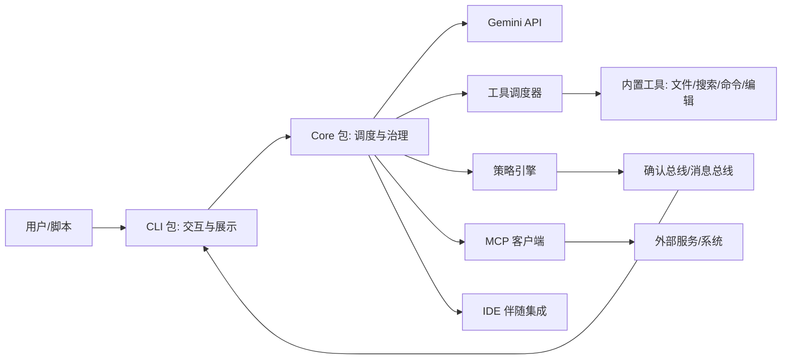

# Gemini CLI 第三方库研究报告

## 要点速览
- **分层清晰**：CLI 负责交互与展示，Core 负责模型调用、工具调度与安全策略，利于复用与演进。
- **工具系统是主轴**：统一的工具注册/校验/执行管线 + 策略引擎 + 确认总线，兼顾自动化与安全。
- **上下文是“分层记忆”**：`GEMINI.md` 分级加载（全局/项目/子目录）+ 运行期补充，形成可持续的项目知识。
- **扩展优先**：内置工具 + MCP 服务器（标准化协议）+ IDE 伴随扩展，形成“能力可插拔”的生态。

---

## 1. 概览

### 1.1 目录结构概览（精简）
```
vendors/gemini-cli/
├── packages/
│   ├── cli/                  # 终端交互与 UI
│   ├── core/                 # 核心调度与模型/工具系统
│   ├── vscode-ide-companion/ # VS Code 伴随扩展
│   ├── a2a-server/           # A2A 实验性服务
│   └── test-utils/           # 测试工具
├── docs/                     # 体系化文档
├── schemas/                  # 配置/协议相关 schema
├── scripts/                  # 构建与发布脚本
├── integration-tests/        # 集成测试
└── third_party/              # 第三方依赖
```

### 1.2 边界与角色
- **CLI（packages/cli）**：终端 UI/交互、配置加载、会话管理、非交互模式入口。
- **Core（packages/core）**：模型调用、工具注册与调度、策略引擎、上下文管理、MCP 与 IDE 连接。
- **扩展层**：MCP 服务器（外部能力）、IDE 伴随扩展（编辑器上下文）与实验性服务（a2a-server）。

### 1.3 设计目标（从代码与文档归纳）
- **终端优先**：把 AI 交互融入开发者日常命令行习惯。
- **可扩展**：通过 MCP 与内置工具扩展能力，而非在核心里堆功能。
- **安全可控**：工具调用与策略引擎分离，默认需要确认，高风险可控放行。
- **可脚本化**：支持非交互模式与结构化输出（JSON/流式 JSON）。

---

## 2. 核心图（架构视角）



**用途说明**：展示“CLI 前端 + Core 后端 + 工具/策略/扩展”的主干关系。

---

## 3. 核心模块职责表（必须项）

| 模块                   | 职责               | 关键依赖                       | 扩展点               |
| -------------------- | ---------------- | -------------------------- | ----------------- |
| packages/cli         | 终端 UI、输入解析、会话与输出 | Ink/React、核心包              | 自定义命令、主题、非交互模式    |
| packages/core        | 模型调用、工具调度、策略、上下文 | @google/genai、工具注册、策略引擎    | 工具/策略/MCP/Hook 体系 |
| core/tools           | 统一工具定义与执行        | ToolRegistry、ToolScheduler | 新增工具、MCP 工具       |
| core/policy          | 规则/安全/确认决策       | 规则集、shell 解析               | 自定义规则、审批模式        |
| core/mcp             | MCP 发现与执行        | MCP SDK、transport          | 接入新的 MCP 服务器      |
| core/services        | 上下文、文件扫描、会话记录等   | 文件系统、git                   | 自定义上下文策略          |
| vscode-ide-companion | 编辑器上下文桥接         | VS Code API                | IDE 上下文能力         |
| a2a-server           | 实验性对外服务          | A2A SDK                    | 未来集成形态            |

---

## 4. 关键机制与设计取舍

### 4.1 CLI/核心分层：体验与能力解耦
- **取舍点**：CLI 专注交互体验（Ink UI、会话流、快捷命令），Core 负责模型与工具调度。
- **收益**：未来可复用 Core 构建其他前端（IDE/服务端），且 CLI 变更不会侵入核心逻辑。

### 4.2 工具系统 + 调度器：把“能力”产品化
- **机制**：工具有统一 schema、校验与执行流程，由 `CoreToolScheduler` 排队执行。
- **取舍点**：工具调用路径比“直接跑脚本”更复杂，但换来可审计与可控性。

### 4.3 策略引擎 + 确认总线：自动化与安全的平衡
- **机制**：`PolicyEngine` 对工具调用做 ALLOW/DENY/ASK_USER 决策；`confirmation-bus` 统一交互。
- **取舍点**：默认“要确认”牺牲一点自动化，但能避免误操作与风险扩散。

### 4.4 上下文分层记忆：让提示“持久化”
- **机制**：`ContextManager` 组合全局/项目/子目录 `GEMINI.md`，构成层级记忆。
- **取舍点**：比单一提示更复杂，但能显著减少重复指令、提升一致性。

### 4.5 MCP 生态扩展：用协议替代定制
- **机制**：通过 `mcpServers` 配置发现工具，支持 stdio/SSE/HTTP 多种传输。
- **取舍点**：引入协议与连接成本，但获得可复用的“外部能力市场”。

### 4.6 非交互模式：让 CLI 进入流水线
- **机制**：提供 `--output-format json/stream-json`，便于脚本读取和编排。
- **取舍点**：交互细节被简化，但提高了自动化场景可用性。

---

## 5. 典型用法/示例（常用场景 3 段）

### 5.1 初始化/最小可用
```bash
# 直接启动交互式 CLI
npx @google/gemini-cli

# 或已安装的情况下
# gemini
```

### 5.2 非交互脚本化（结构化输出）
```bash
# 输出 JSON，便于脚本解析
gemini -p "总结这个仓库的架构" --output-format json
```

### 5.3 扩展点：MCP 服务器（最小配置示例）
```json
{
  "mcpServers": {
    "my-server": {
      "command": "path/to/mcp-server",
      "args": ["--mode", "stdio"],
      "timeout": 30000,
      "trust": false
    }
  }
}
```
```text
# 在会话中使用 MCP 工具或资源
@my-server://resource/path
```

---

## 6. 可对比的同类库维度（用于理解取舍）

| 对比维度 | Gemini CLI 的倾向 | 观察建议 |
| --- | --- | --- |
| 前端/后端分层 | 强分层 | 是否便于替换前端（IDE/服务端） |
| 工具系统 | 强一致性 + 策略化 | 评估“安全 vs 自动化”平衡 |
| 扩展方式 | MCP 协议化 | 看是否能接入既有内部系统 |
| 上下文管理 | 分层记忆 | 是否能降低提示维护成本 |
| 自动化能力 | 非交互模式 | 是否适配 CI/脚本流水线 |

---

## 7. 结论与建议（落地）

- **建议 1：如果要二次开发，优先从 Core 入手**：CLI/UI 相对容易替换，Core 才是工具与策略的价值核心。
- **建议 2：先定义策略规则，再开放工具**：默认确认 + 白名单规则更稳健，避免工具滥用。
- **建议 3：把项目规范沉淀到 `GEMINI.md`**：长期收益大于短期配置成本，尤其适合团队协作。
- **建议 4：试点 MCP 连接“现成系统”**：先选 1-2 个稳定系统验证扩展路径，再逐步扩容。
- **建议 5：脚本化输出与日志整合并行推进**：JSON 输出 + 结构化日志更利于可观测与自动化。

---

## 附：关键文件与入口（便于进一步深挖）
- `vendors/gemini-cli/packages/cli/src/gemini.tsx`
- `vendors/gemini-cli/packages/core/src/core/coreToolScheduler.ts`
- `vendors/gemini-cli/packages/core/src/tools/tools.ts`
- `vendors/gemini-cli/packages/core/src/policy/policy-engine.ts`
- `vendors/gemini-cli/docs/architecture.md`
- `vendors/gemini-cli/docs/tools/mcp-server.md`
