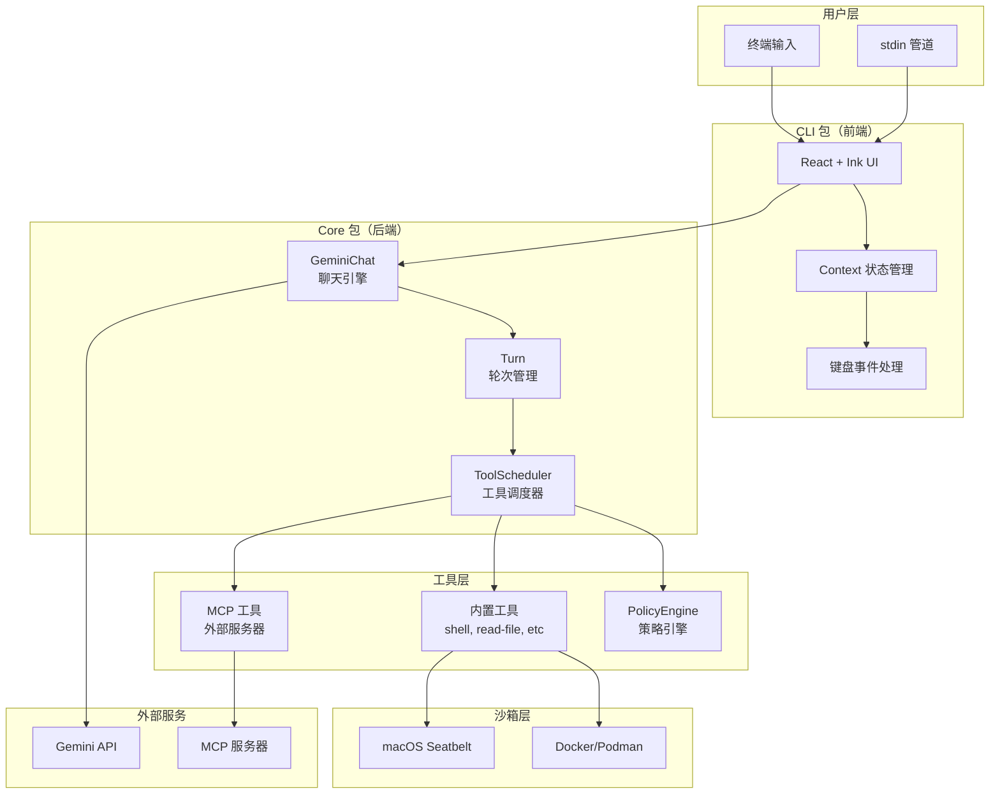
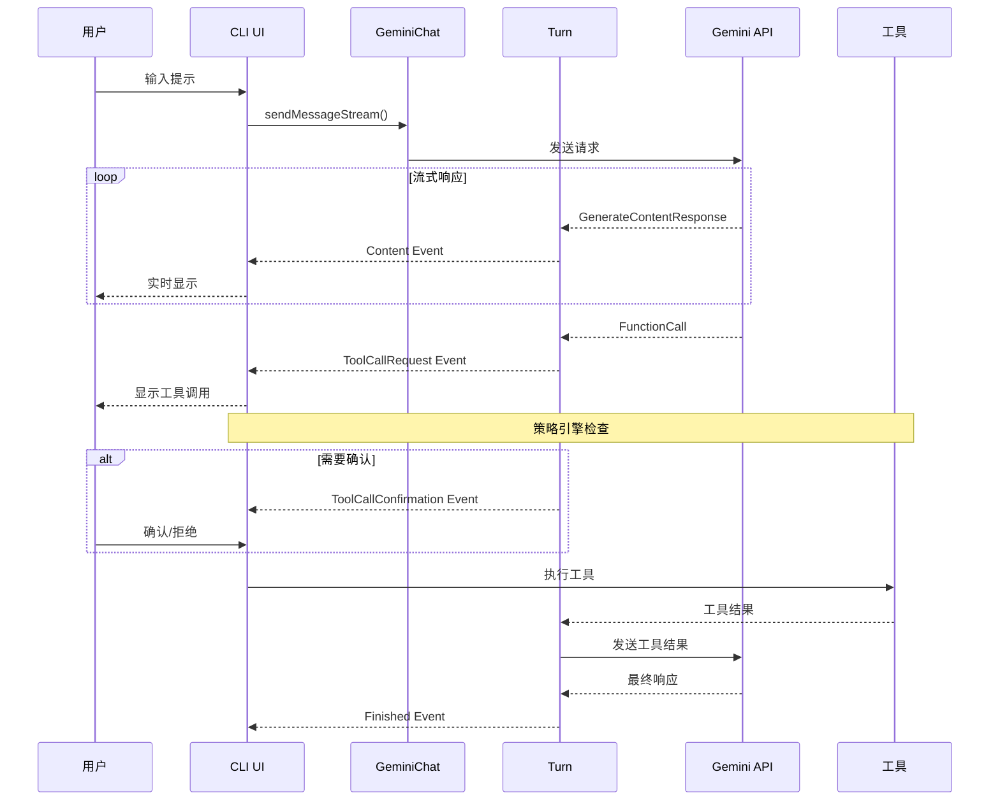

# Google Gemini CLI 研究报告

## 要点速览

| 维度 | 内容 |
|------|------|
| **定位** | 终端优先的 AI 编码代理，直接连接 Gemini API |
| **核心语言** | TypeScript（100%），Node.js 20+ 运行时 |
| **UI 框架** | React + Ink（终端 UI），269 个组件 |
| **安全机制** | PolicyEngine 策略引擎 + 多平台沙箱（macOS Seatbelt、Docker/Podman） |
| **协议设计** | 事件驱动架构 + MCP（Model Context Protocol）标准 |
| **AI 后端** | Gemini 2.5 Pro（1M token 上下文窗口） |
| **免费额度** | 60 请求/分钟，1000 请求/天（Google 账号登录） |

---

## 一、整体概览

### 1.1 项目定位与设计目标

Gemini CLI 是 Google 官方开源的终端 AI 代理，核心设计目标是：

1. **免费优先**：提供慷慨的免费额度，降低使用门槛
2. **终端原生**：为"生活在命令行"的开发者设计
3. **1M 上下文**：利用 Gemini 2.5 Pro 的超大上下文窗口处理大型代码库
4. **可扩展**：通过 MCP 协议支持自定义工具集成

### 1.2 目录结构概览

```
gemini-cli/
├── packages/                    # Monorepo 核心包
│   ├── cli/                     # 用户界面层（React + Ink）
│   │   ├── src/ui/             # 269 个 React 组件
│   │   ├── src/config/         # CLI 配置管理
│   │   └── src/gemini.tsx      # 主入口点
│   ├── core/                    # 后端核心逻辑
│   │   ├── src/core/           # 聊天引擎、Turn 管理
│   │   ├── src/tools/          # 50+ 内置工具
│   │   ├── src/policy/         # 策略引擎
│   │   └── src/mcp/            # MCP 协议集成
│   ├── a2a-server/             # Agent-to-Agent 服务器
│   ├── test-utils/             # 共享测试工具
│   └── vscode-ide-companion/   # VS Code 集成
├── docs/                        # 完整文档（27 个子目录）
├── schemas/                     # JSON Schema 定义
├── integration-tests/           # 集成测试套件
└── scripts/                     # 构建脚本（37 个文件）
```

### 1.3 核心模块职责表

| 模块名 | 职责 | 关键依赖 | 扩展点 |
|--------|------|----------|--------|
| `packages/cli` | 用户界面、终端渲染、状态管理 | React, Ink | UI 组件、快捷键 |
| `packages/core` | API 通信、工具调度、会话管理 | @google/genai | 工具注册、策略规则 |
| `core/geminiChat.ts` | 聊天引擎，流式响应处理 | genai SDK | 重试策略、Hook 系统 |
| `core/turn.ts` | 单轮对话管理，事件生成 | - | 事件类型 |
| `tools/*` | 50+ 内置工具实现 | - | 自定义工具 |
| `policy/policy-engine.ts` | 工具调用审批策略 | - | 策略规则 |
| `mcp/*` | MCP 协议客户端实现 | @modelcontextprotocol/sdk | MCP 服务器 |

---

## 二、核心架构设计

### 2.1 整体架构图



### 2.2 事件驱动架构

Gemini CLI 采用事件驱动架构，核心是 `GeminiEventType` 枚举定义的 17 种事件类型：

```typescript
// turn.ts 中定义的事件类型
export enum GeminiEventType {
  Content = 'content',                    // 文本内容
  ToolCallRequest = 'tool_call_request',  // 工具调用请求
  ToolCallResponse = 'tool_call_response',// 工具调用响应
  ToolCallConfirmation = 'tool_call_confirmation', // 工具确认
  UserCancelled = 'user_cancelled',       // 用户取消
  Error = 'error',                        // 错误
  ChatCompressed = 'chat_compressed',     // 上下文压缩
  Thought = 'thought',                    // 思考过程
  MaxSessionTurns = 'max_session_turns',  // 最大轮次
  Finished = 'finished',                  // 完成
  LoopDetected = 'loop_detected',         // 循环检测
  Citation = 'citation',                  // 引用
  Retry = 'retry',                        // 重试
  ContextWindowWillOverflow = 'context_window_will_overflow', // 上下文溢出
  InvalidStream = 'invalid_stream',       // 无效流
  ModelInfo = 'model_info',               // 模型信息
  AgentExecutionStopped = 'agent_execution_stopped',   // 执行停止
  AgentExecutionBlocked = 'agent_execution_blocked',   // 执行阻止
}
```

**事件流图**：



### 2.3 Turn 类：轮次管理核心

`Turn` 类是 Agent 循环的核心，管理单轮对话中的所有交互：

```typescript
// turn.ts
export class Turn {
  readonly pendingToolCalls: ToolCallRequestInfo[] = [];
  private debugResponses: GenerateContentResponse[] = [];
  finishReason: FinishReason | undefined = undefined;

  constructor(
    private readonly chat: GeminiChat,
    private readonly prompt_id: string,
  ) {}

  // 核心方法：运行轮次，生成事件流
  async *run(
    modelConfigKey: ModelConfigKey,
    req: PartListUnion,
    signal: AbortSignal,
  ): AsyncGenerator<ServerGeminiStreamEvent> {
    // 1. 发送消息到模型
    const responseStream = await this.chat.sendMessageStream(...);

    // 2. 处理流式响应
    for await (const event of responseStream) {
      // 3. 根据响应类型生成对应事件
      if (event.type === StreamEventType.CHUNK) {
        // 处理内容块
        yield { type: GeminiEventType.Content, value: text };
      }
      // 4. 处理工具调用
      if (functionCalls.length > 0) {
        yield { type: GeminiEventType.ToolCallRequest, value: toolCall };
      }
    }
  }
}
```

---

## 三、策略引擎与安全机制

### 3.1 PolicyEngine 策略引擎

Gemini CLI 使用 `PolicyEngine` 进行工具调用的权限控制：

```typescript
// policy-engine.ts
export class PolicyEngine {
  private rules: PolicyRule[];
  private checkers: SafetyCheckerRule[];
  private hookCheckers: HookCheckerRule[];
  private readonly defaultDecision: PolicyDecision;
  private approvalMode: ApprovalMode;

  constructor(config: PolicyEngineConfig = {}, checkerRunner?: CheckerRunner) {
    this.rules = (config.rules ?? []).sort(
      (a, b) => (b.priority ?? 0) - (a.priority ?? 0),
    );
    this.defaultDecision = config.defaultDecision ?? PolicyDecision.ASK_USER;
    this.approvalMode = config.approvalMode ?? ApprovalMode.DEFAULT;
  }

  // 检查工具调用是否允许
  async check(toolCall: FunctionCall, serverName?: string): Promise<PolicyDecision> {
    // 1. 匹配规则
    for (const rule of this.rules) {
      if (ruleMatches(rule, toolCall, stringifiedArgs, serverName)) {
        return rule.decision;
      }
    }
    // 2. 返回默认决策
    return this.defaultDecision;
  }
}
```

**策略决策类型**：

```typescript
export enum PolicyDecision {
  ALLOW = 'ALLOW',      // 允许执行
  DENY = 'DENY',        // 拒绝执行
  ASK_USER = 'ASK_USER', // 询问用户
}

export enum ApprovalMode {
  DEFAULT = 'default',           // 默认模式
  AUTO_APPROVE = 'auto_approve', // 自动批准
  YOLO = 'yolo',                 // 完全自动（危险）
}
```

**规则匹配逻辑**：

```typescript
function ruleMatches(
  rule: PolicyRule,
  toolCall: FunctionCall,
  stringifiedArgs: string | undefined,
  serverName: string | undefined,
  currentApprovalMode: ApprovalMode,
): boolean {
  // 1. 检查审批模式
  if (rule.modes && !rule.modes.includes(currentApprovalMode)) {
    return false;
  }

  // 2. 检查工具名（支持通配符）
  if (rule.toolName) {
    if (rule.toolName.endsWith('__*')) {
      // 通配符匹配：serverName__*
      const prefix = rule.toolName.slice(0, -3);
      if (!toolCall.name.startsWith(prefix + '__')) {
        return false;
      }
    } else if (toolCall.name !== rule.toolName) {
      return false;
    }
  }

  // 3. 检查参数模式（正则匹配）
  if (rule.argsPattern && !rule.argsPattern.test(stringifiedArgs)) {
    return false;
  }

  return true;
}
```

### 3.2 沙箱机制

Gemini CLI 支持多种沙箱方案：

#### macOS Seatbelt

```bash
# 启用 Seatbelt 沙箱
gemini -s -p "analyze the code structure"

# 可用的 Seatbelt 配置文件
# - permissive-open (默认): 写入限制，允许网络
# - permissive-closed: 写入限制，无网络
# - permissive-proxied: 写入限制，代理网络
# - restrictive-open: 严格限制，允许网络
# - restrictive-closed: 最大限制
```

#### Docker/Podman 容器沙箱

```bash
# 使用 Docker 沙箱
export GEMINI_SANDBOX=docker
gemini -p "run the test suite"

# 使用 Podman 沙箱
export GEMINI_SANDBOX=podman
gemini -p "run the test suite"

# 自定义沙箱标志
export SANDBOX_FLAGS="--security-opt label=disable"
```

#### 配置文件方式

```json
// settings.json
{
  "tools": {
    "sandbox": "docker"  // true | docker | podman | sandbox-exec
  }
}
```

### 3.3 工具确认流程

```typescript
// tools.ts
export abstract class BaseToolInvocation<TParams, TResult> {
  async shouldConfirmExecute(abortSignal: AbortSignal): Promise<ToolCallConfirmationDetails | false> {
    // 1. 获取策略决策
    const decision = await this.getMessageBusDecision(abortSignal);

    if (decision === 'ALLOW') {
      return false; // 无需确认
    }

    if (decision === 'DENY') {
      throw new Error('Tool execution denied by policy.');
    }

    if (decision === 'ASK_USER') {
      return this.getConfirmationDetails(abortSignal); // 返回确认详情
    }
  }

  // 用户确认后更新策略
  protected async publishPolicyUpdate(outcome: ToolConfirmationOutcome): Promise<void> {
    if (outcome === ToolConfirmationOutcome.ProceedAlways) {
      // 添加到允许列表
      await this.messageBus.publish({
        type: MessageBusType.UPDATE_POLICY,
        toolName: this._toolName,
        persist: true,
      });
    }
  }
}
```

---

## 四、工具系统

### 4.1 内置工具列表（50+）

| 工具名 | 功能 | 确认要求 |
|--------|------|----------|
| `shell` | 执行 Shell 命令 | 需确认 |
| `read-file` | 读取文件内容 | 无需确认 |
| `write-file` | 写入文件 | 需确认 |
| `edit` | 编辑文件 | 需确认 |
| `glob` | 文件模式匹配 | 无需确认 |
| `grep` / `ripGrep` | 文本搜索 | 无需确认 |
| `ls` | 列出目录 | 无需确认 |
| `web-fetch` | 网络请求 | 需确认 |
| `web-search` | Google 搜索 | 无需确认 |
| `memoryTool` | 内存管理 | 无需确认 |
| `write-todos` | 任务管理 | 无需确认 |
| `mcp-tool` | MCP 工具调用 | 取决于服务器信任设置 |
| `activate-skill` | 技能激活 | 无需确认 |

### 4.2 Shell 工具实现示例

```typescript
// shell.ts
export class ShellToolInvocation extends BaseToolInvocation<ShellToolParams, ToolResult> {
  async execute(
    signal: AbortSignal,
    updateOutput?: (output: string | AnsiOutput) => void,
    shellExecutionConfig?: ShellExecutionConfig,
  ): Promise<ToolResult> {
    const strippedCommand = stripShellWrapper(this.params.command);

    // 1. 检查取消信号
    if (signal.aborted) {
      return { llmContent: 'Command was cancelled.', returnDisplay: 'Cancelled.' };
    }

    // 2. 设置超时
    const timeoutMs = this.config.getShellToolInactivityTimeout();

    // 3. 执行命令
    const { result, pid } = await ShellExecutionService.execute(
      commandToExecute,
      cwd,
      signal,
      (event: ShellOutputEvent) => {
        // 4. 流式输出处理
        updateOutput?.(event.data);
      },
    );

    return result;
  }

  // 获取确认详情
  protected override async getConfirmationDetails(): Promise<ToolCallConfirmationDetails> {
    const rootCommands = getCommandRoots(this.params.command);
    return {
      type: 'exec',
      title: 'Confirm Shell Command',
      command: this.params.command,
      rootCommand: rootCommands.join(', '),
      onConfirm: async (outcome) => {
        await this.publishPolicyUpdate(outcome);
      },
    };
  }
}
```

### 4.3 MCP 工具集成

Gemini CLI 对 MCP 协议有完整支持：

```typescript
// 配置 MCP 服务器
// settings.json
{
  "mcpServers": {
    "pythonTools": {
      "command": "python",
      "args": ["-m", "my_mcp_server"],
      "env": { "API_KEY": "$MY_API_TOKEN" },
      "timeout": 30000,
      "trust": false  // 是否信任（跳过确认）
    }
  }
}
```

**MCP 工具发现流程**：

1. **连接建立**：根据配置选择传输方式（Stdio/SSE/HTTP）
2. **工具发现**：调用服务器的 `tools/list` 端点
3. **Schema 处理**：清理和验证工具定义
4. **冲突解决**：自动添加前缀（`serverName__toolName`）
5. **注册工具**：添加到全局工具注册表

---

## 五、UI 系统

### 5.1 React + Ink 架构

Gemini CLI 使用 React + Ink 构建终端 UI：

```tsx
// App.tsx
export const App = () => {
  const uiState = useUIState();
  const isAlternateBuffer = useAlternateBuffer();
  const isScreenReaderEnabled = useIsScreenReaderEnabled();

  if (uiState.quittingMessages) {
    return isAlternateBuffer
      ? <AlternateBufferQuittingDisplay />
      : <QuittingDisplay />;
  }

  return (
    <StreamingContext.Provider value={uiState.streamingState}>
      {isScreenReaderEnabled
        ? <ScreenReaderAppLayout />
        : <DefaultAppLayout />}
    </StreamingContext.Provider>
  );
};
```

### 5.2 Context 状态管理

```tsx
// 主要 Context
SettingsContext       // 全局设置
AppContext           // 应用状态
SessionContext       // 会话信息
UIStateContext       // UI 状态
StreamingContext     // 流传输状态
VimModeContext       // VIM 模式
KeypressContext      // 键盘事件
MouseContext         // 鼠标事件
ScrollContext        // 滚动状态
```

### 5.3 非交互模式

```typescript
// nonInteractiveCli.ts
export async function runNonInteractive({
  config,
  settings,
  input,
  prompt_id,
  resumedSessionData,
}: RunNonInteractiveParams): Promise<void> {
  // 1. 设置流输出格式
  const streamFormatter = config.getOutputFormat() === OutputFormat.STREAM_JSON
    ? new StreamJsonFormatter()
    : null;

  // 2. 设置取消处理
  const abortController = new AbortController();
  process.stdin.on('keypress', (str, key) => {
    if (key.ctrl && key.name === 'c') {
      abortController.abort();
    }
  });

  // 3. 处理事件流
  for await (const event of geminiClient.chat(input)) {
    switch (event.type) {
      case GeminiEventType.Content:
        process.stdout.write(event.value);
        break;
      case GeminiEventType.ToolCallRequest:
        // 自动执行（非交互模式）
        break;
      case GeminiEventType.Finished:
        return;
    }
  }
}
```

**输出格式选项**：

```bash
# 纯文本输出
gemini -p "explain this code"

# JSON 输出
gemini -p "explain this code" --output-format json

# 流式 JSON（NDJSON）
gemini -p "run tests and deploy" --output-format stream-json
```

---

## 六、认证系统

### 6.1 认证方式对比

| 方式 | 适用场景 | 免费额度 | 配置 |
|------|----------|----------|------|
| **Google OAuth** | 个人开发者 | 60 req/min, 1000 req/day | 浏览器登录 |
| **Gemini API Key** | 需要特定模型 | 100 req/day | `GEMINI_API_KEY` |
| **Vertex AI** | 企业用户 | 按量付费 | `GOOGLE_API_KEY` + `GOOGLE_GENAI_USE_VERTEXAI=true` |

### 6.2 OAuth 登录流程

```bash
# 启动 CLI，选择 "Login with Google"
gemini

# 如果使用 Code Assist License
export GOOGLE_CLOUD_PROJECT="YOUR_PROJECT_ID"
gemini
```

---

## 七、关键设计取舍

### 7.1 TypeScript vs Rust

| 维度 | Gemini CLI (TypeScript) | Codex (Rust) |
|------|------------------------|--------------|
| 启动速度 | 较慢（Node.js 冷启动） | 快（原生二进制） |
| 包体积 | 较大（需要 Node.js） | 小（单文件） |
| 开发效率 | 高 | 中等 |
| 生态兼容 | 丰富的 npm 生态 | 需要 FFI |
| UI 方案 | React + Ink（成熟） | ratatui（较新） |

**选择 TypeScript 的理由**：
- Google 内部 TypeScript 生态成熟
- React + Ink 提供丰富的终端 UI 能力
- 更快的迭代速度
- 与 MCP SDK 原生兼容

### 7.2 事件驱动 vs SQ/EQ 队列

| 方案 | 优点 | 缺点 | Gemini CLI 选择 |
|------|------|------|----------------|
| **事件驱动** | 简单直观、React 友好 | 调试稍难 | 是 |
| SQ/EQ 队列 | 解耦彻底、可测试 | 复杂度高 | 否 |

### 7.3 策略引擎设计

Gemini CLI 的策略引擎比 Codex 更灵活：

```typescript
// 支持的规则特性
interface PolicyRule {
  toolName?: string;           // 工具名（支持通配符）
  argsPattern?: RegExp;        // 参数正则匹配
  decision: PolicyDecision;    // 决策类型
  priority?: number;           // 优先级
  modes?: ApprovalMode[];      // 适用的审批模式
}

// 示例：自动允许所有 grep 命令
{
  toolName: 'shell',
  argsPattern: /^grep\s/,
  decision: PolicyDecision.ALLOW,
  priority: 100,
}
```

---

## 八、典型使用示例

### 8.1 基本使用

```bash
# 启动交互式会话
gemini

# 指定目录
gemini --include-directories ../lib,../docs

# 指定模型
gemini -m gemini-2.5-flash

# 非交互模式
gemini -p "Explain the architecture of this codebase"
```

### 8.2 配置文件示例

```json
// ~/.gemini/settings.json
{
  "theme": {
    "colorScheme": "dark"
  },
  "tools": {
    "sandbox": "docker"
  },
  "mcpServers": {
    "github": {
      "command": "npx",
      "args": ["-y", "@modelcontextprotocol/server-github"],
      "env": { "GITHUB_TOKEN": "$GITHUB_TOKEN" },
      "trust": true
    }
  }
}
```

### 8.3 与 MCP 服务器交互

```bash
# 在对话中使用 MCP 工具
> @github List my open pull requests
> @slack Send a summary to #dev channel

# 查看 MCP 服务器状态
/mcp

# 管理 MCP 服务器
gemini mcp add my-server python server.py
gemini mcp list
gemini mcp remove my-server
```

---

## 九、同类工具对比

| 维度 | Gemini CLI | Claude Code | Codex CLI | Aider |
|------|------------|-------------|-----------|-------|
| **语言** | TypeScript | TypeScript | Rust | Python |
| **UI 框架** | React + Ink | 原生终端 | ratatui | 原生终端 |
| **免费额度** | 慷慨 | 无 | 无 | 无 |
| **上下文窗口** | 1M tokens | 200K | 128K | 取决于模型 |
| **沙箱** | Seatbelt/Docker | 无 | 原生多平台 | 无 |
| **MCP 支持** | 完整 | 完整 | 完整 | 无 |
| **学习曲线** | 低 | 低 | 中 | 中 |

---

## 十、结论与建议

### 10.1 设计亮点总结

1. **免费优先**：慷慨的免费额度降低使用门槛
2. **React + Ink**：成熟的终端 UI 方案，组件化开发
3. **灵活的策略引擎**：支持规则优先级、正则匹配、审批模式
4. **完整的 MCP 支持**：工具发现、资源引用、OAuth 认证
5. **多种输出格式**：支持交互式、文本、JSON、流式 JSON

### 10.2 可借鉴的设计模式

| 模式 | 描述 | 适用场景 |
|------|------|----------|
| React + Ink | 终端 UI 组件化 | 需要丰富终端交互的 CLI |
| PolicyEngine | 灵活的策略规则系统 | 需要细粒度权限控制 |
| 事件类型枚举 | 明确的事件定义 | 事件驱动架构 |
| MCP 集成架构 | 工具发现、冲突解决 | 需要可扩展工具系统 |
| 多输出格式 | text/json/stream-json | CI/CD 集成场景 |

### 10.3 落地建议

1. **UI 参考**：如果你的 CLI 需要丰富的终端 UI，React + Ink 是成熟的选择
2. **策略引擎**：Gemini CLI 的 PolicyEngine 设计值得学习，支持规则优先级和正则匹配
3. **MCP 集成**：完整的 MCP 客户端实现可作为参考
4. **非交互模式**：多输出格式设计对 CI/CD 集成很友好

---

## 附录：技术栈速查

| 类别 | 技术选型 |
|------|----------|
| **语言** | TypeScript 5.3.3（严格模式） |
| **运行时** | Node.js 20+ |
| **UI 框架** | React 19.2 + Ink 6.4.7 |
| **API SDK** | @google/genai 1.30.0 |
| **MCP SDK** | @modelcontextprotocol/sdk 1.23.0 |
| **构建工具** | esbuild 0.25.0 |
| **测试框架** | Vitest 3.2.4 |
| **代码检查** | ESLint 9.24.0 + Prettier 3.5.3 |
| **数据验证** | Zod 3.25.76 |
| **Git 操作** | simple-git 3.28.0 |
| **代码解析** | web-tree-sitter 0.25.10 |
| **遥测** | OpenTelemetry 0.203.0 |
