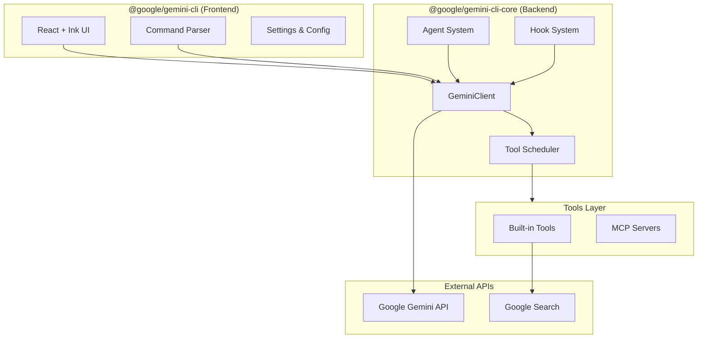
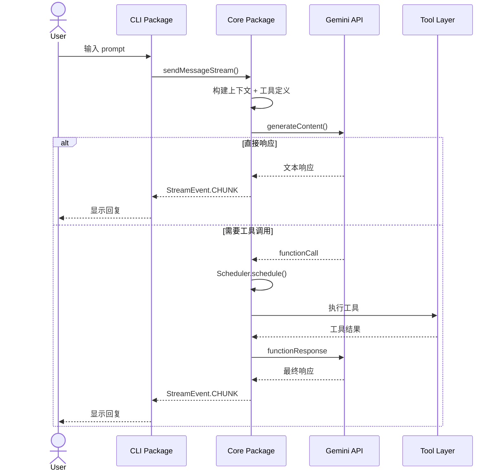
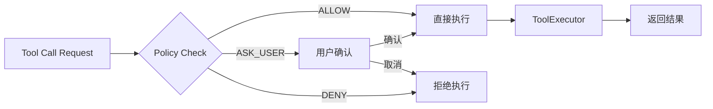
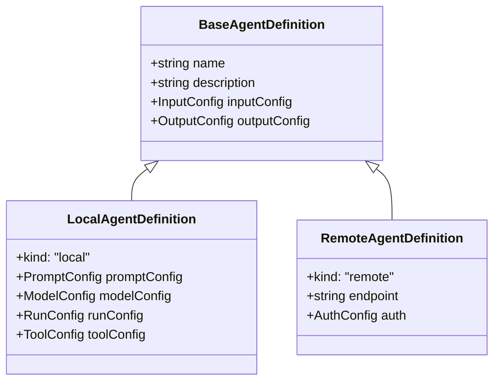
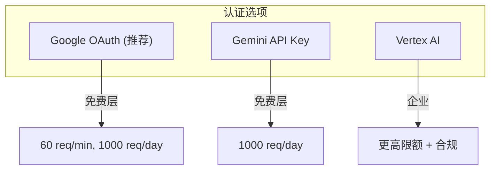

# Gemini CLI 源码分析报告

## 项目概述

**Gemini CLI** 是 Google 官方开源的 AI 终端助手，将 Gemini 大模型的能力直接带入命令行。它采用 **TypeScript + React (Ink)** 技术栈，采用 Monorepo 架构设计。

| 属性 | 信息 |
|------|------|
| **仓库** | https://github.com/google-gemini/gemini-cli |
| **许可证** | Apache 2.0 |
| **版本** | 0.28.0-nightly |
| **Node 要求** | >= 20.0.0 |
| **包管理器** | npm workspaces |

---

## 架构总览



### 核心设计原则

1. **前后端分离**: CLI 包负责 UI 和交互，Core 包负责业务逻辑和 API 通信
2. **工具化架构**: 所有功能通过 Tool 接口扩展，支持 MCP 协议
3. **事件驱动**: 使用 EventEmitter 实现模块间解耦
4. **类型安全**: 全面使用 TypeScript + Zod 进行运行时校验

---

## 包结构分析

### 1. @google/gemini-cli (Frontend)

路径: `packages/cli/`

| 目录 | 职责 |
|------|------|
| `src/ui/` | React 组件 + Ink 渲染逻辑 |
| `src/config/` | CLI 配置、设置加载、认证配置 |
| `src/commands/` | 斜杠命令处理 (`/help`, `/chat` 等) |
| `src/services/` | CLI 层服务（IDE 集成、更新检查） |
| `src/utils/` | 工具函数（终端主题、会话管理） |

**关键文件**:
- `gemini.tsx`: 应用入口，初始化 Ink 渲染
- `nonInteractiveCli.ts`: 非交互模式（脚本化使用）
- `ui/App.tsx`: 主应用组件

### 2. @google/gemini-cli-core (Backend)

路径: `packages/core/`

| 目录 | 职责 | 核心文件 |
|------|------|----------|
| `src/core/` | Gemini API 客户端、对话管理 | `client.ts`, `geminiChat.ts` |
| `src/tools/` | 工具实现 | `read-file.ts`, `shell.ts`, `mcp-client.ts` |
| `src/scheduler/` | 工具调度执行 | `scheduler.ts`, `tool-executor.ts` |
| `src/agents/` | Agent 系统 | `local-executor.ts`, `agentLoader.ts` |
| `src/hooks/` | Hook 扩展机制 | `hookSystem.ts`, `types.ts` |
| `src/services/` | 业务服务 | `contextManager.ts`, `shellExecutionService.ts` |
| `src/mcp/` | MCP 协议实现 | `oauth-provider.ts`, `mcp-client.ts` |
| `src/config/` | 配置管理 | `config.ts`, `models.ts` |
| `src/telemetry/` | 遥测数据收集 | `loggers.ts`, `clearcut-logger/` |

---

## 核心流程详解

### 对话流程 (Conversation Flow)



### 工具调度机制



**Scheduler 职责**:
1. 接收批量工具调用请求
2. 执行策略检查（Policy Check）
3. 协调用户确认流程
4. 调用 ToolExecutor 执行
5. 管理工具调用状态机

---

## 工具系统 (Tools)

### 内置工具清单

| 工具 | 功能 | 需确认 |
|------|------|--------|
| `read-file` | 读取文件内容 | 否 |
| `read-many-files` | 批量读取文件 | 否 |
| `write-file` | 写入/创建文件 | **是** |
| `edit` | 编辑文件（diff） | **是** |
| `ls` | 列出目录 | 否 |
| `glob` | 文件模式匹配 | 否 |
| `grep` | 文本搜索 | 否 |
| `ripGrep` | ripgrep 搜索 | 否 |
| `shell` | 执行 shell 命令 | **是** |
| `web-fetch` | 获取网页内容 | 否 |
| `web-search` | Google 搜索 | 否 |
| `memoryTool` | 记忆管理 | 否 |
| `mcp-client` | 调用 MCP 工具 | 配置决定 |
| `ask-user` | 向用户提问 | 否 |

### 工具接口设计

```typescript
// 伪代码：工具调用抽象
interface ToolInvocation<TParams, TResult> {
  params: TParams;
  getDescription(): string;           // 获取操作描述
  toolLocations(): ToolLocation[];    // 影响的路径
  shouldConfirmExecute(): Promise<ConfirmationDetails | false>;
  execute(signal: AbortSignal): Promise<TResult>;
}
```

### MCP 集成

支持 **Model Context Protocol**，可连接外部 MCP 服务器：

```typescript
// MCP 工具调用流程
MCP Server --(SSE/stdio)--> MCPClientManager --(tool call)--> Scheduler
```

**OAuth 支持**: `mcp/oauth-provider.ts` 实现完整的 OAuth 2.0 + PKCE 流程

---

## Agent 系统

### Agent 类型



### 内置 Agents

| Agent | 用途 |
|-------|------|
| `generalist-agent` | 通用任务处理 |
| `codebase-investigator` | 代码库分析 |
| `cli-help-agent` | CLI 帮助文档 |

---

## Hook 系统

Hook 允许用户在特定事件点执行自定义逻辑：

```typescript
enum HookEventName {
  BeforeTool = 'BeforeTool',      // 工具执行前
  AfterTool = 'AfterTool',        // 工具执行后
  BeforeAgent = 'BeforeAgent',    // Agent 执行前
  AfterAgent = 'AfterAgent',      // Agent 执行后
  SessionStart = 'SessionStart',  // 会话开始
  SessionEnd = 'SessionEnd',      // 会话结束
  BeforeModel = 'BeforeModel',    // 调用模型前
  AfterModel = 'AfterModel',      // 调用模型后
}
```

**Hook 类型**: 目前仅支持 `Command` 类型（执行外部命令）

---

## 配置系统

### 配置层级（优先级从高到低）

```
Project (.gemini/settings.json) > User (~/.gemini/settings.json) > System > Extensions
```

### 关键配置项

| 配置 | 说明 |
|------|------|
| `model` | 使用的 Gemini 模型 |
| `approvalMode` | 工具确认模式 ("always-ask" / "smart" / "none") |
| `mcpServers` | MCP 服务器配置 |
| `hooks` | Hook 定义 |
| `trustedFolders` | 受信任目录（免确认） |

---

## 认证方式



---

## 技术亮点

### 1. 对话压缩 (Chat Compression)

当对话历史超过 token 限制时，自动压缩早期对话：

```typescript
// ChatCompressionService
// 策略：摘要早期对话轮次，保留关键上下文
```

### 2. 循环检测 (Loop Detection)

检测模型是否陷入重复调用模式：

```typescript
// LoopDetectionService
// 监控工具调用模式，检测到循环时介入
```

### 3. 沙箱支持 (Sandboxing)

支持 Docker/Podman 沙箱执行 shell 命令：

```typescript
// 沙箱模式启动
GEMINI_SANDBOX=docker gemini
```

### 4. Token 缓存

支持 prompt caching 减少重复 token 消耗：

```typescript
// tokenLimits.ts 管理缓存策略
```

---

## 扩展点总结

| 扩展方式 | 实现 | 用途 |
|----------|------|------|
| **MCP Servers** | `settings.json` 配置 | 添加外部工具能力 |
| **Hooks** | `settings.json` 配置 | 事件拦截和自定义逻辑 |
| **Agents** | JSON 定义文件 | 专用任务处理 |
| **Skills** | `packages/core/src/skills/` | 内置技能扩展 |
| **Custom Commands** | `/command` 斜杠命令 | CLI 交互扩展 |

---

## 与 Claude Code 的对比

| 特性 | Gemini CLI | Claude Code |
|------|------------|-------------|
| **开发方** | Google | Anthropic |
| **模型** | Gemini 2.5 Flash/Pro | Claude 3.5/4 |
| **开源** | ✅ Apache 2.0 | ❌ 闭源 |
| **MCP 支持** | ✅ 完整支持 | ✅ 完整支持 |
| **Hook 系统** | ✅ 命令式 Hooks | ✅ 多语言 Hooks |
| **沙箱执行** | ✅ Docker/Podman | ✅ 内置沙箱 |
| **IDE 集成** | VS Code 插件 | VS Code/Cursor/JetBrains |
| **免费额度** | 1000 req/day | $20/月订阅 |
| **Agent 系统** | ✅ 本地 + 远程 | ✅ 子 Agent |
| **对话压缩** | ✅ 自动 | ✅ 自动 |

---

## 总结

Gemini CLI 是一个设计精良、架构清晰的 AI 终端工具：

1. **模块化设计**: 前后端分离，职责清晰
2. **可扩展性强**: MCP + Hook + Agent 三层扩展机制
3. **企业就绪**: OAuth、Vertex AI、遥测、策略控制
4. **开发者友好**: 完整的类型定义、丰富的内置工具

其开源特性（Apache 2.0）使其成为构建自定义 AI 终端工具的理想基础。
