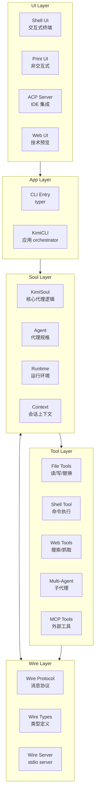
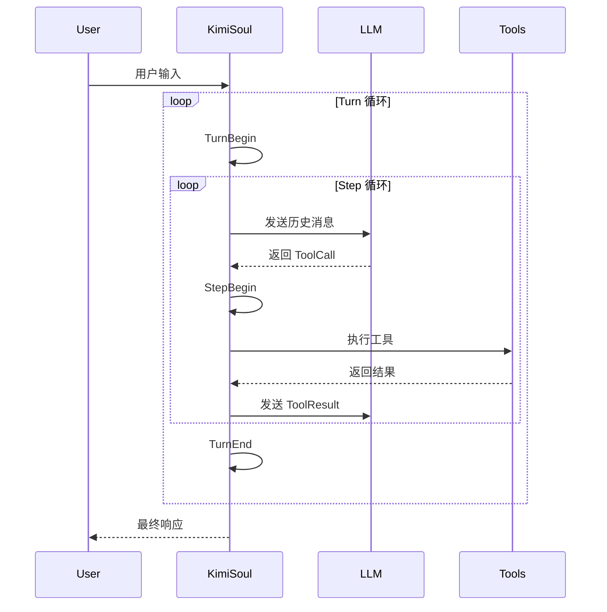
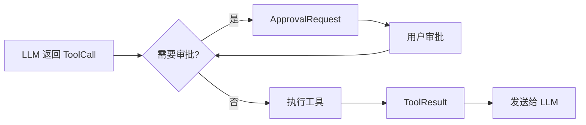
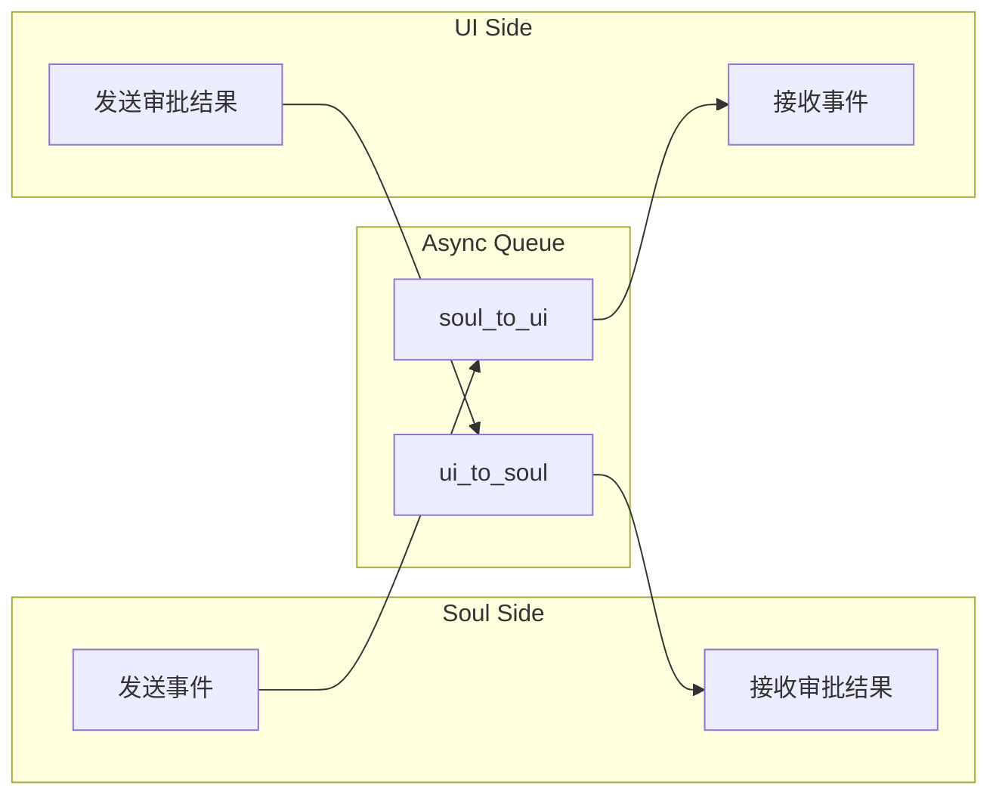
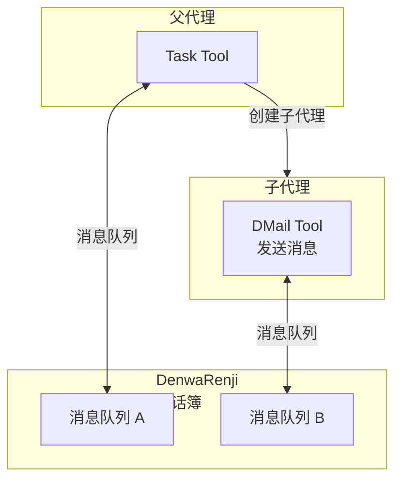

# Kimi-CLI 源码分析报告

## 项目概述

**Kimi Code CLI** 是 Moonshot AI 推出的开源 AI 编程助手，定位为 "Your next CLI agent"。它是一个在终端中运行的 AI 代理，帮助用户完成软件开发任务和终端操作。

| 属性 | 信息 |
|------|------|
| **仓库** | https://github.com/MoonshotAI/kimi-cli |
| **语言** | Python 3.12+ |
| **许可证** | Apache-2.0 |
| **包管理** | uv (modern Python package manager) |
| **核心依赖** | kosong, kaos, fastmcp, pydantic, typer |

---

## 架构全景

Kimi-CLI 采用**分层架构设计**，核心分为：UI 层、Soul 层、Tool 层和 Wire 通信层。



---

## 核心模块详解

### 1. Soul 层（核心代理引擎）

Soul 层是 Kimi-CLI 的**决策大脑**，负责协调 LLM 调用、工具执行和状态管理。

#### 1.1 KimiSoul

`KimiSoul` 是核心代理类，实现了 `Soul` 协议，管理 Agent 的执行循环。

```python
class KimiSoul:
    def __init__(self, agent: Agent, context: Context):
        self._agent = agent          # 代理规格
        self._runtime = agent.runtime # 运行时环境
        self._context = context       # 会话上下文
        self._compaction = SimpleCompaction()  # 上下文压缩
```

**核心职责：**
- **Turn 管理**: 一次用户输入到最终响应的完整周期
- **Step 执行**: 单次 LLM 调用 + 工具执行的循环
- **上下文压缩**: 当上下文窗口满时自动压缩历史消息
- **Slash 命令**: 处理 `/login`, `/web` 等特殊命令



#### 1.2 Runtime

`Runtime` 是 Agent 的运行时环境，包含所有依赖组件：

```python
@dataclass
class Runtime:
    config: Config              # 配置
    oauth: OAuthManager         # OAuth 认证
    llm: LLM | None            # LLM 实例
    session: Session           # 会话信息
    denwa_renji: DenwaRenji    # 电话簿（子代理通信）
    approval: Approval         # 操作审批
    labor_market: LaborMarket  # 子代理劳动力市场
    skills: dict[str, Skill]   # 技能库
```

#### 1.3 Agent 规格系统

Agent 使用 YAML 文件定义，支持继承和扩展：

```yaml
# agents/default/agent.yaml
name: default-agent
system_prompt_path: default-system-prompt.j2
tools:
  - ReadFile
  - WriteFile
  - Shell
  - SearchWeb
  # ...
subagents:
  researcher:
    path: researcher.yaml
    description: 专门用于研究的子代理
```

**设计亮点：**
- 使用 Jinja2 模板引擎渲染系统提示词
- 支持 `extend` 字段实现 Agent 继承
- 内置变量如 `KIMI_NOW`, `KIMI_WORK_DIR` 自动注入

---

### 2. Tool 层（工具系统）

工具层基于 `kosong` 库的 Toolset 构建，支持原生工具和 MCP 工具。

#### 2.1 工具分类

| 类别 | 工具 | 功能 |
|------|------|------|
| **文件** | ReadFile, WriteFile, StrReplaceFile | 文件读写和编辑 |
| **搜索** | Glob, Grep | 文件搜索和文本匹配 |
| **Shell** | Shell | 执行终端命令 |
| **Web** | SearchWeb, FetchURL | 网络搜索和页面抓取 |
| **多代理** | CreateSubagent, Task | 子代理创建和任务委派 |
| **其他** | Think, SetTodoList | 思考模式和待办列表 |

#### 2.2 MCP 集成

Kimi-CLI 原生支持 **MCP (Model Context Protocol)**：

```python
# 添加 MCP server
kimi mcp add --transport http context7 https://mcp.context7.com/mcp

# 或使用配置文件
kimi --mcp-config-file /path/to/mcp.json
```

**实现特点：**
- 支持 stdio 和 HTTP 两种传输方式
- 支持 OAuth 认证流程
- 工具超时可配置 (默认 60s)

#### 2.3 工具执行流程



---

### 3. Wire 层（通信协议）

Wire 是 Soul 和 UI 之间的**通信桥梁**，定义了标准化的消息协议。

#### 3.1 Wire 类型系统

```python
# 核心消息类型
WireMessage = (
    TurnBegin | TurnEnd |           # Turn 生命周期
    StepBegin | StepInterrupted |   # Step 生命周期
    ToolCallRequest | ToolResult |  # 工具调用
    ApprovalRequest | ApprovalResponse |  # 审批
    StatusUpdate |                  # 状态更新
    CompactionBegin | CompactionEnd  # 压缩事件
)
```

#### 3.2 Wire 双端设计



---

### 4. UI 层（多界面支持）

Kimi-CLI 支持多种 UI 模式，适应不同使用场景：

#### 4.1 Shell UI（交互式终端）

基于 `prompt-toolkit` 构建的富文本交互界面：

- **语法高亮**: 代码块自动着色
- **自动补全**: Tab 补全路径和命令
- **快捷键**: Ctrl-X 切换 Shell 模式
- **可视化**: 流式输出工具执行结果

#### 4.2 Print UI（非交互式）

用于脚本化和 CI/CD 场景：

```bash
# 单次执行模式
kimi --print "生成一个 Python 脚本"

# JSON 流输出
kimi --input-format stream-json --output-format stream-json
```

#### 4.3 ACP 模式（IDE 集成）

支持 **Agent Client Protocol**，可接入 VS Code、Zed、JetBrains：

```bash
kimi acp  # 启动 ACP server
```

#### 4.4 Web UI（技术预览）

基于 FastAPI + React 的图形界面：

```bash
kimi web  # 启动 Web UI
```

---

### 5. 配置系统

配置文件位于 `~/.kimi/config.toml`，使用 Pydantic 进行验证：

```toml
# 默认模型
default_model = "kimi-k2.5"
default_thinking = true

# 模型定义
[models.kimi-k2.5]
provider = "moonshot"
model = "kimi-k2.5"
max_context_size = 256000
capabilities = ["image_in", "thinking"]

# Provider 配置
[providers.moonshot]
type = "kimi"
base_url = "https://api.moonshot.cn/v1"
api_key = "sk-..."

# 循环控制
[loop_control]
max_steps_per_turn = 100
max_retries_per_step = 3
reserved_context_size = 50000
```

**环境变量覆盖：**
- `KIMI_BASE_URL` - 覆盖 API 地址
- `KIMI_API_KEY` - 覆盖 API 密钥
- `KIMI_MODEL_NAME` - 覆盖模型名称

---

## 多代理架构

Kimi-CLI 支持**分层多代理**架构，允许创建专用子代理处理特定任务。

### 子代理类型

| 类型 | 用途 | 生命周期 |
|------|------|----------|
| **Fixed Subagent** | 预定义的专业代理 | 持久化 |
| **Dynamic Subagent** | 临时创建的专用代理 | 任务结束后销毁 |

### 通信机制

子代理通过 `DenwaRenji`（电话簿）进行通信：



---

## 依赖分析

### 核心依赖

| 包名 | 用途 | 备注 |
|------|------|------|
| **kosong** | Agent 框架核心 | Moonshot 自研 |
| **kaos** | 异步文件系统 | Moonshot 自研，替代 aiofiles |
| **pykaos** | Kaos 的 Python 绑定 | |
| **fastmcp** | MCP 协议实现 | |
| **prompt-toolkit** | 终端交互 | |
| **typer** | CLI 框架 | |
| **pydantic** | 数据验证 | |
| **rich** | 终端富文本 | |

### Workspace 结构

```
├── packages/
│   ├── kosong/          # Agent 框架
│   ├── kaos/            # 异步文件系统
│   └── kimi-code/       # 核心包
├── sdks/
│   └── kimi-sdk/        # SDK
└── src/kimi_cli/        # 主代码
```

---

## 设计亮点

### 1. 异步优先架构

全盘使用 `asyncio`，从文件操作到网络请求：

```python
# 使用 kaos 替代标准 open
from kaos.path import KaosPath
content = await KaosPath("file.txt").read_text()
```

### 2. 类型安全

- 使用 Pydantic 进行运行时验证
- Pyright 严格模式类型检查
- 自定义类型如 `ProviderType`, `ModelCapability`

### 3. 错误处理

定义了清晰的异常层次：

```python
KimiCLIException
├── ConfigError          # 配置错误
├── AgentSpecError       # Agent 规格错误
├── MCPConfigError       # MCP 配置错误
├── MCPRuntimeError      # MCP 运行时错误
├── LLMNotSet           # LLM 未设置
├── LLMNotSupported     # LLM 不支持
└── MaxStepsReached     # 达到最大步数
```

### 4. 可观测性

- 使用 `loguru` 进行结构化日志
- 支持 `--debug` 模式查看详细日志
- Wire 消息可持久化到文件

---

## 与 Claude Code 对比

| 特性 | Kimi-CLI | Claude Code |
|------|----------|-------------|
| **主体模型** | Kimi K2.5 | Claude 4 |
| **开源** | ✅ 完全开源 | ❌ 闭源 |
| **MCP 支持** | ✅ 原生支持 | ✅ 原生支持 |
| **多代理** | ✅ 内置 | ⚠️ 实验性 |
| **IDE 集成** | ACP 协议 | 专属扩展 |
| **架构** | 模块化 Soul | 集中式 |
| **包管理** | uv | npm |

---

## 总结

Kimi-CLI 是一个**设计精良、架构清晰**的开源 AI 编程助手：

1. **分层架构**: Soul-Tool-Wire-UI 四层分离，职责清晰
2. **多模态 UI**: 支持 Shell、Print、ACP、Web 多种界面
3. **开放生态**: 原生支持 MCP，可扩展外部工具
4. **多代理**: 内置子代理系统，支持复杂任务分解
5. **类型安全**: 全链路类型检查，减少运行时错误

**适用场景：**
- 需要完全可控的 AI 编程助手
- 需要与自有基础设施深度集成
- 研究 AI Agent 架构的学习材料

---

*报告生成时间: 2025-02-04*
*分析版本: kimi-cli v1.6*
