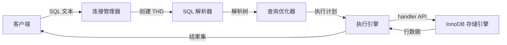

# MySQL Server 架构深度分析

## 版本信息
MySQL 9.6.0 (INNOVATION)

---

## 1. 核心矛盾与存在意义 (The "Why")

### 痛点还原
在没有 MySQL 这类关系型数据库之前，开发者面临的"灾难"：

1. **数据孤岛噩梦**：每个应用都要自己实现文件存储格式，数据分散在成百上千个自定义文件中，无法跨应用共享
2. **并发地狱**：自己用文件锁（flock）处理多进程读写，稍有不慎就是数据损坏或死锁
3. **查询复杂度爆炸**：为了查询一条关联数据，需要手动遍历多个文件，代码里充斥着复杂的嵌套循环
4. **崩溃恢复无解**：程序突然崩溃后，文件处于半写状态，数据完整性无法保证
5. **扩展天花板**：数据量增大时，没有索引机制，查询性能从毫秒级暴跌到分钟级

### 一句话定义
MySQL 是一个**将磁盘上的字节组织成"表格"，并通过 SQL 这门声明式语言，让开发者用"说想要什么"代替"写怎么拿"的存储引擎调度系统**。

### 适用场景

| 必须使用 | 杀鸡用牛刀 |
|---------|-----------|
| 需要 ACID 事务保障的金融/订单系统 | 简单的配置存储（用 SQLite 或 YAML 即可） |
| 多表关联查询的复杂业务系统 | 纯缓存场景（用 Redis 更合适） |
| 需要主从复制的高可用架构 | 日志流水记录（用 Kafka/ClickHouse 更优） |
| 需要灵活索引支持的动态查询 | 单机且数据量极小（< 1万条）的玩具项目 |

---

## 2. 静态架构解剖 (The "Static Structure")

### 核心模块概览

| 模块名称 | 核心职责 (大白话) | 复杂度 | 核心地位 |
|---------|------------------|--------|---------|
| **SQL 解析器 (Parser)** | 把 "SELECT * FROM users WHERE id=1" 这样的字符串，转换成一棵"语法树" | 高 | 灵魂 |
| **查询优化器 (Optimizer)** | 面对多种查询方案（走哪个索引？先 JOIN 哪张表？），算出成本最低的执行路径 | 极高 | 灵魂 |
| **执行引擎 (Executor)** | 按照优化器给的"路线图"，一步步调用存储引擎接口拿数据 | 中 | 骨架 |
| **InnoDB 存储引擎** | 真正干苦力活的：把数据分页存到磁盘、维护 B+ 树索引、保证事务 ACID | 极高 | 灵魂 |
| **事务/锁管理器** | 协调多个客户端同时读写时的并发控制，处理死锁检测 | 高 | 骨架 |
| **Binlog 复制模块** | 把所有写操作记录下来，让从库可以"复刻"主库的数据变更 | 高 | 皮肉 |
| **连接/线程管理器** | 处理客户端连接、权限验证、为每个连接分配独立线程 | 中 | 骨架 |

### 模块详解

#### 1. SQL 解析器 (Parser)
- **入口文件**: `sql/sql_parse.cc`, `sql/lex.h`
- **职责**: 词法分析 → 语法分析 → 生成语法树 (Parse Tree)
- **关键技巧**: 使用 Bison/Yacc 生成语法分析器，MySQL 的 SQL 方言支持非常复杂

#### 2. 查询优化器 (Optimizer)
- **入口文件**: `sql/sql_optimizer.cc`, `sql/join_optimizer/`
- **职责**:
  - 基于成本的优化 (CBO)：统计表/索引的 cardinality，估算不同执行路径的代价
  - 使用 Hypergraph 算法处理多表 JOIN 的最优顺序
  - 决定是否使用索引、是否进行覆盖索引扫描
- **创新点**: MySQL 8.0+ 引入了 Hypergraph 优化器，取代了早期的贪心算法

#### 3. 执行引擎 (Executor)
- **入口文件**: `sql/sql_base.cc`, `sql/handler.cc`
- **职责**: 遍历语法树，通过 handler 接口调用存储引擎的读写方法
- **设计模式**: 基于迭代器模式 (Volcano Model)，每个操作符都实现 `next()` 接口

#### 4. InnoDB 存储引擎
- **入口文件**: `storage/innobase/srv/srv0srv.cc`, `storage/innobase/buf/buf0buf.cc`
- **核心子模块**:
  | 子模块 | 职责 |
  |-------|------|
  | **Buffer Pool** | 内存中的数据页缓存，减少磁盘 I/O |
  | **Redo Log** | 崩溃恢复的关键，保证已提交事务不丢失 |
  | **Undo Log** | 实现 MVCC，支持事务回滚和非阻塞读 |
  | **B+ Tree 索引** | 数据按主键聚簇存储，二级索引通过主键回表 |
  | **Lock System** | 行级锁的实现，包括共享锁、排他锁、间隙锁 |

#### 5. 事务/锁管理器
- **入口文件**: `storage/innobase/trx/trx0trx.cc`, `storage/innobase/lock/lock0lock.cc`
- **职责**:
  - 实现 MVCC（多版本并发控制），让读写互不阻塞
  - 死锁检测：构建等待图，发现环路时选择牺牲者

#### 6. Binlog 复制模块
- **入口文件**: `sql/binlog.cc`, `sql/rpl_replica.cc`
- **职责**:
  - 记录所有数据变更操作（逻辑日志）
  - 支持主从复制、Point-in-Time 恢复
  - 半同步复制、组复制等高级特性

#### 7. 连接/线程管理器
- **入口文件**: `sql/mysqld.cc`, `sql/sql_connect.cc`
- **职责**:
  - 监听端口、接受连接
  - 权限验证（user/password/database）
  - 为每个连接创建 THD 对象（Thread Handle Data）

---

## 3. 动态核心链路追踪 (The "Dynamic Flow")

### 典型场景：执行一条查询语句 `SELECT name FROM users WHERE id = 100`



### 详细数据流转

```
┌─────────────────────────────────────────────────────────────────────────────┐
│  1. 连接建立阶段                                                               │
│     客户端 ──TCP──> mysqld ──> 创建 THD (Thread Handle Data)                  │
│                              ──> 权限验证 (user/password/db)                  │
└─────────────────────────────────────────────────────────────────────────────┘
                                       │
                                       ▼
┌─────────────────────────────────────────────────────────────────────────────┐
│  2. 解析阶段 (sql/sql_parse.cc)                                              │
│     SQL 字符串 "SELECT name FROM users WHERE id=100"                          │
│         │                                                                     │
│         ▼                                                                     │
│     [词法分析器] ──> Token 序列: SELECT, name, FROM, users, WHERE, id, =, 100   │
│         │                                                                     │
│         ▼                                                                     │
│     [语法分析器] ──> 语法树 (SELECT_LEX):                                     │
│                      - 查询类型: SELECT                                       │
│                      - 列: name                                               │
│                      - 表: users                                              │
│                      - 条件: id = 100                                         │
└─────────────────────────────────────────────────────────────────────────────┘
                                       │
                                       ▼
┌─────────────────────────────────────────────────────────────────────────────┐
│  3. 优化阶段 (sql/sql_optimizer.cc)                                          │
│     语法树                                                                     │
│         │                                                                     │
│         ▼                                                                     │
│     [逻辑优化] ──> 常量折叠、子查询展开、视图合并                               │
│         │                                                                     │
│         ▼                                                                     │
│     [物理优化] ──> 估算不同执行路径成本:                                        │
│                      方案A: 全表扫描 (cost=1000)                               │
│                      方案B: 走主键索引 id=100 (cost=1)  ✅ 胜出                │
│         │                                                                     │
│         ▼                                                                     │
│     执行计划 (QEP): 使用索引 ref access，估计返回 1 行                          │
└─────────────────────────────────────────────────────────────────────────────┘
                                       │
                                       ▼
┌─────────────────────────────────────────────────────────────────────────────┐
│  4. 执行阶段 (sql/sql_base.cc -> handler.cc)                                 │
│     执行计划                                                                     │
│         │                                                                     │
│         ▼                                                                     │
│     [执行引擎] ──> ha_innobase::index_read()                                  │
│         │                                                                     │
│         ▼                                                                     │
│     [InnoDB 层]                                                                │
│         │                                                                     │
│         ├──> 1. 检查 Buffer Pool 中是否已有该页                                │
│         │       命中? ──> 直接读取                                             │
│         │       未命中? ──> 从磁盘加载到 Buffer Pool                           │
│         │                                                                     │
│         ├──> 2. 通过 B+ Tree 查找 id=100 的记录                                │
│         │       - 从根页开始遍历                                               │
│         │       - 叶子页中找到 id=100 的索引项                                  │
│         │                                                                     │
│         └──> 3. 返回行数据 (name 列的值)                                        │
│                                                                             │
│     [回传] ──> 结果集包装 ──> 发送给客户端                                      │
└─────────────────────────────────────────────────────────────────────────────┘
```

### 事务场景的数据流（带 ACID 保证）

```
┌─────────────────────────────────────────────────────────────────────────────┐
│  BEGIN; INSERT INTO users VALUES (1, 'Alice'); COMMIT;                        │
└─────────────────────────────────────────────────────────────────────────────┘

   1. BEGIN
      └──> 创建事务对象 (trx_t)，分配事务 ID
      └──> 开启 MVCC 视图（记录当前活跃事务列表）

   2. INSERT
      └──> 写入 Buffer Pool 的数据页（标记为脏页）
      └──> 写 Undo Log（用于回滚和 MVCC）
      └──> 写 Redo Log（保证崩溃恢复）
      └──> 写 Binlog（用于复制）

   3. COMMIT
      └──> 两阶段提交 (2PC)
            ├──> Prepare 阶段: 刷 Redo Log 到磁盘 (fsync)
            └──> Commit 阶段: 刷 Binlog 到磁盘，写入 commit 标记
      └──> 释放行锁、事务结束
```

---

## 4. 架构评价 (The Trade-off)

### 设计亮点

#### 1. **存储引擎插件化架构**
MySQL 最 brilliant 的设计是 **Handler 接口**（`sql/handler.h`）。它将存储引擎抽象成一套统一的 API：
- `ha_open()`, `ha_close()` - 打开/关闭表
- `ha_index_read()`, `ha_rnd_next()` - 读取数据
- `ha_write_row()`, `ha_delete_row()` - 修改数据

这使得 MySQL 可以像换硬盘一样换存储引擎：
- **InnoDB**: 支持事务，适合 OLTP
- **MyISAM**: 无事务但快，适合读多写少的日志
- **Memory**: 纯内存存储，适合临时表
- **NDB**: 分布式存储，适合高可用集群

#### 2. **MVCC 实现机制**
InnoDB 的 MVCC 设计非常精巧：
- 每行数据都包含 `DB_TRX_ID`（最后修改事务 ID）和 `DB_ROLL_PTR`（回滚指针）
- SELECT 时根据事务启动时的 Read View 判断可见性，无需加锁
- 读写互不阻塞，实现了"快照读"

#### 3. **Redo Log 的崩溃恢复设计**
- 先写 Redo Log（顺序写，性能高），再刷脏页（随机写，性能低）
- 即使崩溃，重启时通过 Redo Log "重放"即可恢复数据
- 采用 CheckPoint 机制，平衡恢复时间和性能

### 潜在代价

#### 1. **架构复杂度爆炸**
- 代码量巨大：仅 SQL 层就 48 万+ 行 C++ 代码
- 模块间耦合严重：THD 对象贯穿整个系统，成为"上帝对象"
- 学习曲线陡峭：一个 SQL 查询可能要经过 20+ 个文件的协同处理

#### 2. **性能与功能的权衡**
- **事务开销**：为了保证 ACID，每次写入都要写 Redo、Undo、Binlog，性能是纯文件写入的 1/10
- **锁粒度**：虽然支持行锁，但大量行锁会占用内存，且死锁检测有 CPU 开销
- **Buffer Pool 污染**：全表扫描会把热点数据挤出缓存，影响整体性能

#### 3. **分布式时代的局限**
- MySQL 是为单机设计的，虽然可以通过主从复制扩展读，但**写入无法水平扩展**
- 组复制 (Group Replication) 虽然提供了强一致性，但性能代价巨大
- 面对 PB 级数据，必须引入分库分表中间件（如 Vitess、ShardingSphere），架构复杂度倍增

#### 4. **技术债务累积**
- 代码历史包袱重：很多代码为了向后兼容而存在
- 存储过程和触发器等功能实际很少使用，但维护成本持续存在
- 配置参数多达 500+ 个，调优成为一门"玄学"

---

## 总结

MySQL 是一个**工程上的奇迹，但也是历史的包袱**。它在单机关系型数据库领域做到了极致：
- 通过 **存储引擎插件化** 实现了灵活的存储策略
- 通过 **MVCC + 行锁** 在并发和一致性间找到平衡点
- 通过 **Redo/Undo Log** 实现了可靠的崩溃恢复

但在云原生和分布式数据库时代，MySQL 的架构显得有些"力不从心"。TiDB、CockroachDB 等 NewSQL 数据库正在用"计算存储分离 + 分布式事务"的新架构挑战它的地位。

不过，MySQL 依然是最值得深入学习的开源数据库——理解了它的设计，你就理解了关系型数据库的本质。

---

## 核心文件速查

| 功能 | 关键文件 |
|------|---------|
| 主入口 | `sql/mysqld.cc` |
| SQL 解析 | `sql/sql_parse.cc`, `sql/lex.h` |
| 查询优化 | `sql/sql_optimizer.cc`, `sql/join_optimizer/` |
| 执行引擎 | `sql/sql_base.cc`, `sql/handler.cc` |
| InnoDB 核心 | `storage/innobase/srv/srv0srv.cc` |
| Buffer Pool | `storage/innobase/buf/buf0buf.cc` |
| 事务管理 | `storage/innobase/trx/trx0trx.cc` |
| 锁管理 | `storage/innobase/lock/lock0lock.cc` |
| Redo Log | `storage/innobase/log/log0log.cc` |
| Binlog | `sql/binlog.cc` |
| 复制 | `sql/rpl_replica.cc` |
