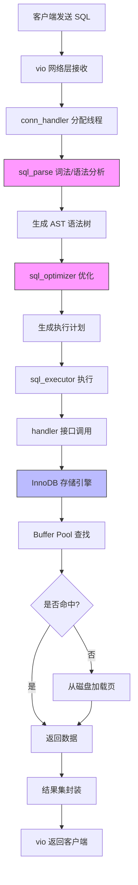
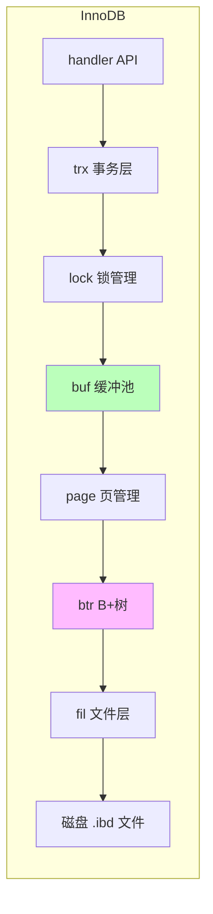

# MySQL Server 架构分析

> 分析日期：2026-02-25
> 源码路径：vendors/mysql-server

---

## 1. 核心矛盾与存在意义 (The "Why")

### 痛点还原

在没有关系型数据库之前，开发者面临着以下"灾难"：

1. **数据持久化的混乱**：每个应用都要自己实现文件存储逻辑，数据格式五花八门，解析容易出错
2. **并发访问的噩梦**：多进程同时读写文件，数据一致性全靠手工加锁，一个不小心就数据损坏
3. **查询能力的匮乏**：想按条件筛选数据？自己写解析器。想要排序？自己实现。想要关联查询？祝你好运
4. **事务的缺失**：银行转账扣了 A 的钱，程序崩溃了，B 没收到钱，钱就这么消失了
5. **数据安全裸奔**：没有权限控制，没有备份机制，没有崩溃恢复

### 一句话定义

MySQL 是一个**实现了 ACID 事务特性的关系型数据库管理系统**，通过**存储引擎抽象层**将 SQL 逻辑与物理存储解耦，让开发者只需关心"查什么"，而不用操心"怎么存"。

### 适用场景

| 场景 | 是否推荐 | 原因 |
|------|---------|------|
| OLTP 业务系统（电商、金融、SaaS） | ✅ 必须 | 事务支持、行级锁、崩溃恢复 |
| 中小规模数据（TB 级别以下） | ✅ 推荐 | 成熟稳定、生态完善 |
| 读多写少的场景 | ✅ 推荐 | 主从复制、读写分离 |
| 超大规模数据分析（PB 级） | ❌ 杀鸡用牛刀 | 用 ClickHouse、Spark 更合适 |
| 嵌入式场景 | ❌ 过重 | 用 SQLite 更轻量 |
| 纯键值存储 | ❌ 浪费 | 用 Redis 更高效 |

---

## 2. 静态架构解剖 (The "Static Structure")

```
mysql-server/
├── sql/              # 核心服务器层 (717 个文件，灵魂所在)
├── storage/          # 存储引擎层
├── include/          # 公共头文件
├── mysys/            # 系统工具库
├── vio/              # 虚拟 I/O 层
├── libmysql/         # 客户端库
├── components/       # 组件系统
├── plugin/           # 插件目录
└── client/           # 客户端工具
```

### 核心模块表

| 模块名称 | 核心职责 | 复杂度 | 核心地位 |
|---------|---------|--------|---------|
| **sql/sql_parse** | SQL 解析器：把 SQL 字符串变成语法树(AST) | 高 | 灵魂 |
| **sql/sql_optimizer** | 查询优化器：决定用哪个索引、怎么 JOIN、执行顺序 | 极高 | 灵魂 |
| **sql/sql_executor** | 查询执行器：按优化器的计划执行，调用存储引擎 | 中 | 骨架 |
| **sql/handler** | 存储引擎抽象接口：定义了 handlerton 和 handler 类 | 高 | 灵魂 |
| **storage/innobase** | InnoDB 存储引擎：事务、MVCC、B+ 树、Buffer Pool | 极高 | 灵魂 |
| **sql/binlog** | 二进制日志：主从复制、数据恢复的基石 | 高 | 骨架 |
| **sql/dd** | 数据字典：存储表结构、索引等元数据 | 中 | 骨架 |
| **sql/conn_handler** | 连接管理：处理客户端连接、线程调度 | 中 | 骨架 |
| **mysys** | 系统工具库：内存管理、线程、文件操作等基础设施 | 中 | 骨架 |
| **vio** | 虚拟 I/O：网络通信抽象层，支持 SSL | 低 | 皮肉 |

---

## 3. 动态核心链路追踪 (The "Dynamic Flow")

### 典型场景：执行一条 SELECT 查询

```sql
SELECT * FROM users WHERE id = 123;
```



### 数据流转详解

| 阶段 | 输入 | 输出 | 关键变化 |
|-----|------|------|---------|
| **网络接收** | TCP 字节流 | 原始 SQL 字符串 | 协议解析、解压缩 |
| **连接调度** | 连接请求 | THD 线程上下文 | 创建/复用线程，初始化会话环境 |
| **SQL 解析** | `SELECT * FROM...` | LEX 结构体 + AST | 词法分析 → 语法分析 → 语义检查 |
| **查询优化** | AST | QEP_TAB 执行计划 | 基于 Cost 选择索引、决定 JOIN 顺序 |
| **执行器** | 执行计划 | 迭代器树 | 生成 RowIterator，火山模型拉取数据 |
| **存储引擎** | `id=123` 条件 | 行数据 | 通过 handler API 调用 InnoDB |
| **Buffer Pool** | 页号 | 内存中的页 | LRU 淘汰、脏页刷盘 |

### InnoDB 内部数据流



---

## 4. 架构评价 (The Trade-off)

### 设计亮点

#### 1. 存储引擎插件化（最精彩的设计）

```cpp
// handler.h - 存储引擎抽象接口
class handler {
  virtual int open(const char *name, int mode, uint test_if_locked) = 0;
  virtual int rnd_next(uchar *buf) = 0;
  virtual int index_read(uchar *buf, const uchar *key, ...) = 0;
  // ... 50+ 虚函数
};
```

**为什么精彩？**
- 上层 SQL 处理完全不知道底层是 InnoDB、MyISAM 还是 Memory
- 换引擎就像换轮胎，不改车身
- 第三方可以开发自己的存储引擎（如 RocksDB、Spider）

#### 2. 两阶段提交保证 Binlog 与 Redo Log 一致性

```
Prepare Phase:
  1. InnoDB 写 Redo Log（prepare 状态）
  2. 返回成功

Commit Phase:
  3. 写 Binlog
  4. InnoDB 写 Redo Log（commit 状态）
```

**为什么精彩？**
- 崩溃恢复时可以根据两份日志的状态判断事务是否完整
- 主从复制不会丢数据

#### 3. MVCC 多版本并发控制

- 读不阻塞写，写不阻塞读
- 通过 Undo Log 构建历史版本

### 潜在代价

| 设计决策 | 收益 | 代价 |
|---------|------|------|
| 存储引擎抽象 | 灵活性、可扩展性 | 函数调用开销、优化难以下沉 |
| MVCC | 高并发读写 | Undo Log 空间膨胀、需要定期清理 |
| ACID 事务 | 数据一致性 | 性能开销（fsync 是性能杀手） |
| B+ 树索引 | 范围查询高效 | 写放大、空间碎片 |
| 单进程多线程 | 上下文切换快 | 某些场景锁竞争严重 |

### 架构演进观察

1. **8.0 重大变化**：数据字典从 .frm 文件迁移到 InnoDB 表（`sql/dd` 模块）
2. **组件化**：引入 components 系统，拆解 monolithic 的 mysqld
3. **直方图**：`sql/histograms` 提供更好的统计信息支持优化器
4. **新优化器**：`sql/join_optimizer` 基于超图的 Join 优化

---

## 附录：关键文件速查

| 文件路径 | 作用 |
|---------|------|
| `sql/sql_parse.cc` | SQL 解析入口 |
| `sql/sql_optimizer.cc` | 查询优化主逻辑 |
| `sql/sql_executor.cc` | 查询执行器 |
| `sql/handler.h` | 存储引擎接口定义 |
| `sql/binlog.cc` | Binlog 核心实现（38 万行！） |
| `storage/innobase/handler/ha_innodb.cc` | InnoDB 对 handler 接口的实现 |
| `storage/innobase/buf/buf0buf.cc` | Buffer Pool 实现 |
| `storage/innobase/btr/btr0btr.cc` | B+ 树操作 |
| `mysys/my_alloc.cc` | 内存池实现 |
