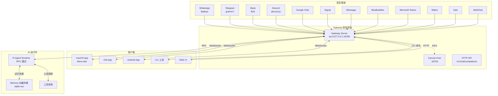
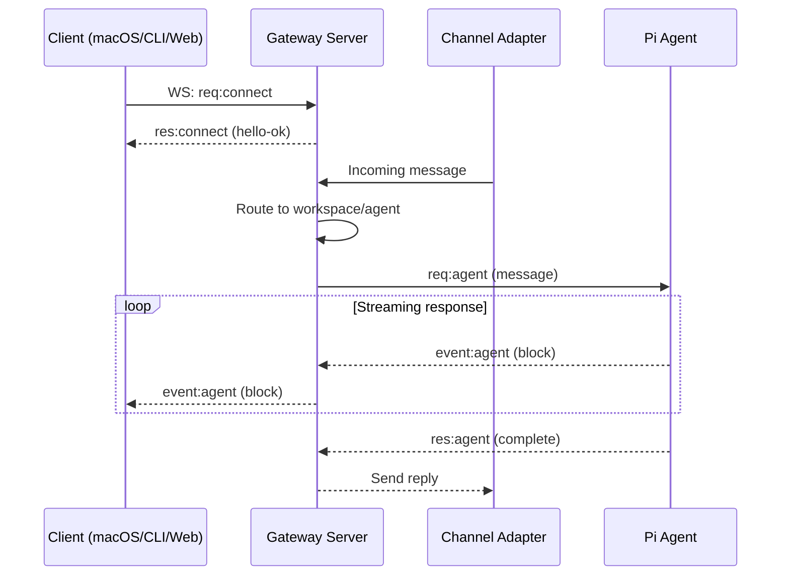
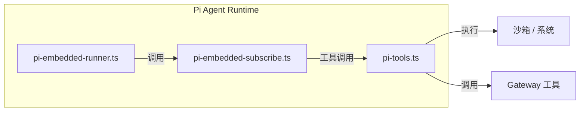
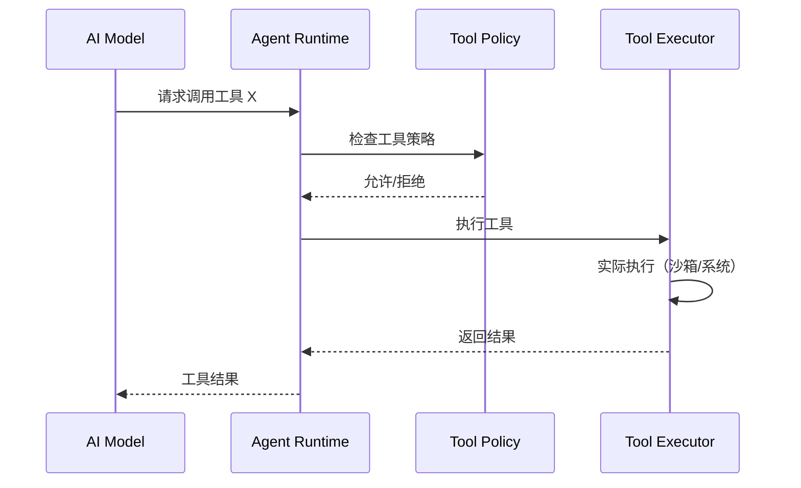
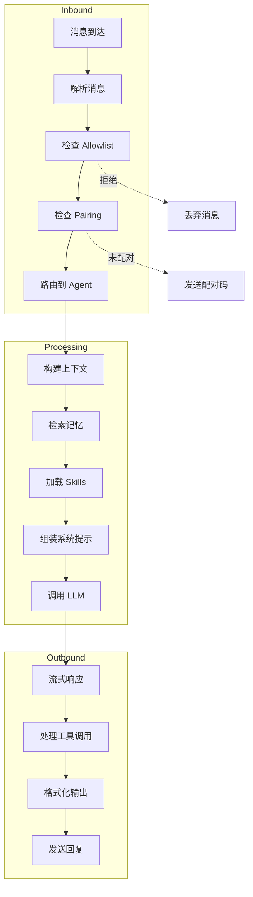
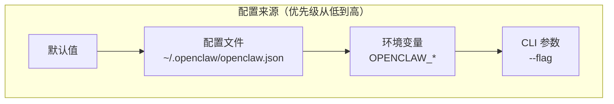

# OpenClaw 源码分析报告

## 项目概览

**OpenClaw** 是一个开源的**个人 AI 助手**平台，允许用户在自己的设备上运行一个私有的、本地优先的 AI 助手。它支持通过多种消息渠道（WhatsApp、Telegram、Slack、Discord 等）与 AI 交互，并提供语音、Canvas 可视化、浏览器控制等丰富功能。

| 属性 | 信息 |
|------|------|
| **项目名称** | OpenClaw |
| **GitHub** | https://github.com/openclaw/openclaw |
| **技术栈** | TypeScript / Node.js / WebSocket |
| **许可协议** | MIT |
| **Node 版本要求** | ≥ 22 |

---

## 架构设计

### 整体架构

OpenClaw 采用**网关（Gateway）中心化**的架构设计，所有组件都通过 WebSocket 连接到单一的 Gateway 控制平面：



### 核心设计原则

1. **Local-first**：所有状态默认存储在本地 `~/.openclaw/`
2. **Single Gateway**：一个 Gateway 实例管理所有消息渠道连接
3. **WebSocket 控制平面**：统一的 WS 协议用于所有客户端通信
4. **多 Agent 隔离**：支持工作区（workspace）级别的 Agent 隔离

---

## 目录结构

```
openclaw/
├── src/
│   ├── gateway/          # Gateway 核心服务
│   │   ├── server.impl.ts       # Gateway 主实现
│   │   ├── server-channels.ts   # 渠道管理
│   │   ├── server-chat.ts       # 聊天处理
│   │   ├── server-methods/      # WS API 方法
│   │   └── protocol/            # 协议定义
│   ├── agents/           # AI Agent 运行时
│   │   ├── pi-embedded-runner/  # Pi Agent 运行器
│   │   ├── pi-embedded-subscribe.ts  # 流式响应处理
│   │   ├── pi-tools.ts          # 工具定义适配
│   │   ├── skills/              # Skills 系统
│   │   └── sandbox/             # 沙箱执行环境
│   ├── channels/         # 消息渠道抽象
│   │   ├── plugins/             # 渠道插件系统
│   │   ├── registry.ts          # 渠道注册表
│   │   └── allowlists/          # 访问控制
│   ├── cli/              # 命令行界面
│   │   ├── program/build-program.ts  # CLI 程序构建
│   │   ├── commands/            # 命令实现
│   │   └── deps.ts              # 依赖注入
│   ├── commands/         # CLI 命令
│   │   ├── gateway.ts           # gateway 命令
│   │   ├── agent.ts             # agent 命令
│   │   ├── onboard.ts           # 引导向导
│   │   └── doctor.ts            # 诊断工具
│   ├── config/           # 配置管理
│   ├── web/              # Web UI 和 HTTP API
│   ├── browser/          # 浏览器控制
│   ├── memory/           # 向量记忆存储
│   ├── tts/              # 文本转语音
│   └── infra/            # 基础设施
├── apps/                 # 原生应用
│   ├── macos/            # macOS 菜单栏应用 (Swift)
│   ├── ios/              # iOS 应用 (Swift)
│   └── android/          # Android 应用 (Kotlin)
├── docs/                 # 文档 (Mintlify)
├── extensions/           # 扩展插件
├── skills/               # 内置 skills
└── ui/                   # Web UI 源码
```

---

## 核心模块详解

### 1. Gateway 模块 (`src/gateway/`)

Gateway 是整个系统的控制平面，负责：

- **WebSocket 服务器**：处理所有客户端连接
- **消息路由**：将渠道消息路由到对应 Agent
- **HTTP API**：提供 OpenAI 兼容的 `/v1/chat/completions` 和 `/v1/responses`
- **Canvas 托管**：提供 A2UI（Agent-to-UI）渲染服务



**关键文件**：
- `server.impl.ts:147` - `startGatewayServer()` 主入口
- `server-chat.ts` - 聊天消息处理逻辑
- `server-channels.ts` - 渠道生命周期管理

### 2. Agent 运行时 (`src/agents/`)

基于 **Pi Agent Core** 的嵌入式运行时，特点：

- **RPC 模式**：通过 `@mariozechner/pi-agent-core` 库与 AI 模型通信
- **工具流式**：支持工具调用和结果的实时流式传输
- **块流式**：AI 响应以块（block）为单位流式返回



**关键文件**：
- `pi-embedded-runner.ts` - Agent 运行器核心
- `pi-embedded-subscribe.ts` - 流式响应订阅处理
- `pi-tools.ts` - OpenClaw 工具定义适配器

### 3. 消息渠道 (`src/channels/`)

支持的消息渠道及其实现：

| 渠道 | 库/协议 | 位置 |
|------|---------|------|
| WhatsApp | Baileys | `src/whatsapp/` |
| Telegram | grammY | `src/telegram/` |
| Slack | Bolt | `src/slack/` |
| Discord | discord.js | `src/discord/` |
| Signal | signal-cli | `src/signal/` |
| iMessage | imsg (Rust) | `src/imessage/` |
| Google Chat | Chat API | `src/channels/` |
| BlueBubbles | 扩展 | `extensions/bluebubbles/` |
| Microsoft Teams | 扩展 | `extensions/msteams/` |
| Matrix | 扩展 | `extensions/matrix/` |
| Zalo | 扩展 | `extensions/zalo/` |

**渠道插件架构**：

```typescript
// src/channels/plugins/index.ts
export type ChannelPlugin = {
  id: ChannelId;
  name: string;
  adapter: ChannelAdapter;
  // ...
};
```

### 4. 工具系统 (`src/agents/tools/`)

工具分为几类：

1. **系统工具**：文件读写、Bash 执行、进程管理
2. **Gateway 工具**：session 管理、channel 操作、子 Agent 创建
3. **浏览器工具**：Chrome 控制、截图、页面操作
4. **Node 工具**：相机、屏幕录制、定位（需连接 iOS/Android/macOS Node）
5. **Canvas 工具**：A2UI 渲染控制

**工具调用流程**：



### 5. Skills 系统 (`src/agents/skills/`)

Skills 是可插拔的功能扩展，三种类型：

- **Bundled Skills**：随 OpenClaw 一起发布的内置 skills
- **Managed Skills**：通过 npm 安装的 skills
- **Workspace Skills**：项目本地 skills（`./.openclaw/skills/`）

**Skill 结构**：
```
skill/
├── skill.yaml          # Skill 元数据
├── index.ts            # 主入口
├── tools/              # 工具定义
└── prompts/            # 系统提示片段
```

### 6. 记忆系统 (`src/memory/`)

基于 **sqlite-vec** 的向量记忆存储：

- 自动消息摘要和向量化
- 语义搜索检索相关记忆
- 按 Agent/工作区隔离

---

## 数据流分析

### 消息处理流程



### 配置层级



---

## 安全设计

### DM（私信）安全策略

默认采用 **Pairing 模式**：

1. 未知发送者收到配对码，消息不被处理
2. 管理员通过 `openclaw pairing approve <channel> <code>` 批准
3. 批准后发送者进入本地 allowlist

```typescript
// src/channels/allowlists/ 目录
- allowlist-store.ts      # 允许列表存储
- dm-policy.ts           # DM 策略定义
- pairing-store.ts       # 配对状态存储
```

### 执行安全

- **Sandbox**：工具执行在可选的 Docker 沙箱中
- **Approval**：敏感操作（如 Bash 执行）可配置为需要确认
- **Policy**：工具级别的允许/拒绝策略

---

## 部署模式

### 本地开发模式

```bash
# 开发模式（独立配置和状态）
openclaw --dev setup
openclaw --dev gateway --allow-unconfigured
```

### 生产部署

1. **systemd**（Linux）
2. **launchd**（macOS）
3. **Docker**：官方提供 Docker 镜像
4. **Fly.io / Render / Railway**：支持一键部署

---

## 优缺点分析

### 优点

1. **架构清晰**：Gateway 中心化设计简化了多客户端同步问题
2. **渠道丰富**：支持 10+ 消息渠道，覆盖主流平台
3. **本地优先**：数据默认本地存储，隐私可控
4. **扩展性强**：Skills 系统和插件架构支持功能扩展
5. **多 Agent 支持**：工作区隔离适合多场景使用

### 潜在改进点

1. **单点故障**：单一 Gateway 设计，虽然简单但存在单点风险
2. **状态管理**：WebSocket 长连接状态复杂，重连逻辑需要仔细处理
3. **资源占用**：Node.js + TypeScript 运行时内存占用相对较高
4. **部署复杂度**：需要维护长期运行的 Gateway 进程

---

## 关键代码入口

| 功能 | 文件路径 | 行号 |
|------|----------|------|
| CLI 入口 | `src/entry.ts` | 1 |
| Gateway 启动 | `src/gateway/server.impl.ts` | 147 |
| Agent 运行 | `src/agents/pi-embedded-runner.ts` | 1 |
| 消息处理 | `src/gateway/server-chat.ts` | 1 |
| 工具调用 | `src/agents/pi-embedded-subscribe.ts` | 200 |
| 配置加载 | `src/config/config.ts` | 1 |

---

## 总结

OpenClaw 是一个设计精良的**个人 AI 助手基础设施**，其核心价值在于：

1. **统一的消息渠道接入**：将分散的 IM 渠道统一到单一 AI 接口
2. **本地优先的隐私保护**：数据不依赖云端，用户完全控制
3. **灵活的扩展能力**：Skills + 插件系统支持无限功能扩展

适合希望拥有**私有化、可定制 AI 助手**的技术用户和小团队使用。
