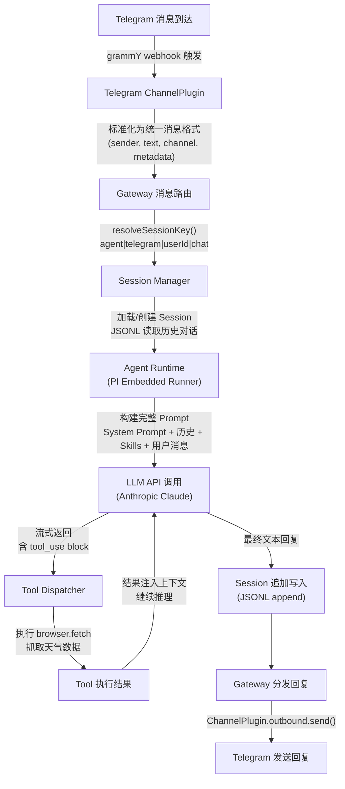

# OpenClaw 架构分析

## 1. 核心矛盾与存在意义 (The "Why")

### 痛点还原

想象一下这个场景：你想要一个 AI 助手，像真人秘书一样，随时随地在你**已经在用**的聊天工具上回复你——WhatsApp、Telegram、Slack、Discord、iMessage……

在 OpenClaw 出现之前，你的选择是：

1. **被平台绑架**：ChatGPT 只能在 ChatGPT 的 App 里用，Claude 只能在 Claude 的网页里用。你需要切换 App，打断工作流。
2. **自己造轮子**：写一个 Telegram Bot 对接 Claude API？可以。再加个 WhatsApp Bot？又写一套。Slack 也要？Discord 也要？每个渠道的协议、认证、消息格式全不一样，光是维护这些"胶水代码"就已经崩溃了。
3. **状态断裂**：就算你把所有 Bot 都搭好了，它们之间的对话记忆是割裂的。你在 Telegram 上跟 AI 聊的事，WhatsApp 上它完全不知道。
4. **没法扩展**：想让 AI 能执行 Shell 命令、浏览网页、操控文件？每个 Bot 都要独立实现一遍工具调用逻辑。

核心矛盾：**AI 能力在快速进化，但"AI 如何到达用户"这条通道极度碎片化。**

### 一句话定义

OpenClaw 是一个**本地运行的 AI 网关（Gateway）**——它在你的设备上架设一个中心控制面，把 38+ 个消息渠道统一接入，让同一个 AI Agent（带完整工具链和记忆）通过你已有的聊天工具为你服务。

### 适用场景

| 场景 | 适合程度 | 说明 |
| :--- | :--- | :--- |
| 想在 WhatsApp/Telegram/Slack 等多个渠道用同一个 AI 助手 | **必须用** | 这是它的核心价值 |
| 需要 AI 助手执行本地任务（跑脚本、操控文件、浏览网页） | **非常适合** | 内置完整工具链 |
| 个人/小团队需要 always-on 的 AI 秘书 | **非常适合** | Daemon 模式 + 定时任务 |
| 只在一个平台用 AI，且不需要工具调用 | **杀鸡用牛刀** | 直接用官方 App 更简单 |
| 企业级多租户 SaaS 部署 | **不适合** | 这是单用户（personal）产品 |

---

## 2. 静态架构解剖 (The "Static Structure")

OpenClaw 是一个 pnpm monorepo，核心代码在 `src/` 下约 68 个模块，外加 38 个渠道扩展。精简到最核心的模块如下：

| 模块名称 | 核心职责 (大白话) | 复杂度 | 核心地位 |
| :--- | :--- | :--- | :--- |
| **Gateway** (`src/gateway/`) | 中央调度中心。一个 WebSocket 服务器，所有客户端（CLI、手机 App、Web UI）都通过它交互。定义了 40+ 个 RPC 方法，是整个系统的"总线"。 | 高 | 灵魂 |
| **Agent Runtime** (`src/agents/`) | AI 大脑。基于 Anthropic 的 PI 框架运行 LLM Agent，处理流式响应、工具调用、上下文管理。Agent 的每次"思考-行动"循环都在这里完成。 | 高 | 灵魂 |
| **Channel Abstraction** (`src/channels/` + `extensions/`) | 消息翻译官。把 38 个平台（WhatsApp、Telegram、Slack……）的消息格式统一成同一个接口。每个渠道是一个 `ChannelPlugin`，实现标准化的收发消息、认证、状态管理。 | 中 | 骨架 |
| **Session Manager** (`src/sessions/`) | 记忆管家。管理对话生命周期——创建、暂停、归档、压缩。用 JSONL 追加写入，支持 Compaction（把长对话总结成摘要以节省 Token）。 | 中 | 骨架 |
| **Plugin & Hook System** (`src/plugins/` + `src/hooks/`) | 扩展机制。第三方可以通过 Plugin API 注册工具、钩子、HTTP 路由、CLI 命令、甚至新的渠道。Hook 系统在关键生命周期节点（消息收发、工具调用前后等）提供拦截点。 | 中 | 骨架 |
| **Config & Workspace** (`src/config/`) | 配置中心。用 JSON5 管理所有行为——Agent 设置、渠道配置、模型选择、定时任务等。Zod Schema 做校验，支持环境变量 → .env → 配置文件的优先级叠加。 | 低 | 皮肉 |
| **CLI** (`src/cli/`) | 用户入口。Commander 搭建的命令行工具——`openclaw gateway`、`openclaw agent`、`openclaw onboard`、`openclaw doctor` 等，是用户跟系统交互的主要方式。 | 低 | 皮肉 |

### 模块关系速览

```
                   ┌──────────────┐
                   │   CLI / App  │  (用户入口)
                   └──────┬───────┘
                          │ WebSocket
                   ┌──────▼───────┐
                   │   Gateway    │  (控制面 / 总线)
                   └──┬───┬───┬──┘
          ┌───────────┘   │   └───────────┐
          ▼               ▼               ▼
   ┌──────────┐    ┌──────────┐    ┌──────────┐
   │ Channels │    │  Agent   │    │ Sessions │
   │ (38个)   │◄──►│ Runtime  │◄──►│ Manager  │
   └──────────┘    └────┬─────┘    └──────────┘
                        │
               ┌────────┼────────┐
               ▼        ▼        ▼
          ┌────────┐┌───────┐┌────────┐
          │ Tools  ││Skills ││Plugins │
          └────────┘└───────┘└────────┘
```

---

## 3. 动态核心链路追踪 (The "Dynamic Flow")

**场景：用户在 Telegram 上发一条消息 "帮我查一下明天的天气"**



### 数据变化追踪

| 阶段 | 数据形态 |
| :--- | :--- |
| Telegram 原始消息 | grammY 的 `Update` 对象（Telegram 协议格式） |
| → Channel 标准化 | 统一 `InboundMessage { sender, text, channel, threadId, attachments }` |
| → Session 路由 | Session Key: `default\|telegram\|123456\|chat`，加载历史 transcript |
| → Agent 构建 Prompt | 完整 messages 数组：system prompt + 压缩过的历史 + 本次用户消息 |
| → LLM 流式响应 | `tool_use` block（调用天气工具）→ `tool_result` → 最终 `text` block |
| → Session 写入 | JSONL 追加：assistant message + tool calls + tool results |
| → 渠道发送 | 文本被格式化为 Telegram Markdown，通过 Bot API 发送 |

---

## 4. 架构评价 (The Trade-off)

### 设计亮点：Gateway-First 的"总线"架构

最精彩的设计决策是把 **Gateway 作为唯一的控制面**，所有交互都通过 WebSocket RPC 进行。

这带来了几个优势：

1. **解耦极致**：CLI、iOS App、Android App、Web UI——任何客户端只要实现 WebSocket 协议就能接入，不需要关心 Agent 怎么跑、渠道怎么连。
2. **渠道适配器模式**：38 个渠道的差异被 `ChannelPlugin` 接口完全吸收。增加一个新渠道只需要实现一套标准接口，不触碰核心逻辑。
3. **Session 隔离**：每个 `(agent, channel, user)` 组合有独立的 Session 和 transcript，消息不会串台。
4. **Always-On**：Gateway 作为 Daemon 运行（launchd/systemd），用户关掉终端，AI 助手依然在后台响应各渠道的消息。

此外，**JSONL + Compaction** 的 Session 存储策略也很巧妙——追加写入保证了高性能，Compaction（把长对话摘要化）解决了 Token 窗口限制的问题，同时避免了数据库的引入（整个系统零数据库依赖，只用文件系统）。

### 潜在代价

| 代价 | 具体表现 |
| :--- | :--- |
| **依赖重** | 38 个渠道扩展意味着巨量的第三方依赖（WhatsApp 用 Baileys、Telegram 用 grammY、Slack 用 Bolt……），`node_modules` 和构建时间都不小。 |
| **单用户限制** | 架构从根本上为"个人助手"设计——单 Gateway 实例、文件系统存储、无多租户机制。如果想做多用户 SaaS，几乎需要重写状态管理层。 |
| **运维成本** | 用户需要自己维护 Node.js 运行环境、管理 API Key、处理渠道认证（WhatsApp 二维码过期、Signal 需要手机号注册等）。对非技术用户不友好。 |
| **Agent 框架耦合** | Agent Runtime 深度绑定 Anthropic 的 PI 框架（`@mariozechner/pi-agent-core`），虽然支持多模型 Provider，但核心推理循环的抽象层与 PI 框架紧耦合。换 Agent 框架的成本较高。 |
| **零数据库设计的天花板** | 文件系统 + JSONL 在单用户场景下很优雅，但一旦 Session 数量增长到数千、需要复杂查询或并发写入时，就会碰到性能瓶颈。 |
