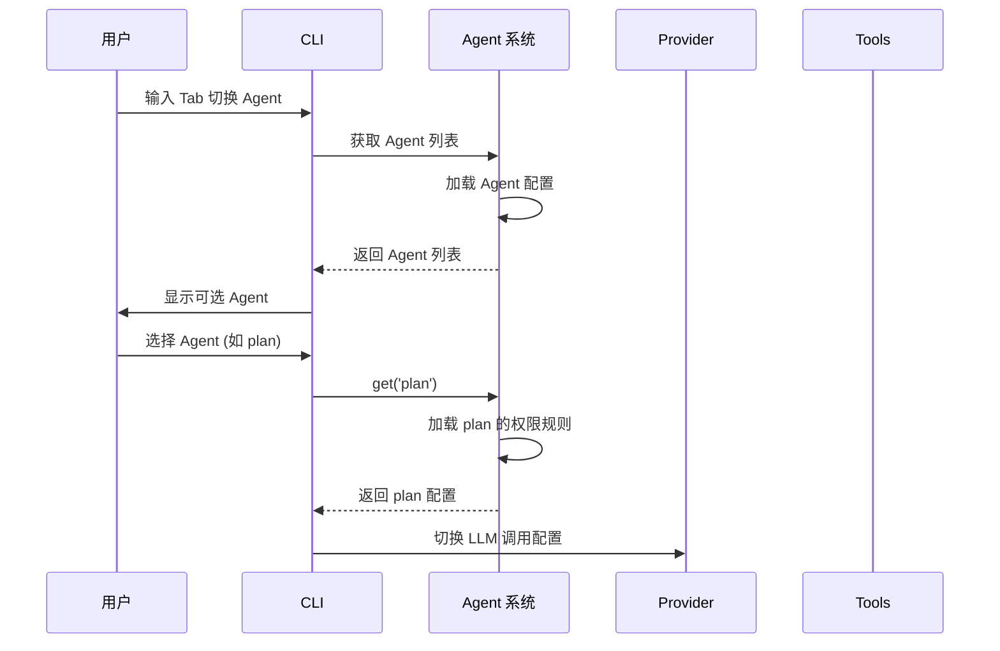
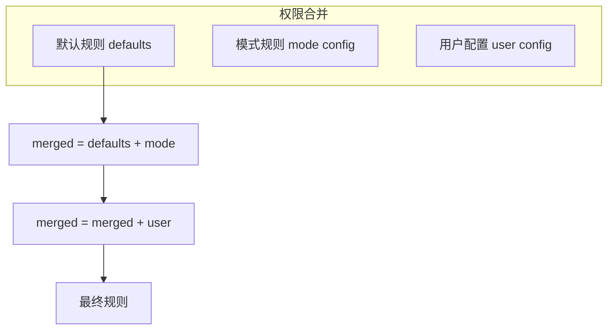

# OpenCode 研究报告（Mini版）

## 一、项目概览

### 1.1 是什么

OpenCode 是一个**开源的 AI 编程代理工具**，定位类似于 GitHub Copilot、Claude Code，但强调 100% 开源和**提供商无关**（provider-agnostic）的设计理念。

### 1.2 核心特点

| 特点 | 说明 |
|------|------|
| 100% 开源 | MIT 许可证，完全透明 |
| 提供商无关 | 可搭配 Claude、OpenAI、Google、本地模型使用 |
| 内置 LSP | 开箱即用的语言服务器协议支持 |
| TUI 优先 | 由 Neovim 用户打造，聚焦终端体验 |
| C/S 架构 | 服务器可独立运行，支持远程客户端连接 |

### 1.3 技术栈

- **语言**：TypeScript
- **运行时**：Bun
- **UI 框架**：SolidJS
- **Web 框架**：Hono
- **AI SDK**：Vercel AI SDK (ai 包)
- **包管理**：Bun Workspaces (Monorepo)

---

## 二、目录结构

```
vendors/opencode/
├── packages/              # 核心包目录
│   ├── opencode/          # 主 CLI 和核心逻辑
│   │   └── src/
│   │       ├── agent/     # Agent 系统
│   │       ├── session/   # 会话管理
│   │       ├── server/    # HTTP 服务器
│   │       ├── provider/  # LLM 提供商适配
│   │       ├── lsp/       # LSP 集成
│   │       ├── tool/      # 工具集 (46个工具)
│   │       └── ...
│   ├── web/               # Web TUI 界面
│   ├── desktop/           # 桌面应用 (Tauri)
│   ├── console/           # 控制台 UI
│   ├── sdk/               # SDK
│   └── ...
├── specs/                 # 技术规格文档
├── themes/                # 主题配置
└── github/                # GitHub Actions
```

---

## 三、核心架构

### 3.1 整体架构图

```mermaid
graph TB
    subgraph Client 层
        TUI[TUI 终端界面]
        Web[Web 界面]
        Desktop[桌面应用]
        API[外部 API 客户端]
    end

    subgraph Server 层[OpenCode Server :4096]
        Hono[Hono Web 框架]
        Routes[路由模块]
        Auth[认证模块]
    end

    subgraph Core 层
        Session[会话管理]
        Agent[Agent 系统]
        Provider[LLM 提供商]
        LSP[语言服务器]
        Tools[工具集 (46个)]
        Permission[权限控制]
    end

    TUI --> Hono
    Web --> Hono
    Desktop --> Hono
    API --> Hono

    Hono --> Routes
    Routes --> Session
    Routes --> Agent
    Routes --> Provider

    Session --> Tools
    Session --> LSP
    Session --> Permission
    Agent --> Provider
    Agent --> Tools
```

### 3.2 核心模块职责

| 模块 | 职责 | 关键依赖 |
|------|------|----------|
| `agent` | Agent 配置与管理 | zod, ai SDK |
| `session` | 会话生命周期、消息历史 | bus, provider |
| `server` | HTTP API 服务器 | hono, zod |
| `provider` | LLM 提供商抽象层 | ai SDK |
| `lsp` | 语言服务器集成 | tree-sitter |
| `tool` | 工具实现 (read/write/grep 等) | - |
| `permission` | 权限规则引擎 | zod |

---

## 四、Agent 系统详解

### 4.1 内置 Agent

OpenCode 内置多个 Agent，可通过 `Tab` 键切换：

| Agent | 模式 | 权限 | 用途 |
|-------|------|------|------|
| `build` | primary | 完整权限 | 默认开发模式 |
| `plan` | primary | 只读为主 | 代码分析与规划 |
| `general` | subagent | 可配置 | 复杂搜索/多步任务 |
| `explore` | subagent | 只读 | 代码库快速探索 |

### 4.2 Agent 定义结构

```typescript
// packages/opencode/src/agent/agent.ts
const state = Instance.state(async () => {
  const defaults = PermissionNext.fromConfig({
    "*": "allow",
    doom_loop: "ask",           // 防止死循环
    external_directory: { "*": "ask" },
    question: "deny",
    plan_enter: "deny",
    read: { "*": "allow", "*.env": "ask" },
  })

  const result: Record<string, Info> = {
    build: {
      name: "build",
      mode: "primary",
      native: true,
      permission: PermissionNext.merge(defaults, user),
    },
    plan: {
      name: "plan",
      mode: "primary",
      native: true,
      permission: PermissionNext.merge(defaults, {
        edit: { "*": "deny" },  // 拒绝所有编辑
        question: "allow",
      }, user),
    },
    // ... 其他 Agent
  }
  return result
})
```

### 4.3 Agent 切换机制



---

## 五、会话与消息系统

### 5.1 会话 API 设计

```mermaid
graph LR
    POST /project/init --> Project
    GET /project --> Project[]
    POST /project/:id/session --> Session
    GET /project/:id/session/:id --> Session
    POST /project/:id/session/:id/message --> Message
    POST /project/:id/session/:id/revert --> Revert
```

### 5.2 消息结构

```typescript
// 消息响应格式
GET /session/:sessionID/message
// 返回: { info: Message, parts: Part[] }[]
```

---

## 六、工具系统（Tool System）

### 6.1 内置工具分类

| 分类 | 工具示例 | 用途 |
|------|----------|------|
| 文件操作 | read, write, glob, edit | 文件读写与搜索 |
| 代码分析 | grep, codesearch | 代码搜索与分析 |
| 命令执行 | bash, shell | 执行 Shell 命令 |
| Web 能力 | webfetch, websearch | 网络搜索与抓取 |
| 版本控制 | git | Git 操作 |
| 权限相关 | permission, question | 权限控制 |

### 6.2 工具注册机制

```typescript
// packages/opencode/src/tool/tool.ts
// 工具通过 @Tool 装饰器注册
@Tool.Define({
    name: "read",
    description: "Read a file from the filesystem",
    parameters: z.object({
        path: z.string(),
        limit: z.number().optional(),
        offset: z.number().optional(),
    }),
})
class ReadTool extends Tool.Handler {
    async run(input: Input) {
        const file = Bun.file(input.path)
        return await file.text()
    }
}
```

---

## 七、权限控制系统

### 7.1 权限规则设计

```typescript
// 权限规则示例
PermissionNext.fromConfig({
    "*": "allow",              // 默认允许
    doom_loop: "ask",          // 循环执行前询问
    external_directory: { "*": "ask" },  // 外部目录访问询问
    read: {
        "*": "allow",
        "*.env": "ask",        // .env 文件需要询问
        "*.env.*": "ask",
    },
    edit: { "*": "deny" },     // plan 模式下拒绝编辑
})
```

### 7.2 权限继承模型



---

## 八、提供商系统（Provider）

### 8.1 支持的提供商

OpenCode 抽象了 LLM 提供商接口，支持：

- **OpenAI** (GPT-4, GPT-3.5)
- **Anthropic** (Claude)
- **Google** (Gemini)
- **本地模型** (通过 Ollama 等)

### 8.2 提供商配置

```typescript
// config.yaml 或环境变量
providers:
  openai:
    api_key: ${OPENAI_API_KEY}
  anthropic:
    api_key: ${ANTHROPIC_API_KEY}
```

---

## 九、服务器架构

### 9.1 HTTP 服务

OpenCode 默认在 `localhost:4096` 启动 HTTP 服务器，提供 RESTful API：

```typescript
// packages/opencode/src/server/server.ts
export function listen(opts: { port: number; hostname: string }) {
    return Bun.serve({
        hostname: opts.hostname,
        port: opts.port,
        fetch: App().fetch,
        websocket: websocket,
    })
}
```

### 9.2 路由模块

| 路由 | 功能 |
|------|------|
| `/project` | 项目管理 |
| `/session` | 会话管理 |
| `/agent` | Agent 列表 |
| `/tool` | 工具调用 |
| `/file` | 文件操作 |
| `/mcp` | MCP 服务器 |
| `/auth` | 认证管理 |
| `/event` | SSE 事件流 |

---

## 十、典型用法

### 10.1 初始化与启动

```bash
# 安装
npm i -g opencode-ai@latest

# 启动（进入 TUI 模式）
opencode

# 以服务器模式启动（供远程客户端连接）
opencode serve --port 4096 --hostname 0.0.0.0
```

### 10.2 配置示例

```yaml
# ~/.config/opencode/config.yaml
default_agent: build

agent:
  build:
    model: anthropic/claude-sonnet-4-20250514
    temperature: 0.3

permission:
  read:
    "**/*": allow
    "*.env*": ask
  bash:
    "*": ask
```

---

## 十一、设计亮点与取舍

### 11.1 优秀设计

| 亮点 | 说明 |
|------|------|
| **Provider 抽象层** | 解耦 LLM 提供商，易于扩展 |
| **Agent 可配置** | 内置 + 自定义 Agent，权限可精细控制 |
| **C/S 架构** | 支持远程调用，可扩展客户端形态 |
| **权限系统** | 默认拒绝模式，安全可控 |
| **Monorepo** | 代码共享便捷，依赖管理统一 |

### 11.2 设计取舍

| 取舍 | 说明 |
|------|------|
| **TUI 优先** | 不追求 GUI 丰富度，专注终端体验 |
| **Bun 运行时** | 依赖 Bun，限制了其他运行时使用 |
| **单进程架构** | 暂无分布式支持，大规模场景受限 |

---

## 十二、落地建议

### 12.1 适用场景

1. **本地开发**：作为日常编程助手，替代或辅助 GitHub Copilot
2. **代码探索**：`plan` 模式适合阅读陌生代码库
3. **CI/CD 集成**：服务器模式可集成到自动化流程
4. **自定义客户端**：基于 API 开发专属 UI

### 12.2 学习价值

1. **Agent 设计**：参考其 Agent 配置与权限系统设计
2. **Provider 模式**：学习如何解耦多 LLM 提供商
3. **工具注册**：了解如何优雅地注册和调度工具
4. **权限模型**：参考其基于规则的权限控制系统

### 12.3 扩展方向

1. **添加新 Provider**：实现 `Provider` 接口即可
2. **自定义工具**：继承 `Tool.Handler` 并注册
3. **新 Agent**：在配置中添加 Agent 定义
4. **远程部署**：利用 C/S 架构部署服务器

---

## 十三、总结

OpenCode 是一个设计精良的开源 AI 编程代理，其**提供商无关**和**权限安全**的设计理念值得学习。核心亮点包括：

- ✅ 100% 开源透明
- ✅ 灵活的 Agent 系统
- ✅ 细粒度权限控制
- ✅ C/S 架构便于扩展

适合作为学习 AI Agent 架构的参考项目，或作为本地开发工具使用。

---

*报告生成时间：2026-01-27*
*基于 vendors/opencode 源码分析*
