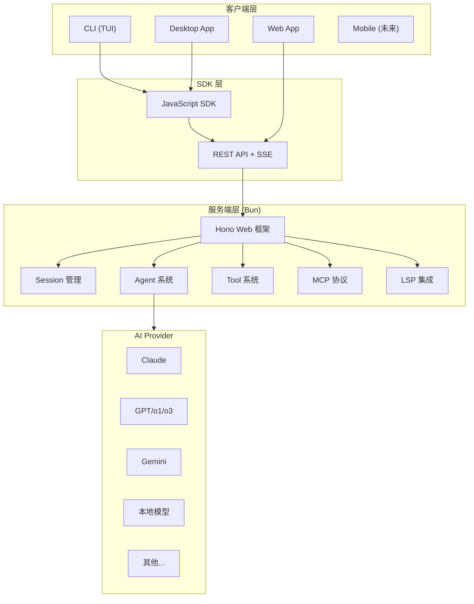
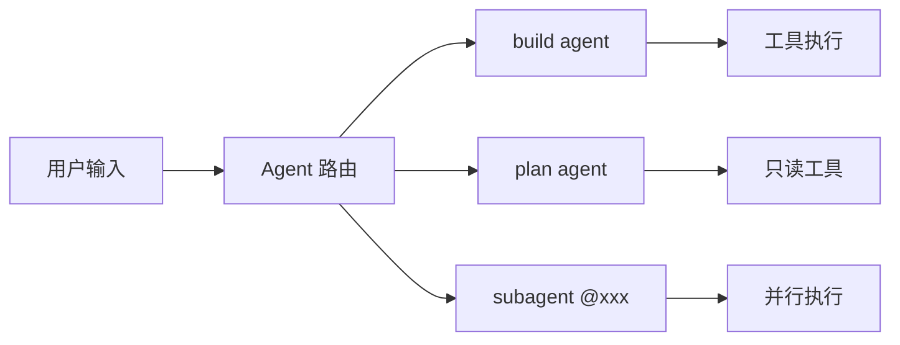
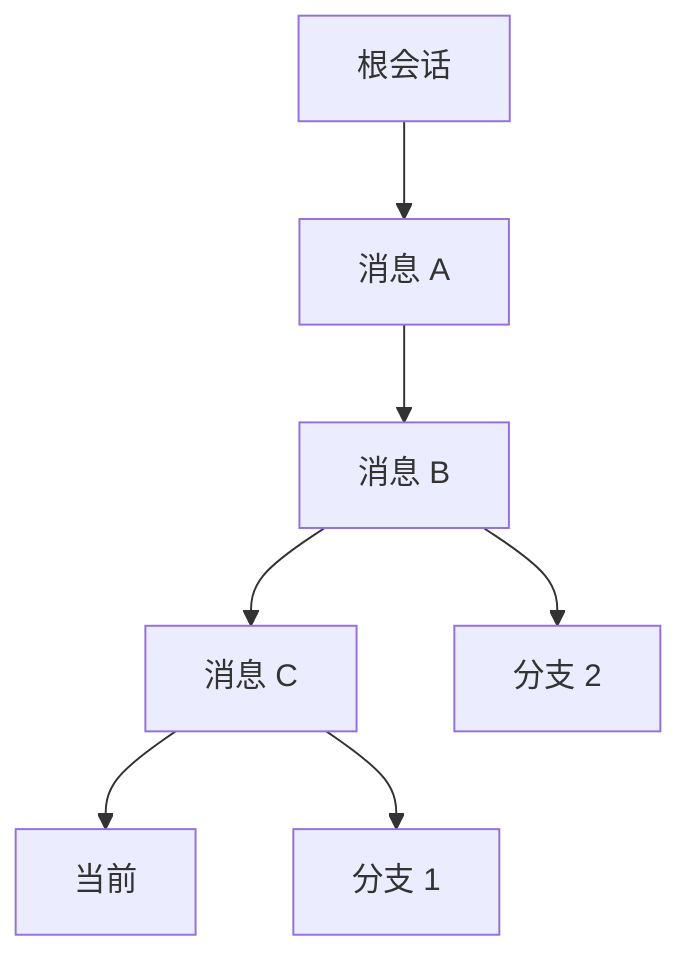
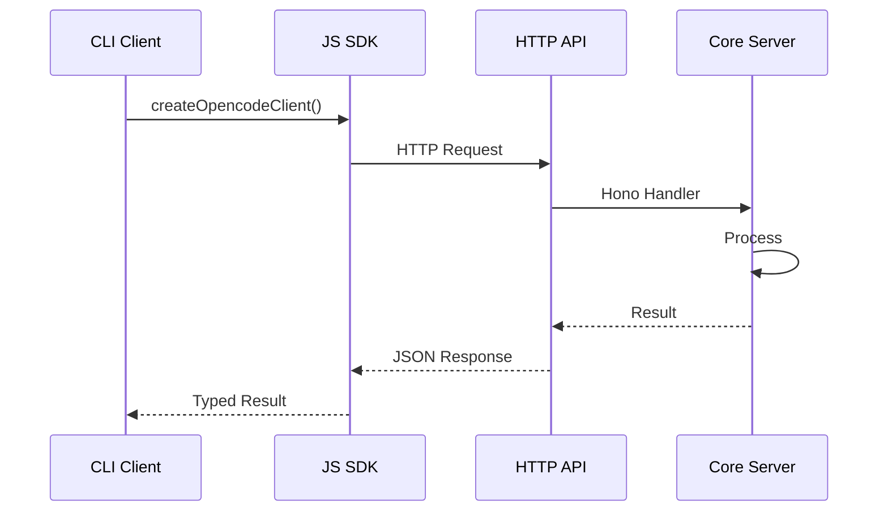

# OpenCode 源码分析报告

## 项目概览

| 属性 | 内容 |
|------|------|
| **项目名称** | OpenCode |
| **GitHub** | https://github.com/anomalyco/opencode |
| **定位** | 开源 AI 编程助手（Claude Code 的开源替代品） |
| **技术栈** | TypeScript + Bun + SolidJS |
| **架构** | Client/Server 架构，支持多客户端 |
| **License** | MIT |

### 核心卖点

- **100% 开源** - 与 Claude Code 功能相近但完全开源
- **供应商无关** - 支持 Claude、OpenAI、Google、本地模型等多种 provider
- **原生 LSP 支持** - 内置语言服务器协议支持
- **TUI 优先** - 由 Neovim 用户和 terminal.shop 创作者打造，极致终端体验
- **Client/Server 架构** - 支持远程驱动（如从手机 App 控制电脑上的 OpenCode）

---

## 整体架构



---

## 目录结构分析

```
packages/
├── opencode/          # 核心 CLI 和服务器
├── app/               # TUI 应用 (SolidJS + Vite)
├── web/               # Web 应用 (SolidJS Start)
├── desktop/           # 桌面应用 (Tauri)
├── sdk/               # SDK (JS/TS)
├── ui/                # 共享 UI 组件
├── util/              # 工具库
├── plugin/            # 插件系统
├── containers/        # 容器化支持
├── slack/             # Slack 集成
├── enterprise/        # 企业版功能
├── console/           # 控制台相关
├── extensions/        # 扩展
├── function/          # 函数计算
├── identity/          # 身份认证
└── docs/              # 文档
```

---

## 核心模块详解

### 1. Agent 系统 (`packages/opencode/src/agent/`)

Agent 是 OpenCode 的核心抽象，代表不同的 AI 行为模式：

| Agent | 类型 | 用途 |
|-------|------|------|
| `build` | primary | 默认 Agent，完整开发能力 |
| `plan` | primary | 只读模式，用于分析和规划 |
| `general` | subagent | 复杂任务并行执行 |
| `explore` | subagent | 快速代码库探索 |
| `compaction` | primary | 会话压缩（内部使用） |
| `title` | primary | 生成会话标题（内部使用） |
| `summary` | primary | 生成摘要（内部使用） |

**权限系统**：每个 Agent 拥有细粒度的工具权限控制



### 2. Tool 系统 (`packages/opencode/src/tool/`)

内置 20+ 个工具，覆盖开发全流程：

**文件操作**
- `read` / `write` / `edit` / `multiedit` - 文件读写编辑
- `glob` / `grep` / `list` - 文件搜索

**代码智能**
- `codesearch` - 代码语义搜索
- `lsp` - 语言服务器交互

**执行与任务**
- `bash` - 命令执行
- `task` - 子任务并行化

**网络与信息**
- `webfetch` / `websearch` - 网络获取/搜索

**开发工作流**
- `todo` - 任务列表管理
- `skill` - 调用预设技能
- `plan` - 计划模式切换

### 3. Session 系统 (`packages/opencode/src/session/`)

会话管理采用树形结构，支持分支和回溯：



**核心特性**：
- 消息持久化（SQLite）
- 会话共享（生成只读链接）
- 自动压缩（上下文窗口管理）
- 分支与回滚

### 4. Provider 系统 (`packages/opencode/src/provider/`)

支持 15+ 个 AI Provider：

```typescript
// 统一模型格式: provider/model
"anthropic/claude-3-5-sonnet"
"openai/gpt-4o"
"google/gemini-pro"
"groq/llama-3"
// ... 更多
```

**关键设计**：
- 基于 Vercel AI SDK 的统一抽象
- 支持自定义 provider 配置
- 模型变体支持（reasoning effort）

### 5. MCP (Model Context Protocol) (`packages/opencode/src/mcp/`)

实现 Anthropic 的 MCP 标准，支持：
- 本地 MCP Server（stdio）
- 远程 MCP Server（SSE）
- OAuth 认证

### 6. LSP 集成 (`packages/opencode/src/lsp/`)

内置 Language Server Protocol 支持：
- 自动检测项目语言
- 代码补全、跳转、诊断
- 可配置自定义 LSP Server

---

## 配置系统

配置加载优先级（低到高）：

```
1. Remote .well-known/opencode (组织默认)
2. Global config (~/.config/opencode/)
3. 环境变量 OPENCODE_CONFIG
4. Project config (opencode.jsonc)
5. .opencode/ 目录配置
6. 环境变量 OPENCODE_CONFIG_CONTENT
7. Managed config (企业部署)
```

**配置内容**：
- Agent 定义和权限
- Provider 和模型设置
- 自定义命令和技能
- MCP Server 配置
- 快捷键绑定

---

## 技术亮点

### 1. 客户端/服务器架构



这种架构允许：
- CLI、Desktop、Web 共享同一后端
- 远程控制（如手机控制电脑）
- 嵌入式场景（如 IDE 插件）

### 2. 事件驱动架构

使用自定义 Event Bus 实现：
- SSE 实时推送
- 会话状态同步
- 工具执行进度

### 3. 权限系统

细粒度的工具权限控制：

```typescript
// 示例: plan agent 的权限
{
  "*": "allow",           // 默认允许
  "edit": "deny",         // 禁止编辑
  "bash": "ask",          // 执行前询问
  "read": {               // 细粒度控制
    "*.env": "ask",
    "*.env.*": "ask"
  }
}
```

### 4. 代码风格

项目有独特的代码风格（见 AGENTS.md）：
- 单字变量名优先
- 避免不必要的解构
- 优先 `const`，使用三元表达式
- 避免 `else`，使用 early return
- 函数式数组方法优先于 for 循环

---

## 与 Claude Code 的对比

| 特性 | OpenCode | Claude Code |
|------|----------|-------------|
| 开源 | ✅ 100% 开源 | ❌ 闭源 |
| Provider 绑定 | ❌ 支持多 Provider | ✅ 仅 Anthropic |
| LSP 支持 | ✅ 原生支持 | ❌ 无 |
| TUI 体验 | ✅ 极致终端体验 | ✅ 优秀 |
| Client/Server | ✅ 支持远程 | ❌ 本地 only |
| 桌面应用 | ✅ 有 | ❌ 无 |

---

## 总结

OpenCode 是一个架构清晰、设计先进的开源 AI 编程助手：

**优势**：
1. 真正的供应商无关，避免 vendor lock-in
2. Client/Server 架构带来灵活性
3. 细粒度的权限和 Agent 系统
4. 原生 LSP 和 MCP 支持
5. 活跃的社区和快速迭代

**适用场景**：
- 需要多模型支持的团队
- 需要远程/嵌入式部署的场景
- 对终端体验有高要求的开发者
- 希望自定义 AI 工作流的高级用户
