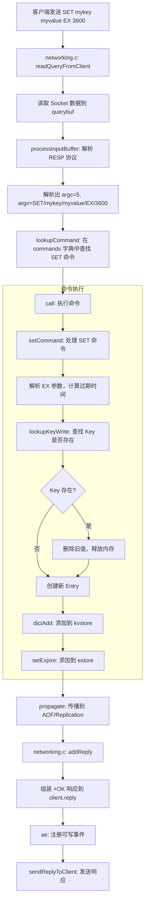

# Redis 架构深度分析

## 1. 核心矛盾与存在意义 (The "Why")

### 痛点还原

在没有 Redis 之前，开发者面临着这样的"灾难"：

- **磁盘 IO 的性能天花板**：传统数据库（MySQL、PostgreSQL）依赖磁盘存储，即使有各种缓存优化，随机读写的延迟仍然在毫秒级甚至更高
- **高频访问数据的瓶颈**：Session、排行榜、计数器、实时统计等场景，每次都打数据库简直是"自杀式"行为
- **分布式协调的复杂性**：多个应用实例之间共享状态、实现分布式锁、消息队列等功能，需要额外的中间件（如 ZooKeeper），架构复杂度飙升
- **实时性与一致性难以兼得**：要么接受慢，要么接受数据可能不一致

### 一句话定义

Redis 是一个**基于内存、单线程事件驱动、支持丰富数据结构的 Key-Value 存储引擎**，通过"数据在内存 + 操作在单线程"的组合拳，将读写延迟压到亚毫秒级。

### 适用场景

| 场景 | 是否适用 | 原因 |
|------|----------|------|
| 缓存 | ✅ 必须 | 这就是 Redis 的本命场景 |
| 分布式锁 | ✅ 必须 | 原子操作 + 过期时间，天然适合 |
| 排行榜/计数器 | ✅ 必须 | ZSET/INCR 原子操作，性能无敌 |
| 消息队列（轻量） | ✅ 适合 | List/Stream/Pub-Sub，但不如专业 MQ |
| 会话存储 | ✅ 必须 | 内存存储 + TTL，完美匹配 |
| 海量数据持久化 | ❌ 杀鸡用牛刀 | 内存成本高，不如用传统 DB |
| 复杂事务/关联查询 | ❌ 不适合 | Redis 不擅长多表关联 |

---

## 2. 静态架构解剖 (The "Static Structure")

Redis 的源码大约 17 万行 C 代码，核心模块 7 个：

| 模块名称 | 核心职责 | 复杂度 | 核心地位 |
|:---------|:---------|:-------|:---------|
| **ae** (事件驱动库) | 封装 epoll/kqueue/select，实现文件事件（网络 IO）和时间事件（定时任务）的统一调度 | 中 | **灵魂** |
| **dict** (哈希表) | Redis 所有 Key-Value 存储的底层数据结构，支持渐进式 Rehash | 中 | **灵魂** |
| **sds** (动态字符串) | 二进制安全、O(1) 获取长度、防止缓冲区溢出的字符串库 | 低 | **骨架** |
| **networking** (网络层) | 客户端连接管理、RESP 协议解析、命令分发、响应组装 | 高 | **骨架** |
| **db** (数据库层) | Key 的 CRUD、过期检查、内存淘汰策略触发 | 高 | **骨架** |
| **object** (对象系统) | redisObject 封装，统一管理 String/List/Hash/Set/ZSet/Stream 等数据类型 | 中 | **骨架** |
| **rdb/aof** (持久化) | RDB 快照 + AOF 日志双保险，保证数据不丢失 | 高 | **皮肉** |
| **replication** (主从复制) | Master-Slave 数据同步，支持全量/增量同步 | 高 | **皮肉** |
| **cluster** (集群) | 16384 槽位分片、故障转移、节点通信 | 高 | **皮肉** |
| **expire** (过期处理) | 惰性删除 + 定期删除，保证过期 Key 最终被清理 | 中 | **皮肉** |

### 核心数据结构关系

```
┌─────────────────────────────────────────────────────────────┐
│                      redisServer                             │
│  ┌─────────────┐  ┌─────────────┐  ┌─────────────────────┐  │
│  │ aeEventLoop │  │   db[16]    │  │      clients        │  │
│  │  (事件循环)  │  │ (数据库数组) │  │   (客户端链表)       │  │
│  └─────────────┘  └─────────────┘  └─────────────────────┘  │
└─────────────────────────────────────────────────────────────┘
                              │
                              ▼
┌─────────────────────────────────────────────────────────────┐
│                        redisDb                               │
│  ┌─────────────────────┐  ┌─────────────────────────────┐   │
│  │ kvstore (dict数组)   │  │   estore (过期时间存储)     │   │
│  │  key -> redisObject │  │   key -> expire_time       │   │
│  └─────────────────────┘  └─────────────────────────────┘   │
└─────────────────────────────────────────────────────────────┘
                              │
                              ▼
┌─────────────────────────────────────────────────────────────┐
│                    redisObject (robj)                        │
│  type: OBJ_STRING/OBJ_LIST/OBJ_HASH/OBJ_SET/OBJ_ZSET/...    │
│  encoding: RAW/EMBSTR/HT/ZIPLIST/QUICKLIST/INTSET/SKIPLIST  │
│  ptr: 指向实际数据结构的指针                                  │
│  lru: LRU/LFU 时钟                                          │
│  refcount: 引用计数                                          │
└─────────────────────────────────────────────────────────────┘
```

---

## 3. 动态核心链路追踪 (The "Dynamic Flow")

### 场景：执行 `SET mykey myvalue EX 3600`

这是 Redis 最典型的写入命令流程：



### 数据流转详解

| 阶段 | 数据形态 | 关键操作 |
|------|----------|----------|
| 网络接收 | TCP 字节流 | `read(fd, querybuf)` |
| 协议解析 | `*5\r\n$3\r\nSET\r\n...` → `argv[]` | RESP 协议解码 |
| 命令查找 | `"SET"` → `redisCommand*` | 字典查找 O(1) |
| 参数处理 | `EX 3600` → `expire_time = now + 3600s` | 参数校验与转换 |
| 数据写入 | `key="mykey", val="myvalue"` | `dictAdd(kvstore, key, robj)` |
| 过期设置 | `expire_time` 存入 estore | 基于时间轮/跳表的过期索引 |
| 响应返回 | `+OK\r\n` | 写入 client.reply 缓冲区 |

### 事件循环核心伪代码

```c
// server.c: main() 核心逻辑
int main(int argc, char **argv) {
    initServer();           // 初始化 server、创建事件循环、监听端口
    aeMain(server.el);      // 进入事件循环
}

void aeMain(aeEventLoop *eventLoop) {
    while (!eventLoop->stop) {
        if (eventLoop->beforesleep)
            eventLoop->beforesleep(eventLoop);  // beforeSleep: 处理过期 Key、写 AOF 等

        aeProcessEvents(eventLoop, AE_ALL_EVENTS);  // 核心：处理事件
    }
}

int aeProcessEvents(aeEventLoop *eventLoop, int flags) {
    // 1. 计算最近的定时事件时间
    shortest = searchNearestTimer();

    // 2. 调用 epoll_wait/kevent 阻塞等待 IO 事件
    numevents = aeApiPoll(eventLoop, tvp);

    // 3. 处理触发的文件事件（网络 IO）
    for (j = 0; j < numevents; j++) {
        if (fe->mask & AE_READABLE)
            fe->rfileProc(eventLoop, fd, fe->clientData, mask);  // 读事件：接收命令
        if (fe->mask & AE_WRITABLE)
            fe->wfileProc(eventLoop, fd, fe->clientData, mask);  // 写事件：发送响应
    }

    // 4. 处理时间事件（定时任务）
    processTimeEvents(eventLoop);  // serverCron: 过期清理、统计、AOF 重写等
}
```

---

## 4. 架构评价 (The Trade-off)

### 设计亮点

#### 1. 单线程 + IO 多路复用 = 极致简单与性能

Redis 选择单线程处理命令，而不是多线程并发：

- **无锁竞争**：所有命令串行执行，不需要加锁，性能可预测
- **CPU 缓存友好**：单线程避免频繁的上下文切换
- **实现简单**：没有复杂的并发控制逻辑，Bug 更少

配合 `epoll/kqueue` 实现的非阻塞 IO，单线程也能处理数万 QPS。

#### 2. 渐进式 Rehash：大字典扩容不卡顿

当哈希表需要扩容时，Redis 不会一次性迁移所有数据（会导致长时间阻塞），而是：

```c
// 每次处理一个命令时，顺便迁移一小批数据
_dictRehashStep(dict) {
    for (int i = 0; i < n; i++) {
        // 将 old_table 的一个桶迁移到 new_table
    }
}
```

这保证了大 Key 空间的扩容操作"丝滑无感"。

#### 3. 丰富的数据结构：一专多能

Redis 不是简单的 Key-Value，而是"数据结构服务器"：

| 数据结构 | 典型场景 | 底层实现 |
|----------|----------|----------|
| String | 缓存、计数器 | SDS（动态字符串） |
| List | 消息队列、时间线 | quicklist（ziplist 链表） |
| Hash | 对象存储 | listpack / dict |
| Set | 去重、标签 | intset / dict |
| ZSet | 排行榜 | skiplist + dict |
| Stream | 消息流 | Radix Tree |

### 潜在代价

| 设计决策 | 带来的好处 | 付出的代价 |
|----------|------------|------------|
| 数据在内存 | 亚毫秒延迟 | 内存成本高，容量受限 |
| 单线程执行 | 无锁、简单、可预测 | 无法利用多核 CPU（但 IO 线程可多线程） |
| 渐进式 Rehash | 扩容不阻塞 | Rehash 期间内存占用翻倍 |
| 丰富的数据结构 | 一站式解决方案 | 代码复杂度高（17 万行 C） |
| RDB + AOF 双持久化 | 数据安全 | 持久化影响性能，文件可能很大 |

### 单线程的"谎言"

严格来说，Redis 不是完全单线程：

- **主线程**：处理命令（单线程）
- **BIO 线程**：后台异步执行 fsync、关闭文件等
- **IO 线程**（可选）：多线程读写 Socket（v6.0+）
- **子进程**：RDB 快照、AOF 重写使用 fork()

---

## 5. 总结

Redis 的成功在于它**在一个点上做到了极致**：

> 用最简单的方式（单线程 + 内存），解决最常见的问题（高速缓存 + 简单数据结构操作）。

它的架构哲学是：

1. **Keep It Simple**：单线程事件循环，代码易读、易维护
2. **Make It Fast**：内存存储 + O(1) 操作，延迟压到极致
3. **Make It Useful**：丰富的数据结构，一个 Redis 顶多个中间件

如果你在选型时追求**"快 + 简单 + 够用"**，Redis 几乎是唯一答案。
