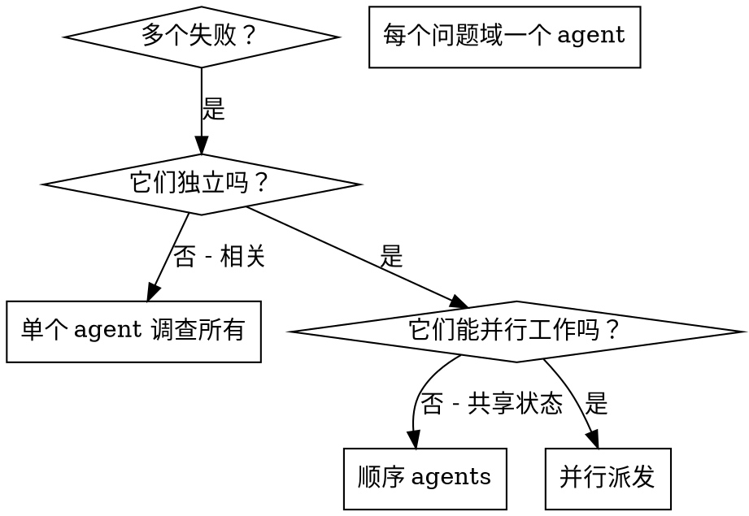

# 派发并行 Agents

## 概述

当你有多个不相关的失败（不同测试文件、不同子系统、不同 bug），顺序调查浪费时间。每个调查是独立的，可以并行发生。

**核心原则：** 每个独立问题域派一个 agent。让它们并发工作。

## 何时使用



**使用时：**
- 3+ 测试文件因不同根本原因失败
- 多个子系统独立损坏
- 每个问题可以在无其他上下文的情况下理解
- 调查间无共享状态

**不要使用时：**
- 失败相关（修复一个可能修复其他）
- 需要理解完整系统状态
- Agents 会相互干扰

## 模式

### 1. 识别独立域

按损坏内容分组失败：
- 文件 A 测试：工具批准流
- 文件 B 测试：批量完成行为
- 文件 C 测试：中止功能

每个域独立 - 修复工具批准不影响中止测试。

### 2. 创建聚焦 Agent 任务

每个 agent 获得：
- **特定范围：** 一个测试文件或子系统
- **清晰目标：** 让这些测试通过
- **约束：** 不要更改其他代码
- **预期输出：** 你发现和修复的内容摘要

### 3. 并行派发

```typescript
// 在 Claude Code / AI 环境中
Task("修复 agent-tool-abort.test.ts 失败")
Task("修复 batch-completion-behavior.test.ts 失败")
Task("修复 tool-approval-race-conditions.test.ts 失败")
// 三个并发运行
```

### 4. 审查和集成

Agents 返回时：
- 阅读每个摘要
- 验证修复不冲突
- 运行完整测试套件
- 集成所有变更

## Agent 提示结构

好的 agent 提示是：
1. **聚焦** - 一个清晰的问题域
2. **自包含** - 理解问题所需的所有上下文
3. **输出具体** - Agent 应该返回什么？

```markdown
修复 src/agents/agent-tool-abort.test.ts 中的 3 个失败测试：

1. "should abort tool with partial output capture" - 期望消息中有 'interrupted at'
2. "should handle mixed completed and aborted tools" - 快工具被中止而非完成
3. "should properly track pendingToolCount" - 期望 3 个结果但得到 0

这些是定时/竞态条件问题。你的任务：

1. 阅读测试文件并理解每个测试验证什么
2. 识别根本原因 - 定时问题还是实际 bug？
3. 通过以下修复：
   - 用基于事件的等待替换任意超时
   - 如果找到修复中止实现中的 bug
   - 如果测试变更行为则调整测试期望

不要只增加超时 - 找到真正的问题。

返回：你发现和修复的内容摘要。
```

## 常见错误

**❌ 太宽泛：** "修复所有测试" - agent 迷路
**✅ 具体：** "修复 agent-tool-abort.test.ts" - 聚焦范围

**❌ 无上下文：** "修复竞态条件" - agent 不知道在哪里
**✅ 上下文：** 粘贴错误消息和测试名称

**❌ 无约束：** Agent 可能重构所有东西
**✅ 约束：** "不要更改生产代码"或"仅修复测试"

**❌ 模糊输出：** "修复它" - 你不知道什么变更了
**✅ 具体：** "返回根本原因和变更摘要"

## 何时不使用

**相关失败：** 修复一个可能修复其他 - 先一起调查
**需要完整上下文：** 理解需要看到整个系统
**探索性调试：** 你还不知道什么坏了
**共享状态：** Agents 会干扰（编辑相同文件，使用相同资源）

## 会话中的真实示例

**场景：** 主要重构后 3 个文件共 6 个测试失败

**失败：**
- agent-tool-abort.test.ts：3 失败（定时问题）
- batch-completion-behavior.test.ts：2 失败（工具未执行）
- tool-approval-race-conditions.test.ts：1 失败（执行计数 = 0）

**决策：** 独立域 - 中止逻辑与批量完成与竞态条件分离

**派发：**
```
Agent 1 -> 修复 agent-tool-abort.test.ts
Agent 2 -> 修复 batch-completion-behavior.test.ts
Agent 3 -> 修复 tool-approval-race-conditions.test.ts
```

**结果：**
- Agent 1：用基于事件的等待替换超时
- Agent 2：修复事件结构 bug（threadId 位置错误）
- Agent 3：添加等待异步工具执行完成

**集成：** 所有修复独立，无冲突，完整套件绿色

**节省时间：** 3 个问题并行解决 vs 顺序

## 关键收益

1. **并行化** - 多个调查同时发生
2. **聚焦** - 每个 agent 范围窄，要跟踪的上下文少
3. **独立性** - Agents 不相互干扰
4. **速度** - 3 个问题在 1 个时间内解决

## 验证

Agents 返回后：
1. **审查每个摘要** - 理解什么变更了
2. **检查冲突** - Agents 编辑相同代码了吗？
3. **运行完整套件** - 验证所有修复一起工作
4. **抽查** - Agents 可能犯系统性错误

## 真实世界影响

来自调试会话（2025-10-03）：
- 3 个文件共 6 失败
- 3 个 agents 并行派发
- 所有调查并发完成
- 所有修复成功集成
- Agent 变更间零冲突
