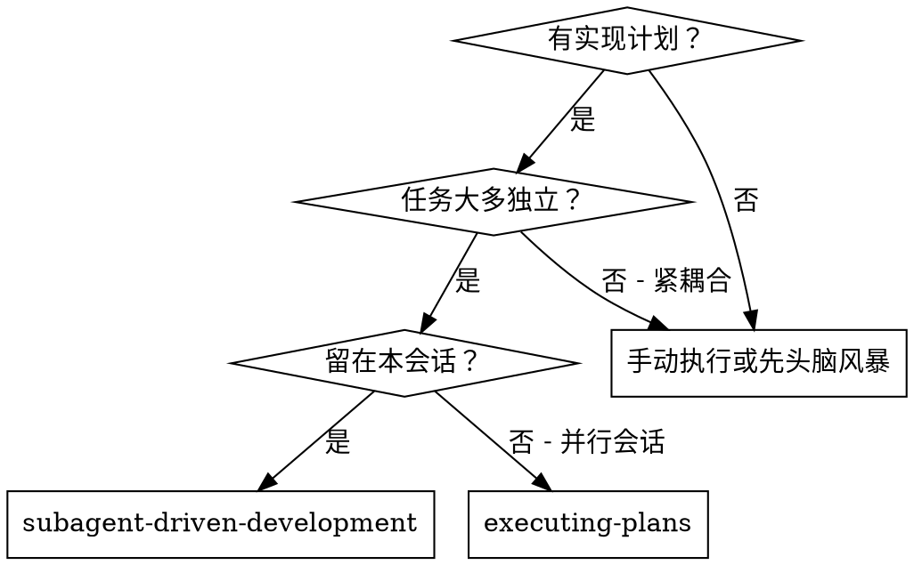
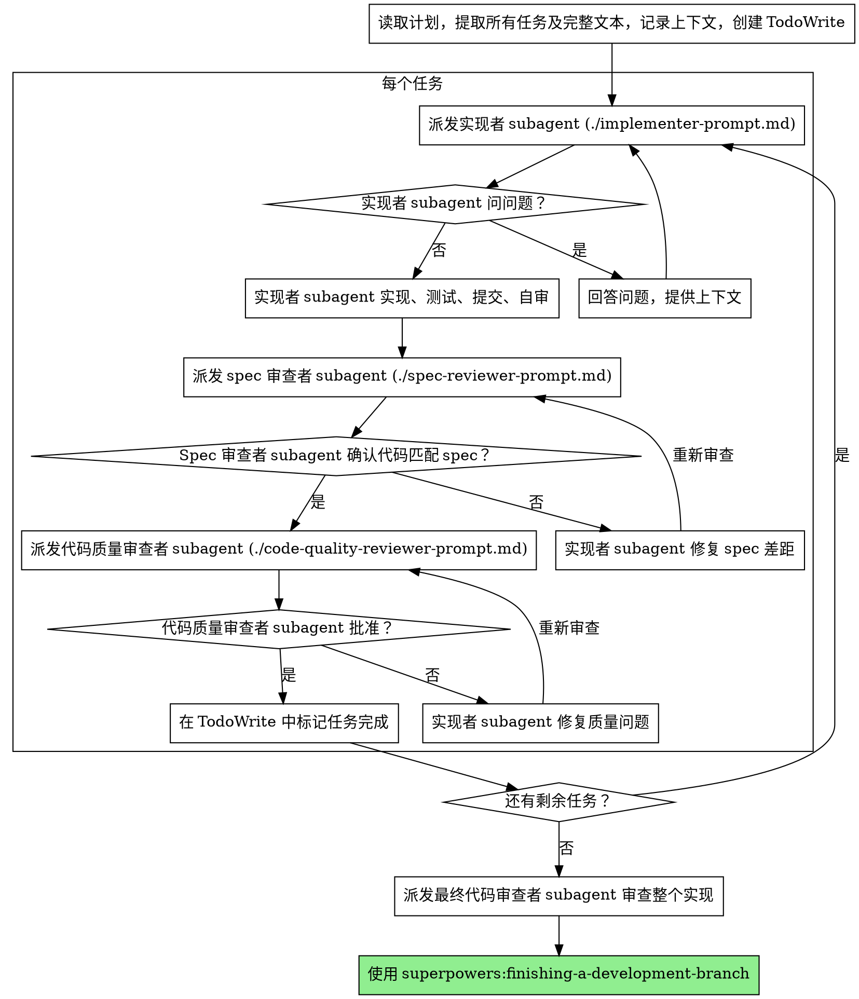

# Subagent 驱动开发

通过为每个任务派新鲜 subagent 执行计划，每个任务后进行两阶段审查：先 spec 合规审查，再代码质量审查。

**核心原则：** 每个任务新鲜 subagent + 两阶段审查（spec 然后质量）= 高质量，快速迭代

## 何时使用



**vs. 执行计划（并行会话）：**
- 同一会话（无上下文切换）
- 每个任务新鲜 subagent（无上下文污染）
- 每个任务后两阶段审查：spec 合规先，然后代码质量
- 更快迭代（任务间无人工介入）

## 流程



## 提示模板

- `./implementer-prompt.md` - 派发实现者 subagent
- `./spec-reviewer-prompt.md` - 派发 spec 合规审查者 subagent
- `./code-quality-reviewer-prompt.md` - 派发代码质量审查者 subagent

## 示例工作流

```
你：我正在使用 Subagent 驱动开发来执行此计划。

[读取计划文件一次：docs/plans/feature-plan.md]
[提取所有 5 个任务及完整文本和上下文]
[用所有任务创建 TodoWrite]

任务 1：Hook 安装脚本

[获取任务 1 文本和上下文（已提取）]
[用完整任务文本 + 上下文派发实现 subagent]

实现者："开始之前 - hook 应该安装在用户级还是系统级？"

你："用户级 (~/.config/superpowers/hooks/)"

实现者："明白。正在实现..."
[稍后] 实现者：
  - 实现了 install-hook 命令
  - 添加了测试，5/5 通过
  - 自审：发现漏了 --force 标志，已添加
  - 已提交

[派发 spec 合规审查者]
Spec 审查者：✅ Spec 合规 - 所有需求满足，没有多余

[获取 git SHAs，派发代码质量审查者]
代码审查者：优点：测试覆盖好，干净。问题：无。已批准。

[标记任务 1 完成]

任务 2：恢复模式

[获取任务 2 文本和上下文（已提取）]
[用完整任务文本 + 上下文派发实现 subagent]

实现者：[无问题，继续]
实现者：
  - 添加了 verify/repair 模式
  - 8/8 测试通过
  - 自审：一切正常
  - 已提交

[派发 spec 合规审查者]
Spec 审查者：❌ 问题：
  - 缺少：进度报告（spec 说"每 100 项报告"）
  - 多余：添加了 --json 标志（未请求）

[实现者修复问题]
实现者：移除了 --json 标志，添加了进度报告

[Spec 审查者再次审查]
Spec 审查者：✅ 现在 spec 合规

[派发代码质量审查者]
代码审查者：优点：扎实。问题（重要）：Magic number (100)

[实现者修复]
实现者：提取了 PROGRESS_INTERVAL 常量

[代码审查者再次审查]
代码审查者：✅ 已批准

[标记任务 2 完成]

...

[所有任务后]
[派发最终代码审查者]
最终审查者：所有需求满足，准备合并

完成！
```

## 优势

**vs. 手动执行：**
- Subagents 自然遵循 TDD
- 每个任务新鲜上下文（无混淆）
- 并行安全（subagents 不干扰）
- Subagent 可以问问题（工作前和工作中）

**vs. 执行计划：**
- 同一会话（无交接）
- 持续进展（无等待）
- 审查检查点自动

**效率提升：**
- 无文件读取开销（控制器提供完整文本）
- 控制器策划确切需要什么上下文
- Subagent 预先获得完整信息
- 问题在工作开始前暴露（而非之后）

**质量门：**
- 交接前自审捕获问题
- 两阶段审查：spec 合规，然后代码质量
- 审查循环确保修复实际工作
- Spec 合规防止过度/不足构建
- 代码质量确保实现构建良好

**成本：**
- 更多 subagent 调用（每个任务实现者 + 2 审查者）
- 控制器做更多准备工作（预先提取所有任务）
- 审查循环增加迭代
- 但早期捕获问题（比之后调试更便宜）

## 红旗

**绝不：**
- 未经用户明确同意在 main/master 分支开始实现
- 跳过审查（spec 合规或代码质量）
- 有未修复问题就继续
- 并行派发多个实现 subagents（冲突）
- 让 subagent 读取计划文件（改为提供完整文本）
- 跳过场景设置上下文（subagent 需要理解任务位置）
- 忽略 subagent 问题（让它们继续前回答）
- 接受 spec 合规"差不多"（spec 审查者发现问题 = 未完成）
- 跳过审查循环（审查者发现问题 = 实现者修复 = 再次审查）
- 让实现者自审替代实际审查（两者都需要）
- **在 spec 合规 ✅ 前开始代码质量审查**（顺序错误）
- 任一审查有未解决问题就进入下一任务

**如果 subagent 问问题：**
- 清晰完整回答
- 如有需要提供额外上下文
- 不要催它们进入实现

**如果审查者发现问题：**
- 实现者（同一 subagent）修复
- 审查者再次审查
- 重复直到批准
- 不要跳过重新审查

**如果 subagent 任务失败：**
- 用具体指令派发修复 subagent
- 不要手动尝试修复（上下文污染）

## 集成

**必需的工作流 skills：**
- **superpowers:using-git-worktrees** - 必需：开始前设置隔离工作空间
- **superpowers:writing-plans** - 创建此 skill 执行的计划
- **superpowers:requesting-code-review** - 审查者 subagents 的代码审查模板
- **superpowers:finishing-a-development-branch** - 所有任务后完成开发

**Subagents 应该使用：**
- **superpowers:test-driven-development** - Subagents 为每个任务遵循 TDD

**替代工作流：**
- **superpowers:executing-plans** - 用于并行会话而非同一会话执行
