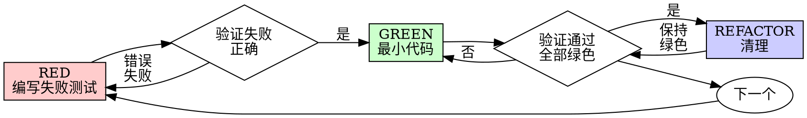

# 测试驱动开发 (TDD)

## 概述

先写测试。看着它失败。编写最小代码让它通过。

**核心原则：** 如果你没有看着测试失败，你就不知道它是否测试了正确的东西。

**违反规则的文字就是违反规则的精神。**

## 何时使用

**总是：**
- 新功能
- Bug 修复
- 重构
- 行为变更

**例外（询问你的伙伴）：**
- 一次性原型
- 生成的代码
- 配置文件

想"就这一次跳过 TDD"？停。那是合理化。

## 铁律

```
没有失败测试在先，就没有生产代码
```

在测试之前写代码？删除它。重新开始。

**没有例外：**
- 不要保留作为"参考"
- 不要在写测试时"适配"它
- 不要看它
- 删除就是删除

从测试开始全新实现。就这样。

## 红-绿-重构



### RED - 编写失败测试

编写一个最小测试展示应该发生什么。

**好**
```typescript
test('失败操作重试 3 次', async () => {
  let attempts = 0;
  const operation = () => {
    attempts++;
    if (attempts < 3) throw new Error('fail');
    return 'success';
  };

  const result = await retryOperation(operation);

  expect(result).toBe('success');
  expect(attempts).toBe(3);
});
```
清晰名称，测试真实行为，只做一件事

**坏**
```typescript
test('retry works', async () => {
  const mock = jest.fn()
    .mockRejectedValueOnce(new Error())
    .mockRejectedValueOnce(new Error())
    .mockResolvedValueOnce('success');
  await retryOperation(mock);
  expect(mock).toHaveBeenCalledTimes(3);
});
```
模糊名称，测试 mock 而非代码

**要求：**
- 一个行为
- 清晰名称
- 真实代码（除非不可避免，否则不用 mock）

### 验证 RED - 看着它失败

**强制。绝不跳过。**

```bash
npm test path/to/test.test.ts
```

确认：
- 测试失败（不是错误）
- 失败消息是预期的
- 因功能缺失而失败（不是拼写错误）

**测试通过了？** 你在测试已存在的行为。修复测试。

**测试报错？** 修复错误，重新运行直到正确失败。

### GREEN - 最小代码

编写最简单的代码让测试通过。

**好**
```typescript
async function retryOperation<T>(fn: () => Promise<T>): Promise<T> {
  for (let i = 0; i < 3; i++) {
    try {
      return await fn();
    } catch (e) {
      if (i === 2) throw e;
    }
  }
  throw new Error('unreachable');
}
```
刚好够通过

**坏**
```typescript
async function retryOperation<T>(
  fn: () => Promise<T>,
  options?: {
    maxRetries?: number;
    backoff?: 'linear' | 'exponential';
    onRetry?: (attempt: number) => void;
  }
): Promise<T> {
  // YAGNI
}
```
过度工程

不要添加功能、重构其他代码，或"改进"超出测试范围。

### 验证 GREEN - 看着它通过

**强制。**

```bash
npm test path/to/test.test.ts
```

确认：
- 测试通过
- 其他测试仍通过
- 输出干净（无错误、警告）

**测试失败？** 修复代码，不是测试。

**其他测试失败？** 立即修复。

### REFACTOR - 清理

仅在绿色之后：
- 移除重复
- 改进名称
- 提取辅助函数

保持测试绿色。不添加行为。

### 重复

下一个功能的下一个失败测试。

## 好的测试

| 质量 | 好 | 坏 |
|---------|------|-----|
| **最小** | 一件事。名字里有"and"？拆分。 | `test('验证 email 和 domain 和 whitespace')` |
| **清晰** | 名称描述行为 | `test('test1')` |
| **展示意图** | 展示期望的 API | 模糊代码应该做什么 |

## 为什么顺序很重要

**"我稍后写测试来验证它工作"**

代码之后写的测试立即通过。立即通过证明不了什么：
- 可能测试错误的东西
- 可能测试实现，而非行为
- 可能错过你忘记的边缘情况
- 你从没看到它捕获 bug

测试优先迫使你看到测试失败，证明它确实测试了东西。

**"我已经手动测试了所有边缘情况"**

手动测试是临时的。你以为你测试了所有但：
- 没有测试记录
- 代码变更时无法重新运行
- 压力下容易忘记情况
- "我试的时候工作" ≠ 全面

自动化测试是系统化的。它们每次都以相同方式运行。

**"删除 X 小时的工作是浪费"**

沉没成本谬误。时间已经没了。你现在的选择：
- 删除并用 TDD 重写（X 更多小时，高信心）
- 保留并稍后添加测试（30 分钟，低信心，可能有 bug）

"浪费"是保留你无法信任的代码。没有真实测试的工作代码是技术债。

**"TDD 是教条，务实意味着适应"**

TDD 就是务实：
- 在提交前发现 bug（比之后调试更快）
- 防止回归（测试立即捕获破坏）
- 记录行为（测试展示如何使用代码）
- 启用重构（自由变更，测试捕获破坏）

"务实"捷径 = 生产环境调试 = 更慢。

**"测试后达到相同目标 - 是精神不是仪式"**

不。测试后回答"这做什么？"测试优先回答"这应该做什么？"

测试后被你的实现偏见。你测试你构建的，不是需要的。你验证记住的边缘情况，不是发现的。

测试优先在实现前强制边缘情况发现。测试后验证你记住了所有（你没记住）。

30 分钟测试后 ≠ TDD。你有覆盖率，失去测试工作的证明。

## 常见合理化

| 借口 | 现实 |
|--------|---------|
| "太简单不需要测试" | 简单代码也会坏。测试只需 30 秒。 |
| "我稍后测试" | 立即通过的测试证明不了什么。 |
| "测试后达到相同目标" | 测试后 = "这做什么？" 测试优先 = "这应该做什么？" |
| "已经手动测试过" | 临时 ≠ 系统化。无记录，无法重新运行。 |
| "删除 X 小时是浪费" | 沉没成本谬误。保留未验证代码是技术债。 |
| "保留作为参考，先写测试" | 你会适配它。那就是测试后。删除意味着删除。 |
| "需要先探索" | 可以。扔掉探索，从 TDD 开始。 |
| "测试难 = 设计不清" | 听测试的。难测试 = 难使用。 |
| "TDD 会拖慢我" | TDD 比调试快。务实 = 测试优先。 |
| "手动测试更快" | 手动不证明边缘情况。每次变更都要重新测试。 |
| "现有代码没有测试" | 你在改进它。为现有代码添加测试。 |

## 红旗 - STOP 并重新开始

- 测试前写代码
- 实现后测试
- 测试立即通过
- 无法解释测试为什么失败
- "稍后"添加测试
- 合理化"就这一次"
- "我已经手动测试过"
- "测试后达到相同目的"
- "是精神不是仪式"
- "保留作为参考"或"适配现有代码"
- "已经花了 X 小时，删除是浪费"
- "TDD 是教条，我在务实"
- "这不同因为..."

**所有这些意味着：删除代码。用 TDD 重新开始。**

## 示例：Bug 修复

**Bug：** 接受空 email

**RED**
```typescript
test('拒绝空 email', async () => {
  const result = await submitForm({ email: '' });
  expect(result.error).toBe('Email required');
});
```

**验证 RED**
```bash
$ npm test
FAIL: expected 'Email required', got undefined
```

**GREEN**
```typescript
function submitForm(data: FormData) {
  if (!data.email?.trim()) {
    return { error: 'Email required' };
  }
  // ...
}
```

**验证 GREEN**
```bash
$ npm test
PASS
```

**REFACTOR**
如需为多个字段提取验证。

## 验证清单

标记工作完成前：

- [ ] 每个新函数/方法都有测试
- [ ] 实现前看着每个测试失败
- [ ] 每个测试因正确原因失败（功能缺失，不是拼写错误）
- [ ] 编写最小代码让每个测试通过
- [ ] 所有测试通过
- [ ] 输出干净（无错误、警告）
- [ ] 测试使用真实代码（仅必要时 mock）
- [ ] 覆盖边缘情况和错误

无法勾选所有？你跳过了 TDD。重新开始。

## 卡住时

| 问题 | 解决方案 |
|---------|----------|
| 不知道怎么测试 | 写期望的 API。先写断言。问你的伙伴。 |
| 测试太复杂 | 设计太复杂。简化接口。 |
| 必须 mock 所有东西 | 代码耦合太高。使用依赖注入。 |
| 测试设置庞大 | 提取辅助函数。还复杂？简化设计。 |

## 调试集成

发现 Bug？编写失败测试复现它。遵循 TDD 循环。测试证明修复并防止回归。

绝不无测试修复 bug。

## 测试反模式

添加 mock 或测试工具时，阅读 @testing-anti-patterns.md 避免常见陷阱：
- 测试 mock 行为而非真实行为
- 向生产类添加仅测试方法
- 不理解依赖就 mock

## 最终规则

```
生产代码 → 测试存在且先失败
否则 → 不是 TDD
```

未经伙伴许可，没有例外。
