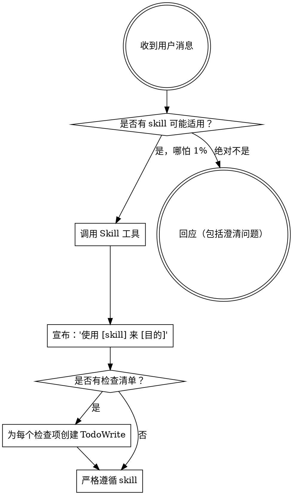

<EXTREMELY-IMPORTANT>
如果你认为某个 skill 有哪怕 1% 的概率适用于你正在做的事情，你**绝对必须**调用该 skill。

如果某个 skill 适用于你的任务，你别无选择。**你必须使用它**。

这是不可协商的。这不是可选项。你不能通过合理化来逃避这一点。
</EXTREMELY-IMPORTANT>

## 如何访问 Skills

**在 Claude Code 中：** 使用 `Skill` 工具。当你调用一个 skill 时，其内容会被加载并呈现给你——直接遵循它。永远不要使用 Read 工具来读取 skill 文件。

**在其他环境中：** 查看你所在平台的文档，了解如何加载 skills。

# 使用 Skills

## 规则

**在做出任何回应或行动之前，先调用相关或被请求的 skills。** 即使只有 1% 的概率某个 skill 可能适用，你也应该调用该 skill 来检查。如果调用的 skill 发现不适用于当前情况，你就不需要使用它。

## 红旗信号

这些想法意味着 STOP——你在合理化：

| 想法 | 现实 |
|---------|---------|
| "这只是个简单的问题" | 问题就是任务。检查 skills。 |
| "我需要先获取更多上下文" | Skill 检查在澄清问题之前。 |
| "让我先探索代码库" | Skills 告诉你如何探索。先检查。 |
| "我可以快速检查 git/文件" | 文件缺乏对话上下文。检查 skills。 |
| "让我先收集信息" | Skills 告诉你如何收集信息。 |
| "这不需要正式的 skill" | 如果 skill 存在，就使用它。 |
| "我记得这个 skill" | Skills 会演进。阅读当前版本。 |
| "这不算任务" | 行动 = 任务。检查 skills。 |
| "这个 skill 太过了" | 简单的事情会变复杂。使用它。 |
| "我先做这件事" | 在做任何事之前先检查。 |
| "这感觉很有效率" | 无纪律的行动浪费时间。Skills 防止这一点。 |
| "我知道那是什么意思" | 知道概念 ≠ 使用 skill。调用它。 |

## Skill 优先级

当多个 skills 可能适用时，使用以下顺序：

1. **流程类 skills 优先** (brainstorming, debugging) - 这些决定如何接近任务
2. **实现类 skills 其次** (frontend-design, mcp-builder) - 这些指导执行

"让我们构建 X" → 先 brainstorming，然后实现 skills。
"修复这个 bug" → 先 debugging，然后领域特定 skills。

## Skill 类型

**刚性** (TDD, debugging)：严格遵循。不要为适应而偏离纪律。

**灵活** (patterns)：根据上下文调整原则。

Skill 本身会告诉你属于哪种类型。

## 用户指令

指令说明 WHAT（做什么），不是 HOW（怎么做）。"添加 X" 或 "修复 Y" 不意味着跳过工作流程。
