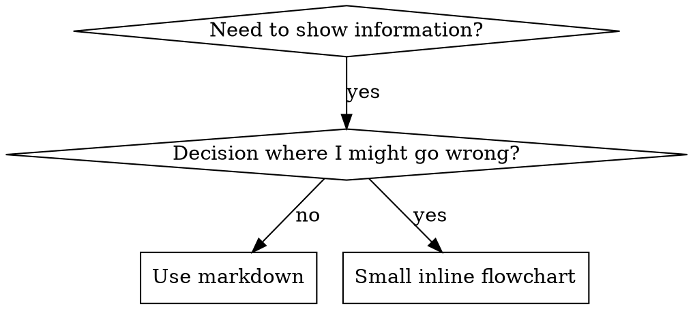

# 编写 Skills

## 概述

**编写 skills 就是将测试驱动开发应用于流程文档。**

**个人 skills 存放在 agent 特定目录（Claude Code 用 `~/.claude/skills`，Codex 用 `~/.codex/skills`）**

你编写测试用例（带 subagents 的压力场景），看着它们失败（基线行为），编写 skill（文档），看着测试通过（agents 遵守），然后重构（关闭漏洞）。

**核心原则：** 如果你没有看着 agent 在没有 skill 时失败，你就不知道 skill 是否教对了东西。

**必需背景：** 在使用此 skill 前，你必须理解 superpowers:test-driven-development。该 skill 定义了基本的 RED-GREEN-REFACTOR 循环。此 skill 将 TDD 适配到文档。

**官方指导：** 关于 Anthropic 官方的 skill 编写最佳实践，请参阅 anthropic-best-practices.md。本文档提供与 TDD 方法相辅相成的额外模式和指南。

## 什么是 Skill？

**Skill** 是已验证技术、模式或工具的参考指南。Skills 帮助未来的 Claude 实例找到并应用有效方法。

**Skills 是：** 可重用技术、模式、工具、参考指南

**Skills 不是：** 关于你如何一次解决问题的叙述

## Skills 的 TDD 映射

| TDD 概念 | Skill 创建 |
|-------------|----------------|
| **测试用例** | 带 subagent 的压力场景 |
| **生产代码** | Skill 文档 (SKILL.md) |
| **测试失败 (RED)** | Agent 无 skill 时违反规则（基线） |
| **测试通过 (GREEN)** | Agent 有 skill 时遵守 |
| **重构** | 关闭漏洞同时保持遵守 |
| **先写测试** | 编写 skill 前运行基线场景 |
| **看着它失败** | 记录 agent 使用的精确合理化 |
| **最小代码** | 编写解决那些特定违规的 skill |
| **看着它通过** | 验证 agent 现在遵守 |
| **重构循环** | 找到新的合理化 → 堵住 → 重新验证 |

整个 skill 创建过程遵循 RED-GREEN-REFACTOR。

## 何时创建 Skill

**创建当：**
- 技术对你不是直观明显的
- 你会跨项目再次参考这个
- 模式广泛适用（非项目特定）
- 其他人会受益

**不要为以下创建：**
- 一次性解决方案
- 其他地方有完善文档的标准实践
- 项目特定约定（放到 CLAUDE.md）
- 机械约束（如果可用 regex/验证强制执行，就自动化——把文档留给判断调用）

## Skill 类型

### 技术
有步骤可循的具体方法（condition-based-waiting、root-cause-tracing）

### 模式
思考问题的方式（flatten-with-flags、test-invariants）

### 参考
API 文档、语法指南、工具文档（office docs）

## 目录结构

```
skills/
  skill-name/
    SKILL.md              # 主参考（必需）
    supporting-file.*     # 仅在需要时
```

**扁平命名空间** - 所有 skills 在一个可搜索命名空间中

**单独文件用于：**
1. **厚重参考** (100+ 行) - API 文档、综合语法
2. **可重用工具** - 脚本、工具、模板

**保持内联：**
- 原则和概念
- 代码模式 (< 50 行)
- 其他所有东西

## SKILL.md 结构

**Frontmatter (YAML)：**
- 仅支持两个字段：`name` 和 `description`
- 总共最多 1024 字符
- `name`：仅使用字母、数字和连字符（无括号、特殊字符）
- `description`：第三人称，仅描述何时使用（不是做什么）
  - 以 "Use when..." 开头聚焦触发条件
  - 包括具体症状、情况和上下文
  - **绝不总结 skill 的流程或工作流**（原因见 CSO 部分）
  - 可能的话保持在 500 字符以下

```markdown
---
name: Skill-Name-With-Hyphens
description: Use when [具体触发条件和症状]
---

# Skill 名称

## Overview
这是什么？1-2 句话的核心原则。

## When to Use
[小内联流程图，如果决定不明显]

带 SYMPTOMS 和使用案例的项目符号列表
何时不使用

## Core Pattern（技术/模式适用）
前后代码对比

## Quick Reference
快速扫描常见操作的表格或项目符号

## Implementation
简单模式内联代码
厚重参考或可重用工具链接到文件

## Common Mistakes
出错内容 + 修复

## Real-World Impact（可选）
具体结果
```

## Claude 搜索优化 (CSO)

**对发现至关重要：** 未来的 Claude 需要找到你的 skill

### 1. 丰富的 Description 字段

**目的：** Claude 读取 description 来决定为给定任务加载哪些 skills。让它回答："我现在应该读这个 skill 吗？"

**格式：** 以 "Use when..." 开头聚焦触发条件

**关键：Description = 何时使用，不是 Skill 做什么**

Description 应该只描述触发条件。不要在 description 中总结 skill 的流程或工作流。

**为什么重要：** 测试显示，当 description 总结 skill 的工作流时，Claude 可能遵循 description 而非阅读完整 skill 内容。说"任务间代码审查"的 description 导致 Claude 只做一次审查，即使 skill 的流程图清楚显示两次审查（spec 合规然后代码质量）。

当 description 改为仅"Use when executing implementation plans with independent tasks in the current session"（无工作流总结）时，Claude 正确阅读流程图并遵循两阶段审查流程。

**陷阱：** 总结工作流的 descriptions 创建 Claude 会走的捷径。Skill 正文变成 Claude 跳过的文档。

```yaml
# ❌ 坏：总结工作流 - Claude 可能遵循这个而非阅读 skill
description: Use when executing plans - dispatches subagent per task with code review between tasks

# ❌ 坏：太多流程细节
description: Use for TDD - write test first, watch it fail, write minimal code, refactor

# ✅ 好：仅触发条件，无工作流总结
description: Use when executing implementation plans with independent tasks in the current session

# ✅ 好：仅触发条件
description: Use when implementing any feature or bugfix, before writing implementation code
```

**内容：**
- 使用具体触发器、信号和表明此 skill 适用的情况
- 描述*问题*（竞态条件、不一致行为）而非*语言特定症状*（setTimeout、sleep）
- 保持触发器技术无关，除非 skill 本身是技术特定的
- 如果 skill 是技术特定的，在触发器中明确说明
- 第三人称撰写（注入系统提示）
- **绝不总结 skill 的流程或工作流**

```yaml
# ❌ 坏：太抽象、模糊，不包括何时使用
description: For async testing

# ❌ 坏：第一人称
description: I can help you with async tests when they're flaky

# ❌ 坏：提及技术但 skill 不特定于它
description: Use when tests use setTimeout/sleep and are flaky

# ✅ 好：以 "Use when" 开头，描述问题，无工作流
description: Use when tests have race conditions, timing dependencies, or pass/fail inconsistently

# ✅ 好：技术特定 skill 带明确触发器
description: Use when using React Router and handling authentication redirects
```

### 2. 关键词覆盖

使用 Claude 会搜索的词：
- 错误消息："Hook timed out"、"ENOTEMPTY"、"race condition"
- 症状："flaky"、"hanging"、"zombie"、"pollution"
- 同义词："timeout/hang/freeze"、"cleanup/teardown/afterEach"
- 工具：实际命令、库名称、文件类型

### 3. 描述性命名

**使用主动语态，动词优先：**
- ✅ `creating-skills` 而非 `skill-creation`
- ✅ `condition-based-waiting` 而非 `async-test-helpers`

### 4. Token 效率（关键）

**问题：** 入门和频繁引用的 skills 加载到每个对话中。每个 token 都重要。

**目标字数：**
- 入门工作流：每个 <150 词
- 频繁加载的 skills：总共 <200 词
- 其他 skills：<500 词（仍然简洁）

**技术：**

**将细节移到工具帮助：**
```bash
# ❌ 坏：在 SKILL.md 中记录所有标志
search-conversations supports --text, --both, --after DATE, --before DATE, --limit N

# ✅ 好：引用 --help
search-conversations supports multiple modes and filters. Run --help for details.
```

**使用交叉引用：**
```markdown
# ❌ 坏：重复工作流细节
When searching, dispatch subagent with template...
[20 行重复指令]

# ✅ 好：引用其他 skill
Always use subagents (50-100x context savings). REQUIRED: Use [other-skill-name] for workflow.
```

**压缩示例：**
```markdown
# ❌ 坏：冗长示例（42 词）
your human partner: "How did we handle authentication errors in React Router before?"
You: I'll search past conversations for React Router authentication patterns.
[Dispatch subagent with search query: "React Router authentication error handling 401"]

# ✅ 好：最小示例（20 词）
Partner: "How did we handle auth errors in React Router?"
You: Searching...
[Dispatch subagent → synthesis]
```

**消除冗余：**
- 不要重复交叉引用 skills 中的内容
- 不要解释命令中明显的
- 不要包含同一模式的多个示例

**验证：**
```bash
wc -w skills/path/SKILL.md
# 入门工作流：目标每个 <150
# 其他频繁加载的：目标总共 <200
```

**按你做什么或核心洞察命名：**
- ✅ `condition-based-waiting` > `async-test-helpers`
- ✅ `using-skills` not `skill-usage`
- ✅ `flatten-with-flags` > `data-structure-refactoring`
- ✅ `root-cause-tracing` > `debugging-techniques`

**动名词 (-ing) 对流程很有效：**
- `creating-skills`、`testing-skills`、`debugging-with-logs`
- 主动，描述你正在采取的行动

### 4. 交叉引用其他 Skills

**编写引用其他 skills 的文档时：**

仅使用 skill 名称，带明确要求标记：
- ✅ 好：`**REQUIRED SUB-SKILL:** Use superpowers:test-driven-development`
- ✅ 好：`**REQUIRED BACKGROUND:** You MUST understand superpowers:systematic-debugging`
- ❌ 坏：`See skills/testing/test-driven-development`（不清楚是否必需）
- ❌ 坏：`@skills/testing/test-driven-development/SKILL.md`（强制加载，消耗上下文）

**为什么不用 @ 链接：** `@` 语法立即强制加载文件，在你需要它们之前消耗 200k+ 上下文。

## 流程图使用



**仅对以下使用流程图：**
- 不明显的决策点
- 你可能过早停止的流程循环
- "何时使用 A vs B" 决策

**绝不对以下使用流程图：**
- 参考材料 → 表格、列表
- 代码示例 → Markdown 块
- 线性指令 → 编号列表
- 无语义含义的标签（step1、helper2）

样式规则见 @graphviz-conventions.dot。

**为你的伙伴可视化：** 使用此目录中的 `render-graphs.js` 将 skill 的流程图渲染为 SVG：
```bash
./render-graphs.js ../some-skill           # 每个图单独
./render-graphs.js ../some-skill --combine # 所有图在一个 SVG 中
```

## 代码示例

**一个优秀示例胜过多个平庸示例**

选择最相关的语言：
- 测试技术 → TypeScript/JavaScript
- 系统调试 → Shell/Python
- 数据处理 → Python

**好示例：**
- 完整且可运行
- 注释良好解释 WHY
- 来自真实场景
- 清楚展示模式
- 准备适配（非通用模板）

**不要：**
- 用 5+ 语言实现
- 创建填空模板
- 编写人为示例

你擅长移植 - 一个优秀示例就够了。

## 文件组织

### 自包含 Skill
```
defense-in-depth/
  SKILL.md    # 所有内容内联
```
何时：所有内容适合，不需要厚重参考

### 带可重用工具的 Skill
```
condition-based-waiting/
  SKILL.md    # 概述 + 模式
  example.ts  # 可适配的工作辅助函数
```
何时：工具是可重用代码，不只是叙述

### 带厚重参考的 Skill
```
pptx/
  SKILL.md       # 概述 + 工作流
  pptxgenjs.md   # 600 行 API 参考
  ooxml.md       # 500 行 XML 结构
  scripts/       # 可执行工具
```
何时：参考材料太大不适合内联

## 铁律（与 TDD 相同）

```
没有失败测试在先，就没有 SKILL
```

这适用于新 skills 和现有 skills 的编辑。

测试前编写 skill？删除它。重新开始。
无测试编辑 skill？同样违规。

**没有例外：**
- 不为"简单添加"
- 不为"只是添加一节"
- 不为"文档更新"
- 不要将未测试变更保留为"参考"
- 不要测试时"适配"
- 删除意味着删除

**必需背景：** superpowers:test-driven-development skill 解释为什么这很重要。相同原则适用于文档。

## 测试所有 Skill 类型

不同类型的 skills 需要不同的测试方法：

### 纪律执行 Skills（规则/要求）

**示例：** TDD、verification-before-completion、designing-before-coding

**用以下测试：**
- 学术问题：它们理解规则吗？
- 压力场景：它们在压力下遵守吗？
- 多重压力组合：时间 + 沉没成本 + 疲惫
- 识别合理化并添加明确反驳

**成功标准：** Agent 在最大压力下遵循规则

### 技术 Skills（操作指南）

**示例：** condition-based-waiting、root-cause-tracing、defensive-programming

**用以下测试：**
- 应用场景：它们能正确应用技术吗？
- 变体场景：它们处理边缘情况吗？
- 缺失信息测试：指令有缺口吗？

**成功标准：** Agent 成功将技术应用于新场景

### 模式 Skills（心智模型）

**示例：** reducing-complexity、information-hiding 概念

**用以下测试：**
- 识别场景：它们识别模式何时适用吗？
- 应用场景：它们能使用心智模型吗？
- 反例：它们知道何时不适用吗？

**成功标准：** Agent 正确识别何时/如何应用模式

### 参考 Skills（文档/API）

**示例：** API 文档、命令参考、库指南

**用以下测试：**
- 检索场景：它们能找到正确信息吗？
- 应用场景：它们能正确使用找到的吗？
- 缺口测试：常见用例被覆盖了吗？

**成功标准：** Agent 找到并正确应用参考信息

## 跳过测试的常见合理化

| 借口 | 现实 |
|--------|---------|
| "Skill 显然很清楚" | 对你清楚 ≠ 对其他 agents 清楚。测试它。 |
| "它只是参考" | 参考可能有缺口、不清楚的章节。测试检索。 |
| "测试太过了" | 未测试的 skills 有问题。总是。15 分钟测试节省数小时。 |
| "如果问题出现我会测试" | 问题 = agents 无法使用 skill。部署前测试。 |
| "测试太繁琐" | 测试比在生产环境调试坏 skill 更不繁琐。 |
| "我有信心它是好的" | 过度自信保证问题。还是测试。 |
| "学术审查就够了" | 阅读 ≠ 使用。测试应用场景。 |
| "没时间测试" | 部署未测试 skill 浪费更多时间稍后修复。 |

**所有这些意味着：部署前测试。没有例外。**

## 使 Skills 防弹对抗合理化

执行纪律的 skills（如 TDD）需要抵抗合理化。Agents 很聪明，会在压力下找到漏洞。

**心理学注：** 理解 WHY 说服技术有效帮助你系统应用它们。见 persuasion-principles.md 了解研究基础（Cialdini, 2021; Meincke et al., 2025）关于权威、承诺、稀缺、社会认同和团结原则。

### 明确关闭每个漏洞

不要只陈述规则 - 禁止特定变通：

<Bad>
```markdown
Write code before test? Delete it.
```
</Bad>

<Good>
```markdown
Write code before test? Delete it. Start over.

**No exceptions:**
- Don't keep it as "reference"
- Don't "adapt" it while writing tests
- Don't look at it
- Delete means delete
```
</Good>

### 处理"精神 vs 文字"论点

早期添加基础原则：

```markdown
**Violating the letter of the rules is violating the spirit of the rules.**
```

这切断整个"我在遵循精神"合理化类别。

### 建立合理化表格

从基线测试捕获合理化（见下面的测试部分）。Agents 做的每个借口都进表格：

```markdown
| Excuse | Reality |
|--------|---------|
| "Too simple to test" | Simple code breaks. Test takes 30 seconds. |
| "I'll test after" | Tests passing immediately prove nothing. |
| "Tests after achieve same goals" | Tests-after = "what does this do?" Tests-first = "what should this do?" |
```

### 创建红旗列表

让 agents 合理化时容易自我检查：

```markdown
## Red Flags - STOP and Start Over

- Code before test
- "I already manually tested it"
- "Tests after achieve the same purpose"
- "It's about spirit not ritual"
- "This is different because..."

**All of these mean: Delete code. Start over with TDD.**
```

### 为违规症状更新 CSO

添加到 description：你即将违反规则时的症状：

```yaml
description: use when implementing any feature or bugfix, before writing implementation code
```

## Skills 的 RED-GREEN-REFACTOR

遵循 TDD 循环：

### RED：编写失败测试（基线）

不带 skill 用 subagent 运行压力场景。记录精确行为：
- 它们做了什么选择？
- 它们使用了什么合理化（逐字）？
- 哪些压力触发了违规？

这是"看着测试失败" - 你必须在编写 skill 前看到 agents 自然做什么。

### GREEN：编写最小 Skill

编写解决那些特定合理化的 skill。不要为假设案例添加额外内容。

用 skill 运行相同场景。Agent 应该现在遵守。

### REFACTOR：关闭漏洞

Agent 找到新合理化？添加明确反驳。重新测试直到防弹。

**测试方法：** 见 @testing-skills-with-subagents.md 了解完整测试方法：
- 如何编写压力场景
- 压力类型（时间、沉没成本、权威、疲惫）
- 系统堵住漏洞
- 元测试技术

## 反模式

### ❌ 叙述示例
"在 2025-10-03 会话中，我们发现空 projectDir 导致..."
**为什么坏：** 太具体，不可重用

### ❌ 多语言稀释
example-js.js、example-py.py、example-go.go
**为什么坏：** 平庸质量，维护负担

### ❌ 流程图中的代码
```dot
step1 [label="import fs"];
step2 [label="read file"];
```
**为什么坏：** 无法复制粘贴，难读

### ❌ 通用标签
helper1、helper2、step3、pattern4
**为什么坏：** 标签应该有语义含义

## STOP：在进入下一 Skill 之前

**编写任何 skill 后，你必须 STOP 并完成部署流程。**

**不要：**
- 批量创建多个 skills 而不测试每个
- 当前 skill 验证前进入下一 skill
- 因为"批量更高效"跳过测试

**下面的部署检查清单对每个 skill 是强制的。**

部署未测试 skills = 部署未测试代码。这是违反质量标准的。

## Skill 创建检查清单（TDD 适配）

**重要：使用 TodoWrite 为下面每个检查项创建 todos。**

**RED 阶段 - 编写失败测试：**
- [ ] 创建压力场景（纪律 skills 3+ 组合压力）
- [ ] 不带 skill 运行场景 - 逐字记录基线行为
- [ ] 识别合理化/失败中的模式

**GREEN 阶段 - 编写最小 Skill：**
- [ ] 名称仅使用字母、数字、连字符（无括号/特殊字符）
- [ ] YAML frontmatter 只有 name 和 description（最多 1024 字符）
- [ ] Description 以 "Use when..." 开头并包括具体触发器/症状
- [ ] Description 第三人称撰写
- [ ] 全文关键词用于搜索（错误、症状、工具）
- [ ] 清晰概述带核心原则
- [ ] 解决 RED 中识别的具体基线失败
- [ ] 代码内联或链接到单独文件
- [ ] 一个优秀示例（非多语言）
- [ ] 带 skill 运行场景 - 验证 agents 现在遵守

**REFACTOR 阶段 - 关闭漏洞：**
- [ ] 从测试识别新合理化
- [ ] 添加明确反驳（如果是纪律 skill）
- [ ] 从所有测试迭代建立合理化表格
- [ ] 创建红旗列表
- [ ] 重新测试直到防弹

**质量检查：**
- [ ] 小流程图仅在决定不明显时
- [ ] 快速参考表格
- [ ] 常见错误章节
- [ ] 无叙述故事
- [ ] 支持文件仅用于工具或厚重参考

**部署：**
- [ ] 提交 skill 到 git 并推送到你的 fork（如果配置）
- [ ] 考虑通过 PR 贡献回来（如果广泛有用）

## 发现工作流

未来 Claude 如何找到你的 skill：

1. **遇到问题** ("tests are flaky")
3. **找到 SKILL** (description 匹配)
4. **扫描概述** (这相关吗？)
5. **阅读模式** (快速参考表格)
6. **加载示例** (仅在实现时)

**为此流程优化** - 早期和经常放置可搜索词。

## 底线

**创建 skills 就是流程文档的 TDD。**

相同铁律：没有失败测试在先，就没有 skill。
相同循环：RED（基线）→ GREEN（编写 skill）→ REFACTOR（关闭漏洞）。
相同收益：更好质量、更少意外、防弹结果。

如果你为代码遵循 TDD，为 skills 遵循它。这是应用于文档的相同纪律。
