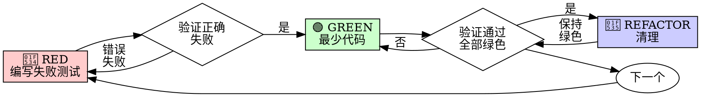

# 测试驱动开发（TDD）

## 概述

先写测试。看它失败。编写最少代码让它通过。

**核心原则：** 如果你没有看到测试失败，你就不知道它是否测试了正确的东西。

**违反规则的文字就是违反规则的精神。**

## 何时使用

**总是：**
- 新功能
- Bug 修复
- 重构
- 行为变更

**例外（询问你的合作伙伴）：**
- 一次性原型
- 生成的代码
- 配置文件

想着"这次跳过 TDD"？停下来。那是在为自己找借口。

## 铁律

```
没有失败的测试，就没有生产代码
```

在测试之前写了代码？删除它。重新开始。

**没有例外：**
- 不要保留它作为"参考"
- 不要在写测试时"改编"它
- 不要看它
- 删除就是删除

完全根据测试重新实现。就这样。

## RED-GREEN-REFACTOR（红-绿-重构）



### 🔴 RED - 编写失败测试

编写一个最小的测试，展示应该发生什么。

<好例子>
```typescript
test('重试失败操作 3 次', async () => {
  let attempts = 0;
  const operation = () => {
    attempts++;
    if (attempts < 3) throw new Error('fail');
    return 'success';
  };

  const result = await retryOperation(operation);

  expect(result).toBe('success');
  expect(attempts).toBe(3);
});
```
名称清晰，测试真实行为，只做一件事
</好例子>

<坏例子>
```typescript
test('重试有效', async () => {
  const mock = jest.fn()
    .mockRejectedValueOnce(new Error())
    .mockRejectedValueOnce(new Error())
    .mockResolvedValueOnce('success');
  await retryOperation(mock);
  expect(mock).toHaveBeenCalledTimes(3);
});
```
名称模糊，测试的是 mock 而不是代码
</坏例子>

**要求：**
- 一个行为
- 清晰的名称
- 真实代码（除非不可避免，否则不要用 mock）

### 验证 RED - 看它失败

**强制性的。永远不要跳过。**

```bash
npm test path/to/test.test.ts
```

确认：
- 测试失败（不是错误）
- 失败消息是预期的
- 失败是因为功能缺失（不是拼写错误）

**测试通过了？** 你在测试现有行为。修复测试。

**测试报错？** 修复错误，重新运行直到它正确失败。

### 🟢 GREEN - 最少代码

编写最简单的代码让测试通过。

<好例子>
```typescript
async function retryOperation<T>(fn: () => Promise<T>): Promise<T> {
  for (let i = 0; i < 3; i++) {
    try {
      return await fn();
    } catch (e) {
      if (i === 2) throw e;
    }
  }
  throw new Error('unreachable');
}
```
刚好够通过
</好例子>

<坏例子>
```typescript
async function retryOperation<T>(
  fn: () => Promise<T>,
  options?: {
    maxRetries?: number;
    backoff?: 'linear' | 'exponential';
    onRetry?: (attempt: number) => void;
  }
): Promise<T> {
  // YAGNI - 你不需要它
}
```
过度设计
</坏例子>

不要添加功能、重构其他代码，或"改进"超出测试范围的内容。

### 验证 GREEN - 看它通过

**强制性的。**

```bash
npm test path/to/test.test.ts
```

确认：
- 测试通过
- 其他测试仍然通过
- 输出干净（没有错误、警告）

**测试失败？** 修复代码，不是测试。

**其他测试失败？** 立即修复。

### 🔵 REFACTOR - 清理

只有在变绿之后：
- 消除重复
- 改进名称
- 提取辅助函数

保持测试绿色。不要添加行为。

### 重复

为下一个功能编写下一个失败测试。

## 为什么顺序很重要

**"我后面再写测试来验证它有效"**

在代码之后写的测试会立即通过。立即通过证明不了什么：
- 可能测试了错误的东西
- 可能测试了实现，而不是行为
- 可能遗漏了你忘记的边界情况
- 你从未看到它捕获 bug

先测试迫使你看到测试失败，证明它确实测试了某些东西。

**"我已经手动测试了所有边界情况"**

手动测试是临时的。你以为你测试了一切，但是：
- 没有测试内容的记录
- 代码变更时无法重新运行
- 压力下容易忘记情况
- "我试的时候有效" ≠ 全面

自动化测试是系统性的。它们每次都以相同的方式运行。

## 常见借口

| 借口 | 现实 |
|------|------|
| "太简单了不需要测试" | 简单代码也会坏。测试只需要 30 秒。 |
| "我后面再测试" | 立即通过的测试证明不了什么。 |
| "后面测试能达到同样的目标" | 后测试 = "这做什么？" 先测试 = "这应该做什么？" |
| "已经手动测试过了" | 临时 ≠ 系统。没有记录，无法重新运行。 |
| "删除 X 小时的工作太浪费了" | 沉没成本谬误。保留未验证的代码是技术债务。 |
| "保留作为参考，先写测试" | 你会改编它。那就是后测试。删除就是删除。 |
| "需要先探索一下" | 可以。扔掉探索成果，用 TDD 重新开始。 |
| "测试太难 = 设计不清晰" | 倾听测试。难测试 = 难使用。 |
| "TDD 会拖慢我" | TDD 比 debug 更快。务实 = 先测试。 |
| "手动测试更快" | 手动测试无法证明边界情况。每次变更都要重新测试。 |
| "现有代码没有测试" | 你在改进它。为现有代码添加测试。 |

## 危险信号 - STOP 并重新开始

- 代码在测试之前
- 实现之后写测试
- 测试立即通过
- 无法解释为什么测试失败
- "稍后"添加测试
- 为自己找借口"就这一次"
- "我已经手动测试过了"
- "后面测试能达到同样的目的"
- "这是关于精神而不是仪式"
- "保留作为参考"或"改编现有代码"
- "已经花了 X 小时，删除是浪费"
- "TDD 是教条的，我是务实的"
- "这不一样，因为..."

**所有这些都意味着：删除代码。用 TDD 重新开始。**

## 验证清单

在标记工作完成之前：

- [ ] 每个新函数/方法都有测试
- [ ] 在实现之前看到每个测试失败
- [ ] 每个测试因预期原因失败（功能缺失，不是拼写错误）
- [ ] 编写了最少代码让每个测试通过
- [ ] 所有测试通过
- [ ] 输出干净（没有错误、警告）
- [ ] 测试使用真实代码（只有不可避免时才用 mock）
- [ ] 涵盖了边界情况和错误

无法勾选所有框？你跳过了 TDD。重新开始。

## 最终规则

```
生产代码 → 测试存在且先失败
否则 → 不是 TDD
```

没有例外，除非得到你的合作伙伴的许可。