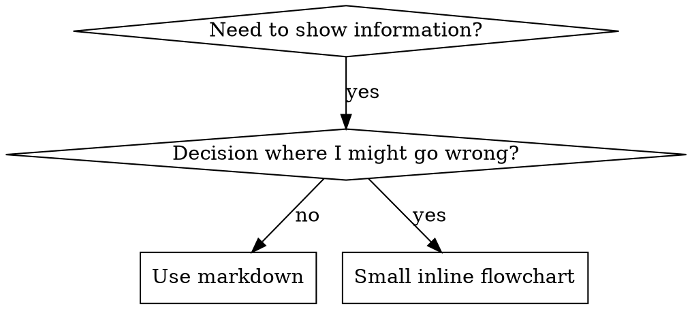

# 编写 Skills

## 概述

**编写 skills 是将测试驱动开发应用于流程文档。**

**个人 skills 位于代理特定目录（Claude Code 在 `~/.claude/skills`，Codex 在 `~/.codex/skills`）**

你编写测试用例（用子代理的压力场景），观察它们失败（基线行为），编写 skill（文档），观察测试通过（代理遵守），然后重构（关闭漏洞）。

**核心原则：** 如果你没有看到代理在没有 skill 的情况下失败，你就不知道 skill 是否教了正确的东西。

**必需背景：** 在使用此 skill 之前，你**必须**理解 superpowers:test-driven-development。该 skill 定义了基本的 RED-GREEN-REFACTOR 循环。此 skill 将 TDD 适配到文档。

**官方指导：** 对于 Anthropic 官方的 skill 编写最佳实践，请参阅 anthropic-best-practices.md。本文档提供了与此 skill 中 TDD 聚焦方法相辅相成的额外模式和指导。

## 什么是 Skill？

**skill** 是经过验证的技术、模式或工具的参考指南。Skills 帮助未来的 Claude 实例找到并应用有效的方法。

**Skills 是：** 可重用技术、模式、工具、参考指南

**Skills 不是：** 关于你如何一次性解决问题的叙述

## Skill 创建的 TDD 映射

| TDD 概念 | Skill 创建 |
|----------|-----------|
| **测试用例** | 用子代理的压力场景 |
| **生产代码** | Skill 文档（SKILL.md） |
| **测试失败（RED）** | 没有 skill 时代理违反规则（基线） |
| **测试通过（GREEN）** | 有 skill 时代理遵守 |
| **重构** | 在保持遵守的同时关闭漏洞 |
| **先写测试** | 在编写 skill 之前运行基线场景 |
| **观察失败** | 记录代理使用的确切合理化 |
| **最少代码** | 编写解决那些特定违规的 skill |
| **观察通过** | 验证代理现在遵守 |
| **重构循环** | 找到新的合理化 → 填补 → 重新验证 |

整个 skill 创建过程遵循 RED-GREEN-REFACTOR。

## 何时创建 Skill

**当以下情况时创建：**
- 技术对你来说不是直观明显的
- 你会在跨项目中再次引用它
- 模式广泛适用（不是项目特定）
- 其他人会受益

**不要为以下情况创建：**
- 一次性解决方案
- 其他地方有良好文档的标准实践
- 项目特定约定（放在 CLAUDE.md 中）
- 机械约束（如果可以用正则/验证强制执行，就自动化——将文档留给判断调用）

## Skill 类型

### 技术
遵循的具体方法（condition-based-waiting、root-cause-tracing）

### 模式
思考问题的方式（flatten-with-flags、test-invariants）

### 参考
API 文档、语法指南、工具文档（office 文档）

## 目录结构

```
skills/
  skill-name/
    SKILL.md              # 主要参考（必需）
    supporting-file.*     # 仅在需要时
```

**扁平命名空间** - 所有 skills 在一个可搜索的命名空间中

**单独文件用于：**
1. **重度参考**（100+ 行）- API 文档、综合语法
2. **可重用工具** - 脚本、工具、模板

**保持内联：**
- 原则和概念
- 代码模式（< 50 行）
- 其他一切

## SKILL.md 结构

**Frontmatter（YAML）：**
- 仅支持两个字段：`name` 和 `description`
- 总共最多 1024 个字符
- `name`：仅使用字母、数字和连字符（无括号、特殊字符）
- `description`：第三人称，仅描述何时使用（不是它做什么）
  - 以"Use when..."开头，聚焦触发条件
  - 包括具体症状、情况和上下文
  - **永远不要总结 skill 的流程或工作流**（CSO 部分解释原因）
  - 尽可能保持在 500 字符以下

```markdown
---
name: Skill-Name-With-Hyphens
description: Use when [specific triggering conditions and symptoms]
---

# Skill Name

## Overview
这是什么？1-2 句话的核心原则。

## When to Use
[小内联流程图，如果决定不明显]

带症状和用例的项目符号列表
何时不使用

## Core Pattern（对于技术/模式）
Before/after 代码对比

## Quick Reference
表格或项目符号用于扫描常见操作

## Implementation
简单模式的内联代码
链接到重度参考或可重用工具的文件

## Common Mistakes
什么问题 + 修复

## Real-World Impact（可选）
具体结果
```

## Claude 搜索优化（CSO）

**对发现关键：** 未来的 Claude 需要**找到**你的 skill

### 1. 丰富的描述字段

**目的：** Claude 读取描述来决定为给定任务加载哪些 skills。让它回答："我现在应该读这个 skill 吗？"

**格式：** 以"Use when..."开头，聚焦触发条件

**关键：描述 = 何时使用，不是 Skill 做什么**

描述应该只描述触发条件。**不要在描述中总结 skill 的流程或工作流。**

**为什么重要：** 测试显示，当描述总结 skill 的工作流时，Claude 可能遵循描述而不是阅读完整的 skill 内容。一个说"任务间代码审查"的描述导致 Claude 只做**一次**审查，即使 skill 的流程图清楚地显示了**两次**审查（规格合规然后代码质量）。

当描述改为"在执行具有独立任务的实现计划时使用"（没有工作流总结），Claude 正确阅读流程图并遵循两阶段审查流程。

**陷阱：** 总结工作流的描述会创建 Claude 会走的捷径。Skill 主体变成 Claude 跳过的文档。

```yaml
# ❌ 坏：总结工作流 - Claude 可能遵循这个而不是阅读 skill
description: Use when executing plans - dispatches subagent per task with code review between tasks

# ❌ 坏：太多流程细节
description: Use for TDD - write test first, watch it fail, write minimal code, refactor

# ✅ 好：只有触发条件，没有工作流总结
description: Use when executing implementation plans with independent tasks in the current session

# ✅ 好：只有触发条件
description: Use when implementing any feature or bugfix, before writing implementation code
```

**内容：**
- 使用具体触发器、信号和表明此 skill 适用的情况
- 描述*问题*（竞态条件、不一致行为）而不是*语言特定症状*（setTimeout、sleep）
- 除非 skill 本身是技术特定的，否则保持触发器与技术无关
- 如果 skill 是技术特定的，在触发器中明确说明
- 第三人称撰写（注入系统提示）
- **永远不要总结 skill 的流程或工作流**

```yaml
# ❌ 坏：太抽象、模糊，不包括何时使用
description: For async testing

# ❌ 坏：第一人称
description: I can help you with async tests when they're flaky

# ❌ 坏：提到技术但 skill 不限于它
description: Use when tests use setTimeout/sleep and are flaky

# ✅ 好：以"Use when"开头，描述问题，没有工作流
description: Use when tests have race conditions, timing dependencies, or pass/fail inconsistently

# ✅ 好：技术特定 skill 带明确触发器
description: Use when using React Router and handling authentication redirects
```

### 2. 关键词覆盖

使用 Claude 会搜索的词：
- 错误消息："Hook timed out"、"ENOTEMPTY"、"race condition"
- 症状："flaky"、"hanging"、"zombie"、"pollution"
- 同义词："timeout/hang/freeze"、"cleanup/teardown/afterEach"
- 工具：实际命令、库名称、文件类型

### 3. 描述性命名

**使用主动语态，动词开头：**
- ✅ `creating-skills` 不是 `skill-creation`
- ✅ `condition-based-waiting` 不是 `async-test-helpers`

### 4. 令牌效率（关键）

**问题：** getting-started 和频繁引用的 skills 加载到**每个**对话中。每个令牌都重要。

**目标字数：**
- getting-started 工作流：每个 <150 词
- 频繁加载的 skills：总共 <200 词
- 其他 skills：<500 词（仍然要简洁）

**技术：**

**将细节移到工具帮助：**
```bash
# ❌ 坏：在 SKILL.md 中记录所有标志
search-conversations supports --text, --both, --after DATE, --before DATE, --limit N

# ✅ 好：引用 --help
search-conversations supports multiple modes and filters. Run --help for details.
```

**使用交叉引用：**
```markdown
# ❌ 坏：重复工作流细节
When searching, dispatch subagent with template...
[20 lines of repeated instructions]

# ✅ 好：引用其他 skill
Always use subagents (50-100x context savings). REQUIRED: Use [other-skill-name] for workflow.
```

**压缩示例：**
```markdown
# ❌ 坏：冗长示例（42 词）
your human partner: "How did we handle authentication errors in React Router before?"
You: I'll search past conversations for React Router authentication patterns.
[Dispatch subagent with search query: "React Router authentication error handling 401"]

# ✅ 好：最小示例（20 词）
Partner: "How did we handle auth errors in React Router?"
You: Searching...
[Dispatch subagent → synthesis]
```

**消除冗余：**
- 不要重复交叉引用 skills 中的内容
- 不要解释从命令明显的东西
- 不要包含同一模式的多个示例

**验证：**
```bash
wc -w skills/path/SKILL.md
# getting-started 工作流：目标 <150 每个
# 其他频繁加载的：目标 <200 总共
```

**按你做的或核心洞察命名：**
- ✅ `condition-based-waiting` > `async-test-helpers`
- ✅ `using-skills` 不是 `skill-usage`
- ✅ `flatten-with-flags` > `data-structure-refactoring`
- ✅ `root-cause-tracing` > `debugging-techniques`

**动名词（-ing）对流程很有效：**
- `creating-skills`、`testing-skills`、`debugging-with-logs`
- 主动的，描述你正在采取的行动

### 4. 交叉引用其他 Skills

**在编写引用其他 skills 的文档时：**

仅使用 skill 名称，带明确要求标记：
- ✅ 好：`**REQUIRED SUB-SKILL:** Use superpowers:test-driven-development`
- ✅ 好：`**REQUIRED BACKGROUND:** You MUST understand superpowers:systematic-debugging`
- ❌ 坏：`See skills/testing/test-driven-development`（不清楚是否必需）
- ❌ 坏：`@skills/testing/test-driven-development/SKILL.md`（强制加载，消耗上下文）

**为什么没有 @ 链接：** `@` 语法立即强制加载文件，在你需要它们之前消耗 200k+ 上下文。

## 流程图使用



**仅将流程图用于：**
- 不明显的决策点
- 你可能过早停止的流程循环
- "何时使用 A vs B"决策

**永远不要将流程图用于：**
- 参考材料 → 表格、列表
- 代码示例 → Markdown 块
- 线性指令 → 编号列表
- 没有语义意义的标签（step1、helper2）

请参阅 @graphviz-conventions.dot 了解 graphviz 样式规则。

**为你的合作伙伴可视化：** 使用本目录中的 `render-graphs.js` 将 skill 的流程图渲染为 SVG：
```bash
./render-graphs.js ../some-skill           # 每个图表单独
./render-graphs.js ../some-skill --combine # 所有图表在一个 SVG 中
```

## 代码示例

**一个优秀的示例胜过许多平庸的示例**

选择最相关的语言：
- 测试技术 → TypeScript/JavaScript
- 系统调试 → Shell/Python
- 数据处理 → Python

**好的示例：**
- 完整且可运行
- 注释良好解释**为什么**
- 来自真实场景
- 清楚展示模式
- 准备好适应（不是通用模板）

**不要：**
- 用 5+ 语言实现
- 创建填空模板
- 编写人为示例

你很擅长移植——一个伟大的示例就够了。

## 文件组织

### 自包含 Skill
```
defense-in-depth/
  SKILL.md    # 一切内联
```
何时：所有内容适合，不需要重度参考

### 带可重用工具的 Skill
```
condition-based-waiting/
  SKILL.md    # 概述 + 模式
  example.ts  # 可适应的工作辅助函数
```
何时：工具是可重用代码，不只是叙述

### 带重度参考的 Skill
```
pptx/
  SKILL.md       # 概述 + 工作流
  pptxgenjs.md   # 600 行 API 参考
  ooxml.md       # 500 行 XML 结构
  scripts/       # 可执行工具
```
何时：参考材料太大不适合内联

## 铁律（与 TDD 相同）

```
没有失败的测试，就没有 skill
```

这适用于**新** skills 和**编辑**现有 skills。

在测试之前写 skill？删除它。重新开始。
没有测试就编辑 skill？同样的违规。

**没有例外：**
- 不是为了"简单添加"
- 不是为了"只是添加一个部分"
- 不是为了"文档更新"
- 不要将未测试的变更作为"参考"保留
- 不要在运行测试时"改编"
- 删除就是删除

**必需背景：** superpowers:test-driven-development skill 解释了为什么这很重要。相同原则适用于文档。

## 测试所有 Skill 类型

不同类型的 skills 需要不同的测试方法：

### 纪律强制执行 Skills（规则/要求）

**示例：** TDD、verification-before-completion、designing-before-coding

**用以下测试：**
- 学术问题：他们理解规则吗？
- 压力场景：他们在压力下遵守吗？
- 多重压力组合：时间 + 沉没成本 + 疲惫
- 识别合理化并添加明确反驳

**成功标准：** 代理在最大压力下遵循规则

### 技术 Skills（操作指南）

**示例：** condition-based-waiting、root-cause-tracing、defensive-programming

**用以下测试：**
- 应用场景：他们能正确应用技术吗？
- 变体场景：他们处理边界情况吗？
- 缺失信息测试：指令有缺口吗？

**成功标准：** 代理成功将技术应用于新场景

### 模式 Skills（心智模型）

**示例：** reducing-complexity、information-hiding 概念

**用以下测试：**
- 识别场景：他们识别模式何时适用吗？
- 应用场景：他们能使用心智模型吗？
- 反例：他们知道何时**不**应用吗？

**成功标准：** 代理正确识别何时/如何应用模式

### 参考 Skills（文档/API）

**示例：** API 文档、命令参考、库指南

**用以下测试：**
- 检索场景：他们能正确找到信息吗？
- 应用场景：他们能正确使用找到的东西吗？
- 缺口测试：常见用例被覆盖了吗？

**成功标准：** 代理找到并正确应用参考信息

## 跳过测试的常见合理化

| 借口 | 现实 |
|------|------|
| "Skill 显然很清晰" | 对你清晰 ≠ 对其他代理清晰。测试它。 |
| "这只是个参考" | 参考可能有缺口、不清晰的章节。测试检索。 |
| "测试是过度杀伤" | 未测试的 skills 有问题。始终如此。15 分钟测试节省数小时。 |
| "如果问题出现我会测试" | 问题 = 代理无法使用 skill。在部署**之前**测试。 |
| "测试太乏味" | 测试比在生产中调试坏 skill 更不乏味。 |
| "我确信它很好" | 过度自信保证会有问题。还是要测试。 |
| "学术审查就够了" | 阅读 ≠ 使用。测试应用场景。 |
| "没有时间测试" | 部署未测试的 skill 会浪费更多时间以后修复它。 |

**所有这些都意味着：部署前测试。没有例外。**

## 使 Skills 防合理化

强制执行纪律的 skills（如 TDD）需要抵制合理化。代理很聪明，会在压力下找到漏洞。

**心理学说明：** 理解**为什么**说服技巧有效有助于你系统地应用它们。有关权威、承诺、稀缺、社会认同和团结原则的研究基础，请参阅 persuasion-principles.md（Cialdini, 2021; Meincke et al., 2025）。

### 明确关闭每个漏洞

不要只陈述规则 - 禁止特定变通方法：

<坏>
```markdown
在测试之前写代码？删除它。
```
</坏>

<好>
```markdown
在测试之前写代码？删除它。重新开始。

**没有例外：**
- 不要保留它作为"参考"
- 不要在写测试时"改编"它
- 不要看它
- 删除就是删除
```
</好>

### 处理"精神 vs 文字"论点

早期添加基础原则：

```markdown
**违反规则的文字就是违反规则的精神。**
```

这切断了一整类"我遵循精神"的合理化。

### 构建合理化表

从基线测试中捕获合理化（见下面的测试部分）。代理的每个借口都放入表中：

```markdown
| 借口 | 现实 |
|------|------|
| "太简单了不需要测试" | 简单代码会坏。测试只需 30 秒。 |
| "我后面再测试" | 立即通过的测试证明不了什么。 |
| "后面测试能达到同样的目标" | 后测试 = "这做什么？" 先测试 = "这应该做什么？" |
```

### 创建危险信号列表

让代理在合理化时容易自我检查：

```markdown
## 危险信号 - STOP 并重新开始

- 代码在测试之前
- "我已经手动测试过了"
- "后面测试能达到同样的目的"
- "这是关于精神而不是仪式"
- "这不一样，因为..."

**所有这些都意味着：删除代码。用 TDD 重新开始。**
```

### 为违规症状更新 CSO

添加到描述：你即将违反规则的症状：

```yaml
description: use when implementing any feature or bugfix, before writing implementation code
```

## Skills 的 RED-GREEN-REFACTOR

遵循 TDD 循环：

### RED：编写失败测试（基线）

用子代理运行**没有** skill 的压力场景。记录确切行为：
- 他们做了什么选择？
- 他们使用了什么合理化（逐字）？
- 哪些压力触发了违规？

这是"观察测试失败"——你必须在编写 skill 之前看到代理自然做什么。

### GREEN：编写最少 Skill

编写解决那些特定合理化的 skill。不要为假设情况添加额外内容。

用 skill 运行相同场景。代理现在应该遵守。

### REFACTOR：关闭漏洞

代理找到新的合理化？添加明确反驳。重新测试直到防弹。

**测试方法：** 请参阅 @testing-skills-with-subagents.md 了解完整的测试方法：
- 如何编写压力场景
- 压力类型（时间、沉没成本、权威、疲惫）
- 系统地填补漏洞
- 元测试技术

## 反模式

### ❌ 叙述示例
"在 2025-10-03 的会话中，我们发现空的 projectDir 导致..."
**为什么坏：** 太具体，不可重用

### ❌ 多语言稀释
example-js.js、example-py.py、example-go.go
**为什么坏：** 质量平庸，维护负担

### ❌ 流程图中的代码
```dot
step1 [label="import fs"];
step2 [label="read file"];
```
**为什么坏：** 不能复制粘贴，难读

### ❌ 通用标签
helper1、helper2、step3、pattern4
**为什么坏：** 标签应该有语义意义

## STOP：在移动到下一个 Skill 之前

**在编写**任何**skill 后，你必须 STOP 并完成部署流程。**

**不要：**
- 批量创建多个 skills 而不测试每个
- 在当前 skill 验证之前移动到下一个
- 跳过测试因为"批量更有效率"

**下面的部署检查清单对每个 skill 是强制性的。**

部署未测试的 skills = 部署未测试的代码。这是质量标准的违反。

## Skill 创建检查清单（TDD 适配）

**重要：使用 TodoWrite 为下面的每个检查清单项目创建 todos。**

**RED 阶段 - 编写失败测试：**
- [ ] 创建压力场景（纪律 skills 需要 3+ 组合压力）
- [ ] 运行**没有** skill 的场景 - 逐字记录基线行为
- [ ] 识别合理化/失败中的模式

**GREEN 阶段 - 编写最少 Skill：**
- [ ] 名称仅使用字母、数字、连字符（无括号/特殊字符）
- [ ] 只有 name 和 description 的 YAML frontmatter（最多 1024 字符）
- [ ] Description 以"Use when..."开头，包括特定触发器/症状
- [ ] Description 第三人称撰写
- [ ] 全文关键词用于搜索（错误、症状、工具）
- [ ] 清晰概述带核心原则
- [ ] 解决 RED 中识别的特定基线失败
- [ ] 代码内联**或**链接到单独文件
- [ ] 一个优秀示例（不是多语言）
- [ ] 用 skill 运行场景 - 验证代理现在遵守

**REFACTOR 阶段 - 关闭漏洞：**
- [ ] 从测试中识别**新**合理化
- [ ] 添加明确反驳（如果是纪律 skill）
- [ ] 从所有测试迭代构建合理化表
- [ ] 创建危险信号列表
- [ ] 重新测试直到防弹

**质量检查：**
- [ ] 小流程图仅在决定不明显时
- [ ] 快速参考表
- [ ] 常见错误部分
- [ ] 没有叙述故事
- [ ] 支持文件仅用于工具或重度参考

**部署：**
- [ ] 将 skill 提交到 git 并推送到你的 fork（如果配置）
- [ ] 考虑通过 PR 贡献回来（如果广泛有用）

## 发现工作流

未来 Claude 如何找到你的 skill：

1. **遇到问题**（"tests are flaky"）
2. **搜索 skills**（描述匹配）
3. **找到 SKILL**（描述匹配）
4. **扫描概述**（这相关吗？）
5. **阅读模式**（快速参考表）
6. **加载示例**（仅在实现时）

**为此流程优化** - 将可搜索词放在前面和频繁出现。

## 底线

**创建 skills 是流程文档的 TDD。**

相同的铁律：没有失败测试，就没有 skill。
相同的循环：RED（基线）→ GREEN（编写 skill）→ REFACTOR（关闭漏洞）。
相同的好处：更好的质量，更少的意外，防弹结果。

如果你为代码遵循 TDD，就为 skills 遵循它。它是应用于文档的相同纪律。