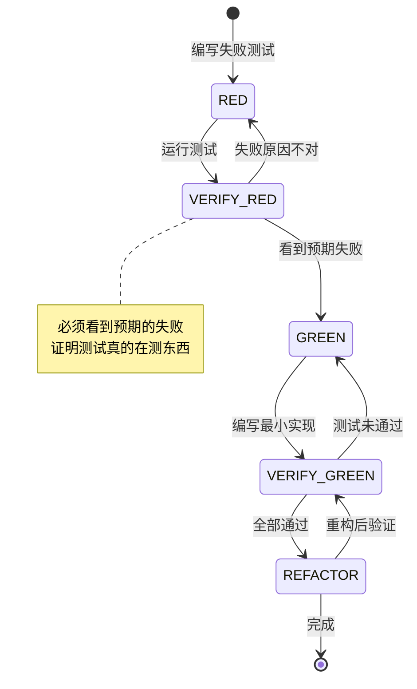
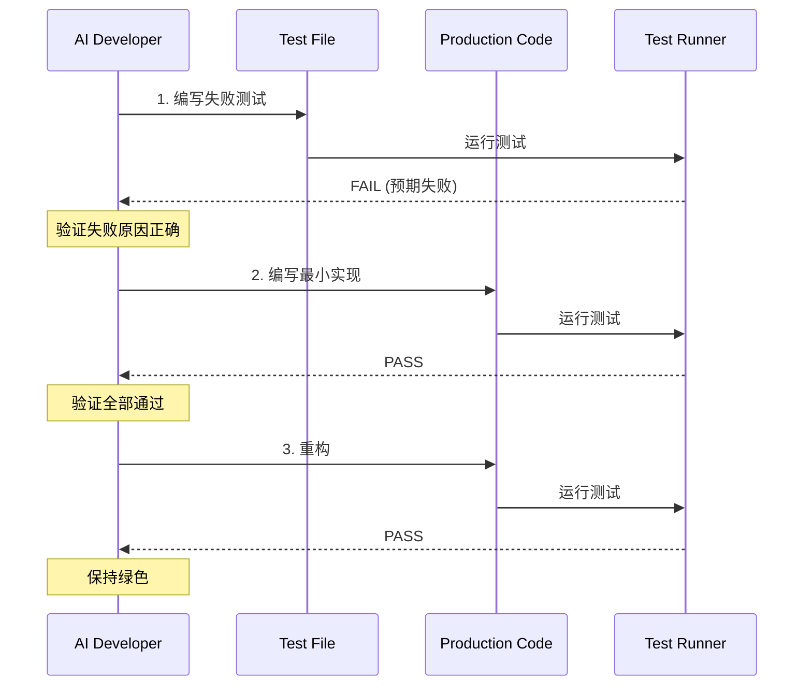

# Superpowers TDD Skill 深度分析

## 概述

Superpowers 的 **Test-Driven Development (TDD) Skill** 不是传统意义上的"测试框架"，而是一个**行为约束系统**。它通过精心设计的文档结构和心理机制，强制 AI 在编写代码之前先编写测试。

**核心洞察**：AI 和人类程序员一样，会在时间压力下跳过测试。TDD Skill 通过"铁律"和"反理性化"设计来对抗这种倾向。

---

## 设计理念

### 1. 铁律设计

```
NO PRODUCTION CODE WITHOUT A FAILING TEST FIRST
```

这条规则被设计为**无例外**的绝对命令：
- 先写代码？删除它，重新开始
- 不要保留作为"参考"
- 不要"适配"现有代码
- 删除就是删除

**为什么如此严格？** 因为 AI 特别擅长"合理化"跳过步骤：
- "这个太简单了，不需要测试"
- "我先写代码，等下再补测试"
- "我已经手动测试过了"
- "删除这么多工作是浪费"

### 2. Red-Green-Refactor 循环



**关键创新点**：
- **Verify RED 阶段是强制的** - 大多数开发者跳过这步
- 测试必须通过"看到它失败"来证明它测试的是正确的东西
- 如果测试立即通过，说明你在测试已存在的行为

---

## 核心机制

### 1. 对抗理性化表格

Skill 中专门有一个表格，列出 AI 可能找的"借口"和对应的"现实"：

| 借口 | 现实 |
|------|------|
| "太简单了不需要测试" | 简单代码也会坏。测试只需 30 秒。 |
| "我先写代码再补测试" | 后补的测试立即通过，证明不了什么。 |
| "我已经手动测试过了" | 手动测试 ≠ 系统化。无记录，不可重复。 |
| "删除 X 小时的工作是浪费" | 沉没成本谬误。保留未验证代码是技术债。 |
| "TDD 太教条，我要务实" | TDD 就是务实。找捷径 = 生产环境调试 = 更慢。 |

**设计原理**：当 AI 产生"跳过测试"的念头时，这个表格提供了即时的反驳。

### 2. 红旗列表 (Red Flags)

Skill 明确列出需要 STOP 的信号：
- Code before test
- Test after implementation
- Test passes immediately
- Can't explain why test failed
- "I'll test after"
- "Keep as reference"
- "Already spent X hours, deleting is wasteful"
- "This is different because..."

**统一结论**：All of these mean: **Delete code. Start over with TDD.**

### 3. 测试质量标准

好的测试必须满足：
- **Minimal**：只测一件事（名字里有"and"就该拆分）
- **Clear**：名字描述行为，不是 `test1`
- **Shows intent**：展示期望的 API 用法
- **Real code**：不用 mock（除非不可避免）

---

## 实现流程

### 标准 TDD 流程



### Bug 修复流程


**关键原则**：Never fix bugs without a test.

---

## 测试反模式 (Testing Anti-Patterns)

TDD Skill 配套了一个反模式文档，防止 AI 写出糟糕的测试：

### 反模式 1: 测试 Mock 行为

```typescript
// ❌ BAD: 测试 mock 存在
expect(screen.getByTestId('sidebar-mock')).toBeInTheDocument();

// ✅ GOOD: 测试真实行为
expect(screen.getByRole('navigation')).toBeInTheDocument();
```

### 反模式 2: 生产代码中的测试专用方法

```typescript
// ❌ BAD: destroy() 只在测试中使用
class Session {
  async destroy() { /* 只在测试调用 */ }
}

// ✅ GOOD: 测试工具处理清理
export async function cleanupSession(session: Session) {
  // 在测试工具中实现
}
```

### 反模式 3: 不理解依赖就 Mock

```typescript
// ❌ BAD: Mock 破坏了测试依赖的副作用
vi.mock('ToolCatalog', () => ({
  discoverAndCacheTools: vi.fn().mockResolvedValue(undefined)
}));
// 测试依赖 config 写入，但 mock 阻止了它！

// ✅ GOOD: 在正确层级 mock
vi.mock('MCPServerManager'); // 只 mock 慢速部分
```

### 反模式 4: 不完整的 Mock

```typescript
// ❌ BAD: 只 mock 已知字段
const mockResponse = {
  status: 'success',
  data: { userId: '123' }
  // 缺少下游代码需要的 metadata
};

// ✅ GOOD: 镜像真实 API 的完整结构
const mockResponse = {
  status: 'success',
  data: { userId: '123' },
  metadata: { requestId: 'req-789', timestamp: 1234567890 }
};
```

---

## 验证清单

在标记工作完成前，必须检查：

- [ ] 每个新函数/方法都有测试
- [ ] 看到每个测试在实现前失败
- [ ] 每个测试因正确原因失败（功能缺失，不是拼写错误）
- [ ] 编写了最小代码让每个测试通过
- [ ] 所有测试通过
- [ ] 输出干净（无错误、警告）
- [ ] 测试使用真实代码（mock 只在必要时）
- [ ] 覆盖边界情况和错误处理

**无法勾选所有项？** 你跳过了 TDD。重新开始。

---

## 设计亮点

### 1. 心理学设计

TDD Skill 大量运用心理学原理：
- **承诺一致性**：一旦开始 TDD，就倾向于完成它
- **损失厌恶**：强调"删除代码"比"保留垃圾"更好
- **社会证明**：提供"常见借口"表格，让 AI 知道其他人也会这么想
- **权威**：使用绝对语气（"No exceptions"、"Never"）

### 2. 自我诊断

Skill 提供了当测试"卡壳"时的诊断表：

| 问题 | 解决方案 |
|------|---------|
| 不知道怎么测试 | 先写期望的 API，再写断言 |
| 测试太复杂 | 设计太复杂，简化接口 |
| 必须 mock 所有东西 | 代码耦合太高，使用依赖注入 |
| 测试设置太庞大 | 提取 helper，还是复杂就简化设计 |

**洞察**：测试困难 = 设计问题，不是测试问题。

### 3. 与调试集成

```
发现 Bug? → 编写失败测试复现它 → 遵循 TDD 循环
```

测试不仅验证修复，还防止回归。

---

## 实际效果

### 对 AI 行为的改变

**没有 TDD Skill 时**：
1. 用户要求实现功能
2. AI 直接写代码
3. 可能写测试，也可能不写
4. 测试质量参差不齐

**有 TDD Skill 时**：
1. 用户要求实现功能
2. AI 先加载 TDD Skill
3. 编写失败测试
4. 运行看到失败
5. 编写最小实现
6. 运行看到通过
7. 重构（如果需要）

### 质量保证

- **测试覆盖率**：强制每个新功能都有测试
- **测试有效性**：通过"看失败"确保测试真的测了东西
- **代码质量**：最小实现原则防止过度工程
- **可维护性**：测试作为文档，展示代码用法

---

## 总结

Superpowers TDD Skill 是一个**行为工程系统**，它：

1. **识别问题**：AI 和人类一样会跳过测试
2. **提供对抗**：通过铁律、表格、红旗列表阻止理性化
3. **标准化流程**：Red-Green-Refactor 循环
4. **质量保证**：验证清单确保执行到位
5. **教育功能**：反模式文档教会 AI 什么是好的测试

**核心洞察**：TDD 不是"测试的技术"，而是"先思考后行动"的纪律。这个 Skill 强制 AI 在写代码之前先想清楚"这应该做什么"。
